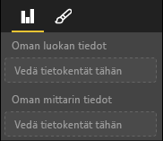

# <a name="capabilities-and-properties-of-power-bi-visuals"></a>Power BI:n visualisointien toiminnot ja ominaisuudet 

Toimintojen avulla voit antaa tietoja visualisoinnistasi isännälle. Kaikkien toimintomallin ominaisuuksien määrite on `optional`.

Visualisoinnin toimintojen juuriobjekteja ovat esimerkiksi `dataRoles` ja `dataViewMappings`.

```json
{
    "dataRoles": [ ... ],
    "dataViewMappings": [ ... ],
    "objects":  { ... },
    "supportsHighlight": true|false,
    "advancedEditModeSupport": 0|1|2,
    "sorting": { ... }
}

```

## <a name="define-the-data-fields-that-your-visual-expects-dataroles"></a>Visualisoinnin odottamien tietokenttien määrittäminen: dataRoles

Tietoihin sidottavien kenttien määrittämisessä käytetään kohdetta `dataRoles`. `dataRoles` ottaa käyttöön `DataViewRole`-objektien matriisin, joka määrittää kaikki vaaditut ominaisuudet.

### <a name="properties"></a>Ominaisuudet

* **name**: Tämän tietokentän sisäinen nimi (oltava yksilöivä).
* **kind**: Kentän tyyppi:
    * `Grouping`: Erillisiä arvoja, joita käytetään mittarikenttien ryhmittelemiseen.
    * `Measure`: Numeerisia tietoarvoja.
    * `GroupingOrMeasure`: Arvoja, joita voidaan käyttää joko ryhmittelynä tai mittarina.
* **displayName**: Nimi, joka näytetään käyttäjälle **Ominaisuudet**-ruudussa.
* **description**: Kentän lyhyt kuvaus (valinnainen).
* **requiredTypes**: Tämän tietoroolin vaadittu tietotyyppi. Arvot, jotka eivät täsmää, saavat tyhjäarvon (valinnainen).
* **preferredTypes**: Tämän tietoroolin ensisijainen tietotyyppi (valinnainen).

### <a name="valid-data-types-in-requiredtypes-and-preferredtypes"></a>Kelvolliset tietotyypit kohteissa requiredTypes ja preferredTypes

* **bool**: Totuusarvo
* **integer**: Kokonaislukuarvo
* **numeric**: Numeerinen arvo
* **text**: Tekstiarvo
* **geography**: Maantieteellinen tieto

### <a name="example"></a>Esimerkki

```json
"dataRoles": [
    {
        "displayName": "My Category Data",
        "name": "myCategory",
        "kind": "Grouping",
        "requiredTypes": [
            {
                "text": true
            },
            {
                "numeric": true
            },
            {
                "integer": true
            }
        ],
        "preferredTypes": [
            {
                "text": true
            }
        ]
    },
    {
        "displayName": "My Measure Data",
        "name": "myMeasure",
        "kind": "Measure",
        "requiredTypes": [
            {
                "integer": true
            },
            {
                "numeric": true
            }
        ],
        "preferredTypes": [
            {
                "integer": true
            }
        ]
    },
    {
        "displayNameKey": "Visual_Location",
        "name": "Locations",
        "kind": "Measure",
        "displayName": "Locations",
        "requiredTypes": [
            {
                "geography": {
                    "address": true
                }
            },
            {
                "geography": {
                    "city": true
                }
            },
            {
                "geography": {
                    "continent": true
                }
            },
            {
                "geography": {
                    "country": true
                }
            },
            {
                "geography": {
                    "county": true
                }
            },
            {
                "geography": {
                    "place": true
                }
            },
            {
                "geography": {
                    "postalCode": true
                }
            },
            {
                "geography": {
                    "region": true
                }
            },
            {
                "geography": {
                    "stateOrProvince": true
                }
            }
        ]
    }
]
```

Edellä olevat tietoroolit loisivat kentät, jotka näkyvät seuraavassa kuvassa:



## <a name="define-how-you-want-the-data-mapped-dataviewmappings"></a>Määritä, miten haluat yhdistää tiedot: dataViewMapping

DataViewMapping-ominaisuus kuvaa, miten tietoroolit liittyvät toisiinsa ja antaa sinun määrittää niille ehdollisia vaatimuksia.

Useimmat visualisoinnit tarjoavat yhden yhdistämismäärityksen, mutta voit tehdä useita dataViewMapping-määrityksiä. Jokainen kelvollinen yhdistäminen tuottaa tietonäkymän. 

```json
"dataViewMappings": [
    {
        "conditions": [ ... ],
        "categorical": { ... },
        "table": { ... },
        "single": { ... },
        "matrix": { ... }
    }
]
```

Lisätietoja on artikkelissa [Power BI -visualisointien tietonäkymän yhdistämismääritykset](dataview-mappings.md).

## <a name="define-property-pane-options-objects"></a>Ominaisuusruudun asetusten määrittäminen: objektit

Objektit kuvailevat visualisointiin liittyviä mukautettavia ominaisuuksia. Jokaisella objektilla voi olla useita ominaisuuksia, ja jokaiseen ominaisuuteen liittyy tyyppi. Tyypit viittaavat siihen, mikä ominaisuus on. 

```json
"objects": {
    "myCustomObject": {
        "displayName": "My Object Name",
        "properties": { ... }
    }
}
```

Lisätietoja on artikkelissa [Power BI:n visualisointien objektit ja ominaisuudet](objects-properties.md).

## <a name="handle-partial-highlighting-supportshighlight"></a>Osittaisen korostusten käsitteleminen: supportsHighlight

Oletusarvoisesti tämän arvon määrityksenä on `false`, mikä tarkoittaa, että arvot suodatetaan automaattisesti, kun sivulla valitaan jotakin. Tämä automaattinen suodatus puolestaan päivittää visualisoinnin näyttämään vain valitun arvon. Jos haluat näyttää täydelliset tiedot, mutta korostaa vain valitut kohteet, sinun on asetettava `supportsHighlight`-arvoksi `true` tiedostossa *capabilities.json*.

Lisätietoja on artikkelissa [Arvopisteiden korostaminen Power BI:n visualisoinneissa](highlight.md).

## <a name="handle-advanced-edit-mode-advancededitmodesupport"></a>Kehittyneen muokkaustilan käsitteleminen: advancedEditModeSupport

Visualisointi voi ilmaista tukensa muokkaustilan lisäasetuksia kohtaan. Visualisointi ei oletusarvoisesti tue muokkaustilan lisäasetuksia, ellei tiedostossa *capabilities.json* ole toisin mainittu.

Lisätietoja on artikkelissa [Kehittynyt muokkaustila Power BI:n visualisoinneissa](advanced-edit-mode.md).

## <a name="data-sorting-options-for-visual-sorting"></a>Visualisoinnin tietojen lajittelun asetukset: lajittelu

Visualisointi voi määrittää lajittelukäyttäytymisensä toimintojensa avulla. Visualisointi ei oletusarvoisesti tue lajittelujärjestyksen muokkaamista, ellei tiedostossa *capabilities.json* ole toisin mainittu.

Lisätietoja on artikkelissa [Lajitteluasetukset Power BI:n visualisoinneissa](sort-options.md).
