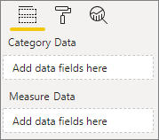

# <a name="build-a-bar-chart"></a>Palkkikaavion rakentaminen

Tämä artikkeli antaa vaiheittaiset ohjeet Power BI -mallipalkkikaavion visualisoinnin luomiseen koodilla. Saat täydellisen koodiesimerkin kohdasta[https://github.com/Microsoft/PowerBI-visuals-sampleBarChart](https://github.com/Microsoft/PowerBI-visuals-sampleBarChart).

## <a name="view-model"></a>Mallin tarkastelu
On tärkeää määrittää ensin palkkikaavionäkymän malli ja kerrata, mitä visualisoinnissa on näkyvillä, kun rakennat sitä.

```typescript
/**
 * Interface for BarCharts viewmodel.
 *
 * @interface
 * @property {BarChartDataPoint[]} dataPoints - Set of data points the visual will render.
 * @property {number} dataMax                 - Maximum data value in the set of data points.
 */
interface BarChartViewModel {
    dataPoints: BarChartDataPoint[];
    dataMax: number;
};

/**
 * Interface for BarChart data points.
 *
 * @interface
 * @property {number} value    - Data value for the point.
 * @property {string} category - Corresponding category of the data value.
 */
interface BarChartDataPoint {
    value: number;
    category: string;
};
```

### <a name="use-static-data"></a>Staattisten tietojen käyttö

Staattisten tietojen käyttäminen on erinomainen tapa testata visualisointia ilman tietojen sidontaa. Näkymämallisi ei muutu, vaikka olisit lisännyt tietojen sidonnan myöhemmässä vaiheessa.

```typescript
let testData: BarChartDataPoint[] = [
    {
        value: 10,
        category: 'a'
    },
    {
        value: 20,
        category: 'b'
    },
    {
        value: 1,
        category: 'c'
    },
    {
        value: 100,
        category: 'd'
    },
    {
        value: 500,
        category: 'e'
    }];

let viewModel: BarChartViewModel = {
    dataPoints: testData,
    dataMax: d3.max(testData.map((dataPoint) => dataPoint.value))
};
```

## <a name="data-binding"></a>Tietojen sidonta 
Lisää tietojen sidonta määrittämällä visualisointitoiminnot kohdassa *ominaisuudet.json*. Mallikoodilla on jo rakenne, jota voit käyttää.

Tietojen sidonta toimii **kentässä** hyvin Power BI:ssa.



### <a name="add-data-roles"></a>Tietoroolien lisääminen
Mallikoodissa on jo tietorooleja, mutta voit mukauttaa niitä.

- `displayName` on nimi, joka näkyy **Kenttä**-osiossa.
- `name` on sisäinen nimi, jota käytetään viittaamaan tietorooliin.
- `kind` kertoo kentän tyypin. *Ryhmittely*-kentissä (0) on erilliset arvot. *Mittari*-kentissä (1) on numeerisia data-arvoja.

```json
"dataRoles": [
    {
        "displayName": "Category Data",
        "name": "category",
        "kind": 0
    },
    {
        "displayName": "Measure Data",
        "name": "measure",
        "kind": 1
    }
],
```

Lisätietoja löytyy kohdasta [Tietoroolit](./capabilities.md#define-the-data-fields-that-your-visual-expects-dataroles).

### <a name="add-conditions-to-dataviewmapping"></a>Ehtojen lisääminen DataView-liitokseen
Määritä `dataViewMappings`-ehdot, jos haluat määrittää, kuinka monta kenttää kukin kenttä voi sitoa. Käytä tietoroolin sisäistä `name` viittaamaan kuhunkin kenttään.

```json
    "dataViewMappings": [
        {
            "conditions": [
                {
                    "category": {
                        "max": 1
                    },
                    "measure": {
                        "max": 1
                    }
                }
            ],
        }
    ]
```

Lisätietoja löytyy kohdasta [Tietonäkymän yhdistämismääritykset](./dataview-mappings.md).

### <a name="define-and-use-visualtransform"></a>Visualisoin muunnoksen määrittäminen ja käyttäminen
`DataView` on rakenne, joka Power BI tarjoaa visualisoinnille, joka sisältää visualisoitavien kysellyt tiedot. `DataView` voi kuitenkin antaa tietoja eri muodoissa esim. luokitus- ja taulukkomuodossa. Jotta voit luoda luokittaisia visualisointeja palkkikaaviona, sinun tarvitsee käyttää vain `DataView`-kohteen luokitteluominaisuutta. `visualTransform` määrittämisen avulla voit muuntaa `DataView` näyttömalliksi, jota visualisointi tulee käyttämään.

Jos haluat määrittää värejä ja valita ne määrittäessäsi yksilöllisiä arvopisteitä, käytä `IVisualHost`. 

```typescript
/**
 * Function that converts queried data into a view model that will be used by the visual
 *
 * @function
 * @param {VisualUpdateOptions} options - Contains references to the size of the container
 *                                        and the dataView which contains all the data
 *                                        the visual had queried.
 * @param {IVisualHost} host            - Contains references to the host which contains services
 */
function visualTransform(options: VisualUpdateOptions, host: IVisualHost): BarChartViewModel {
    /*Convert dataView to your viewModel*/
}

```

## <a name="color"></a>Väri 
Väri näkyy yhtenä `IVisualHost`:n käytettävissä olevista palveluista.

### <a name="add-color-to-data-points"></a>Värin lisääminen arvopisteisiin
Kutakin arvopistettä edustaa eri väri. Lisäät värin `BarChartDataPoint`-liittymään.

```typescript
/**
 * Interface for BarChart data points.
 *
 * @interface
 * @property {number} value    - Data value for the point.
 * @property {string} category - Corresponding category of the data value.
 * @property {string} color    - Color corresponding to the data point.
 */
interface BarChartDataPoint {
    value: number;
    category: string;
    color: string;
};
```

### <a name="the-colorpalette-service"></a>colorPalette-palvelu
`colorPalette`-palvelu hallitsee visualisoinnissa käytettyjä värejä. Sen esiintymä on käytettävissä kohdassa `IVisualHost`.

### <a name="assign-color-to-data-points"></a>Värin määrittäminen arvopisteisiin
`visualTransform` määritettiin rakenteena, jonka avulla `dataView` voidaan muuntaa näkymämalliksi, jota palkkikaavio voi käyttää. Koska `visualTransform`:ssa iteroidaan arvopisteiden kautta, se on myös ihanteellinen paikka värien määrittelemistä varten.

```typescript
let colorPalette: IColorPalette = host.colorPalette; // host: IVisualHost
for (let i = 0, len = Math.max(category.values.length, dataValue.values.length); i < len; i++) {
    barChartDataPoints.push({
        category: category.values[i],
        value: dataValue.values[i],
        color: colorPalette.getColor(category.values[i]).value,
    });
}
```

## <a name="selection-and-interactions"></a>Valinta ja vuorovaikutukset
Valinta antaa käyttäjän vaikuttaa sekä omaan että muihin visualisointeihin. 

### <a name="add-selection-to-each-data-point"></a>Valinnan lisääminen kuhunkin arvopisteeseen
Koska jokainen arvopiste on yksilöivä, lisää valinta kuhunkin arvopisteeseen. Valintaominaisuus lisätään `BarChartDataPoint`-liittymässä.

```typescript
/**
 * Interface for BarChart data points.
 *
 * @interface
 * @property {number} value             - Data value for the point.
 * @property {string} category          - Corresponding category of data value.
 * @property {string} color             - Color corresponding to data point.
 * @property {ISelectionId} selectionId - Id assigned to data point for cross filtering
 *                                        and visual interaction.
 */
interface BarChartDataPoint {
    value: number;
    category: string;
    color: string;
    selectionId: ISelectionId;
};
```

### <a name="assign-selection-ids-to-each-data-point"></a>Valintatunnuksen lisääminen kuhunkin arvopisteeseen
Koska `visualTransform`:ssa iteroidaan arvopisteiden kautta, se on myös ihanteellinen paikka valintatunnusten luomista varten. Isäntämuuttuja on `IVisualHost`, joka sisältää palveluja, joita visualisointi voi käyttää, kuten värin ja valinnan muodostimen. 

Luo uusi valintatunnus käyttämällä `createSelectionIdBuilder`tehdasmenetelmää kohdassa `IVisualHost`. Luo uusi valintamuodostin kullekin arvopisteelle.

Koska teet valintoja vain luokan perusteella, sinun tarvitsee vain määrittää valinnat `withCategory`.

```typescript
for (let i = 0, len = Math.max(category.values.length, dataValue.values.length); i < len; i++) {
    barChartDataPoints.push({
        category: category.values[i],
        value: dataValue.values[i],
        color: colorPalette.getColor(category.values[i]).value,
        selectionId: host.createSelectionIdBuilder()
            .withCategory(category, i)
            .createSelectionId()
    });
}
```

Lisätietoa on kohdassa [Valinnanmuodostimen esiintymän luominen](./selection-api.md#create-an-instance-of-the-selection-builder).

### <a name="interact-with-data-points"></a>Arvopisteiden käsittely
Voit käsitellä palkkikaavion kutakin palkkia, kun arvopisteeksi on määritetty valintatunnus. Palkkikaavio kuuntelee `click`-tapahtumia.

Käyttämällä `selectionManager`tehdasmenetelmää kohdassa `IVisualHost` voit luoda valinnan hallinnan ristiinsuodatusta ja valintojen poistamista varten.

```typescript
let selectionManager = this.selectionManager;

//This must be an anonymous function instead of a lambda because
//d3 uses 'this' as the reference to the element that was clicked.
bars.on('click', function(d) {
    selectionManager.select(d.selectionId).then((ids: ISelectionId[]) => {
        bars.attr({
            'fill-opacity': ids.length > 0 ? BarChart.Config.transparentOpacity : BarChart.Config.solidOpacity
        });

        d3.select(this).attr({
            'fill-opacity': BarChart.Config.solidOpacity
        });
    });

    (<Event>d3.event).stopPropagation();
});
```

Lisätietoja saa kohdasta [Kuinka SelectionManageria käytetään](./selection-api.md#how-to-use-selectionmanager-to-select-data-points).

## <a name="static-objects"></a>Staattiset objektit

Voit lisätä objekteja **Ominaisuus**-ruutuun visualisoinnin mukauttamiseksi. Nämä mukautukset voivat olla käyttöliittymän muutoksia tai kyselyn kohteena oleviin tietoihin liittyviä muutoksia. Malli käyttää staattisia objekteja viivakaavion X-akselin hahmontamiseen.

Voit ottaa käyttöön tai poistaa käytöstä objekteja **Ominaisuus**-ruudussa.


### <a name="define-objects-in-capabilities"></a>Objektien määrittäminen ominaisuuksiin
Määritä `objects`-ominaisuus *capabilities.json*-tiedoston sisällä **Ominaisuudet**-ruudussa näytettävää objektia varten.
- `enableAxis` on sisäinen nimi, johon `dataView` viittaa. 
- `displayName` on nimi, joka näkyy **Ominaisuudet** ruudussa.
- `bool` on primitiivinen arvo, jota käytetään yleensä staattisissa objekteissa, kuten tekstikehyksissä tai valitsimissa.
- `show` on erityinen ominaisuus, `properties`jonka avulla `show`-valitsin voi vaihtaa objektin. Koska `show` on valitsin, sen tyyppi on `bool`.


```typescript
"objects": {
    "enableAxis": {
        "displayName": "Enable Axis",
        "properties": {
            "show": {
                "displayName": "Enable Axis",
                "type": { "bool": true }
            }
        }
    }
}
```

Katso lisätietoja kohdasta [Objektit](./objects-properties.md).

### <a name="define-property-settings"></a>Ominaisuusasetusten määrittäminen

Seuraavissa osissa on kuvattu ominaisuusasetusten määrittämisen perusperiaatteet. Voit myös käyttää `powerbi-visuals-utils-dataviewutils`-paketissa määritettyjä apuohjelmaluokkia ominaisuuksien asetusten määrittämiseksi. Saat lisätietoja [DataViewObjectsParser](https://github.com/Microsoft/powerbi-visuals-utils-dataviewutils/blob/master/docs/api/data-view-objects-parser.md)-luokan dokumentaatiosta ja näytteistä.


Vaikka se on valinnaista, useimmat asetukset on parasta paikallistaa yhteen objektiin helppoa viittausta varten.

```typescript
/**
 * Interface for BarCharts viewmodel.
 *
 * @interface
 * @property {BarChartDataPoint[]} dataPoints - Set of data points the visual will render.
 * @property {number} dataMax                 - Maximum data value in the set of data points.
 * @property {BarChartSettings} settings      - Object property settings
 */
interface BarChartViewModel {
    dataPoints: BarChartDataPoint[];
    dataMax: number;
    settings: BarChartSettings;
};

/**
 * Interface for BarChart settings.
 *
 * @interface
 * @property "show" enableAxis - Object property that allows axis to be enabled.
 */
interface BarChartSettings {
    enableAxis: {
        show: boolean;
    };
}
```

### <a name="define-and-use-objectenumerationutility"></a>ObjectEnumerationUtility-apuohjelman määrittäminen ja käyttäminen
Objektin ominaisuusarvot ovat käytettävissä `dataView`-metatiedoissa, mutta näiden ominaisuuksien noutamiseen ei ole mitään palvelua. `ObjectEnumerationUtility` on joukko staattisia funktioita, joita voit käyttää objektiarvojen noutamiseen `dataView`:sta ja muissa visuaalisissa projekteissa. `ObjectEnumerationUtility` on valinnainen, mutta se soveltuu erinomaisesti objektin ominaisuuksien hakemiseen `dataView`:n kautta.

```typescript
/**
 * Gets property value for a particular object.
 *
 * @function
 * @param {DataViewObjects} objects - Map of defined objects.
 * @param {string} objectName       - Name of desired object.
 * @param {string} propertyName     - Name of desired property.
 * @param {T} defaultValue          - Default value of desired property.
 */
export function getValue<T>(objects: DataViewObjects, objectName: string, propertyName: string, defaultValue: T ): T {
    if(objects) {
        let object = objects[objectName];
        if(object) {
            let property: T = object[propertyName];
            if(property !== undefined) {
                return property;
            }
        }
    }
    return defaultValue;
}
```

Katso lähdekoodi kohdasta [objectEnumerationUtility.ts](https://github.com/Microsoft/PowerBI-visuals-sampleBarChart/blob/master/src/objectEnumerationUtility.ts).

### <a name="retrieve-property-values-from-dataview"></a>Ominaisuusarvojen haku dataView-apuohjelmasta
`visualTransform` on ihanteellinen paikka visualisoinnin näkymämallin muokkaamiseen. Jos haluat jatkaa tätä kaavaa, nouda objektin ominaisuudet kohdasta `dataView`.

Määritä ominaisuuden oletustila ja nouda ominaisuus `dataView`:sta `getValue`:n avulla.

```typescript
let defaultSettings: BarChartSettings = {
    enableAxis: {
        show: false,
    }
};

let barChartSettings: BarChartSettings = {
    enableAxis: {
        show: getValue<boolean>(objects, 'enableAxis', 'show', defaultSettings.enableAxis.show),
    }
}
```

### <a name="populate-property-pane-with-enumerateobjectinstances"></a>Ominaisuus-ruudun täyttäminen enumerateObjectInstances-apuohjelmalla
`enumerateObjectInstances`Valinnainen menetelmä `IVisual`:ssa luetteloi kaikki objektit ja sijoittaa ne **Ominaisuus**-ruutuun. Kutakin objektia kutsutaan `enumerateObjectInstances`:lla. Objektin nimi on käytettävissä `EnumerateVisualObjectInstancesOptions`:ssa.

Määritä kullekin objektille ominaisuus sen nykyisellä tilalla.

```typescript
/**
 * Enumerates through the objects defined in the capabilities and adds the properties to the format pane
 *
 * @function
 * @param {EnumerateVisualObjectInstancesOptions} options - Map of defined objects
 */
public enumerateObjectInstances(options: EnumerateVisualObjectInstancesOptions): VisualObjectInstanceEnumeration {
    let objectName = options.objectName;
    let objectEnumeration: VisualObjectInstance[] = [];

    switch(objectName) {
        case 'enableAxis':
            objectEnumeration.push({
                objectName: objectName,
                properties: {
                    show: this.barChartSettings.enableAxis.show,
                },
                selector: null
            });
    };

    return objectEnumeration;
}
```

### <a name="control-property-update-logic"></a>Ominaisuuden päivityslogiikan ohjaaminen
Kun objekti on lisätty **Ominaisuus** ruutuun, jokainen valitsin käynnistää päivityksen. Lisää tietyn objektin logiikka `if` lohkoissa:

```typescript
if(settings.enableAxis.show) {
    let margins = BarChart.Config.margins;
    height -= margins.bottom;
}
```

## <a name="databound-objects"></a>Tietoihin sidotut objektit
Tietoihin sidotut objektit muistuttavat staattisia objekteja, mutta ne käsittelevät yleensä tietojen valitsemista. Voit esimerkiksi muuttaa arvopisteeseen liitettyä väriä.


### <a name="define-object-in-capabilities"></a>Objektien määrittäminen ominaisuuksiin
Kuten staattisten objektien kohdalla, määritä toinen objekti kohdassa *capabilities.json*. 
- `colorSelector` on sisäinen nimi, johon `dataView` viittaa.
- `displayName` on nimi, joka näkyy **Ominaisuudet** ruudussa.
- `fill` on rakenteellisen objektin arvo, jota ei ole liitetty primitiivityyppiin.

```typescript
"colorSelector": {
    "displayName": "Data Colors",
    "properties": {
        "fill": {
            "displayName": "Color",
            "type": {
                "fill": {
                    "solid": {
                        "color": true
                    }
                }
            }
        }
    }
}
```

Katso lisätietoja kohdasta [Objektit](./objects-properties.md).

### <a name="use-objectenumerationutility"></a>ObjectEnumerationUtility-apuohjelman käyttäminen
Kuten staattisten objektien kohdalla, sinun on noudettava objektin tiedot `dataView`:sta. Sen sijaan, että objektiarvot olisivat metatiedoissa, objektin arvot liittyvät kuhunkin luokkaan.

```typescript
/**
 * Gets property value for a particular object in a category.
 *
 * @function
 * @param {DataViewCategoryColumn} category - List of category objects.
 * @param {number} index                    - Index of category object.
 * @param {string} objectName               - Name of desired object.
 * @param {string} propertyName             - Name of desired property.
 * @param {T} defaultValue                  - Default value of desired property.
 */
export function getCategoricalObjectValue<T>(category: DataViewCategoryColumn, index: number, objectName: string, propertyName: string, defaultValue: T): T {
    let categoryObjects = category.objects;

    if(categoryObjects) {
        let categoryObject: DataViewObject = categoryObjects[index];
        if(categoryObject) {
            let object = categoryObject[objectName];
            if(object) {
                let property: T = object[propertyName];
                if(property !== undefined) {
                    return property;
                }
            }
        }
    }
    return defaultValue;
}
```

Katso lähdekoodi kohdasta [objectEnumerationUtility.ts](https://github.com/Microsoft/PowerBI-visuals-sampleBarChart/blob/master/src/objectEnumerationUtility.ts).

### <a name="define-default-color-and-retrieve-categorical-object-from-dataview"></a>Määritä oletusväri ja nouda luokittainen objekti dataView-kohteesta
Jokainen väri liitetään nyt kuhunkin luokkaan `dataView`:n sisällä. Voit asettaa kunkin arvopisteen sitä vastaavalle värille.

```typescript
for (let i = 0, len = Math.max(category.values.length, dataValue.values.length); i < len; i++) {
    let defaultColor: Fill = {
        solid: {
            color: colorPalette.getColor(category.values[i]).value
        }
    }

    barChartDataPoints.push({
        category: category.values[i],
        value: dataValue.values[i],
        color: getCategoricalObjectValue<Fill>(category, i, 'colorSelector', 'fill', defaultColor).solid.color,
        selectionId: host.createSelectionIdBuilder()
            .withCategory(category, i)
            .createSelectionId()
    });
}
```

### <a name="populate-property-pane-with-enumerateobjectinstances"></a>Ominaisuus-ruudun täyttäminen enumerateObjectInstances-apuohjelmalla
`enumerateObjectInstances`:n avulla voit täyttää **Ominaisuus**-ruudun objekteilla. 

Lisää tähän esiintymään värivalitsin, joka hahmontaa kunkin luokan **Ominaisuus**-ruudussa. Voit tehdä tämän lisäämällä ylimääräisen tapauksen `colorSelector`:n `switch`-lausekkeeseen ja kerrata kunkin arvopisteen käyttämällä siihen liittyvää väriä. 

Valinta vaaditaan, jotta väri voidaan liittää arvopisteeseen.

```typescript
/**
 * Enumerates through the objects defined in the capabilities and adds the properties to the format pane
 *
 * @function
 * @param {EnumerateVisualObjectInstancesOptions} options - Map of defined objects
 */
public enumerateObjectInstances(options: EnumerateVisualObjectInstancesOptions): VisualObjectInstanceEnumeration {
    let objectName = options.objectName;
    let objectEnumeration: VisualObjectInstance[] = [];

    switch(objectName) {
        case 'enableAxis':
            objectEnumeration.push({
                objectName: objectName,
                properties: {
                    show: this.barChartSettings.enableAxis.show,
                },
                selector: null
            });
            break;
        case 'colorSelector':
            for(let barDataPoint of this.barDataPoints) {
                objectEnumeration.push({
                    objectName: objectName,
                    displayName: barDataPoint.category,
                    properties: {
                        fill: {
                            solid: {
                                color: barDataPoint.color
                            }
                        }
                    },
                    selector: barDataPoint.selectionId.getSelector()
                });
            }
            break;
    };

    return objectEnumeration;
}
```

Kun olet tarjonnut kullekin ominaisuudelle valitsimen, näyttöön tulee seuraava `dataView` objektimatriisi:


Jokainen taulukon kohde `dataViews[0].categorical.categories[0].objects` vastaa tietojoukon konkreettista luokkaa.

Funktio `getCategoricalObjectValue` on kätevä tapa käyttää ominaisuuksia luokkaindeksin perusteella. Sinun on annettava `objectName` ja `propertyName`, jotka vastaavat *capabilities.json*-objektia ja ominaisuutta.

## <a name="other-features"></a>Muut ominaisuudet 
Voit lisätä palkkikaavioon liukusäätimen tai työkaluvihjeitä. Jos haluat lisätä koodin, tutustu kohtiin [Ominaisuusruudun liukusäätimen lisääminen peittävyyden ohjaukseen](https://github.com/Microsoft/PowerBI-visuals-sampleBarChart/commit/e2e0bc5888d9a3ca305a7a7af5046068645c8b30) ja [Työkaluvihjeiden tuen lisääminen](https://github.com/Microsoft/PowerBI-visuals-sampleBarChart/commit/981b021612d7b333adffe9f723ab27783c76fb14). Katso lisätietoja työkaluvihjeistä kohdasta [Power BI:n visualisointien työkaluvihjeet](./add-tooltips.md).

## <a name="packaging"></a>Pakkaukset

Ennen kuin voit ladata visualisoinnin [Power BI Desktopiin](https://powerbi.microsoft.com/desktop/) tai jakaa sen yhteisön [Power BI -visualisointien valikoimassa](https://visuals.powerbi.com/), sinun on pakattava se. Siirry visualisointiprojektin pääkansioon, joka sisältää tiedoston *pbiviz.json*, ja luo *pbiviz*-tiedosto käyttämällä seuraavaa komentoa:

```bash
pbiviz package
```
Tämä komento luo *pbiviz-* tiedoston visualisointiprojektisi *dist/* -hakemistoon ja korvaa *pbiviz*-tiedoston edellisistä pakkaustoiminnoista.

## <a name="next-steps"></a>Seuraavat vaiheet
Voit lisätä visualisointiin seuraavia ominaisuuksia:
* [Pikavalikon lisääminen visualisointiin](./context-menu.md)
* [Aloitussivu](./landing-page.md)
* [URL:n käynnistäminen](./launch-url.md)
* [Aluekohtainen tuki](./localization.md)