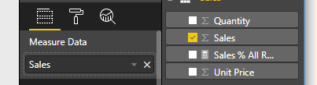

# <a name="tutorial-create-a-react-based-visual"></a>Opetusohjelma: React-perustaisen visualisoinnin luominen

Tässä opetusohjelmassa kerrotaan, miten voit luoda Power BI -visualisoinnin käyttämällä [Reactiä](https://reactjs.org/). Visualisointi näyttää arvon ympyrässä. Visualisointia voi mukauttaa mukautuvan koon ja asetusten avulla. Tämän artikkelin tietojen avulla voit luoda omia Power BI -visualisointeja Reactillä.


Tässä opetusohjelmassa opit:

> [!div class="checklist"]
>
> * määrittämään kehitysympäristösi
> * luomaan React-visualisoinnin
> * määrittämään visualisoinnin toiminnot
> * hahmontamaan tiedot Power BI:stä
> * muuttamaan visualisoinnin kokoa
> * tekemään visualisoinnista mukautettavan.

## <a name="prerequisites"></a>Edellytykset

* **Power BI Pro -tili**. [Rekisteröi ilmainen kokeiluversio](https://powerbi.microsoft.com/pricing/) ennen kuin aloitat.
* [Visual Studio Code](https://www.visualstudio.com/).
* [Windows Poweshellistä](https://docs.microsoft.com/powershell/scripting/install/installing-windows-powershell?view=powershell-6) vähintään versio 4 Windows-käyttäjille. [Terminal](https://macpaw.com/how-to/use-terminal-on-mac) OSX-käyttäjille.
* Ympäristö, joka on kuvattu kohdassa [Kehittäjäympäristön määrittäminen](custom-visual-develop-tutorial.md#setting-up-the-developer-environment).

## <a name="getting-started"></a>Aloittaminen

Aloita luomalla minimaalinen Power BI -visualisointi käyttämällä `pbiviz`iä. Lisätietoja projekteista ja projektirakenteesta on kohdassa [Power BI -visualisoinnin projektirakenne](visual-project-structure.md). Lisätietoja tämän visualisoinnin koko lähdekoodista on kohdassa [Circle Card React -visualisointi](https://github.com/Microsoft/powerbi-visuals-circlecard-react).

Voit kloonata tai ladata visualisoinnin koko lähdekoodin [GitHubista](https://github.com/Microsoft/powerbi-visuals-circlecard-react).

1. Avaa PowerShell ja suorita seuraava komento:

   ```powershell
   pbiviz new ReactCircleCard
   ```

   Komento luo kansion nimeltä *ReactCircleCard*.

1. Muuta hakemistot kyseiseen kansioon ja avaa Visual Studio Code.

   ```powershell
   cd ./ReactCircleCard
   code .
   ```

1. Käynnistä kehittäjäpalvelin visualisoinnille.

   ```powershell
   pbiviz start
   ```

   

Tämä perusvisualisointi edustaa päivitysten määrää. Muunnetaan se Circle Cardiksi seuraavassa vaiheessa.

## <a name="change-the-visual-to-a-circle-card"></a>Visualisoinnin muuttaminen Circle Cardiksi

Tämä perusvisualisointi edustaa päivitysmäärää. Muunna se seuraavaksi Circle Cardiksi, joka edustaa mittaria ja sen otsikkoa.

1. Asenna vaaditut riippuvuussuhteet suorittamalla seuraava komento:

   ```powershell
   npm i react react-dom
   ```

1. Asenna React 16 ja sitä vastaavat `react-dom`-versiot ja -tyypit suorittamalla seuraava komento:

   ```powershell
   npm i @types/react @types/react-dom
   ```

1. Luo React-komponenttiluokka. Valitse Visual Studio Codessa **Tiedosto** > **Uusi tiedosto**. Kopioi seuraava koodi tiedostoon.

    ```typescript
    import * as React from "react";

    export class ReactCircleCard extends React.Component<{}>{
        render(){
            return (
                <div className="circleCard">
                    Hello, React!
                </div>
            )
        }
    }

    export default ReactCircleCard;
    ```

1. Valitse **Tallenna nimellä**. Siirry *src*-hakemistoon. Anna nimi *component* Valitse **Tallenna muodossa** -vaihtoehdoksi **TypeScript React**.

1. Avaa *src/visual.ts*. Korvaa nykyinen koodi seuraavalla koodilla:

    ```typescript
    "use strict";
    import powerbi from "powerbi-visuals-api";

    import DataView = powerbi.DataView;
    import VisualConstructorOptions = powerbi.extensibility.visual.VisualConstructorOptions;
    import VisualUpdateOptions = powerbi.extensibility.visual.VisualUpdateOptions;
    import IVisual = powerbi.extensibility.visual.IVisual;

    import "./../style/visual.less";

    export class Visual implements IVisual {

        constructor(options: VisualConstructorOptions) {

        }

        public update(options: VisualUpdateOptions) {

        }
    }
    ```

1. Tuo React-riippuvuussuhteet ja juuri lisäämäsi komponentit.

    ```typescript
    import * as React from "react";
    import * as ReactDOM from "react-dom";
    ...
    import ReactCircleCard from "./component";
    ```

   Power BI TypeScript -oletusasetukset eivät hyväksy Reactin *tsx*-tiedostoja. Visual Studio Code näyttää kohdan `component` virheenä.

1. Avaa tiedosto *tsconfig.json* ja lisää kaksi riviä kohdan `compilerOptions` alkuun.

    ```json
    {
      "compilerOptions": {
        "jsx": "react",
        "types": ["react", "react-dom"],
        //...
      }
    }
    ```

   Virheen `component` pitäisi kadota.

   Jos haluat hahmontaa komponentin, lisää HTML-kohde-elementti. Tämä elementti on `HTMLElement` kohdassa `VisualConstructorOptions`, ja se välitetään konstruktoriin.

1. Muokkaa luokkaa `Visual` seuraavan koodin tavoin:

    ```typescript
      private target: HTMLElement;
      private reactRoot: React.ComponentElement<any, any>;

      constructor(options: VisualConstructorOptions) {
          this.reactRoot = React.createElement(ReactCircleCard, {});
          this.target = options.element;

          ReactDOM.render(this.reactRoot, this.target);
      }
    ```

1. Tallenna muutokset ja suorita olemassa oleva koodi käyttämällä tätä komentoa:

    ```bash
    pbiviz start
    ```

   > [!NOTE]
   > Jos suoritit aiemmin `pbiviz`in, se on käynnistettävä uudelleen, jotta muutokset otetaan käyttöön *tsconfig.json*-tiedostossa.

  

## <a name="configure-capabilities"></a>Ominaisuuksien määrittäminen

Voit määrittää visualisoinnin ominaisuudet.

1. Avaa `capabilities.json`. Poista objekti `Category Data` kohdasta `dataRoles`. `ReactCircleCard` näyttää yksittäisen arvon, joten tarvitaan vain `Measure Data`. Avain `dataRoles` näyttää nyt seuraavanlaiselta:

    ```json
    "dataRoles": [
        {
            "displayName": "Measure Data",
            "name": "measure",
            "kind": "Measure"
        }
    ],
    ```

1. Poista kaikki avaimen `objects` sisältö. Täytät sen myöhemmin.

    ```json
        "objects": {},
    ```

1. Kopioi seuraava ominaisuuden `dataViewMappings` koodi. Arvo `max: 1` tarkoittaa, että vain yksi mittarisarake voidaan lähettää.

    ```json
        "dataViewMappings": [
            {
                "conditions": [
                    {
                        "measure": {
                            "max": 1
                        }
                    }
                ],
                "single": {
                    "role": "measure"
                }
            }
        ]
    ```

Voit nyt tuoda tiedot ruudusta `Fields` visualisoinnin asetuksiin.



## <a name="receive-properties-from-power-bi"></a>Ominaisuuksien vastaanottaminen Power BI:stä

Voit hahmontaa tietoja käyttämällä Reactiä. Komponentti voi näyttää tietoja omasta tilastaan.

1. Muokkaa kohdetta *src/component.tsx*.

    ```javascript
    export interface State {
        textLabel: string,
        textValue: string
    }

    export const initialState: State = {
        textLabel: "",
        textValue: ""
    }

    export class ReactCircleCard extends React.Component<{}, State>{
        constructor(props: any){
            super(props);
            this.state = initialState;
        }

        render(){
            const { textLabel, textValue } = this.state;

            return (
                <div className="circleCard">
                    <p>
                        {textLabel}
                        <br/>
                        <em>{textValue}</em>
                    </p>
                </div>
            )
        }
    }
    ```

1. Lisää tyylejä uutta merkintää varten muokkaamalla kohdetta *styles/visual.less*.

    ```css
    .circleCard {
        position: relative;
        box-sizing: border-box;
        border: 1px solid #000;
        border-radius: 50%;
        width: 200px;
        height: 200px;
    }

    p {
        text-align: center;
        line-height: 30px;
        font-size: 20px;
        font-weight: bold;

        position: relative;
        top: -30px;
        margin: 50% 0 0 0;
    }
    ```

1. Visualisoinnit vastaanottavat nykyiset tiedot menetelmän `update` argumenttina. Avaa *src/visual.ts* ja lisää koodi kohtaan `ReactCircleCard.update`.

    ```typescript
    //...
    import { ReactCircleCard, initialState } from "./component";
    //...

    export class Visual implements IVisual {
        //...
        public update(options: VisualUpdateOptions) {

            if(options.dataViews && options.dataViews[0]){
                const dataView: DataView = options.dataViews[0];

                ReactCircleCard.update({
                    textLabel: dataView.metadata.columns[0].displayName,
                    textValue: dataView.single.value.toString()
                });
            }
            } else {
                this.clear();
            }
        }

        private clear() {
            ReactCircleCard.update(initialState);
        }
    }
    ```

    Koodi valitsee kohteet `textLabel` ja `textValue` kohdasta `DataView`. Jos tietoja on olemassa, se päivittää komponentin tilan.

1. Jos haluat lähettää päivityksiä komponenttiesiintymään, lisää seuraava koodi luokkaan `ReactCircleCard`:

    ```typescript
        private static updateCallback: (data: object) => void = null;

        public static update(newState: State) {
            if(typeof ReactCircleCard.updateCallback === 'function'){
                ReactCircleCard.updateCallback(newState);
            }
        }

        public state: State = initialState;

        public componentWillMount() {
            ReactCircleCard.updateCallback = (newState: State): void => { this.setState(newState); };
        }

        public componentWillUnmount() {
            ReactCircleCard.updateCallback = null;
        }
    ```

1. Testaa visualisointia. Varmista, että `pbiviz start` on suoritettu, ja tallenna kaikki tiedostot. Päivitä visualisointi.

   

## <a name="make-component-resizable"></a>Komponentin kokomuutoksen ottaminen käyttöön

Tässä osiossa voit tehdä komponentin koosta muokattavan. Tällä hetkellä komponentilla on kiinteä leveys ja korkeus.

Hae visualisoinnin näyttöikkunan nykyinen koko objektista `options`.

1. Avaa *src/visual.ts*. Tuo käyttöliittymä `IViewport` ja lisää ominaisuus `viewport` luokkaan `visual`.

    ```typescript
    import IViewport = powerbi.IViewport;

    //...

    export class Visual implements IVisual {
        private viewport: IViewport;
        //...
    }
    ```

1. Lisää seuraava koodi kohdan `visual` menetelmään `update`.

    ```typescript
      if (options.dataViews && options.dataViews[0]) {
          const dataView: DataView = options.dataViews[0];

          this.viewport = options.viewport;
          const { width, height } = this.viewport;
          const size = Math.min(width, height);

          ReactCircleCard.update({
              size,
              //...
          });
      }
    ```

1. Lisää ominaisuudet käyttöliittymään `State` kohdassa *src/component.tsx*.

    ```typescript
    export interface State {
        //...
        size: number
    }

    const initialState: State = {
        //...
        size: 200
    }
    ```

1. Tee seuraavat muutokset menetelmään `render` kohdassa *src/component.tsx*:

    ```typescript
        render() {
            const { textLabel, textValue, size } = this.state;

            const style: React.CSSProperties = { width: size, height: size };

            return (
                <div className="circleCard" style={style}>
                    {/* ... */}
                </div>
            )
        }
    ```

1. Korvaa säännöt `width` ja `height` kohdassa *style/visual.less* arvoilla `min-width` ja `min-height`.

    ```css
        min-width: 200px;
        min-height: 200px;
    ```

Nyt voit muuttaa näyttöikkunan kokoa. Ympyrän halkaisija vastaa leveyden tai korkeuden vähimmäiskokoa.

## <a name="make-your-power-bi-visual-customizable"></a>Power BI -visualisoinnin muuttaminen mukautettavaksi

Tässä osiossa voit tehdä visualisoinnista mukautettavan.

1. Avaa *capabilities.json*. Lisää seuraavat asetukset ominaisuuteen `objects`.

    ```json
    //...
        "objects": {
            "circle": {
                "displayName": "Circle",
                "properties": {
                    "circleColor": {
                        "displayName": "Color",
                        "description": "The fill color of the circle.",
                        "type": {
                            "fill": {
                                "solid": {
                                    "color": true
                                }
                            }
                        }
                    },
                    "circleThickness": {
                        "displayName": "Thickness",
                        "description": "The circle thickness.",
                        "type": {
                            "numeric": true
                        }
                    }
                }
            }
        },
    //...
    ```

1. Korvaa aiemmin luotu koodi kohdassa *src/settings.ts* tällä koodilla:

    ```typescript
    "use strict";

    import { dataViewObjectsParser } from "powerbi-visuals-utils-dataviewutils";
    import DataViewObjectsParser = dataViewObjectsParser.DataViewObjectsParser;

    export class CircleSettings {
        public circleColor: string = "white";
        public circleThickness: number = 2;
    }

    export class VisualSettings extends DataViewObjectsParser {
        public circle: CircleSettings = new CircleSettings();
    }
    ```

1. Lisää nämä lausekkeet `import` kohdan *src/visual.ts* yläosaan:

    ```typescript
    import VisualObjectInstance = powerbi.VisualObjectInstance;
    import EnumerateVisualObjectInstancesOptions = powerbi.EnumerateVisualObjectInstancesOptions;
    import VisualObjectInstanceEnumerationObject = powerbi.VisualObjectInstanceEnumerationObject;

    import { VisualSettings } from "./settings";

    ```

1. Lisää menetelmä `enumerateObjectInstances` kohtaan *src/visual.ts*. Tätä menetelmää käytetään visualisoinnin asetusten ottamiseen käyttöön.

    ```typescript
    export class Visual implements IVisual {
        private settings: VisualSettings;

        //...

        public enumerateObjectInstances(
            options: EnumerateVisualObjectInstancesOptions
        ): VisualObjectInstance[] | VisualObjectInstanceEnumerationObject {

            return VisualSettings.enumerateObjectInstances(this.settings || VisualSettings.getDefault(), options);
        }
    }
    ```

1. Lisää koodi, jotta objekti `dataView` voi vastaanottaa asetukset.

    ```typescript
        public update(options: VisualUpdateOptions) {

            if(options.dataViews && options.dataViews[0]){
                //...
                this.settings = VisualSettings.parse(dataView) as VisualSettings;
                const object = this.settings.circle;

                ReactCircleCard.update({
                    borderWidth: object && object.circleThickness ? object.circleThickness : undefined,
                    background: object && object.circleColor ? object.circleColor : undefined,
                    //...
                });
            }
        }
    }
    ```

1. Käytä vastaavia muutoksia kohdassa *src/component.tsx* ensin lisäämällä nämä arvot kohtaan `State`:

    ```typescript
    export interface State {
        //...
        background?: string,
        borderWidth?: number
    }
    ```

1. Lisää sitten seuraava koodi menetelmään `render`:

    ```typescript
        const { /*...*/ background, borderWidth } = this.state;

        const style: React.CSSProperties = { /*...*/ background, borderWidth };
    ```

    

## <a name="next-steps"></a>Seuraavat vaiheet

Lisätietoja Power BI -kehityksestä on kohdissa [Power BI -visualisointien ohjeet](guidelines-powerbi-visuals.md) ja [Visualisoinnit Power BI:ssä](power-bi-visuals-concept.md).