# <a name="tutorial-developing-a-power-bi-visual"></a>Opetusohjelma: Power BI -visualisoinnin kehittäminen

Annamme kehittäjille keinot Power BI -visualisointien vaivattomaan lisäämiseen Power BI:hin raporttinäkymissä ja raporteissa käytettäviksi. Alkuun pääsemisen helpottamiseksi olemme julkaisseet GitHubissa koodin kaikille visualisoinneille.

Visualisointikehyksen lisäksi tarjoamme käyttöön testiohjelmiston ja työkalut, joiden avulla yhteisö voi kehittää laadukkaita Power BI -visualisointeja Power BI:hin.

Tässä opetusohjelmassa näytetään, miten voit kehittää mukautetun Power BI -visualisoinnin nimeltä Circle Card. Sen avulla voi näyttää muotoillun mittariarvon ympyrän sisällä. Circle Card -visualisointi tukee täytevärin ja ääriviivan paksuuden mukauttamista.

Power BI Desktop -raportissa kortit muokataan Circle Card -visualisoinneiksi.

  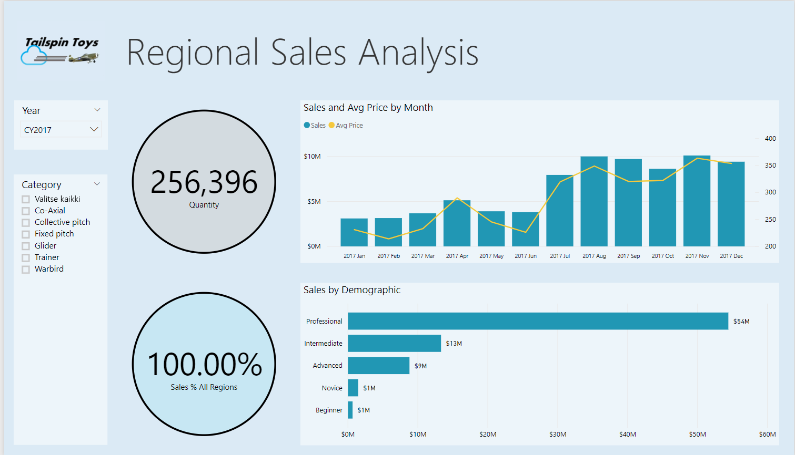

Tässä opetusohjelmassa opit:
> [!div class="checklist"]
> * Power BI:n mukautetun visualisoinnin luominen
> * Mukautetun visualisoinnin kehittäminen D3:n visuaalisilla elementeillä
> * Tietosidonnan määrittäminen visuaalisiin elementteihin
> * Tietojen arvojen muotoileminen

## <a name="prerequisites"></a>Edellytykset

* Jos et ole rekisteröitynyt **Power BI:hin**, [rekisteröi ilmainen kokeiluversio](https://powerbi.microsoft.com/pricing/) ennen aloittamista.
* Tarvitset asennetun [Visual Studio Coden](https://www.visualstudio.com/).
* Windows-käyttäjät tarvitsevat [Windows Poweshellistä](https://docs.microsoft.com/powershell/scripting/install/installing-windows-powershell?view=powershell-6) vähintään version 4. OSX-käyttäjät tarvitsevat [Terminalin](https://macpaw.com/how-to/use-terminal-on-mac).

## <a name="setting-up-the-developer-environment"></a>Kehittäjäympäristön määrittäminen

Näiden edellytysten lisäksi sinun on asennettava muutamia lisätyökaluja.

### <a name="installing-nodejs"></a>Node.js:n asentaminen

1. Asenna Node.js siirtymällä selaimella [Node.js-sivulle](https://nodejs.org).

2. Lataa uusin MSI-asennusohjelma.

3. Suorita asennusohjelma ja noudata asennusohjeita. Hyväksy käyttöoikeussopimus ja kaikki oletusarvot.

   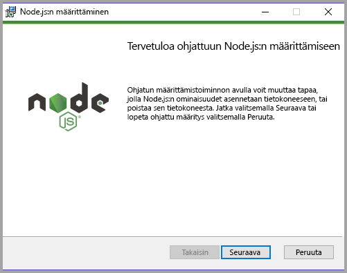

4. Käynnistä tietokone uudelleen.

### <a name="installing-packages"></a>Pakettien asentaminen

Nyt sinun on asennettava **pbiviz**-paketti.

1. Avaa Windows PowerShell, kun tietokone on käynnistynyt uudelleen.

2. Asenna pbiviz-paketti antamalla seuraava komento.

    ```powershell
    npm i -g powerbi-visuals-tools
    ```

### <a name="creating-and-installing-a-certificate"></a>Varmenteen luominen ja asentaminen

#### <a name="windows"></a>Windows

1. Voit luoda ja asentaa varmenteen syöttämällä seuraavan komennon.

    ```powershell
    pbiviz --install-cert
    ```

    Se palauttaa tuloksen, joka tuottaa *tunnuslauseen*. Tässä tapauksessa *tunnuslause* on **_15105661266553327_** . Se myös aloittaa varmenteiden tuontitoiminnon.

    

2. Varmista ohjatussa varmenteiden tuontitoiminnossa, että säilön sijainniksi on määritetty Nykyinen käyttäjä. Valitse *Seuraava*.

      

3. Valitse **Tuotava tiedosto** -vaiheessa *Seuraava*.

4. Liitä **Yksityisen avaimen suojaus** -vaiheessa salasanaruutuun tunnuslause, jonka varmenteen luomisvaiheessa.  Tässä tapauksessa se on siis **_15105661266553327_** .

      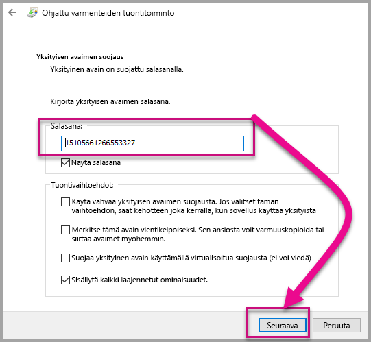

5. Valitse **Varmennesäilö**-vaiheessa **Sijoita kaikki varmenteet seuraavaan paikkaan** -vaihtoehto. Valitse *Selaa*.

      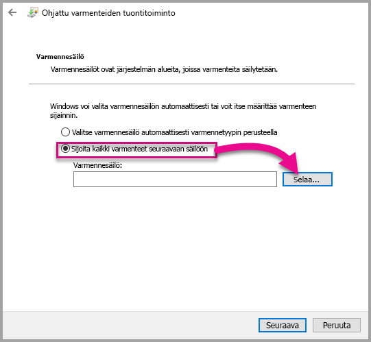

6. Valitse **Valitse varmennesäilö** -ikkunassa **Luotetut varmenteiden päämyöntäjät** ja sitten *OK*. Valitse **Varmennesäilö**-näytössä *Seuraava*.

      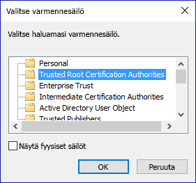

7. Viimeistele tuonti valitsemalla **Valmis**.

8. Jos näyttöön tulee suojausvaroitus, valitse **Kyllä**.

    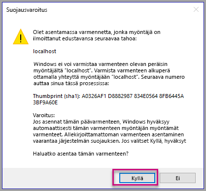

9. Kun ilmoituksen tuonti onnistui, valitse **OK**.

    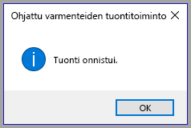

> [!Important]
> Älä sulje Windows PowerShell -istuntoa.

#### <a name="osx"></a>OSX

1. Jos lukko on lukittu vasemmassa yläkulmassa, avaa sen lukitus valitsemalla lukko. Hae *localhost* ja kaksoisnapsauta varmennetta.

    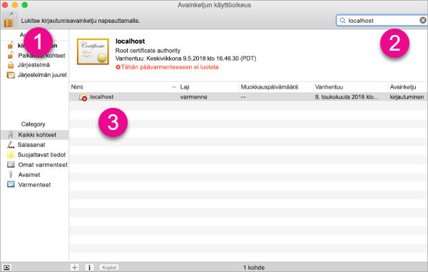

2. Valitse **Luota aina** ja sulje ikkuna.

    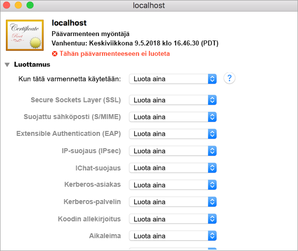

3. Kirjoita käyttäjänimi ja salasana. Valitse **Päivitä asetukset**.

    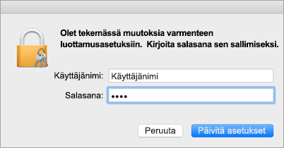

4. Sulje kaikki selaimet, jotka ovat avoinna.

> [!NOTE]
> Jos varmennetta ei tunnisteta, sinun on ehkä käynnistettävä tietokone uudelleen.

## <a name="creating-a-custom-visual"></a>Mukautetun visualisoinnin luominen

Nyt kun olet määrittänyt ympäristön, on aika luoda mukautettu visualisointi.

Voit [ladata](https://github.com/Microsoft/PowerBI-visuals-circlecard) koko lähdekoodin tätä opetusohjelmaa varten.

1. Varmista, että Power BI Visual Tools -paketti on asennettu.

    ```powershell
    pbiviz
    ```
    Näkyviin pitäisi tulla tulee Ohje-tuloste.

    <pre><code>
        +syyso+/
    oms/+osyhdhyso/
    ym/       /+oshddhys+/
    ym/              /+oyhddhyo+/
    ym/                     /osyhdho
    ym/                           sm+
    ym/               yddy        om+
    ym/         shho /mmmm/       om+
        /    oys/ +mmmm /mmmm/       om+
    oso  ommmh +mmmm /mmmm/       om+
    ymmmy smmmh +mmmm /mmmm/       om+
    ymmmy smmmh +mmmm /mmmm/       om+
    ymmmy smmmh +mmmm /mmmm/       om+
    +dmd+ smmmh +mmmm /mmmm/       om+
            /hmdo +mmmm /mmmm/ /so+//ym/
                /dmmh /mmmm/ /osyhhy/
                    //   dmmd
                        ++

        PowerBI Custom Visual Tool

    Usage: pbiviz [options] [command]

    Commands:

    new [name]        Create a new visual
    info              Display info about the current visual
    start             Start the current visual
    package           Package the current visual into a pbiviz file
    update [version]  Updates the api definitions and schemas in the current visual. Changes the version if specified
    help [cmd]        display help for [cmd]

    Options:

    -h, --help      output usage information
    -V, --version   output the version number
    --install-cert  Install localhost certificate
    </code></pre>

    <a name="ssl-setup"></a>

2. Tarkista tuloste ja tuettujen komentojen luettelo.

    

3. Jos haluat luoda mukautetun visualisoinnin projektin, anna seuraava komento. **CircleCard** on projektin nimi.

    ```PowerShell
    pbiviz new CircleCard
    ```
    

    > [!Note]
    > Luot uuden projektin kehotteen nykyisessä sijainnissa.

4. Siirry projektikansioon.

    ```powershell
    cd CircleCard
    ```
5. Käynnistä mukautettu visualisointi. CircleCard-visualisointi on nyt käynnissä, ja sitä isännöidään samanaikaisesti tietokoneessasi.

    ```powershell
    pbiviz start
    ```

    

> [!Important]
> Älä sulje Windows PowerShell -istuntoa.

### <a name="testing-the-custom-visual"></a>Mukautetun visualisoinnin testaaminen

Tässä osiossa testataan mukautettua CircleCard-visualisointia lataamalla Power BI Desktop -raportti ja muokkaamalla sitä näyttämään mukautettu visualisointi.

1. Kirjaudu sisään [PowerBI.comin](https://powerbi.microsoft.com/). Valitse **hammaspyöräkuvake** ja sitten **Asetukset**.

      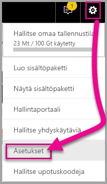

2. Valitse **Kehittäjä** ja sitten **Ota kehittäjätila käyttöön testausta varten** -valintaruutu.

    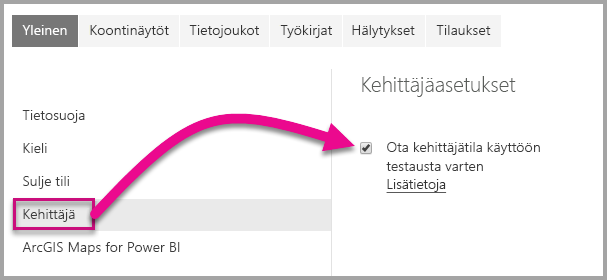

3. Lataa Power BI Desktop -raportti.  

    Valitse Nouda tiedot > Tiedostot > Paikallinen tiedosto.

    Voit [ladata](https://microsoft.github.io/PowerBI-visuals/docs/step-by-step-lab/images/US_Sales_Analysis.pbix) Power BI Desktopin malliraportin, jos sinulla ei ole vielä valmiiksi luotua raporttia.

    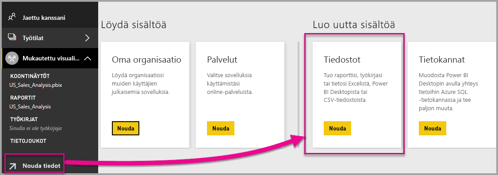 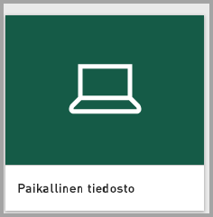

    Tarkastele raporttia valitsemalla **US_Sales_Analysis** vasemman siirtymisruudun **Raportti**-osiosta.

    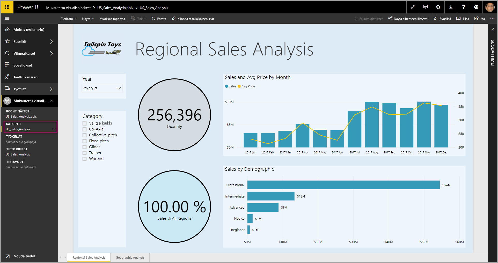

4. Nyt raporttia on muokattava Power BI -palvelussa.

    Valitse **Muokkaa raporttia**.

    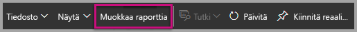

5. Valitse **Visualisointi**-ruudusta **Kehittäjän visualisointi**.

    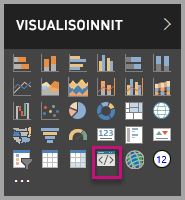

    > [!Note]
    > Tämä visualisointi edustaa mukautettua visualisointia, jonka käynnistit tietokoneessasi. Se on käytettävissä vain silloin, kun kehittäjäasetukset on otettu käyttöön.

6. Huomaa, että visualisointi lisättiin raporttipohjaan.

    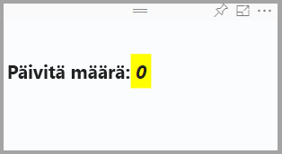

    > [!Note]
    > Tämä on erittäin yksinkertainen visualisointi, joka näyttää, kuinka monta kertaa sen päivitysmenetelmää on kutsuttu. Tässä vaiheessa visualisointi ei vielä nouda tietoja.

7. Kun olet valitsemassa uutta visualisointia raportissa, valitse Kentät-ruutu, laajenna Myynti-kohta ja valitse Määrä.

    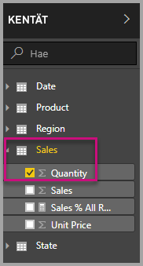

8. Testaa uutta visualisointia muuttamalla sen kokoa. Pane merkille päivitysarvon kasvu.

    

Voit lopettaa mukautetun visualisoinnin suorittamisen PowerShellissä näppäinyhdistelmällä Ctrl+C. Kun erätyön lopettamiseen pyydetään vahvistusta, paina Y ja sitten Enter.

## <a name="adding-visual-elements"></a>Visuaalisten elementtien lisääminen

Nyt sinun on asennettava **JavaScript-kirjasto D3**. D3 on JavaScript-kirjasto, jolla tuotetaan dynaamisia ja vuorovaikutteisia tietojen visualisointeja selaimissa. Se käyttää yleisiä SVG HTML5- ja CSS-standardeja.

Nyt voit kehittää mukautetun visualisoinnin, joka näyttää ympyrän ja tekstiä.

> [!Note]
> Monet tämän opetusohjelman teksteistä voi kopioida [täältä](https://github.com/Microsoft/powerbi-visuals-circlecard).

1. Asenna **D3-kirjasto** PowerShellissä antamalla alla oleva komento.

    ```powershell
    npm i d3@^5.0.0 --save
    ```

    ```powershell
    PS C:\circlecard>npm i d3@^5.0.0 --save
    + d3@5.11.0
    added 179 packages from 169 contributors and audited 306 packages in 33.25s
    found 0 vulnerabilities

    PS C:\circlecard>
    ```

2. Asenna tyyppimääritykset **D3-kirjastolle** antamalla alla oleva komento.

    ```powershell
    npm i @types/d3@^5.0.0 --save
    ```

    ```powershell
    PS C:\circlecard>npm i @types/d3@^5.0.0 --save
    + @types/d3@5.7.2
    updated 1 package and audited 306 packages in 2.217s
    found 0 vulnerabilities

    PS C:\circlecard>
    ```

    Tämä komento asentaa JavaScript-tiedostoihin perustuvat TypeScript-määritelmät, joiden ansiosta voit kehittää mukautetun visualisoinnin TypeScriptillä (joka on JavaScriptin yläjoukko. Visual Studio Code on paras mahdollinen integroitu kehitysympäristö TypeScript-sovellusten kehittämiseen.

3. Asenna **core-js** PowerShellissä antamalla alla oleva komento.

    ```powershell
    npm i core-js@3.2.1 --save
    ```

    ```powershell
    PS C:\circlecard> npm i core-js@3.2.1 --save

    > core-js@3.2.1 postinstall F:\circlecard\node_modules\core-js
    > node scripts/postinstall || echo "ignore"

    Thank you for using core-js ( https://github.com/zloirock/core-js ) for polyfilling JavaScript standard library!

    The project needs your help! Please consider supporting of core-js on Open Collective or Patreon:
    > https://opencollective.com/core-js
    > https://www.patreon.com/zloirock

    + core-js@3.2.1
    updated 1 package and audited 306 packages in 6.051s
    found 0 vulnerabilities

    PS C:\circlecard>
    ```

    Tämä komento asentaa JavaScriptin modulaarisen vakiokirjaston. Se sisältää polytäytöt ECMAScriptille 2019:ään saakka. Lisätietoja: [`core-js`](https://www.npmjs.com/package/core-js)

4. Asenna **powerbi-visual-api** PowerShellissä antamalla alla oleva komento.

    ```powershell
    npm i powerbi-visuals-api --save-dev
    ```

    ```powershell
    PS C:\circlecard>npm i powerbi-visuals-api --save-dev

    + powerbi-visuals-api@2.6.1
    updated 1 package and audited 306 packages in 2.139s
    found 0 vulnerabilities

    PS C:\circlecard>
    ```

    Tämä komento asentaa Power BI:n visualisointiohjelmointirajapintamääritelmät.

5. Asenna [Visual Studio Code](https://code.visualstudio.com/).

    Voit käynnistää **Visual Studio Coden** PowerShellissä käyttämällä seuraavaa komentoa.

    ```powershell
    code .
    ```

6. Laajenna **resurssienhallintaruudun** **node_modules**-kansio ja varmista, että **D3-kirjasto** on asennettu.

    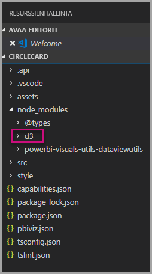

7. Varmista, että **index.d.ts**-tiedosto lisättiin: laajenna node_modules > @types > d3 **resurssienhallintaruudussa**.

    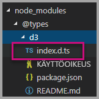

### <a name="developing-the-visual-elements"></a>Visuaalisten elementtien kehittäminen

Nyt voimme kehittää mukautetun visualisoinnin, joka näyttää ympyrän ja mallitekstin.

1. Laajenna **resurssienhallintaruudussa** **src**-kansio ja valitse **visual.ts**.

    > [!Note]
    > Pane merkille kommentit **visual.ts**-tiedoston yläosassa. Power BI:n mukautettujen visualisointien pakettien käyttöoikeus myönnetään maksutta MIT:n käyttöoikeussopimuksen ehtojen mukaisesti. Osana sopimusta sinun on kirjoitettava kommentti tiedoston yläosaan.

2. Poista seuraava oletusarvoinen mukautetun visualisoinnin logiikka Visual-luokasta.
    * Neljä luokkatason yksityistä muuttujaesittelyä.
    * Kaikki koodirivit konstruktorista.
    * Kaikki koodirivit päivitysmenetelmästä.
    * Kaikki moduulin jäljellä olevat rivit, mukaan lukien parseSettings- ja enumerateObjectInstances-menetelmät.

    Varmista, että moduulikoodi näyttää seuraavalta.

    ```typescript
    "use strict";
    import "core-js/stable";
    import "../style/visual.less";
    import powerbi from "powerbi-visuals-api";
    import IVisual = powerbi.extensibility.IVisual;
    import VisualConstructorOptions = powerbi.extensibility.visual.VisualConstructorOptions;
    import VisualUpdateOptions = powerbi.extensibility.visual.VisualUpdateOptions;
    import EnumerateVisualObjectInstancesOptions = powerbi.EnumerateVisualObjectInstancesOptions;
    import VisualObjectInstanceEnumeration = powerbi.VisualObjectInstanceEnumeration;
    import IVisualHost = powerbi.extensibility.visual.IVisualHost;

    import * as d3 from "d3";
    type Selection<T extends d3.BaseType> = d3.Selection<T, any,any, any>;

    export class Visual implements IVisual {

        constructor(options: VisualConstructorOptions) {

        }

        public update(options: VisualUpdateOptions) {

        }
    }
    ```

3. Lisää *Visual*-luokan esittelyn alle seuraavat luokkatason ominaisuudet.

    ```typescript
    export class Visual implements IVisual {
        // ...
        private host: IVisualHost;
        private svg: Selection<SVGElement>;
        private container: Selection<SVGElement>;
        private circle: Selection<SVGElement>;
        private textValue: Selection<SVGElement>;
        private textLabel: Selection<SVGElement>;
        // ...
    }
    ```

    

4. Lisää seuraava koodi *konstruktoriin*.

    ```typescript
    this.svg = d3.select(options.element)
        .append('svg')
        .classed('circleCard', true);
    this.container = this.svg.append("g")
        .classed('container', true);
    this.circle = this.container.append("circle")
        .classed('circle', true);
    this.textValue = this.container.append("text")
        .classed("textValue", true);
    this.textLabel = this.container.append("text")
        .classed("textLabel", true);
    ```

    Tämä koodi lisää SVG-ryhmän visualisoinnin sisälle ja lisää sitten kolme muotoa: ympyrä ja kaksi tekstielementtiä.

    Muotoile asiakirjan koodia napsauttamalla kakkospainikkeella missä tahansa **Visual Studio Code -asiakirjassa** ja valitsemalla sitten **Muotoile asiakirja**.

      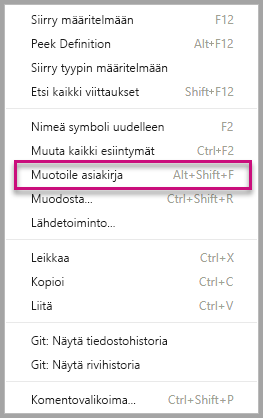

    Luettavuuden parantamiseksi asiakirja kannattaa muotoilla aina, kun liität koodikatkelmia.

5. Lisää seuraava koodi *päivitysmenetelmään*.

    ```typescript
    let width: number = options.viewport.width;
    let height: number = options.viewport.height;
    this.svg.attr("width", width);
    this.svg.attr("height", height);
    let radius: number = Math.min(width, height) / 2.2;
    this.circle
        .style("fill", "white")
        .style("fill-opacity", 0.5)
        .style("stroke", "black")
        .style("stroke-width", 2)
        .attr("r", radius)
        .attr("cx", width / 2)
        .attr("cy", height / 2);
    let fontSizeValue: number = Math.min(width, height) / 5;
    this.textValue
        .text("Value")
        .attr("x", "50%")
        .attr("y", "50%")
        .attr("dy", "0.35em")
        .attr("text-anchor", "middle")
        .style("font-size", fontSizeValue + "px");
    let fontSizeLabel: number = fontSizeValue / 4;
    this.textLabel
        .text("Label")
        .attr("x", "50%")
        .attr("y", height / 2)
        .attr("dy", fontSizeValue / 1.2)
        .attr("text-anchor", "middle")
        .style("font-size", fontSizeLabel + "px");
    ```

    *Tämä koodi määrittää visualisoinnin leveyden ja korkeuden sekä alustaa visuaalisten elementtien määritteet ja tyylit.*

6. Tallenna **visual.ts**-tiedosto.

7. Valitse **capabilities.json**-tiedosto.

    Poista rivillä 14 koko objektien elementti (rivit 14 – 60).

8. Tallenna **capabilities.json**-tiedosto.

9. Käynnistä mukautettu visualisointi PowerShellissä.

    ```powershell
    pbiviz start
    ```

### <a name="toggle-auto-reload"></a>Automaattinen uudelleenlataus käytössä tai ei käytössä

1. Siirry takaisin Power BI -raporttiin.
2. Valitse kehittäjän visualisoinnin päällä olevalta irralliselta työkaluriviltä **Automaattinen uudelleenlataus käytössä tai ei käytössä**.

    

    Tämä vaihtoehto varmistaa, että visualisointi ladataan automaattisesti uudelleen aina, kun tallennat projektin muutokset.

3. Vedä **Kentät-ruudussa** **Määrä**-kenttä kehittäjän visualisointiin.

4. Varmista, että visualisointi näyttää seuraavalta.

    

5. Muuta visualisoinnin kokoa.

    Huomaa, että ympyrä ja tekstiarvo skaalautuvat visualisoinnin mittojen mukaan.

    Päivitysmenetelmää kutsutaan jatkuvasti visualisoinnin koon muuttamisen aikana, jolloin tuloksena on visualisoinnin elementtien sulava uudelleenskaalautuminen.

    Olet nyt kehittänyt visualisoinnin elementit.

6. Jatka visualisoinnin suorittamista.

## <a name="process-data-in-the-visual-code"></a>Tietojen käsittely visualisointikoodissa

Määritä tietoroolien ja tietonäkymän yhdistämismääritykset. Muokkaa sitten mukautetun visualisoinnin logiikkaa näyttämään mittarin arvo ja näyttönimi.

### <a name="configuring-the-capabilities"></a>Ominaisuuksien määrittäminen

Muokkaa **capabilities.json**-tiedostoa tietoroolien ja tietonäkymän yhdistämismääritysten määrittämiseksi.

1. Poista kaikki sisältö **capabilities.json**-tiedoston **dataRoles**-matriisin riveiltä 3–12 Visual Studio Codessa.

2. Lisää seuraava koodi **dataRoles**-matriisin sisälle.

    ```json
    {
        "displayName": "Measure",
        "name": "measure",
        "kind": "Measure"
    }
    ```

    **DataRoles**-matriisi määrittää nyt yksittäisen **mittari**-tyyppiä olevan tietoroolin, jonka nimenä on **mittari** ja näyttönimenä **Mittari**. Tämä tietorooli sallii joko mittarikentän tai yhteenvetokentän välittämisen.

3. Poista kaikki sisältö riveiltä 10–31 **dataViewMappings**-matriisin sisällä.

4. Lisää seuraava sisältö **dataViewMappings**-matriisin sisälle.

    ```json
    {
        "conditions": [
            { "measure": { "max": 1 } }
        ],
        "single": {
            "role": "measure"
        }
    }
    ```

    **DataViewMappings**-matriisi määrittää nyt yhden kentän, jonka voi välittää tietorooliin nimeltä **mittari**.

5. Tallenna **capabilities.json**-tiedosto.

6. Huomaa, että voit nyt Power BI:ssä määrittää visualisoinnin **mittarin** avulla.

    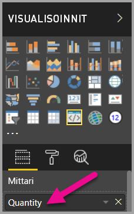

    > [!Note]
    > Visualisointiprojekti ei vielä sisällä tietojen sidontalogiikkaa.

### <a name="exploring-the-dataview"></a>Tietonäkymän tutkiminen

1. Valitse visualisoinnin päällä olevalta irralliselta työkaluriviltä **Näytä tietonäkymä**.

    

2. Laajenna alaspäin **yksittäinen**-kohtaan ja ota sen arvo ylös.

    

3. Laajenna alaspäin **metatiedot**-kohtaan ja **sarakkeet**-matriisiin. Ota ylös erityisesti **muoto**- ja **displayName**-arvot.

    

4. Vaihda takaisin visualisointiin. Valitse visualisoinnin päällä olevalta irralliselta työkaluriviltä **Näytä tietonäkymä**.

    

### <a name="consume-data-in-the-visual-code"></a>Tietojen käyttö visualisointikoodissa

1. Tuo **Visual Studio -koodin** **visual.ts**-tiedostoon

    liittymä `DataView` moduulista `powerbi`

    ```typescript
    import DataView = powerbi.DataView;
    ```

    ja lisää seuraava lauseke päivitysmenetelmän ensimmäiseksi lausekkeeksi.

    ```typescript
    let dataView: DataView = options.dataViews[0];
    ```

    

    Tämä lauseke määrittää *DataView’n* muuttujaan käytön helpottamiseksi ja määrittää muuttujan viittaamaan *dataView*-objektiin.

2. Korvaa **päivitysmenetelmässä** **.text(”Value”)** seuraavalla.

    ```typescript
    .text(<string>dataView.single.value)
    ```

    

3. Korvaa **päivitysmenetelmässä** **.text(”Label”)** seuraavalla.

    ```typescript
    .text(dataView.metadata.columns[0].displayName)
    ```

    

4. Tallenna **visual.ts**-tiedosto.

5. Tarkista visualisointi **Power BI:ssä**. Se näyttää nyt arvon ja näyttönimen.

Olet nyt määrittänyt tietoroolit ja sitonut visualisoinnin tietonäkymään.

Seuraavassa opetusohjelmassa opit lisäämään muotoiluasetuksia mukautettuun visualisointiin.

## <a name="debugging"></a>Virheenkorjaus

Katso vihjeitä mukautetun visualisoinnin virheenkorjauksesta [virheenkorjauksen oppaasta](https://microsoft.github.io/PowerBI-visuals/docs/how-to-guide/how-to-debug/).

## <a name="next-steps"></a>Seuraavat vaiheet

> [!div class="nextstepaction"]
> [Muotoiluasetusten lisääminen](custom-visual-develop-tutorial-format-options.md)
