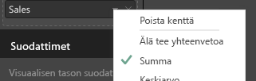
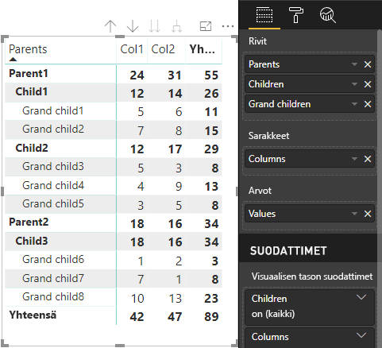

# <a name="understand-data-view-mapping-in-power-bi-visuals"></a>Power BI -visualisointien tietonäkymän yhdistämismääritykset

Tässä artikkelissa kuvataan, miten tietonäkymän yhdistämismääritykset liittyvät toisiinsa ja antavat sinun määrittää niille ehdollisia vaatimuksia. Artikkelissa kuvataan myös jokainen `dataMappings`-tyyppi.

Jokainen kelvollinen yhdistäminen tuottaa tietonäkymän, mutta tuemme tällä hetkellä vain yhden kyselyn suorittamista visualisointia kohden. Saat tavallisesti vain yhden tietonäkymän. Voit kuitenkin antaa useita tietojen yhdistämismäärityksiä tietyillä ehdoilla, mikä mahdollistaa seuraavan:

```json
"dataViewMappings": [
    {
        "conditions": [ ... ],
        "categorical": { ... },
        "single": { ... },
        "table": { ... },
        "matrix": { ... }
    }
]
```

Power BI luo tietonäkymän yhdistämismäärityksen, jos ja vain jos kelvollinen yhdistämismääritys on täytetty kohteessa `dataViewMappings`.

Toisin sanoen `categorical` voidaan määrittää `dataViewMappings`-yhdistämismäärityksessä, mutta muissa määrityksissä, kuten `table` tai `single`, ei ehkä voida. Esimerkki:

```json
"dataViewMappings": [
    {
        "categorical": { ... }
    }
]
```

Power BI tuottaa tietonäkymän, jossa on yksittäinen `categorical`-yhdistäminen, ja `table` sekä muut yhdistämiset ovat määrittämättömiä:

```javascript
{
    "categorical": {
        "categories": [ ... ],
        "values": [ ... ]
    },
    "metadata": { ... }
}
```

## <a name="conditions"></a>Ehdot

Tässä osassa kuvataan tietyn tietojen yhdistämismäärityksen ehdot. Voit antaa useita ehtojoukkoja, ja jos tiedot vastaavat jotakin kuvatuista ehtojoukoista, visualisointi hyväksyy tiedot kelvollisiksi.

Tällä hetkellä kullekin kentälle voidaan määrittää vähimmäis-ja enimmäisarvo. Arvo edustaa niiden kenttien määrää, jotka voidaan sitoa kyseiseen tietorooliin. 

> [!NOTE]
> Jos tietorooli jätetään pois ehdosta, sillä voi olla mikä tahansa määrä kenttiä.

### <a name="example-1"></a>Esimerkki: 1

Voit vetää useita kenttiä kuhunkin tietorooliin. Tässä esimerkissä rajoitetaan luokka yhteen tietokenttään ja mittari kahteen tietokenttään.

```json
"conditions": [
    { "category": { "max": 1 }, "y": { "max": 2 } },
]
```

### <a name="example-2"></a>Esimerkki 2

Tässä esimerkissä vaaditaan jompikumpi kahdesta ehdosta:
* Täsmälleen yksi luokkatietokenttä ja täsmälleen kaksi mittaria
* Tarkalleen kaksi luokkaa ja täsmälleen yksi mittari.

```json
"conditions": [
    { "category": { "min": 1, "max": 1 }, "measure": { "min": 2, "max": 2 } },
    { "category": { "min": 2, "max": 2 }, "measure": { "min": 1, "max": 1 } }
]
```

## <a name="single-data-mapping"></a>Yksittäistietojen yhdistäminen

Yksittäistietojen yhdistäminen on yksinkertaisin tietojen yhdistämisen muoto. Se hyväksyy yksittäisen mittarikentän ja antaa tulokseksi kokonaismäärän. Jos kenttä on numeerinen, saat tulokseksi summan. Muutoin saat yksilöllisten arvojen määrän.

Jos haluat käyttää yksittäistietojen yhdistämistä, sinun on määritettävä sen tietoroolin nimi, jonka haluat yhdistää. Tämä yhdistäminen toimii vain yksittäisen mittarikentän kanssa. Jos toinen kenttä on määritetty, tietonäkymää ei muodosteta. Siksi on myös hyvä käytäntö sisällyttää ehto, joka rajoittaa tiedot yhteen kenttään.

> [!NOTE]
> Tätä tietojen yhdistämistä ei voi käyttää yhdessä minkään muun tietojen yhdistämisen kanssa. Se on tarkoitettu muuttamaan tiedot yhdeksi numeeriseksi arvoksi.

### <a name="example-3"></a>Esimerkki 3

```json
"dataViewMappings": {
    "conditions": [
        { "Y": { "max": 1 } }
    ],
    "single": {
        "role": "Y"
    }
}  
```

Tuloksena saatava tietonäkymä sisältää yhä muita tyyppejä (esimerkiksi taulukko ja luokittainen), mutta jokainen yhdistämismääritys sisältää vain yksittäisen arvon. Paras käytäntö on käyttää yksittäistä arvoa.

```JSON
{
    "dataView": [
        {
            "metadata": null,
            "categorical": null,
            "matrix": null,
            "table": null,
            "tree": null,
            "single": {
                "value": 94163140.3560001
            }
        }
    ]
}
```

## <a name="categorical-data-mapping"></a>Luokittainen tietojen yhdistäminen

Luokittaisen tietojen yhdistämisen avulla saadaan yksi tai kaksi riippumatonta tietoryhmittelyä.

### <a name="example-4"></a>Esimerkki 4

Tässä on edellisen tietorooliesimerkin määritys:

```json
"dataRole":[
    {
        "displayName": "Category",
        "name": "category",
        "kind": "Grouping"
    },
    {
        "displayName": "Y Axis",
        "name": "measure",
        "kind": "Measure"
    }
]
```

Tämä on yhdistämismääritys:

```json
"dataViewMappings": {
    "categorical": {
        "categories": {
            "for": { "in": "category" }
        },
        "values": {
            "select": [
                { "bind": { "to": "measure" } }
            ]
        }
    }
}
```

Esimerkki on yksinkertainen. Selkeällä englannilla siinä lukee ”Map my `category` DataRole so that for every field I drag into `category`, its data is mapped to `categorical.categories`. Also map my `measure` DataRole to `categorical.values`” (Yhdistä category-DataRole niin, että jokainen kenttä, jonka vedän kohteeseen category, yhdistyy kohteeseen categorical values Yhdistä myös measure-DataRole kohteeseen categorical.values).

* **for...in**: Sisällytä kaikki tämän tietoroolin kohteet tietokyselyyn.
* **bind...to**: Tuottaa saman tuloksen kuin *for...in*, mutta odottaa, että tietojen roolilla on ehto, joka rajoittaa sen yksittäiseen kenttään.

### <a name="example-5"></a>Esimerkki 5

Tässä esimerkissä käytämme kahta ensimmäistä tietojen roolia edellisestä esimerkistä ja lisäksi määritämme nimet `grouping` ja `measure2`.

```json
"dataRole":[
    {
        "displayName": "Category",
        "name": "category",
        "kind": "Grouping"
    },
    {
        "displayName": "Y Axis",
        "name": "measure",
        "kind": "Measure"
    },
    {
        "displayName": "Grouping with",
        "name": "grouping",
        "kind": "Grouping"
    },
    {
        "displayName": "X Axis",
        "name": "measure2",
        "kind": "Grouping"
    }
]
```

Tämä on yhdistämismääritys:

```json
"dataViewMappings":{
    "categorical": {
        "categories": {
            "for": { "in": "category" }
        },
        "values": {
            "group": {
                "by": "grouping",
                "select":[
                    { "bind": { "to": "measure" } },
                    { "bind": { "to": "measure2" } }
                ]
            }
        }
    }
}
```

Tässä ero on siinä, miten categorical.values-yhdistämismääritys tehdään. Sanomme ”Map my `measure` and `measure2` data roles to be grouped by the data role `grouping`.” (”Tee yhdistämismääritys tietorooleille measure ja measure2, niin että ne ryhmitellään tietoroolin grouping mukaan.)

### <a name="example-6"></a>Esimerkki 6

Nämä ovat tietojen roolit:

```json
"dataRoles": [
    {
        "displayName": "Categories",
        "name": "category",
        "kind": "Grouping"
    },
    {
        "displayName": "Measures",
        "name": "measure",
        "kind": "Measure"
    },
    {
        "displayName": "Series",
        "name": "series",
        "kind": "Measure"
    }
]
```

Nämä ovat tietonäkymän yhdistämismääritykset:

```json
"dataViewMappings": [
    {
        "categorical": {
            "categories": {
                "for": {
                    "in": "category"
                }
            },
            "values": {
                "group": {
                    "by": "series",
                    "select": [{
                            "for": {
                                "in": "measure"
                            }
                        }
                    ]
                }
            }
        }
    }
]
```

Luokittainen tietonäkymä voidaan visualisoida näin:

| Luokittainen |  |  | | | |
|-----|-----|------|------|------|------|
| | Vuosi | 2013 | 2014 | 2015 | 2016 |
| Maa | | |
| Yhdysvallat | | x | x | 125 | 100 |
| Kanada | | x | 50 | 200 | x |
| Meksiko | | 300 | x | x | x |
| Iso-Britannia | | x | x | 75 | x |

Power BI tuottaa sen luokittaisena tietonäkymänä. Se on luokkien joukko.

```JSON
{
    "categorical": {
        "categories": [
            {
                "source": {...},
                "values": [
                    "Canada",
                    "Mexico",
                    "UK",
                    "USA"
                ],
                "identity": [...],
                "identityFields": [...],
            }
        ]
    }
}
```

Jokainen luokka yhdistyy myös joukkoon arvoja. Jokainen näistä arvoista ryhmitellään vuosina ilmaistavan sarjan mukaan.

Esimerkiksi Kanadan myynti vuonna 2013 on tyhjäarvo, Kanadan myynti 2014 on 50.

```JSON
{
    "values": [
        {
            "source": {...},
            "values": [
                null,
                300,
                null,
                null
            ],
            "identity": [...],
        },
        {
            "source": {...},
            "values": [
                50,
                null,
                150,
                null
            ],
            "identity": [...],
        },
        {
            "source": {...},
            "values": [
                200,
                null,
                null,
                125
            ],
            "identity": [...],
        },
        {
            "source": {...},
            "values": [
                null,
                null,
                null,
                100
            ],
            "identity": [...],
        }
    ]
}
```

## <a name="table-data-mapping"></a>Taulukkotietojen yhdistäminen

Taulukon tietonäkymä on yksinkertainen tietojen yhdistämismääritys. Pohjimmiltaan kyseessä on arvopisteiden luettelo, johon voidaan koota numeerisia arvopisteitä.

### <a name="example-7"></a>Esimerkki 7

Annetuilla ominaisuuksilla:

```json
"dataRoles": [
    {
        "displayName": "Values",
        "name": "values",
        "kind": "Measure"
    }
]
```

```json
"dataViewMappings": [
    {
        "table": {
            "rows": {
                "for": {
                    "in": "values"
                }
            }
        }
    }
]
```

Voit visualisoida taulukkotietonäkymän seuraavasti:  

| Maa| Vuosi | Myynti |
|-----|-----|------|
| Yhdysvallat | 2016 | 100 |
| Yhdysvallat | 2015 | 50 |
| Kanada | 2015 | 200 |
| Kanada | 2015 | 50 |
| Meksiko | 2013 | 300 |
| Iso-Britannia | 2014 | 150 |
| Yhdysvallat | 2015 | 75 |

Power BI näyttää tietosi taulukkotietonäkymänä. Sinun ei pidä olettaa, että tiedot on järjestetty.

```JSON
{
    "table" : {
        "columns": [...],
        "rows": [
            [
                "Canada",
                2014,
                50
            ],
            [
                "Canada",
                2015,
                200
            ],
            [
                "Mexico",
                2013,
                300
            ],
            [
                "UK",
                2014,
                150
            ],
            [
                "USA",
                2015,
                100
            ],
            [
                "USA",
                2015,
                75
            ],
            [
                "USA",
                2016,
                100
            ]
        ]
    }
}
```

Voit koostaa tiedot valitsemalla haluamasi kentän ja valitsemalla sitten summan.  



## <a name="matrix-data-mapping"></a>Matriisitietojen yhdistäminen

Matriisitietojen yhdistäminen on samantapaista kuin taulukkotietojen yhdistäminen, mutta rivit esitetään hierarkkisesti. Mitä tahansa tietorooliarvoista voidaan käyttää sarakeotsikon arvona.

```json
{
    "dataRoles": [
        {
            "name": "Category",
            "displayName": "Category",
            "displayNameKey": "Visual_Category",
            "kind": "Grouping"
        },
        {
            "name": "Column",
            "displayName": "Column",
            "displayNameKey": "Visual_Column",
            "kind": "Grouping"
        },
        {
            "name": "Measure",
            "displayName": "Measure",
            "displayNameKey": "Visual_Values",
            "kind": "Measure"
        }
    ],
    "dataViewMappings": [
        {
            "matrix": {
                "rows": {
                    "for": {
                        "in": "Category"
                    }
                },
                "columns": {
                    "for": {
                        "in": "Column"
                    }
                },
                "values": {
                    "select": [
                        {
                            "for": {
                                "in": "Measure"
                            }
                        }
                    ]
                }
            }
        }
    ]
}
```

Power BI luo hierarkkisen tietorakenteen. Puun juuri sisältää **Päätaso**-sarakkeen tiedot `Category`-tietoroolista ja alatason tiedot tietoroolitaulukon **Alataso**-sarakkeesta.

Tietojoukko:

| Vanhemmat | Lapset | Alatason alataso | Sarakkeet | Arvot |
|-----|-----|------|-------|-------|
| Vanhempi1 | Lapsi1 | Lapsenlapsi1 | Sar1 | 5 |
| Vanhempi1 | Lapsi1 | Lapsenlapsi1 | Sar2 | 6 |
| Vanhempi1 | Lapsi1 | Lapsenlapsi2 | Sar1 | 7 |
| Vanhempi1 | Lapsi1 | Lapsenlapsi2 | Sar2 | 8 |
| Vanhempi1 | Lapsi2 | Lapsenlapsi3 | Sar1 | 5 |
| Vanhempi1 | Lapsi2 | Lapsenlapsi3 | Sar2 | 3 |
| Vanhempi1 | Lapsi2 | Lapsenlapsi4 | Sar1 | 4 |
| Vanhempi1 | Lapsi2 | Lapsenlapsi4 | Sar2 | 9 |
| Vanhempi1 | Lapsi2 | Lapsenlapsi5 | Sar1 | 3 |
| Vanhempi1 | Lapsi2 | Lapsenlapsi5 | Sar2 | 5 |
| Vanhempi2 | Lapsi3 | Lapsenlapsi6 | Sar1 | 1 |
| Vanhempi2 | Lapsi3 | Lapsenlapsi6 | Sar2 | 2 |
| Vanhempi2 | Lapsi3 | Lapsenlapsi7 | Sar1 | 7 |
| Vanhempi2 | Lapsi3 | Lapsenlapsi7 | Sar2 | 1 |
| Vanhempi2 | Lapsi3 | Lapsenlapsi8 | Sar1 | 10 |
| Vanhempi2 | Lapsi3 | Lapsenlapsi8 | Sar2 | 13 |

Power BI:n ydinmatriisivisualisointi hahmontaa tiedot taulukon tapaan.



Visualisointi saa tietorakenteensa seuraavassa koodissa kuvatulla tavalla (vain kaksi ensimmäistä taulukon riviä näkyvät tässä):

```json
{
    "metadata": {...},
    "matrix": {
        "rows": {
            "levels": [...],
            "root": {
                "childIdentityFields": [...],
                "children": [
                    {
                        "level": 0,
                        "levelValues": [...],
                        "value": "Parent1",
                        "identity": {...},
                        "childIdentityFields": [...],
                        "children": [
                            {
                                "level": 1,
                                "levelValues": [...],
                                "value": "Child1",
                                "identity": {...},
                                "childIdentityFields": [...],
                                "children": [
                                    {
                                        "level": 2,
                                        "levelValues": [...],
                                        "value": "Grand child1",
                                        "identity": {...},
                                        "values": {
                                            "0": {
                                                "value": 5 // value for Col1
                                            },
                                            "1": {
                                                "value": 6 // value for Col2
                                            }
                                        }
                                    },
                                    ...
                                ]
                            },
                            ...
                        ]
                    },
                    ...
                ]
            }
        },
        "columns": {
            "levels": [...],
            "root": {
                "childIdentityFields": [...],
                "children": [
                    {
                        "level": 0,
                        "levelValues": [...],
                        "value": "Col1",
                        "identity": {...}
                    },
                    {
                        "level": 0,
                        "levelValues": [...],
                        "value": "Col2",
                        "identity": {...}
                    },
                    ...
                ]
            }
        },
        "valueSources": [...]
    }
}
```

## <a name="data-reduction-algorithm"></a>Tietojenvähennysalgoritmi

Voit määrittää tietonäkymään vastaanotettavien tietojen määrän käyttämällä tietojenvähennysalgoritmia.

Oletusarvon mukaan kaikissa mukautetuissa visualisoinneissa on käytössä tietojenvähennysalgoritmi, jonka *määrä*-arvo on 1000 arvopistettä. Se vastaa seuraavien ominaisuuksien määrittämistä tiedostossa *capabilities.json*:

```json
"dataReductionAlgorithm": {
    "top": {
        "count": 1000
    }
}
```

Voit muokata *määrä*-arvoa mihin tahansa kokonaislukuarvoon, joka on enintään 30000. R-pohjaiset mukautetut visualisoinnit voivat tukea enintään 150 000 riviä.

## <a name="data-reduction-algorithm-types"></a>Tietojen vähentämisen algoritmityypit

Tietojenvähennysalgoritmin asetuksia on neljää tyyppiä:

* `top`: Jos haluat rajoittaa tiedot arvoihin, jotka on otettu tietojoukon yläosasta. Tietojoukosta otetaan ylimmät ensimmäiset *määrä*-arvot.
* `bottom`: Jos haluat rajoittaa tiedot arvoihin, jotka on otettu tietojoukon alaosasta. Viimeiset määrä-arvot otetaan tietojoukosta.
* `sample`: Pienentää tietojoukkoa yksinkertaisella otanta-algoritmilla, joka on rajoitettu kohteiden *määrä*-arvon mukaan. Se tarkoittaa, että ensimmäiset ja viimeiset kohteet sisällytetään samoin kuin *määrä*-arvon suuruinen määrä kohteita, jotka esiintymisväli on tasainen.
Jos sinulla on esimerkiksi tietojoukko [0, 1, 2... 100] ja *määrä* 9, saat arvot [0, 10, 20... 100].
* `window`: Lataa kerrallaan yhden arvopisteiden *ikkunan*, joka sisältää *määrä*-elementtejä. Tällä hetkellä `top` ja `window` vastaavat toisiaan. Pyrimme tukemaan ikkunointiasetusta täydellisesti.

## <a name="data-reduction-algorithm-usage"></a>Tietojen vähentämisen algoritmin käyttö

Tietojenvähennysalgoritmia voidaan käyttää yhdistämiseen tietojen luokittaisessa näkymässä tai taulukko- tai matriisinäkymässä.

Voit määrittää algoritmin kohdassa `categories` ja/tai `values`-kohdan group-alakohdassa luokittaista tietojen yhdistämistä varten.

### <a name="example-8"></a>Esimerkki 8

```json
"dataViewMappings": {
    "categorical": {
        "categories": {
            "for": { "in": "category" },
            "dataReductionAlgorithm": {
                "window": {
                    "count": 300
                }
            }  
        },
        "values": {
            "group": {
                "by": "series",
                "select": [{
                        "for": {
                            "in": "measure"
                        }
                    }
                ],
                "dataReductionAlgorithm": {
                    "top": {
                        "count": 100
                    }
                }  
            }
        }
    }
}
```

Voit käyttää tietojenvähennysalgoritmia tietonäkymän yhdistämistaulukon `rows`-osassa.

### <a name="example-9"></a>Esimerkki 9

```json
"dataViewMappings": [
    {
        "table": {
            "rows": {
                "for": {
                    "in": "values"
                },
                "dataReductionAlgorithm": {
                    "top": {
                        "count": 2000
                    }
                } 
            }
        }
    }
]
```

Voit käyttää tietojenvähennysalgoritmia tietonäkymän yhdistämismatriisin `rows`- ja `columns`-osassa.
