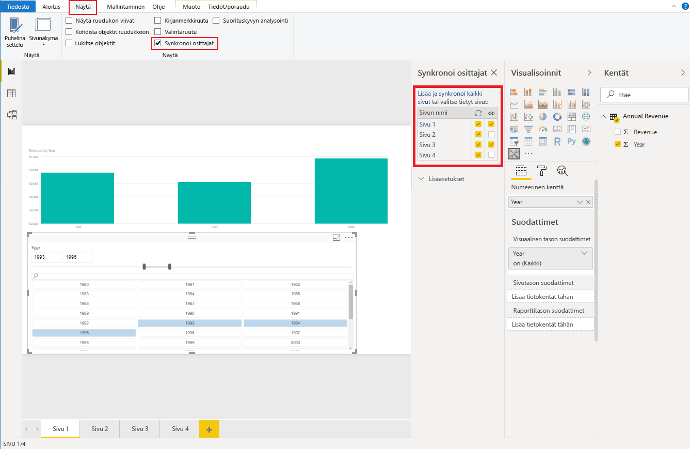

# <a name="sync-slicers-in-power-bi-visuals"></a>Synkronoi osittajat -toiminto Power BI:n visualisoinneissa

[Synkronoi osittajat](https://docs.microsoft.com/power-bi/desktop-slicers) -toiminnon tuki edellyttää, että mukautettu osittaja käyttää ohjelmointirajapinnan versiota 1,13 tai uudempaa versiota.

Lisäksi sinun on otettava asetus käyttöön *capabilities.json*-tiedostossa seuraavassa koodissa esitetyllä tavalla:

```json
{
    ...
    "supportsHighlight": true,
    "suppressDefaultTitle": true,
    "supportsSynchronizingFilterState": true,
    "sorting": {
        "default": {}
    }
}
```

Kun olet ladannut *capabilities.json*-tiedoston, voit tarkastella **Synkronoi osittajat** -asetusruutua, kun valitset mukautetun osittajan visualisoinnin.

> [!NOTE]
> Synkronoi osittajat -toiminto tukee enintään yhtä kenttää. Jos osittajassasi on vähintään kaksi kenttää (**Luokka** tai **Mittari**), toiminto on poissa käytöstä.



**Synkronoi osittajat** -ruudussa näkyy, että osittajan näkyvyys ja suodatus voidaan ottaa käyttöön useille raporttisivuille.
