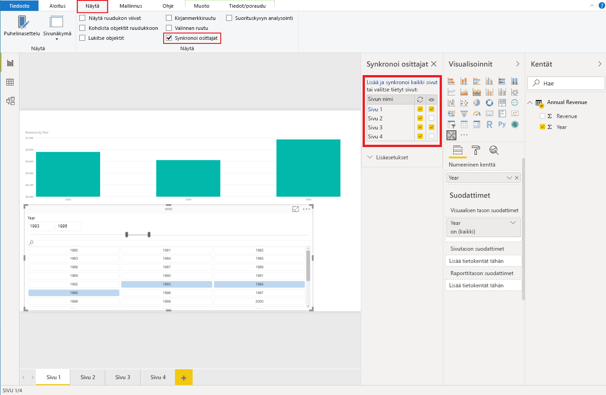

# <a name="sync-slicers"></a>Synkronoi osittajat

Tukeakseen [osittajien synkronointia](https://docs.microsoft.com/power-bi/desktop-slicers) mukautetun osittajan visualisoinnin on käytettävä ohjelmointirajapintaa 1.13 tai uudempaa.

Käytössä pitää olla myös asetus `capabilities.json` (katso alla oleva malli).

```json
{
    ...
    "supportsHighlight": true,
    "suppressDefaultTitle": true,
    "supportsSynchronizingFilterState": true,
    "sorting": {
        "default": {}
    }
}
```

Kun olet tehnyt muutoksia kohtaan `capabilities.json`, näet Synkronoi osittajat -asetuspaneelin, kun napsautat mukautettua osittajan visualisointia.

> [!NOTE]
> Jos osittajassa on useampi kuin yksi kenttä (luokka tai mittari), ominaisuus poistetaan käytöstä, koska osittajien synkronointi ei tue useita kenttiä.



Paneelissa näkyy, että osittajan näkyvyys ja suodatus voidaan ottaa käyttöön useille raporttisivuille.
