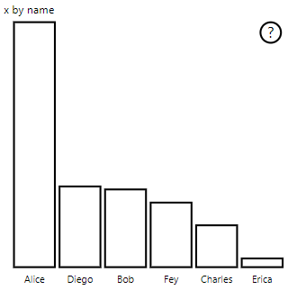

# <a name="high-contrast-mode-support"></a>Suuren kontrastin tilan tuki

Windowsin *suuren kontrastin* asetus helpottaa tekstin ja sovellusten näkemistä käyttämällä selkeämpiä värejä.
Lue lisää [suuren kontrastin tuesta Power BI:ssä](https://powerbi.microsoft.com/blog/power-bi-desktop-june-2018-feature-summary/#highContrast).

Suuren kontrastin tuen lisääminen visualisointiin edellyttää seuraavaa:

1. Alustuksen yhteydessä: Tunnista, onko Power BI suuren kontrastin tilassa ja jos on, hae nykyiset suuren kontrastin värit.
2. Jokaisen päivityksen yhteydessä: Muuta visualisoinnin hahmontamista siten, että se on helpommin näkyvissä.

PowerBI-visuals-sampleBarChart-visualisoinnissa on käytössä suuren kontrastin tuki.

Jos haluat lisätietoja, tutustu [PowerBI-visuals-sampleBarChart-visualisoinnin säilöön](https://github.com/Microsoft/PowerBI-visuals-sampleBarChart/commit/61011c82b66ca0d3321868f1d089c65101ca42e6)

## <a name="on-init"></a>Alustuksen yhteydessä

`options.host`-objektin ColorPalette-jäsenellä on useita ominaisuuksia suuren kontrastin tilassa. Näiden ominaisuuksien avulla voit määrittää, onko suuren kontrastin tila aktiivinen, ja jos on, mitä värejä käytetään.

### <a name="detect-that-power-bi-is-in-high-contrast-mode"></a>Tunnista, että Power BI on suuren kontrastin tilassa

Jos `host.colorPalette.isHighContrast`-objektin arvona on `true`, suuren kontrastin tila on aktiivinen ja visualisoinnin pitäisi piirtää itsensä sen mukaisesti.

### <a name="get-high-contrast-colors"></a>Hanki suuren kontrastin värejä

Suuren kontrastin tilassa visualisoinnin tulee rajoittua seuraaviin väreihin:

* **Edustan** värillä piirretään viivoja, kuvakkeita, tekstiä, ääriviivoja tai täytetään muotoja.
* **Taustan** väriä käytetään taustassa ja korostettujen muotojen täyttövärinä.
* **Edusta – valittu** -väriä käytetään osoittamaan valittua tai aktiivista elementtiä.
* **Hyperlinkin** väriä käytetään vain hyperlinkkitekstissä.

> [!NOTE]
> Jos toissijaista väriä tarvitaan, edustan väriä voidaan käyttää pienellä peittävyydellä (Power BI:n alkuperäisissä visualisoinneissa peittävyys on 40 %). Käytä tätä säästeliäästi, jotta visualisoinnin tiedot on helppo nähdä.

Voit tallentaa nämä arvot alustuksen aikana:

```typescript
private isHighContrast: boolean;

private foregroundColor: string;
private backgroundColor: string;
private foregroundSelectedColor: string;
private hyperlinkColor: string;
//...

constructor(options: VisualConstructorOptions) {
    this.host = options.host;
    let colorPalette: ISandboxExtendedColorPalette = host.colorPalette;
    //...
    this.isHighContrast = colorPalette.isHighContrast;
    if (this.isHighContrast) {
        this.foregroundColor = colorPalette.foreground.value;
        this.backgroundColor = colorPalette.background.value;
        this.foregroundSelectedColor = colorPalette.foregroundSelected.value;
        this.hyperlinkColor = colorPalette.hyperlink.value;
    }
```

Voit myös tallentaa `host`-objektin alustuksen aikana ja käyttää asianmukaisia `colorPalette`-ominaisuuksia päivityksen aikana.

## <a name="on-update"></a>Päivityksen yhteydessä

Suuren kontrastin tuen tarkat toteutukset vaihtelevat visualisoinnista toiseen ja riippuvat graafisen suunnittelun yksityiskohdista. Suuren kontrastin tila vaatii yleensä oletusmallista hieman poikkeavan mallin, jotta tärkeät tiedot on helppo erottaa rajoitetuilla väreillä.

Seuraavassa on joitakin ohjeita, ja sen jälkeen Power BI:n alkuperäisiä visualisointeja:

* Kaikissa arvopisteissä käytetään samaa väriä (edusta).
* Kaikissa teksteissä, akseleissa, nuolissa, viivoissa jne. käytetään edustan väriä.
* Paksut muodot piirretään ääriviivoina, ja niissä on paksut viivat (vähintään kaksi kuvapistettä) ja taustavärin täyttö.
* Tarvittaessa arvopisteet erotetaan toisistaan erilaisilla merkintämuodoilla ja tietoviivat erilaisilla viivoilla.
* Kun tietoelementti korostetaan, kaikkien muiden elementtien peittävyydeksi tulee 40 %.
* Osittajien kohdalla aktiiviset suodatuselementit käyttävät edustavalittua väriä.

Esimerkkipalkkikaaviossa kaikki palkit on piirretty käyttäen kahden kuvapisteen paksuista edustan ääriviivaa ja taustan täyttöä. Vertaa sen ulkoasua, kun käytössä ovat oletusvärit sekä muutama suuren kontrastin teema:




Seuraavassa on yksi `visualTransform`-funktion kohta, jota muutettiin tukemaan suurta kontrastia, se kutsutaan hahmontamisen osana kun `update` tehdään:

### <a name="before"></a>Ennen

```typescript
for (let i = 0, len = Math.max(category.values.length, dataValue.values.length); i < len; i++) {
    let defaultColor: Fill = {
        solid: {
            color: colorPalette.getColor(category.values[i] + '').value
        }
    };

    barChartDataPoints.push({
        category: category.values[i] + '',
        value: dataValue.values[i],
        color: getCategoricalObjectValue<Fill>(category, i, 'colorSelector', 'fill', defaultColor).solid.color,
        selectionId: host.createSelectionIdBuilder()
            .withCategory(category, i)
            .createSelectionId()
    });
}
```

### <a name="after"></a>Jälkeen

```typescript
for (let i = 0, len = Math.max(category.values.length, dataValue.values.length); i < len; i++) {
    const color: string = getColumnColorByIndex(category, i, colorPalette);

    const selectionId: ISelectionId = host.createSelectionIdBuilder()
        .withCategory(category, i)
        .createSelectionId();

    barChartDataPoints.push({
        color,
        strokeColor,
        strokeWidth,
        selectionId,
        value: dataValue.values[i],
        category: `${category.values[i]}`,
    });
}

//...

function getColumnColorByIndex(
    category: DataViewCategoryColumn,
    index: number,
    colorPalette: ISandboxExtendedColorPalette,
): string {
    if (colorPalette.isHighContrast) {
        return colorPalette.background.value;
    }

    const defaultColor: Fill = {
        solid: {
            color: colorPalette.getColor(`${category.values[index]}`).value,
        }
    };

    return getCategoricalObjectValue<Fill>(category, index, 'colorSelector', 'fill', defaultColor).solid.color;
}
```
