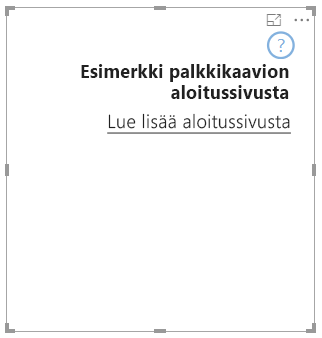

# <a name="landing-page"></a>Aloitussivu

Ohjelmointirajapinta 2.3.0:n avulla voit lisätä visualisointiin aloitussivun: lisää `supportsLandingPage` ominaisuuksiin ja määritä sen arvoksi Tosi, jolloin visualisointi alustetaan ja päivitetään jo ennen tietojen lisäämistä siihen (eli siinä ei enää ole vesileimaa). Näin voit suunnitella oman aloitussivun, joka näytetään visualisoinnissa, kunhan siinä ei ole tietoja.

```typescript
export class BarChart implements IVisual {
    //...
    private element: HTMLElement;
    private isLandingPageOn: boolean;
    private LandingPageRemoved: boolean;
    private LandingPage: d3.Selection<any>;

    constructor(options: VisualConstructorOptions) {
            //...
            this.element = options.element;
            //...
    }

    public update(options: VisualUpdateOptions) {
    //...
        this.HandleLandingPage(options);
    }

    private HandleLandingPage(options: VisualUpdateOptions) {
        if(!options.dataViews || !options.dataViews.length) {
            if(!this.isLandingPageOn) {
                this.isLandingPageOn = true;
                const SampleLandingPage: Element = this.createSampleLandingPage(); //create a landing page
                this.element.appendChild(SampleLandingPage);
                this.LandingPage = d3.select(SampleLandingPage);
            }

        } else {
                if(this.isLandingPageOn && !this.LandingPageRemoved){
                    this.LandingPageRemoved = true;
                    this.LandingPage.remove();
                }
        }
    }
```

Malli


