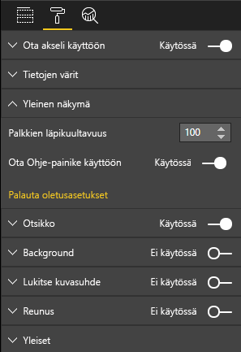

# <a name="create-a-launch-url"></a>URL-käynnistysosoitteen luominen

Luomalla URL-käynnistysosoitteen voit avata uuden selainvälilehden (tai ikkunan) siirtämällä todellisen työn Power BI:hin.

> [!IMPORTANT]
> `host.launchUrl()` otettiin käyttöön visualisointien ohjelmointirajapinnassa 1.9.0.

## <a name="sample"></a>Malli

Tuo `IVisualHost`-liittymä ja tallenna linkki `host`-objektiin visualisoinnin konstruktorissa.

```typescript
import powerbi from "powerbi-visuals-api";
import IVisualHost = powerbi.extensibility.visual.IVisualHost;

export class Visual implements IVisual {
    private host: IVisualHost;
    // ...
    constructor(options: VisualConstructorOptions) {
        // ...
        this.host = options.host;
        // ...
    }

    // ...
}
```

## <a name="usage"></a>Käyttö

Käytä `host.launchUrl()`-ohjelmointirajapinnan kutsua ja välitä kohde-URL merkkijonoargumenttina:

```typescript
this.host.launchUrl('https://some.link.net');
```

## <a name="restrictions"></a>Rajoitukset

* Käytä vain absoluuttisia polkuja, älä suhteellisia. Käytä esimerkiksi absoluuttista polkua, kuten `https://some.link.net/subfolder/page.html`. Suhteellista polkua `/page.html`ei avata.

* Tällä hetkellä vain *HTTP*- ja *HTTPS*-protokollat ovat tuettuja. Vältä esimerkiksi protokollia *FTP* ja *mailto*.

## <a name="best-practices"></a>Parhaat käytännöt

* Useimmiten linkki on parasta avata vain silloin, kun käyttäjä nimenomaan niin haluaa. Varmista, että käyttäjän on helppo ymmärtää, että linkin tai painikkeen napsauttaminen aiheuttaa uuden välilehden avaamisen. `launchUrl()`-kutsun käynnistäminen ilman käyttäjän toimia tai muun toiminnon sivuvaikutuksena voi olla käyttäjälle hämmentävää tai turhauttavaa.

* Jos linkki ei ole välttämätön visualisoinnin moitteettoman toiminnan kannalta, on suositeltavaa antaa raportin tekijälle tapa poistaa linkki käytöstä ja piilottaa se. Tämä suositus on erityisen tärkeä Power BI:n erityiskäyttötavoissa, kuten raportin upottamisessa kolmannen osapuolen sovellukseen tai raportin julkaisemisessa verkossa.

* Vältä käynnistämästä `launchUrl()`-kutsua silmukan sisältä, visualisoinnin `update`-toiminnosta tai mistä tahansa muusta usein toistuvasta koodista.

## <a name="a-step-by-step-example"></a>Vaiheittainen esimerkki

### <a name="add-a-link-launching-element"></a>Linkin käynnistävän elementin lisääminen

Seuraavat rivit lisättiin visualisoinnin `constructor`-toimintoon:

```typescript
    this.helpLinkElement = this.createHelpLinkElement();
    options.element.appendChild(this.helpLinkElement);
```

Lisäksi lisättiin yksityinen funktio, joka luo ja liittää ankkuri-elementin:

```typescript
private createHelpLinkElement(): Element {
    let linkElement = document.createElement("a");
    linkElement.textContent = "?";
    linkElement.setAttribute("title", "Open documentation");
    linkElement.setAttribute("class", "helpLink");
    linkElement.addEventListener("click", () => {
        this.host.launchUrl("https://docs.microsoft.com/power-bi/developer/visuals/custom-visual-develop-tutorial");
    });
    return linkElement;
};
```

Lopuksi *visual.less*-tiedoston merkintä määrittää linkkielementin tyylin:

```less
.helpLink {
    position: absolute;
    top: 0px;
    right: 12px;
    display: block;
    width: 20px;
    height: 20px;
    border: 2px solid #80B0E0;
    border-radius: 20px;
    color: #80B0E0;
    text-align: center;
    font-size: 16px;
    line-height: 20px;
    background-color: #FFFFFF;
    transition: all 900ms ease;

    &:hover {
        background-color: #DDEEFF;
        color: #5080B0;
        border-color: #5080B0;
        transition: all 250ms ease;
    }

    &.hidden {
        display: none;
    }
}
```

### <a name="add-a-toggling-mechanism"></a>Vaihtomekanismin lisääminen

Jos haluat lisätä vaihtomekanismin, sinun on lisättävä staattinen objekti, jotta raportin tekijä voi vaihdella linkkielementin näkyvyyttä. (Oletusasetus on *Piilotettu*.) Lisätietoja on [staattisen objektin opetusohjelmassa](https://microsoft.github.io/PowerBI-visuals/docs/concepts/objects-and-properties).

Staattinen totuusarvo-objekti `showHelpLink` lisättiin *capabilities.json*-tiedoston objektimerkintään seuraavassa koodissa esitetyllä tavalla:

```typescript
"objects": {
    "generalView": {
            "displayName": "General View",
            "properties":
                "showHelpLink": {
                    "displayName": "Show Help Button",
                    "type": {
                        "bool": true
                    }
                }
            }
        }
    }
```



Seuraavat rivit lisättiin visualisoinnin `update`-funktioon:

```typescript
if (settings.generalView.showHelpLink) {
    this.helpLinkElement.classList.remove("hidden");
} else {
    this.helpLinkElement.classList.add("hidden");
}
```

Elementin näyttämistä hallitseva *hidden*-luokka on määritetty *visual.less*-tiedostossa.