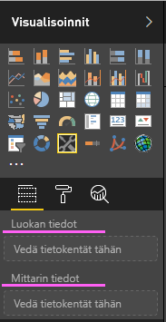
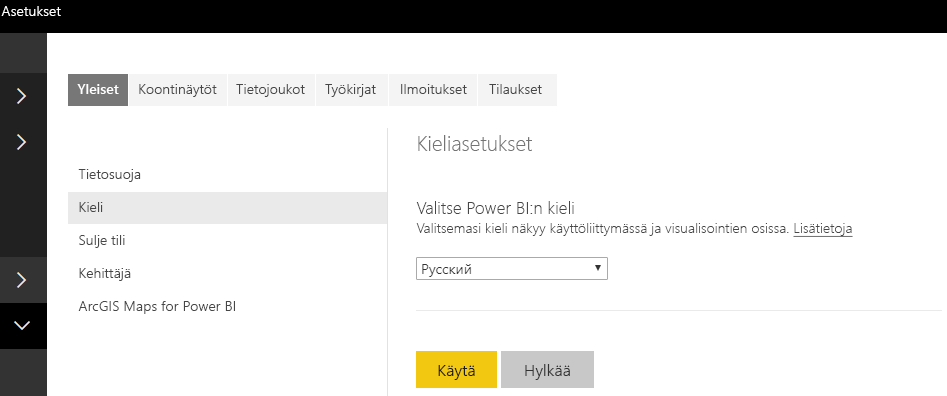

# <a name="add-the-locale-in-power-bi-for-power-bi-visuals"></a>Alueen lisääminen Power BI:ssä Power BI -visualisoinneille

Visualisoinnit voivat noutaa Power BI:n aluekohtaiset asetukset sisällön lokalisoimiseksi kyseiselle kielelle.

Lue lisää kohdasta [Power BI:n tuetut kielet ja maat tai alueet](./../../supported-languages-countries-regions.md)

Esimerkiksi kieliasetuksen hakeminen mallipalkkikaavion visualisoinnissa.


Jokainen näistä palkkikaavioista luotiin eri kieliasetuksen (englanti, baski ja hindi) alle, ja ne näytetään työkaluvihjeessä.

> [!NOTE]
> Visualisoinnin koodin lokalisoinnin hallintaa tuetaan ohjelmointirajapinnassa 1.10.0 ja uudemmissa.

## <a name="get-the-locale"></a>Hae aluekohtaiset asetukset

`locale` välitetään merkkijonona visualisoinnin alustuksen aikana. Jos aluekohtaisia asetuksia muutetaan Power BI:ssä, visualisointi luodaan uudelleen käyttäen uusia aluekohtaisia asetuksia. Koko mallikoodi on SampleBarChart with Locale -kohteessa

BarChart-konstruktorilla on nyt Aluekohtaiset asetukset -jäsen, jonka esiintymä luodaan konstruktorissa aluekohtaiset asetukset -isäntäesiintymän avulla.

```typescript
private locale: string;
...
this.locale = options.host.locale;
```

Tuetut aluekohtaiset asetukset:

Aluekohtainen merkkijono | Kieli
--------------|----------------------
ar-SA | العربية (arabia)
bg-BG | български (bulgaria)
ca-ES | català (katalaani)
cs-CZ | čeština (tsekki)
da-DK | dansk (tanska)
de-DE | Deutsche (saksa)
el-GR | ελληνικά (kreikka)
en-US | English (englanti)
es-ES | español service (espanja)
et-EE | eesti (viro)
eU-ES | Euskal (baski)
fi-FI | suomi (suomi)
fr-FR | Français (ranska)
gl-ES | galego (galicia)
he-IL | עברית (heprea)
hi-IN | हिन्दी (hindi)
hr-HR | hrvatski (kroatia)
hu-HU | magyar (unkari )
id-ID | Bahasa Indonesia (indonesia)
it-IT | italiano (italia)
ja-JP | 日本の (japani)
kk-KZ | Қазақ (kazakki)
ko-KR | 한국의 (korea)
lt-LT | Lietuvos (liettua)
lv-LV | Latvijas (latvia)
ms-MY | Bahasa Melayu (malaiji)
nb-NO | norsk (norja)
nl-NL | Nederlands (hollanti)
pl-PL | polski (puola)
pt-BR | português (portugali)
pt-PT | português (portugali)
ro-RO | românesc (romania)
ru-RU | русский (venäjä)
sk-SK | slovenský (slovakki)
sl-SI | slovenski (sloveeni)
sr-Cyrl-RS | cрпски (serbia)
sr-Latn-RS | srpski (serbia)
sv-SE | svenska (ruotsi)
th-TH | ไทย (thai)
tr-TR | türk (turkki)
uk-UA | український (ukraina)
vi-VN | tiếng Việt (vietnam)
zh-CN | 中国 (kiina, yksinkertaistettu)
zh-TW | 中國 (kiina, perinteinen)

> [!NOTE]
> Power BI Desktopissa aluekohtaiset asetukset -ominaisuus sisältää asennetun PowerBI Desktopin kielen.

## <a name="localizing-the-property-pane-for-power-bi-visuals"></a>Power BI -visualisointien ominaisuusruudun lokalisointi

Ominaisuusruudun kentät voidaan lokalisoida entistä yhtenäisemmän ja yhdenmukaisemman käyttökokemuksen tarjoamiseksi. Se tekee mukautetusta visualisoinnista samankaltaisen kuin minkä tahansa muun Power BI -ydinvisualisoinnin.

Esimerkiksi `pbiviz new` -komennolla luodun mukautetun, lokalisoimattoman visualisoinnin ominaisuusruudussa näkyvät seuraavat kentät:



sekä luokkatiedot että mittaritiedot on määritetty capabilities.json-tiedostossa muodossa `displayName`.

## <a name="how-to-localize-capabilities"></a>Kuinka ominaisuuksia lokalisoidaan

Lisää ensin näyttönimiavain jokaisen ominaisuuden näyttönimeen, jonka haluat lokalisoida. Tässä esimerkissä:

```json
{
    "dataRoles": [
        {
            "displayName": "Category Data",
            "displayNameKey": "VisualCategoryDataNameKey1",
            "name": "category",
            "kind": "Grouping"
        },
        {
            "displayName": "Measure Data",
            "displayNameKey": "VisualMeasureDataNameKey2",
            "name": "measure",
            "kind": "Measure"
        }
    ]
}
```

Lisää sitten hakemisto nimeltä stringResources. Hakemisto sisältää kaikki eri merkkijonojen resurssitiedostot niiden aluekohtaisten asetusten perusteella, joita haluat visualisoinnin tukevan. Tämän hakemiston alla sinun on lisättävä JSON-tiedosto jokaiselle alueelle, jota haluat tukea. Nämä tiedostot sisältävät aluekohtaisia tietoja ja lokalisoituja merkkijonoarvoja kullekin korvattavalle displayNameKey-kohteelle.

Tässä esimerkissä haluamme tukea arabiaa ja hepreaa. Meidän on lisättävä kaksi JSON-tiedostoa seuraavalla tavalla:


Jokainen JSON-tiedosto määrittää yksittäisen kieliasetuksen (tämän tiedoston on oltava jokin yllä olevasta tuetuista alueista) käyttäen haluamiesi näyttönimiavainten merkkijonoarvoja. Tässä esimerkissä hepreankielinen merkkijonoresurssitiedosto näyttää seuraavalta:

```json
{
    "locale": "he-IL",
    "values": {
        "VisualCategoryDataNameKey1": "קטגוריה",
        "VisualMeasureDataNameKey2": "יחידות מידה"
    }
}
```

Kaikki lokalisointihallinnan käyttöön tarvittavat vaiheet on kuvattu alla.

> [!NOTE]
> Lokalisointia ei tueta tällä hetkellä dev-visualisoinnin virheenkorjauksessa

## <a name="setup-environment"></a>Asetusympäristö

### <a name="desktop"></a>Työpöytä

Lataa työpöytäkäyttöön Power BI Desktopin lokalisoitu versio osoitteesta https://powerbi.microsoft.com.

### <a name="web-service"></a>Verkkopalvelu

Jos käytät verkko-ohjelmaa (selainta) palvelussa, vaihda kieli asetuksissa:



## <a name="resource-file"></a>Resurssitiedosto

Lisää resources.resjson-tiedosto kansioon, joka on nimetty sen alueen mukaan, jota aiot käyttää stringResources-kansion sisällä. Esimerkissä käytämme en-US ja ru-RU.


Lisää sen jälkeen kaikki lokalisointimerkkijonot, joita aiot käyttää edellisessä vaiheessa lisäämässäsi resources.resjson-tiedostossa.

```json
{
    ...
    "Role_Legend": "Обозначения",
    "Role_task": "Задача",
    "Role_StartDate": "Дата начала",
    "Role_Duration": "Длительность"
    ...
}
```

Tämä esimerkki on resources.resjson-tiedoston en-US-versio:

```json
{
    ...
    "Role_Legend": "Legend",
    "Role_task": "Task",
    "Role_StartDate": "Start date",
    "Role_Duration": "Duration"
    ...
}
```

Uusi localizationManager-esiintymä Luo localizationManager-esiintymä visualisoinnin koodissa seuraavasti

```typescript
private localizationManager: ILocalizationManager;

constructor(options: VisualConstructorOptions) {
    this.localizationManager = options.host.createLocalizationManager();
}
```

## <a name="localizationmanager-usage-sample"></a>esimerkki localizationManager-esiintymän käytöstä

Nyt voit kutsua lokalisointihallinnan getDisplayName-funktiota käyttäen resources.resjson-tiedostossa määritettyä merkkijonoavainargumenttia, jotta saat tarvittavan merkkijonon minne tahansa koodiisi:

```typescript
let legend: string = this.localization.getDisplayName("Role_Legend");
```

Se palauttaa "Legend" kielelle en-US ja "Обозначения" kielelle ru-RU

## <a name="next-steps"></a>Seuraavat vaiheet

* [Lue, miten voit käyttää muotoilun apuohjelmia lokalisoitujen muotoilujen tarjoamiseen](utils-formatting.md)
