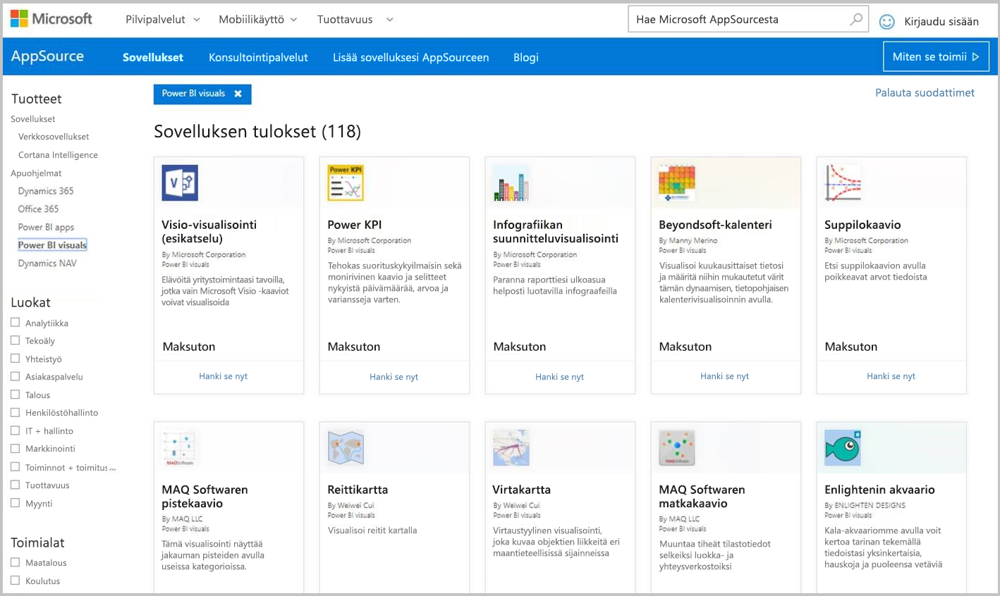
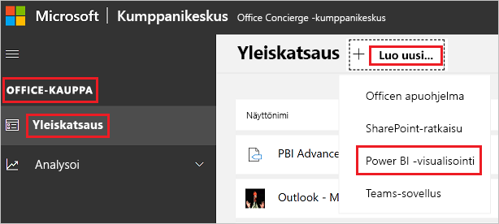

# Power BI -visualisointien julkaiseminen kumppanikeskuksessa

Kun olet luonut Power BI -visualisoinnin, voit julkaista sen AppSourcessa, josta muutkin löytävät sen käyttöönsä. Jos haluat lisätietoja Power BI -visualisointien luomisesta, katso [Power BI -visualisoinnin kehittäminen](custom-visual-develop-tutorial.md).

## Mikä AppSource on?

[AppSource](https://appsource.microsoft.com/marketplace/apps?product=power-bi-visuals) on paikka, josta löydät SaaS-sovelluksia ja apuohjelmia Microsoftin tuotteille ja palveluille.

## Power BI -visualisoinnin julkaisun valmisteleminen

Ennen kuin lähetät Power BI -visualisoinnin AppSourceen, varmista, että olet lukenut [Power BI -visualisointien ohjeet](guidelines-powerbi-visuals.md) ja [testannut mukautettua visualisointiasi](https://github.com/Microsoft/PowerBI-visuals/blob/master/Tutorial/SubmissionTesting.md).

Kun olet valmis lähettämään Power BI -visualisoinnin, varmista, että se täyttää kaikki alla luetellut vaatimukset.

| Kohde | Pakollinen | Kuvaus |
| --- | --- | --- |
| Pbiviz-paketti |Kyllä |Pakkaa Power BI -visualisointi Pbiviz-pakettiin, joka sisältää kaikki vaaditut metatiedot. Visualisoinnin nimi Näyttönimi GUID Versio Kuvaus Tekijän nimi ja sähköpostiosoite |
| .pbix-raporttitiedostoesimerkki |Kyllä |Auta käyttäjiä tutustumaan visualisointiisi esittelemällä sitä. Korosta arvoa, jota visualisointi tuo käyttäjille, ja anna esimerkkejä käytöstä ja muotoiluasetuksista. Voit myös lisätä loppuun *vinkkisivun*, jolla annat vinkkejä ja kerrot, mitä kannattaa välttää. .pbix-raporttitiedostoesimerkin täytyy toimia offline-tilassa ilman mitään ulkoista yhteyttä. |
| Kuvake |Kyllä |Sisällytä mukaan oman visualisointisi logo, joka näytetään kaupassa. Se voi olla .png-, .jpg-, .jpeg- tai .gif-muodossa. Sen on oltava tarkalleen 300 × 300 kuvapistettä (leveys × korkeus). **Tärkeää!** Lue tämä [AppSourcen kuvien tallennusopas](https://docs.microsoft.com/office/dev/store/craft-effective-appsource-store-images) huolellisesti ennen logon lähettämistä. |
| Näyttökuvat |Kyllä |Anna ainakin yksi näyttökuva. Se voi olla .png-, .jpg-, .jpeg- tai .gif-muodossa. Mittojen on oltava tarkalleen 1 366 kuvapistettä (leveys) ja 768 kuvapistettä (korkeus). Tiedostokoko saa olla enintään 1 024 kt. Käyttäjämäärien kasvattamiseksi suosittelemme, että lisäät näyttökuviin tekstikuplia, jotka tuovat esiin tärkeimpien toimintojen etuja. |
| Tuen latauslinkki |Kyllä |Anna asiakkaillesi tuen URL-osoite. Tämä linkki on lisätty kumppanikeskusluetteloosi, ja käyttäjät näkevät sen käyttäessään visualisointiluetteloasi AppSourcessa. URL-osoitteen täytyy olla muodossa, johon kuuluu https:// tai https://. |
| Tietosuoja-asiakirjan linkki |Kyllä |Anna linkki visualisoinnin tietosuojakäytäntöön. Tämä linkki on lisätty kumppanikeskusluetteloosi, ja käyttäjät näkevät sen käyttäessään visualisointiluetteloasi AppSourcessa. Linkin täytyy olla muodossa, johon kuuluu https:// tai https://. |
| Käyttöoikeussopimus (EULA) |Kyllä |Sinun on annettava EULA-tiedosto Power BI -visualisointiasi varten. Voit käyttää [vakiosopimusta](https://go.microsoft.com/fwlink/?linkid=2041178), [Power BI -visualisointien sopimusta](https://visuals.azureedge.net/app-store/Power%20BI%20-%20Default%20Custom%20Visual%20EULA.pdf)tai omaa käyttöoikeussopimusta. |
| Videolinkki |Ei |Voit kasvattaa kiinnostusta visualisointiasi kohtaan antamalla linkin sen esittelyvideoon. URL-osoitteen täytyy olla muodossa, johon kuuluu https:// tai https://. |
| GitHub-säilö |Ei |Jaa julkinen linkki [GitHub](https://www.github.com)-säilöön, joka sisältää Power BI -visualisoinnin lähteet ja esimerkkitiedot. Tämän ansiosta muut kehittäjät voivat antaa palautetta ja ehdottaa parannuksia koodiisi. |

## XML-sovelluspaketin hankkiminen

Tarvitset XML-sovelluspaketin Power BI -tiimiltä Power BI -visualisoinnin lähettämiseen. Hanki XML-sovelluspaketti lähettämällä sähköpostia Power BI -visualisointien julkaisutiimille ([pbivizsubmit@microsoft.com](mailto:pbivizsubmit@microsoft.com)).

Ennen **pbiviz**-paketin luomista sinun on täytettävä seuraavat **pbiviz.json**-tiedoston kentät:
* kuvaus
* tuen Url
* tekijä
* name
* sähköposti

Liitä **pbiviz-tiedosto** ja **malliraportin pbix-tiedosto** sähköpostiisi. Power BI -tiimi vastaa sinulle ja antaa ohjeet sekä sovelluspaketin XML-tiedoston ladattavaksi. Tämä XML-sovelluspaketti vaaditaan, jotta voit lähettää julkaisusi Office Developer Centerin kautta.

> [!NOTE]
> Laadun parantamiseksi ja olemassa olevien raporttien toimintakyvyn takaamiseksi olemassa olevien visualisointien päivitykset ovat käytettävissä hyötykäyttöympäristössä vasta kahden viikon kuluttua kaupassa hyväksymisestä.

## AppSourceen lähettäminen

Jos haluat lähettää Power BI -visualisoinnin AppSourceen, sinun on hankittava sovelluspaketti Power BI -tiimiltä, ja lähetettävä se sitten kumppanikeskukseen. 

### Sovelluspaketin hankkiminen

Sinun täytyy lähettää **pbiviz**- ja **pbix**-tiedoston sisältävä sähköposti Power BI -tiimille ennen AppSourceen lähettämistä. Tällä tavoin Power BI -tiimi voi ladata tiedostot julkiseen jakopalvelimeen. Muussa tapauksessa kauppa ei voi hakea tiedostoja. 

Power BI -tiimin on tarkistettava tiedostot, kun lähetät uuden Power BI -visualisoinnin, päivität aiemmin julkaistua Power BI -visualisointia tai teet korjauksia hylätyn lähetyksen johdosta.

### Kumppanikeskukseen lähettäminen

Jos haluat lähettää Power BI -visualisoinnin kumppanikeskukseen, sinun on oltava rekisteröitynyt kumppanikeskukseen. Jos et ole vielä rekisteröitynyt, [avaa kehittäjätili kumppanikeskuksessa](https://docs.microsoft.com/office/dev/store/open-a-developer-account).

Lähetä Power BI -visualisointi kumppanikeskukseen noudattamalla alla olevia ohjeita. Lisätietoja lähettämisprosessista on kohdassa [Office-ratkaisun lähettäminen AppSourceen kumppanikeskuksen kautta](https://docs.microsoft.com/office/dev/store/use-partner-center-to-submit-to-appsource).

1. Kirjaudu sisään **kumppanikeskukseen**.

2. Valitse vasemmasta ruudusta **OFFICE-KAUPPA**.

3. Valitse **Yleiskatsaus**.

4. Valitse **Luo uusi**, ja valitse avattavasta valikosta **Power BI -visualisointi**.

    

5. Anna Power BI -visualisoinnille nimi **Luo uusi Power BI -visualisointi** -ikkunassa, ja valitse **Luo**.

6. Valitse **Paketit**, ja lataa Power BI -visualisoinnin XML-sovelluspaketti.

7. Valitse **Ominaisuudet**, ja anna tarvittavat tiedot.

8. Jos tuotteesi edellyttää lisäostoja, valitse **Tuotteen asennus** ja valitse **Lisäpalvelun osto** -valintaruutu.

9. (Valinnainen) Jos haluat [sertifioida](power-bi-custom-visuals-certified.md) visualisoinnin, valitse **Tuotteen asennus** ja valitse **Power BI -sertifiointi** -valintaruutu.
    >[!TIP]
    >Power BI:n sertifiointiprosessi saattaa kestää jonkin aikaa. Jos olet luomassa uutta Power BI -visualisointia, suosittelemme sinua julkaisemaan Power BI -visualisointisi kumppanikeskuksen kautta, ennen kuin pyydät Power BI -sertifiointia. Näin varmistat sen, ettei visualisointisi julkaiseminen viivästy.

10. Valitse **Tuotteen asennus**, ja valitse **Tarkista ja julkaise**.

## Lähetyksen tilan ja käytön seuraaminen

Voit tarkistaa [vahvistuskäytännöt](https://docs.microsoft.com/legal/marketplace/certification-policies#1180-power-bi-visuals).

Kun olet lähettänyt visualisoinnin, voit seurata sen tilaa [sovelluskoontinäytössä](https://sellerdashboard.microsoft.com/Application/Summary/).

## Visualisoinnin sertifioiminen

Kun visualisointisi on luotu, voit halutessasi hankkia sille [sertifioinnin](power-bi-custom-visuals-certified.md).

## Seuraavat vaiheet

* [Power BI:n mukautetun visualisoinnin kehittäminen](custom-visual-develop-tutorial.md)

* [Visualisoinnit Power BI:ssä](../../visuals/power-bi-report-visualizations.md)  

* [Visualisoinnit Power BI:ssä](power-bi-custom-visuals.md)  

* [Sertifioinnin hankkiminen Power BI -visualisoinnille](power-bi-custom-visuals-certified.md)

* Onko sinulla kysyttävää? [Voit esittää kysymyksiä Power BI -yhteisössä](https://community.powerbi.com/)
