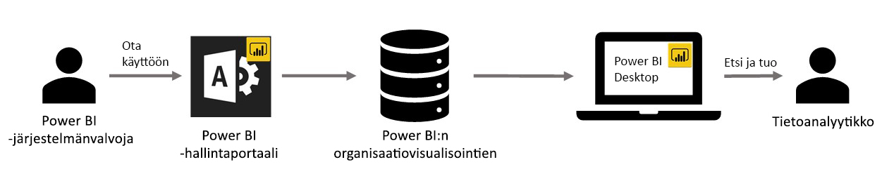

# Organisaation visualisoinnit Power BI:ssä

Power BI:n Power BI -visualisointien avulla voit luoda yksilöllisen visualisointityypin, joka on juuri sinulle räätälöity. Power BI -visualisoinnit ovat kehittäjien työn tulosta, ja usein niitä luodaan silloin, kun Power BI:hin sisältyvä laaja visualisointivalikoima ei vastaa täysin kehittäjän tarpeita.

Joissakin organisaatioissa Power BI -visualisoinnit ovat vielä tärkeämpiä – niitä saatetaan tarvita organisaation tiettyjen tietojen tai merkityksellisten tietojen välittämiseen, niillä voi olla erityisiä tietovaatimuksia tai ne saattavat korostaa yksityisiä liiketoimintamalleja. Tällaisten organisaatioiden on kehitettävä Power BI -visualisointeja, jaettava niitä koko organisaatioon ja varmistettava, että niitä ylläpidetään oikein. Power BI -visualisointien avulla se onnistuu helposti.

Seuraavassa kuvassa näkyy prosessi, jonka mukaan organisaation Power BI -visualisoinnit siirtyvät Power BI:ssä järjestelmänvalvojalta kehityksen ja ylläpidon kautta tietoanalyytikolle.

Power BI -järjestelmänvalvoja ottaa organisaation visualisoinnit käyttöön ja hallinnoi niitä hallintaportaalissa. Kun organisaation Power BI -visualisoinnit on otettu käyttöön organisaation säilössä, organisaation käyttäjät voivat helposti löytää ne ja tuoda ne raportteihinsa suoraan Power BI Desktopista.

Lisätietoja siitä, miten voit käyttää organisaation Power BI -visualisointeja luomissasi raporteissa, on seuraavassa artikkelissa: [Lisätietoja organisaation visualisointien tuomisesta raportteihin](power-bi-custom-visuals.md).

## Organisaation Power BI -visualisointien hallinta

Lisätietoja organisaation Power BI -visualisointien käyttöönotosta ja hallinnasta organisaatiossasi on seuraavassa artikkelissa: [Lisätietoja organisaation Power BI -visualisointien käyttöönotosta ja hallinnasta](https://go.microsoft.com/fwlink/?linkid=866790).

> [!WARNING]
> Tiedostosta asennettu Power BI -visualisointi voi sisältää koodia, jossa on suojaus- tai tietosuojariskejä. Varmista, että luotat Power BI -visualisointitiedoston tekijään ja lähteeseen, ennen kuin otat sen käyttöön organisaation säilössä.

## Huomioitavat asiat ja rajoitukset

Sinun on otettava huomioon useita seikkoja ja rajoituksia.

Järjestelmänvalvoja:

* Jos AppSourcesta tai tiedostosta peräisin oleva Power BI -visualisointi poistetaan säilöstä, poistettua visualisointia käyttäviä aiemmin luotuja raportteja ei enää näytetä. Säilöstä poistamista ei voi kumota. Jos haluat poistaa AppSourcesta tai tiedostosta peräisin oleva Power BI -visualisoinnin käytöstä tilapäisesti, käytä Poista käytöstä toimintoa.

* Organisaation Power BI -visualisointeja ei tueta Power BI -raporttipalvelimessa.

Käyttäjä:

* Organisaation Power BI -visualisoinnit ovat yksityisiä visualisointeja, jotka on tuotu organisaation säilöstä. Yksityisiä visualisointeja ei voi [viedä PowerPointiin](https://docs.microsoft.com/power-bi/consumer/end-user-powerpoint) tai näyttää sähköpostiviesteissä, joita käyttäjä vastaanottaa [tilatessaan raporttisivuja](https://docs.microsoft.com/power-bi/consumer/end-user-subscribe). Vain suoraan Marketplacesta tuodut [sertifioidut Power BI -visualisoinnit](power-bi-custom-visuals-certified.md) tukevat näitä ominaisuuksia.

* AppSource Marketplacen Visio-visualisointia, PowerApps-visualisointia, Map Box -visualisointia ja GlobeMap-visualisointia ei hahmonneta, jos ne on otettu käyttöön organisaation säilön kautta.

## Vianmääritys

Lisätietoja vianmäärityksestä on kohdassa [Power BI -visualisointien vianmääritys](power-bi-custom-visuals-troubleshoot.md).

## Usein kysytyt kysymykset

Saat lisätietoja ja vastauksia kysymyksiisi [Power BI -visualisointien usein kysytyistä kysymyksistä](power-bi-custom-visuals-faq.md#organizational-power-bi-visuals).

Onko sinulla kysyttävää? [Kokeile Power BI -yhteisöä](https://community.powerbi.com/).
