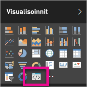

# Power BI -visualisointien vianmääritys

## Virheenkorjaus

**Pbiviz-komentoa ei löydy (tai samankaltaisia virheitä)**

Jos suoritat kohteen `pbiviz` päätteen komentorivillä, näkyviin pitäisi tulla Ohje-näyttö. Jos näin ei ole, sitä ei ole asennettu oikein. Varmista, että olet asentanut vähintään NodeJS 4.0 -version.

**Visualisoinnin virheenkorjausta ei löydy Visualisoinnit-välilehdestä**

Visualisoinnin virheenkorjaus on kehotekuvakkeen kaltainen **Visualisoinnit**-välilehdessä.

Jos et näe sitä, varmista, että olet ottanut sen käyttöön Power BI:n asetuksissa.

> [!NOTE]
> Virheenkorjauksen visualisointi on nykyisin saatavilla vain Power BI Desktopissa tai mobiilisovelluksessa. Pakattu visualisointi toimii edelleen kaikkialla.

**Yhteyden muodostaminen visualisointipalvelimeen ei onnistu**

Suorita visualisointipalvelin käyttämällä `pbiviz start`-komentoa päätteen komentorivillä visualisointiprojektin juurikansiosta. Jos palvelin ei toimi, se johtuu todennäköisesti siitä, että SSL-varmenteita ei ole asennettu oikein.

Voit lähettää Power -visualisointien tukitiimille (pbicvsupport@microsoft.com) kysymyksiä ja kommentteja.

## Seuraavat vaiheet

Lisätietoja on kohdassa [Usein kysyttyjä kysymyksiä – Power BI -visualisoinnit](power-bi-custom-visuals-faq.md#organizational-power-bi-visuals).