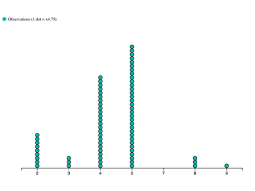
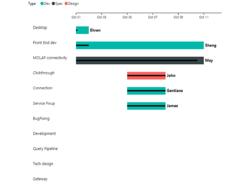
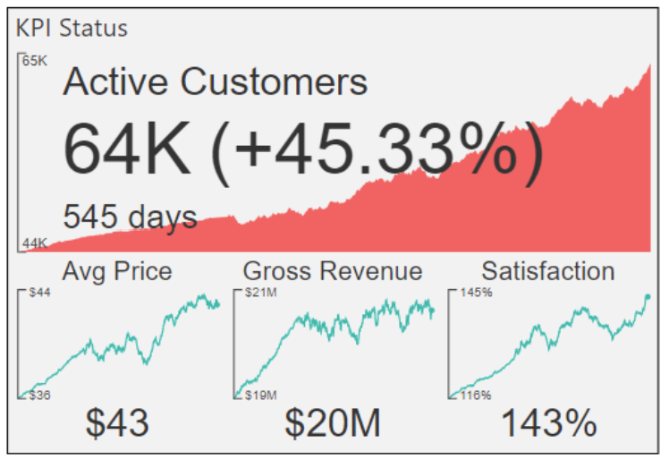
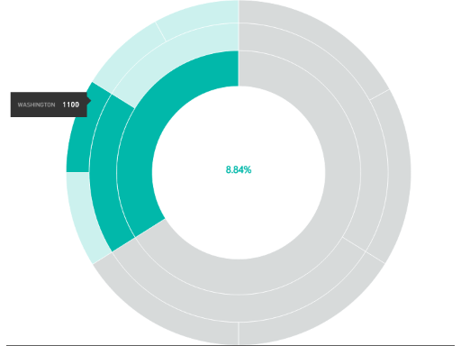
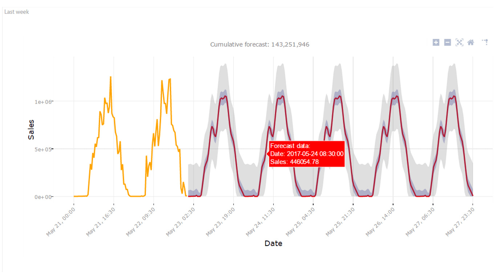
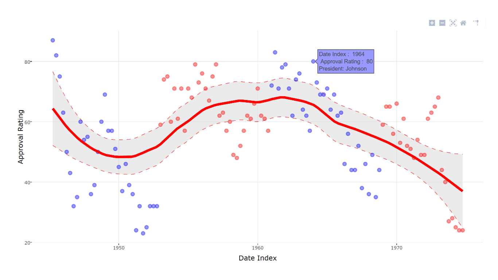
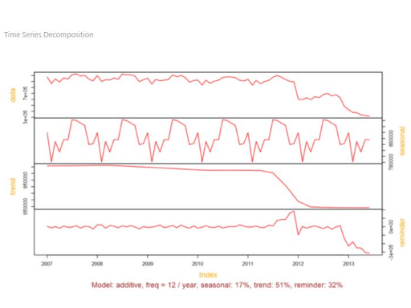
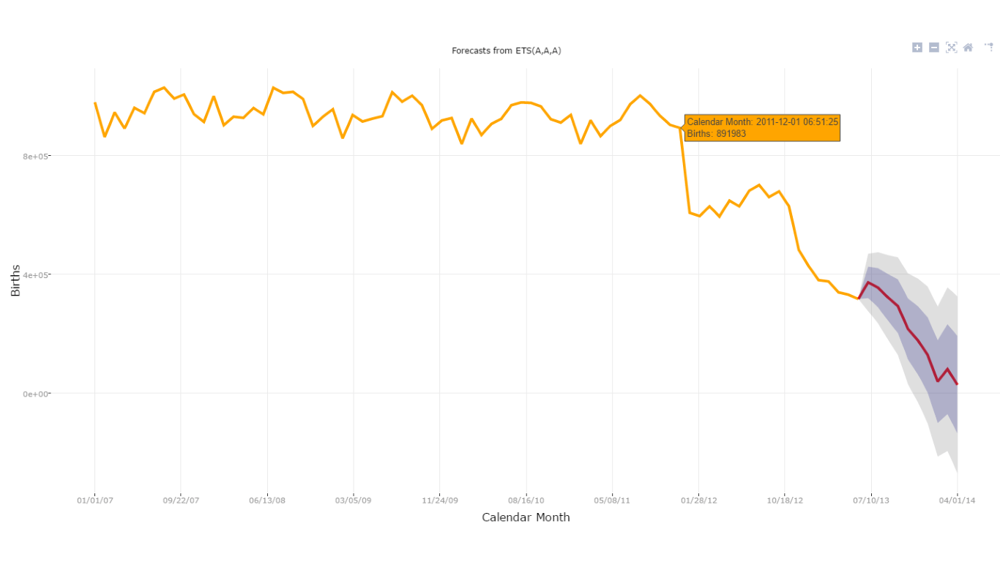

# Power BI -visualisointien mallit

Voit ladata nämä Power BI -visualisoinnit, käyttää niitä ja muokata niitä GitHubista. Nämä esimerkit kuvaavat sitä, miten voit käsitellä yleisiä tilanteita, kun kehität sovellusta Power BI:ssä.

## Osittajat

Osittajan avulla voit tarkentaa raportin muissa visualisoinneissa näkyvän tietojoukon osaa. Osittajat ovat yksi monesta tavasta suodattaa tietoja Power BI:ssä.

|   |  | |
| ------------- | ------------- | -------------|
| [Chiclet-osittaja](https://github.com/Microsoft/powerbi-visuals-chicletslicer/)   Näytä kuvan tai tekstin painikkeet, jotka toimivat suodattimena muille visualisoinneille | [Aikajanan osittaja](https://github.com/Microsoft/powerbi-visuals-timeline/)  Graafinen päivämääräalueen valitsin, joka suodattaa päivämäärän mukaan | [Osittajaesimerkki](https://github.com/Microsoft/powerbi-visuals-sampleslicer/)  Esittelee kehittyneen suodatuksen ohjelmointirajapinnan käyttöä

## Kaaviot

Voit hyödyntää valikoimaamme, kuten palkkikaavioita, ympyräkaavioita ja sanapilveä.

|   |  | |
| ------------- | ------------- | -------------|
| [Asterikaavio](https://github.com/Microsoft/powerbi-visuals-asterplot/)   Tavallisen rengaskaavion kierre, joka käyttää toista arvoa taivutuskulman tekemiseen | [Nuolikaavio ](https://github.com/Microsoft/powerbi-visuals-bulletchart/)  Palkkikaavio, joka sisältää visuaalisia lisäelementtejä kontekstin tarjoamista varten. Tästä on hyötyä tavoitteiden seurannassa | [Jänne](https://github.com/Microsoft/powerbi-visuals-chord/)  Graafinen menetelmä tietojen välisten suhteiden näyttämiseen
|  | |  
| [Pistekaavio](https://github.com/Microsoft/powerbi-visuals-dotplot/)  Näyttää taajuuksien jakauman hienolla tavalla | [Dual KPI ‑kaavio](https://github.com/Microsoft/powerbi-visuals-dualkpi/)  Visualisoi tehokkaasti kaksi mittaria ajan kuluessa ja näytä niiden trendi yhteisellä aikajanalla | [Parannettu pistekaavio](https://github.com/Microsoft/powerbi-visuals-enhancedscatter/)  Parannus olemassa olevaan pistekaavioon
| | | 
| [Force Graph](https://github.com/Microsoft/powerbi-visuals-forcegraph/)  Pakota asettelukaavio käyrän polun mukaiseksi. Tästä on hyötyä entiteettien välisten yhteyksien näyttämiseen | [Gantt-kaavio](https://github.com/Microsoft/powerbi-visuals-gantt/)  Palkkikaavio, joka esittää projektin aikajanan tai aikataulun resurssien kanssa | [Lämpökarttataulukko](https://github.com/Microsoft/powerbi-visuals-heatmap/)  Vertaa tietoja helposti ja intuitiivisesti käyttämällä värejä taulukossa
|  |  |  
| [Histogrammikaavio](https://github.com/Microsoft/powerbi-visuals-histogram/)  Visualisoi tietojen jakautumisen jatkuvalla aikavälillä tai tietyllä ajanjaksolla | [Viiva-pallokaavio](https://github.com/Microsoft/powerbi-visuals-linedotchart/)  Animoitu viivakaavio, jossa on hauskoja animoituja pisteitä ja joka herättää hyötyä yleisön mielenkiinnon tietojen avulla | [Mekko-kaavio](https://github.com/Microsoft/powerbi-visuals-mekkochart/)  Sekoitus 100 %:n pinotusta pylväskaaviosta ja 100 %:n pinotusta palkkikaaviosta yhdistettynä yhdeksi näkymäksi
|  |  |  
| [Multi KPI](https://github.com/microsoft/PowerBI-visuals-MultiKPI/)   Tehokas monen suorituskykyilmaisimen visualisointi, jossa on avainsuorituskykyilmaisin sekä useita tukitietojen sparkline-kaavioita | [Power KPI](https://github.com/microsoft/PowerBI-visuals-PowerKPI/)  Tehokas suorituskykyilmaisin sekä monirivinen kaavio ja selitteet nykyistä päivämäärää, arvoa ja variansseja varten | [Power KPI ‑taulukko](https://github.com/microsoft/PowerBI-visuals-PowerKPIMatrix/)  Valvo tasapainotettuja tuloskortteja ja rajoittamatonta määrää mittareita ja suorituskykyilmaisimia kompaktissa ja helppolukuisessa luettelossa
| |  |  
| [Jaksoittainen kaavio](https://github.com/Microsoft/powerbi-visuals-pulsechart/)  Tämä viivakaavio, johon on merkitty tärkeät tapahtumat, sopii täydellisesti tarinan kertomiseen tietojen avulla| [Säteittäinen kaavio](https://github.com/Microsoft/powerbi-visuals-radarchart/)  Esittää useita mittareita tulostettuna luokka-akselille, mistä on hyötyä määritteiden vertailemisessa | [Sankey-kaavio](https://github.com/Microsoft/powerbi-visuals-sankey/)  Vuokaavio, jossa sarjan leveys on suhteessa vuon laatuun
|  | | 
| [Virtakaavio](https://github.com/Microsoft/powerbi-visuals-streamgraph/)  Pinottu aluekaavio, jossa on tasainen interpolointi ja jota käytetään usein ajan kuluessa muuttuvien arvojen näyttämiseen | [Auringonsädekaavio](https://github.com/Microsoft/powerbi-visuals-sunburst/)  Monitasoinen rengaskaavio hierarkkisten tietojen visualisoimista varten| [Tornadokuvaaja](https://github.com/Microsoft/powerbi-visuals-tornado/)  Vertaa muuttujien suhteellista tärkeyttä kahden ryhmän välillä
 | 
 | [Sanapilvi](https://github.com/Microsoft/powerbi-visuals-wordcloud/)  Luo hauska visualisointi tiedoissasi usein esiintyvästä tekstistä

## WebGL

WebGL sallii verkkosisällön käyttää OpenGL ES 2.0:aan perustuvaa ohjelmointirajapintaa 2D-ja 3D-hahmonnukseen HTML-pohjalla.

| |
| ------------- |
| [Karttapallo](https://github.com/Microsoft/powerbi-visuals-globemap/)  Tulosta sijainnit vuorovaikutteiselle kolmiulotteiselle kartalle

## R-visualisoinnit

Nämä esimerkit esittelevät, miten voit hyödyntää R-visualisointien ja R-komentosarjojen analyyttista ja visuaalista tehokkuutta.

| | | |
|------------- |------------- |------------- |------------- |
| [Liittämissäännöt](https://github.com/Microsoft/powerbi-visuals-assorules/)  Paljasta näennäisesti toisiinsa liittymättömien tietojen väliset yhteydet jos-niin-lausekkeiden avulla | [Klusterointi](https://github.com/Microsoft/powerbi-visuals-clustering-kmeans/)  Etsi samankaltaisuusryhmät tiedoistasi k-means-algoritmin avulla | [Klusterointi ja poikkeamat](https://github.com/microsoft/PowerBI-visuals-dbscan/)  Löydä samankaltaisuusryhmät ja poikkeamat tiedoistasi
|  |  |  
| [Korrelaatiokaavio](https://github.com/Microsoft/powerbi-visuals-corrplot/)  Korosta tietotaulukon korreloivimmat muuttujat | [Päätöspuukaavio](https://github.com/Microsoft/powerbi-visuals-decision-tree/)  Puun muotoinen toimintakaavio tilastollisen todennäköisyyden määrittämiseksi rekursiivisen osioinnin avulla | [TBATS-ennusteet](https://github.com/Microsoft/powerbi-visuals-forcasting-tbats/)  TBATS-mallin avulla suoritettavat aikasarjaennusteet sarjalle, jolla on useita kausivaihteluja malleja
|  |  |  
| [Ennustaminen ARIMA:n avulla](https://github.com/Microsoft/powerbi-visuals-forcastingarima/)  Ennakoi tulevat arvot historiallisten tietojen perusteella käyttäen autoregressiivistä integroitua liukuvaa keskiarvoa (ARIMA) | [Suppilokaavio](https://github.com/Microsoft/powerbi-visuals-funnel/)  Etsi suppilokaavion avulla poikkeavat arvot tiedoista | [Poikkeamien havaitseminen](https://github.com/Microsoft/powerbi-visuals-outliers-det/)  Selvitä tietojesi poikkeamat sopivimmalla menetelmällä ja kaaviolla
|  |  | 
| [Splinikaavio](https://github.com/Microsoft/powerbi-visuals-spline/)  Visualisoi ja selvitä tietojen häiriöt | [Aikasarjan hajautuskaavio](https://github.com/Microsoft/powerbi-visuals-timeseriesdecomposition/)  Selvitä aikasarjakomponentit STL:n (Seasonal and Trend decomposition using Loess) avulla | [Aikasarjan ennustekaavio](https://github.com/Microsoft/powerbi-visuals-forcasting-exp/)  Eksponentiaalisen tasoitusmallin käyttäminen tulevien arvojen ennustamiseen aiemmin havaittujen arvojen perusteella

## Seuraavat vaiheet

Jos haluat kokeilla Power BI -visualisointien luomista, lue [Opetusohjelma: Power BI -visualisoinnin kehittäminen](custom-visual-develop-tutorial.md).
