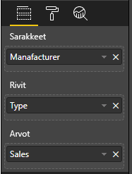

# <a name="add-interactivity-into-visual-by-power-bi-visuals-selections"></a>Vuorovaikutteisuuden lisääminen visualisointiin Power BI:n visualisointien valinnoilla

Power BI:ssä visualisoinnit voivat vaikuttaa toisiinsa kahdella tavalla: valinnalla ja suodattamalla. Alla olevassa esimerkissä kuvataan, kuinka voit valita yhdestä visualisoinnista mitä tahansa kohteita ja ilmoittaa raportin toisille visualisoinneille uudesta valintatilasta.

`Selection`-objekti vastaa liittymää:

```typescript
export interface ISelectionId {
    equals(other: ISelectionId): boolean;
    includes(other: ISelectionId, ignoreHighlight?: boolean): boolean;
    getKey(): string;
    getSelector(): Selector;
    getSelectorsByColumn(): SelectorsByColumn;
    hasIdentity(): boolean;
}
```

## <a name="how-to-use-selectionmanager-to-select-data-points"></a>Kuinka arvopisteitä valitaan SelectionManagerin avulla

Visualisoinnin isäntäobjektissa on metodi, jolla luodaan valintojen hallinnan esiintymä. Valintojen hallinta on vastuussa valinnasta, valinnan tyhjentämisestä, pikavalikon näyttämisestä, nykyisten valintojen tallentamisesta ja valintatilan tarkistamisesta. Valintojen hallinnassa on vastaavat menetelmät näille toiminnoille.

### <a name="create-an-instance-of-the-selection-manager"></a>Luo valintojen hallinnan esiintymä

Jos käytät valintojen hallintaa, sinun on luotava valintojen hallinnan esiintymä. Visualisoinneissa visuaalisen objektin `constructor` luo yleensä valintojen hallinnan esiintymän.

```typescript
export class Visual implements IVisual {
    private target: HTMLElement;
    private host: IVisualHost;
    private selectionManager: ISelectionManager;
    // ...
    constructor(options: VisualConstructorOptions) {
        this.host = options.host;
        // ...
        this.selectionManager = this.host.createSelectionManager();
    }
    // ...
}
```

### <a name="create-an-instance-of-the-selection-builder"></a>Luo valinnanmuodostimen esiintymä

Kun valintojen hallinnan esiintymä luodaan, sinun tulee luoda `selections` kullekin visualisoinnin arvopisteelle. Visualisoinnin isäntäobjekti tarjoaa `createSelectionIdBuilder`-metodin, jolla luodaan valinta kullekin arvopisteelle. Tämä metodi palauttaa objektin esiintymän, jolla on liittymä `powerbi.visuals.ISelectionIdBuilder`:

```typescript
export interface ISelectionIdBuilder {
    withCategory(categoryColumn: DataViewCategoryColumn, index: number): this;
    withSeries(seriesColumn: DataViewValueColumns, valueColumn: DataViewValueColumn | DataViewValueColumnGroup): this;
    withMeasure(measureId: string): this;
    withMatrixNode(matrixNode: DataViewMatrixNode, levels: DataViewHierarchyLevel[]): this;
    withTable(table: DataViewTable, rowIndex: number): this;
    createSelectionId(): ISelectionId;
}
```

Tällä objektilla on vastaavat menetelmät, joilla voidaan luoda `selections` erityyppisille tietonäkymämäärityksille.

> [!NOTE]
> Metodit `withTable`, `withMatrixNode` esiteltiin Power BI -visualisointien ohjelmointirajapinnassa 2.5.0.
> Jos sinun on käytettävä valintoja taulukko- tai matriisitietojen näkymämäärityksiin, ohjelmointirajapinnan versio on päivitettävä vähintään versioon 2.5.0.

### <a name="create-selections-for-categorical-data-view-mapping"></a>Luo valinnat luokittaista tietonäkymämääritystä varten

Tarkastellaan, miten valinnat esitetään mallitietojoukon luokittaisessa tietonäkymämäärityksessä:

| Valmistaja | Tyyppi | Arvo |
| - | - | - |
| Chrysler | Kotimainen auto | 28883 |
| Chrysler | Kotimainen rekka | 117131 |
| Chrysler | Tuontiauto | 0 |
| Chrysler | Tuontirekka | 6362 |
| Ford | Kotimainen auto | 50032 |
| Ford | Kotimainen rekka | 122446 |
| Ford | Tuontiauto | 0 |
| Ford | Tuontirekka | 0 |
| GM | Kotimainen auto | 65426 |
| GM | Kotimainen rekka | 138122 |
| GM | Tuontiauto | 197 |
| GM | Tuontirekka | 0 |
| Honda | Kotimainen auto | 51450 |
| Honda | Kotimainen rekka | 46115 |
| Honda | Tuontiauto | 2932 |
| Honda | Tuontirekka | 0 |
| Nissan | Kotimainen auto | 51476 |
| Nissan | Kotimainen rekka | 47343 |
| Nissan | Tuontiauto | 5485 |
| Nissan | Tuontirekka | 1430 |
| Toyota | Kotimainen auto | 55643 |
| Toyota | Kotimainen rekka | 61227 |
| Toyota | Tuontiauto | 20799 |
| Toyota | Tuontirekka | 23614 |

Visualisointi käyttää seuraavaa tietonäkymämääritystä:

```json
{
    "dataRoles": [
        {
            "displayName": "Columns",
            "name": "columns",
            "kind": "Grouping"
        },
        {
            "displayName": "Rows",
            "name": "rows",
            "kind": "Grouping"
        },
        {
            "displayName": "Values",
            "name": "values",
            "kind": "Measure"
        }
    ],
    "dataViewMappings": [
        {
            "categorical": {
                "categories": {
                    "for": {
                        "in": "columns"
                    }
                },
                "values": {
                    "group": {
                        "by": "rows",
                        "select": [
                            {
                                "for": {
                                    "in": "values"
                                }
                            }
                        ]
                    }
                }
            }
        }
    ]
}
```

Esimerkissä `Manufacturer` on `columns` ja `Type` on `rows`. Esimerkissä on sarjoja, jotka `rows` luovat ryhmittelyarvojen perusteella (`Type`).

Visualisoinnin tulee myös voida osittaa tietoja, niin että perusteina ovat `Manufacturer` ja `Type`.

Jos käyttäjä esimerkiksi valitsee `Manufacturer`-kohteesta vaihtoehdon `Chrysler`, muiden visualisointien tulee näyttää seuraavat tiedot:

| Valmistaja | Tyyppi | Arvo |
| - | - | - |
| **Chrysler** | Kotimainen auto | 28883 |
| **Chrysler** | Kotimainen rekka | 117131 |
| **Chrysler** | Tuontiauto | 0 |
| **Chrysler** | Tuontirekka | 6362 |

Jos käyttäjä valitsee `Type`-kohteesta vaihtoehdon `Import Car` (valitsee tietoja sarjan perusteella), muiden visualisointien tulee näyttää seuraavat tiedot:

| Valmistaja | Tyyppi | Arvo |
| - | - | - |
| Chrysler | **Tuontiauto** | 0 |
| Ford | **Tuontiauto** | 0 |
| GM | **Tuontiauto** | 197 |
| Honda | **Tuontiauto** | 2932 |
| Nissan | **Tuontiauto** | 5485 |
| Toyota | **Tuontiauto** | 20799 |


Visualisoinnin tietokorit on täytettävä.



Luokka on `Manufacturer` (sarakkeet), sarja on `Type` (rivit) ja `Values` on `Value` sarjoille.

> [!NOTE]
> `Values`-tiedot tarvitaan sarjoille, koska tietonäkymämäärityksen mukaan visualisointi odottaa, että `Values` ryhmitellään `Rows`-tietojen mukaan.

#### <a name="create-selections-for-categories"></a>Valintojen luominen luokille

```typescript
// categories
const categories = dataView.categorical.categories;

// create label for 'Manufacturer' column
const p = document.createElement("p") as HTMLParagraphElement;
p.innerText = categories[0].source.displayName.toString();
this.target.appendChild(p);

// get count of category elements
const categoriesCount = categories[0].values.length;

// iterate all categories to generate selection and create button elements to use selections
for (let categoryIndex = 0; categoryIndex < categoriesCount; categoryIndex++) {
    const categoryValue: powerbi.PrimitiveValue = categories[0].values[categoryIndex];

    const categorySelectionId = this.host.createSelectionIdBuilder()
        .withCategory(categories[0], categoryIndex) // we have only one category (only one `Manufacturer` column)
        .createSelectionId();
    this.dataPoints.push({
        value: categoryValue,
        selection: categorySelectionId
    });
    console.log(categorySelectionId);

    // create button element to apply selection on click
    const button = document.createElement("button") as HTMLButtonElement;
    button.value = categoryValue.toString();
    button.innerText = categoryValue.toString();
    button.addEventListener("click", () => {
        // handle click event to apply correspond selection
        this.selectionManager.select(categorySelectionId);
    });
    this.target.appendChild(button);
}
```

Mallikoodissa kaikki luokat iteroidaan. Kunkin iteraation yhteydessä kutsutaan `createSelectionIdBuilder` luomaan kullekin luokalle seuraava valinta kutsumalla valintamuodostimen `withCategory`-metodia. Metodia `createSelectionId` käytetään viimeisenä metodina, joka palauttaa luodun `selection`-objektin.

`withCategory`-metodissa välitetään `category`-sarake, joka on esimerkissä `Manufacturer` ja luokkaelementin indeksi.

#### <a name="create-selections-for-series"></a>Valintojen luominen sarjoille

```typescript
// get groupped values for series
const series: powerbi.DataViewValueColumnGroup[] = dataView.categorical.values.grouped();

// create label for 'Type' column
const p2 = document.createElement("p") as HTMLParagraphElement;
p2.innerText = dataView.categorical.values.source.displayName;
this.target.appendChild(p2);

// iterate all series to generate selection and create button elements to use selections
series.forEach( (ser: powerbi.DataViewValueColumnGroup) => {
    // create selection id for series
    const seriesSelectionId = this.host.createSelectionIdBuilder()
        .withSeries(dataView.categorical.values, ser)
        .createSelectionId();

    this.dataPoints.push({
        value: ser.name,
        selection: seriesSelectionId
    });

    // create button element to apply selection on click
    const button = document.createElement("button") as HTMLButtonElement;
    button.value =ser.name.toString();
    button.innerText = ser.name.toString();
    button.addEventListener("click", () => {
        // handle click event to apply correspond selection
        this.selectionManager.select(seriesSelectionId);
    });
    this.target.appendChild(button);
});
```

### <a name="create-selections-for-table-data-view-mapping"></a>Luo valinnat taulukon tietonäkymämääritystä varten

Taulukon tietonäkymämäärityksen malli

```json
{
    "dataRoles": [
        {
            "displayName": "Values",
            "name": "values",
            "kind": "GroupingOrMeasure"
        }
    ],
    "dataViewMappings": [
        {
            "table": {
                "rows": {
                    "for": {
                        "in": "values"
                    }
                }
            }
        }
    ]
}
```

Voit luoda valinnan kullekin taulukon tietonäkymämääritykselle kutsumalla valinnanmuodostimen `withTable`-metodia.

```typescript
public update(options: VisualUpdateOptions) {
    const dataView = options.dataViews[0];
    dataView.table.rows.forEach((row: DataViewTableRow, rowIndex: number) => {
        this.target.appendChild(rowDiv);
        const selection: ISelectionId = this.host.createSelectionIdBuilder()
            .withTable(dataView.table, rowIndex)
            .createSelectionId();
    }
}
```

Visualisoinnin koodi iteroi taulukon rivit, ja kukin rivi kutsuu `withTable`-taulukkometodia. `withTable`-metodin parametreja ovat `table`-objekti ja taulukkorivin indeksi.

### <a name="create-selections-for-matrix-data-view-mapping"></a>Luo valinnat matriisin tietonäkymämääritystä varten

```typescript
public update(options: VisualUpdateOptions) {
    const host = this.host;
    const rowLevels: powerbi.DataViewHierarchyLevel[] = dataView.matrix.rows.levels;
    const columnLevels: powerbi.DataViewHierarchyLevel[] = dataView.matrix.rows.levels;

    // iterate rows hierarchy
    nodeWalker(dataView.matrix.rows.root, rowLevels);
    // iterate columns hierarchy
    nodeWalker(dataView.matrix.columns.root, columnLevels);

    function nodeWalker(node: powerbi.DataViewMatrixNode, levels: powerbi.DataViewHierarchyLevel[]) {
        const nodeSelection = host.createSelectionIdBuilder().withMatrixNode(node, levels);

        if (node.children && node.children.length) {
            node.children.forEach(child => {
                nodeWalker(child, levels);
            });
        }
    }
}
```

Esimerkissä `nodeWalker` kutsuu rekursiivisesti kutakin solmua ja alisolmua.

`nodeWalker` luo `nodeSelection`-objektin kunkin kutsun yhteydessä. Ja kukin `nodeSelection` on vastaavien solmujen `selection`.

## <a name="select-datapoints-to-slice-other-visuals"></a>Tietopisteiden valitseminen muiden visualisointien osittamiseksi

Luokittaisen tietonäkymämäärityksen valintojen mallikoodeissa havaittiin, että painike-elementeille luotiin napsautusten käsittelijä. Käsittelijä kutsuu valintojen hallinnan `select`-metodia ja välittää valinta-objektin.

```typescript
button.addEventListener("click", () => {
    // handle click event to apply correspond selection
    this.selectionManager.select(categorySelectionId);
});
```

`select`-metodin liittymä on

```typescript
interface ISelectionManager {
    // ...
    select(selectionId: ISelectionId | ISelectionId[], multiSelect?: boolean): IPromise<ISelectionId[]>;
    // ...
}
```

Kuten huomaat, `select` voi hyväksyä monenlaisia valintoja. Visualisointisi voi siis valita useita arvopisteitä. Toinen parametri `multiSelect` on vastuussa monivalinnasta. Jos arvo on True, Power BI ei tyhjennä edellistä valintatilaa ja käytä nykyistä valintaa, muussa tapauksessa aiempi valinta poistetaan.

Tyypillinen `multiSelect`-parametrin käyttöskenaario, jossa käsitellään CTRL-painikkeen tilaa napsautustapahtuman yhteydessä.

```typescript
button.addEventListener("click", (mouseEvent) => {
    const multiSelect = (mouseEvent as MouseEvent).ctrlKey;
    this.selectionManager.select(seriesSelectionId, multiSelect);
});
```

## <a name="next-steps"></a>Seuraavat vaiheet

* [Lue, miten voit sitoa visuaalisia ominaisuuksia arvopisteisiin valintojen avulla](objects-properties.md#objects-selector)

* [Lue, miten voit käsitellä valintoja kirjanmerkkejä vaihdettaessa](bookmarks-support.md#visuals-with-selection)

* [Lue, miten voit lisätä pikavalikon visualisointien arvopisteisiin](context-menu.md)

* [Lue, miten voit lisätä valintoja Power BI:n visualisointeihin InterActivityUtilsin avulla](utils-interactivity-selections.md)
