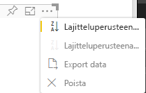

# <a name="sorting-options-for-power-bi-visuals"></a>Power BI -visualisointien lajitteluasetukset

Tässä artikkelissa kuvataan, miten*lajittelu*asetukset määrittävät Power BI:n visualisointien lajittelun toiminnan. 

Lajittelutoiminto edellyttää jotakin seuraavista parametreista.

## <a name="default-sorting"></a>Oletuslajittelu

`default`-asetus on yksinkertaisin muoto. Sen avulla voidaan lajitella DataMappings-osassa esitettyjä tietoja. Tämän vaihtoehdon avulla käyttäjä voi lajitella tietojen yhdistämiset ja määrittää lajittelusuunnan.

```json
    "sorting": {
        "default": {   }
    }
```



## <a name="implicit-sorting"></a>Implisiittinen lajittelu

Implisiittinen lajittelu on lajittelua matriisiparametrilla `clauses`, joka kuvailee jokaisen tietoroolin lajittelun. `implicit` tarkoittaa, että visualisoinnin käyttäjä ei voi muuttaa lajittelujärjestystä. Power BI ei näytä lajitteluasetuksia visualisoinnin valikossa. Power BI kuitenkin lajittelee tiedot määritettyjen asetusten mukaan.

`clauses`-parametrit voivat sisältää useita objekteja, joilla on kaksi parametria:

- `role`: lajittelulle määritetään `DataMapping`
- `direction`: lajittelulle määritetään suunta (1 = nouseva, 2 = laskeva)

```json
    "sorting": {
        "implicit": {
            "clauses": [
                {
                    "role": "category",
                    "direction": 1
                },
                {
                    "role": "measure",
                    "direction": 2
                }
            ]
        }
    }
```

## <a name="custom-sorting"></a>Mukautettu lajittelu

Mukautettu lajittelu tarkoittaa sitä, että kehittäjä hallitsee lajittelua visualisoinnin koodissa.
