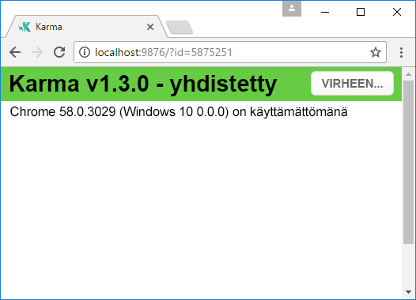
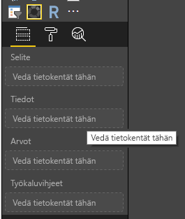
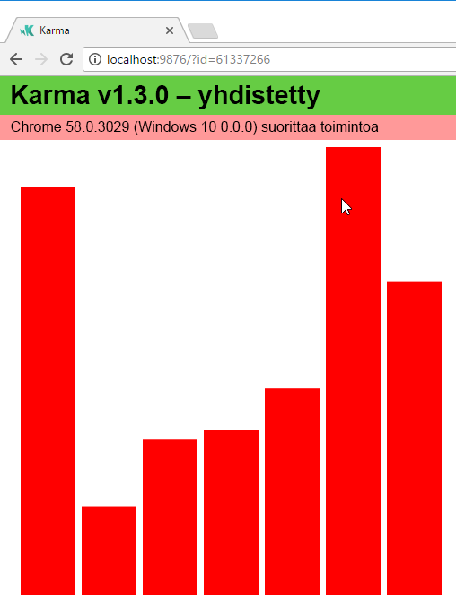
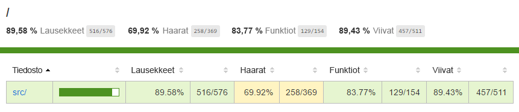

# <a name="tutorial-add-unit-tests-for-power-bi-visual-projects"></a>Opetusohjelma: Yksikkötestien lisääminen Power BI:n visualisointien projekteille

Tässä artikkelissa kerrotaan Power BI:n visualisointien yksikkötestien kirjoittamisen perusteista, kuten seuraavista:

* Määritä Karma JavaScript -testisuorittimen testausympäristö, Jasmine.
* Käytä powerbi-visuals-utils-testutils-pakettia.
* Käytä harjoitustestejä Power BI:n visualisointien yksikkötestauksen helpottamiseen.

## <a name="prerequisites"></a>Edellytykset

* Asennettu Power BI:n visualisointiprojekti
* Määritetty Node.js-ympäristö

## <a name="install-and-configure-the-karma-javascript-test-runner-and-jasmine"></a>Karma JavaScript -testisuorittimen ja Jasminen asentaminen ja määrittäminen

Lisää tarvittavat kirjastot *package.json*-tiedoston `devDependencies`-osaan:

```json
"@babel/polyfill": "^7.2.5",
"@types/d3": "5.5.0",
"@types/jasmine": "2.5.37",
"@types/jasmine-jquery": "1.5.28",
"@types/jquery": "2.0.41",
"@types/karma": "3.0.0",
"@types/lodash-es": "4.17.1",
"coveralls": "3.0.2",
"istanbul-instrumenter-loader": "^3.0.1",
"jasmine": "2.5.2",
"jasmine-core": "2.5.2",
"jasmine-jquery": "2.1.1",
"jquery": "3.1.1",
"karma": "3.1.1",
"karma-chrome-launcher": "2.2.0",
"karma-coverage": "1.1.2",
"karma-coverage-istanbul-reporter": "^2.0.4",
"karma-jasmine": "2.0.1",
"karma-junit-reporter": "^1.2.0",
"karma-sourcemap-loader": "^0.3.7",
"karma-typescript": "^3.0.13",
"karma-typescript-preprocessor": "0.4.0",
"karma-webpack": "3.0.5",
"puppeteer": "1.17.0",
"style-loader": "0.23.1",
"ts-loader": "5.3.0",
"ts-node": "7.0.1",
"tslint": "^5.12.0",
"webpack": "4.26.0"
```

Lisätietoja paketista on sen kuvauksessa.

Tallenna *package.json*-tiedosto ja suorita `package.json`-sijainnissa seuraava komento:

```cmd
npm install
```

Paketinhallinta asentaa kaikki uudet paketit, jotka on lisätty *package.json*-tiedostoon.

Jos haluat suorittaa yksikkötestejä, määritä testisuoritin ja `webpack`-määritys.

Seuraava koodi on malli *test.webpack.config.js*-tiedostosta:

```typescript
const path = require('path');
const webpack = require("webpack");

module.exports = {
    devtool: 'source-map',
    mode: 'development',
    optimization : {
        concatenateModules: false,
        minimize: false
    },
    module: {
        rules: [
            {
                test: /\.tsx?$/,
                use: 'ts-loader',
                exclude: /node_modules/
            },
            {
                test: /\.json$/,
                loader: 'json-loader'
            },
            {
                test: /\.tsx?$/i,
                enforce: 'post',
                include: /(src)/,
                exclude: /(node_modules|resources\/js\/vendor)/,
                loader: 'istanbul-instrumenter-loader',
                options: { esModules: true }
            },
            {
                test: /\.less$/,
                use: [
                    {
                        loader: 'style-loader'
                    },
                    {
                        loader: 'css-loader'
                    },
                    {
                        loader: 'less-loader',
                        options: {
                            paths: [path.resolve(__dirname, 'node_modules')]
                        }
                    }
                ]
            }
        ]
    },
    externals: {
        "powerbi-visuals-api": '{}'
    },
    resolve: {
        extensions: ['.tsx', '.ts', '.js', '.css']
    },
    output: {
        path: path.resolve(__dirname, ".tmp/test")
    },
    plugins: [
        new webpack.ProvidePlugin({
            'powerbi-visuals-api': null
        })
    ]
};
```

Seuraava koodi on malli *Karma.conf.ts*-tiedostosta:

```typescript
"use strict";

const webpackConfig = require("./test.webpack.config.js");
const tsconfig = require("./test.tsconfig.json");
const path = require("path");

const testRecursivePath = "test/visualTest.ts";
const srcOriginalRecursivePath = "src/**/*.ts";
const coverageFolder = "coverage";

process.env.CHROME_BIN = require("puppeteer").executablePath();

import { Config, ConfigOptions } from "karma";

module.exports = (config: Config) => {
    config.set(<ConfigOptions>{
        mode: "development",
        browserNoActivityTimeout: 100000,
        browsers: ["ChromeHeadless"], // or Chrome to use locally installed Chrome browser
        colors: true,
        frameworks: ["jasmine"],
        reporters: [
            "progress",
            "junit",
            "coverage-istanbul"
        ],
        junitReporter: {
            outputDir: path.join(__dirname, coverageFolder),
            outputFile: "TESTS-report.xml",
            useBrowserName: false
        },
        singleRun: true,
        plugins: [
            "karma-coverage",
            "karma-typescript",
            "karma-webpack",
            "karma-jasmine",
            "karma-sourcemap-loader",
            "karma-chrome-launcher",
            "karma-junit-reporter",
            "karma-coverage-istanbul-reporter"
        ],
        files: [
            "node_modules/jquery/dist/jquery.min.js",
            "node_modules/jasmine-jquery/lib/jasmine-jquery.js",
            {
                pattern: './capabilities.json',
                watched: false,
                served: true,
                included: false
            },
            testRecursivePath,
            {
                pattern: srcOriginalRecursivePath,
                included: false,
                served: true
            }
        ],
        preprocessors: {
            [testRecursivePath]: ["webpack", "coverage"]
        },
        typescriptPreprocessor: {
            options: tsconfig.compilerOptions
        },
        coverageIstanbulReporter: {
            reports: ["html", "lcovonly", "text-summary", "cobertura"],
            dir: path.join(__dirname, coverageFolder),
            'report-config': {
                html: {
                    subdir: 'html-report'
                }
            },
            combineBrowserReports: true,
            fixWebpackSourcePaths: true,
            verbose: false
        },
        coverageReporter: {
            dir: path.join(__dirname, coverageFolder),
            reporters: [
                // reporters not supporting the `file` property
                { type: 'html', subdir: 'html-report' },
                { type: 'lcov', subdir: 'lcov' },
                // reporters supporting the `file` property, use `subdir` to directly
                // output them in the `dir` directory
                { type: 'cobertura', subdir: '.', file: 'cobertura-coverage.xml' },
                { type: 'lcovonly', subdir: '.', file: 'report-lcovonly.txt' },
                { type: 'text-summary', subdir: '.', file: 'text-summary.txt' },
            ]
        },
        mime: {
            "text/x-typescript": ["ts", "tsx"]
        },
        webpack: webpackConfig,
        webpackMiddleware: {
            stats: "errors-only"
        }
    });
};
```

Voit muokata tätä määritystä tarvittaessa.

Koodi *karma.conf.js*-tiedostossa sisältää seuraavan muuttujan:

* `recursivePathToTests`: Paikantaa testikoodin

* `srcRecursivePath`: Paikantaa JavaScript-tuloskoodin kääntämisen jälkeen

* `srcCssRecursivePath`: Etsii CSS-tulosteen sen jälkeen, kun se on kääntänyt vähemmän tiedostoa tyyleillä

* `srcOriginalRecursivePath`: Etsii visualisoinnin lähdekoodin

* `coverageFolder`: Määrittää, minne kattavuusraportti luodaan

Määritystiedosto sisältää seuraavat ominaisuudet:

* `singleRun: true`: Testit suoritetaan jatkuvan integraation (CI) järjestelmässä, tai ne voidaan suorittaa kerran. Voit muuttaa asetukseksi *false* (epätosi), jos haluat käyttää testien vianmääritystä. Karma pitää selaimen toiminnassa, jotta voit käyttää konsolia virheenkorjaukseen.

* `files: [...]`: Tässä matriisissa voit määrittää selaimeen ladattavat tiedostot. Yleensä ne ovat lähdetiedostoja, testitapauksia tai kirjastoja (Jasmine, testiapuohjelmat). Voit lisätä tiedostoja luetteloon tarpeen mukaan.

* `preprocessors`: Tässä osassa määrität toiminnot, jotka suoritetaan ennen yksikkötestien suorittamista. Niitä voivat olla esimerkiksi typescriptin esikääntäminen JavaScript-muotoon, lähdekarttatiedostojen valmisteleminen ja koodikattavuusraportin luominen. Voit poistaa käytöstä kohteen `coverage`, kun teet vianmäärityksen testeillesi. Kattavuus luo lisäkoodin testikattavuuden tarkistuskoodille, mikä vaikeuttaa virheenkorjaustestejä.

Jos haluat lukea kuvaukset kaikista Karma-määrityksistä, siirry [Karma-määritystiedostosivulle](https://karma-runner.github.io/1.0/config/configuration-file.html).

Voit halutessasi lisätä testikomennon `scripts`-kohteeseen:

```json
{
    "scripts": {
        "pbiviz": "pbiviz",
        "start": "pbiviz start",
        "typings":"node node_modules/typings/dist/bin.js i",
        "lint": "tslint -r \"node_modules/tslint-microsoft-contrib\"  \"+(src|test)/**/*.ts\"",
        "pretest": "pbiviz package --resources --no-minify --no-pbiviz --no-plugin",
        "test": "karma start"
    }
    ...
}
```

Olet nyt valmis aloittamaan yksikkötestien kirjoittamisen.

## <a name="check-the-dom-element-of-the-visual"></a>Visualisoinnin DOM-osan tarkistaminen

Visualisoinnin testaamista varten luo ensin visualisoinnin esiintymä.

### <a name="create-a-visual-instance-builder"></a>Visualisoinnin esiintymän muodostimen luominen

Lisää *visualBuilder.ts*-tiedoston *testi*kansioon käyttämällä seuraavaa koodia:

```typescript
import {
    VisualBuilderBase
} from "powerbi-visuals-utils-testutils";

import {
    BarChart as VisualClass
} from "../src/visual";

import  powerbi from "powerbi-visuals-api";
import VisualConstructorOptions = powerbi.extensibility.visual.VisualConstructorOptions;

export class BarChartBuilder extends VisualBuilderBase<VisualClass> {
    constructor(width: number, height: number) {
        super(width, height);
    }

    protected build(options: VisualConstructorOptions) {
        return new VisualClass(options);
    }

    public get mainElement() {
        return this.element.children("svg.barChart");
    }
}
```

Visualisoinnin esiintymän luonnissa on käytettävissä `build`-menetelmä. `mainElement` on hakumenetelmä, joka palauttaa DOM (Document Object Model) -pääelementin esiintymän visualisointiin. Getter-elementti on valinnainen, mutta se tekee yksikkötestin kirjoittamisesta helpompaa.

Sinulla on nyt koontiversio visualisointisi esiintymästä. Kirjoitetaanpa sitten testitapaus. Testitapaus tarkistaa SVG-elementit, jotka luodaan, kun visualisointi näytetään.

### <a name="create-a-typescript-file-to-write-test-cases"></a>Typescript-tiedoston luominen testitapausten kirjoittamista varten

Lisää testitapauksia varten *visualTest.ts*-tiedosto käyttämällä seuraavaa koodia:

```typescript
import powerbi from "powerbi-visuals-api";

import { BarChartBuilder } from "./VisualBuilder";

import {
    BarChart as VisualClass
} from "../src/visual";

import VisualBuilder = powerbi.extensibility.visual.test.BarChartBuilder;

describe("BarChart", () => {
    let visualBuilder: VisualBuilder;
    let dataView: DataView;

    beforeEach(() => {
        visualBuilder = new VisualBuilder(500, 500);
    });

    it("root DOM element is created", () => {
        expect(visualBuilder.mainElement).toBeInDOM();
    });
});
```

Useita menetelmiä kutsutaan:

* [`describe`](https://jasmine.github.io/api/2.6/global.html#describe): Kuvailee testitapauksen. Jasmine-ympäristön yhteydessä se kuvailee usein ohjelmistopaketin tai ominaisuusryhmän.

* `beforeEach`: Sitä kutsutaan aina, ennen kuin kutsutaan `it`-menetelmää, joka on määritetty [ `describe`](https://jasmine.github.io/api/2.6/global.html#beforeEach)-menetelmässä.

* [`it`](https://jasmine.github.io/api/2.6/global.html#it): Määrittää yhden ominaisuuden. `it`-menetelmän tulee sisältää vähintään yksi `expectations`.

* [`expect`](https://jasmine.github.io/api/2.6/global.html#expect): Luo odotuksen ominaisuudelle. Menetelmä onnistuu, jos kaikki odotukset läpäisevät ilman virheitä.

* `toBeInDOM`: Yksi *matcher*-menetelmistä. Lisätietoja matchereista on sivulla [Jasmine Namespace: matchers](https://jasmine.github.io/api/2.6/matchers.html).

Lisätietoja Jasminesta on [Jasmine-ympäristön dokumentaatiosivulla](https://jasmine.github.io/).

### <a name="launch-unit-tests"></a>Yksikkötestien käynnistys

Tämä testi tarkistaa, että visualisointien SVG-pääelementti luodaan. Voit suorittaa yksikkötestin kirjoittamalla seuraavan komennon komentorivityökaluun:

```cmd
npm run test
```

`karma.js` suorittaa testitapauksen Chrome-selaimessa.



> [!NOTE]
> Google Chrome on asennettava paikallisesti.

Komentorivi-ikkunasta saat seuraavan tulosteen:

```cmd
> karma start

23 05 2017 12:24:26.842:WARN [watcher]: Pattern "E:/WORKSPACE/PowerBI/PowerBI-visuals-sampleBarChart/data/*.csv" does not match any file.
23 05 2017 12:24:30.836:WARN [karma]: No captured browser, open http://localhost:9876/
23 05 2017 12:24:30.849:INFO [karma]: Karma v1.3.0 server started at http://localhost:9876/
23 05 2017 12:24:30.850:INFO [launcher]: Launching browser Chrome with unlimited concurrency
23 05 2017 12:24:31.059:INFO [launcher]: Starting browser Chrome
23 05 2017 12:24:33.160:INFO [Chrome 58.0.3029 (Windows 10 0.0.0)]: Connected on socket /#2meR6hjXFmsE_fjiAAAA with id 5875251
Chrome 58.0.3029 (Windows 10 0.0.0): Executed 1 of 1 SUCCESS (0.194 secs / 0.011 secs)

=============================== Coverage summary ===============================
Statements   : 27.43% ( 65/237 )
Branches     : 19.84% ( 25/126 )
Functions    : 43.86% ( 25/57 )
Lines        : 20.85% ( 44/211 )
================================================================================
```

### <a name="how-to-add-static-data-for-unit-tests"></a>Staattisten tietojen lisääminen yksikkötesteihin

Luo *visualData.ts*-tiedosto *testi*kansioon käyttämällä seuraavaa koodia:

```typescript
import powerbi from "powerbi-visuals-api";
import DataView = powerbi.DataView;

import {
    testDataViewBuilder,
    getRandomNumbers
} from "powerbi-visuals-utils-testutils";

export class SampleBarChartDataBuilder extends TestDataViewBuilder {
    public static CategoryColumn: string = "category";
    public static MeasureColumn: string = "measure";

    public constructor() {
        super();
        ...
    }

    public getDataView(columnNames?: string[]): DataView {
        let dateView: any = this.createCategoricalDataViewBuilder([
            ...
        ],
        [
            ...
        ], columnNames).build();

        // there's client side computed maxValue
        let maxLocal = 0;
        this.valuesMeasure.forEach((item) => {
                if (item > maxLocal) {
                    maxLocal = item;
                }
        });
        (<any>dataView).categorical.values[0].maxLocal = maxLocal;
    }
}
```

`SampleBarChartDataBuilder`-luokka laajentaa kohteen `TestDataViewBuilder` ja toteuttaa abstraktin menetelmän `getDataView`.

Kun sijoitat tietoja tietokenttäsäilöihin, Power BI tuottaa tietoihin perustuvan luokittaisen `dataview`-objektin.



Yksikkötesteissä sinulla ei ole Power BI:n keskeisiä funktioita tietojen toistamiseksi. Sinun on kuitenkin yhdistettävä staattiset tietosi luokittaiseksi `dataview`-kohteeksi. Voit helpottaa sen yhdistämistä `TestDataViewBuilder`-luokan avulla.

Lisätietoja tietonäkymän yhdistämismäärityksestä on artikkelissa [Tietonäkymän yhdistämismääritykset](https://github.com/Microsoft/PowerBI-visuals/blob/master/Capabilities/DataViewMappings.md).

`getDataView`-menetelmässä kutsut `createCategoricalDataViewBuilder`-menetelmää tietojesi kanssa.

`sampleBarChart`-visualisoinnin [capabilities.json](https://github.com/Microsoft/PowerBI-visuals-sampleBarChart/blob/master/capabilities.json#L2)-tiedostossa käytettävissä on dataRoles- ja dataViewMapping-objektit:

```json
"dataRoles": [
    {
        "displayName": "Category Data",
        "name": "category",
        "kind": "Grouping"
    },
    {
        "displayName": "Measure Data",
        "name": "measure",
        "kind": "Measure"
    }
],
"dataViewMappings": [
    {
        "conditions": [
            {
                "category": {
                    "max": 1
                },
                "measure": {
                    "max": 1
                }
            }
        ],
        "categorical": {
            "categories": {
                "for": {
                    "in": "category"
                }
            },
            "values": {
                "select": [
                    {
                        "bind": {
                            "to": "measure"
                        }
                    }
                ]
            }
        }
    }
],
```

Jotta voit luoda saman yhdistämismäärityksen, sinun on määritettävä seuraavat parametrit `createCategoricalDataViewBuilder`-menetelmälle:

```typescript
([
    {
        source: {
            displayName: "Category",
            queryName: SampleBarChartData.ColumnCategory,
            type: ValueType.fromDescriptor({ text: true }),
            roles: {
                Category: true
            },
        },
        values: this.valuesCategory
    }
],
[
    {
        source: {
            displayName: "Measure",
            isMeasure: true,
            queryName: SampleBarChartData.MeasureColumn,
            type: ValueType.fromDescriptor({ numeric: true }),
            roles: {
                Measure: true
            },
        },
        values: this.valuesMeasure
    },
], columnNames)
```

Jossa `this.valuesCategory` on luokkamatriisi:

```ts
public valuesCategory: string[] = ["Monday", "Tuesday", "Wednesday", "Thursday", "Friday", "Saturday", "Sunday"];
```

`this.valuesMeasure` on mittamatriisi jokaiselle luokalle:

```ts
public valuesMeasure: number[] = [742731.43, 162066.43, 283085.78, 300263.49, 376074.57, 814724.34, 570921.34];
```

Nyt voit käyttää `SampleBarChartDataBuilder`-luokkaa yksikkötestissäsi.

`ValueType`-luokka määritetään powerbi-visuals-utils-testutils-paketissa. `createCategoricalDataViewBuilder`-menetelmä edellyttää `lodash`-kirjastoa.

Lisää nämä paketit riippuvuuksiin.

`package.json`-kohdassa osassa `devDependencies`

```json
"lodash-es": "4.17.1",
"powerbi-visuals-utils-testutils": "2.2.0"
```

Kutsu

```cmd
npm install
```

asentaaksesi `lodash-es`-kirjaston.

Nyt voit suorittaa yksikkötestin uudelleen. Sinun pitää saada seuraava tuloste:

```cmd
> karma start

23 05 2017 16:19:54.318:WARN [watcher]: Pattern "E:/WORKSPACE/PowerBI/PowerBI-visuals-sampleBarChart/data/*.csv" does not match any file.
23 05 2017 16:19:58.333:WARN [karma]: No captured browser, open http://localhost:9876/
23 05 2017 16:19:58.346:INFO [karma]: Karma v1.3.0 server started at http://localhost:9876/
23 05 2017 16:19:58.346:INFO [launcher]: Launching browser Chrome with unlimited concurrency
23 05 2017 16:19:58.394:INFO [launcher]: Starting browser Chrome
23 05 2017 16:19:59.873:INFO [Chrome 58.0.3029 (Windows 10 0.0.0)]: Connected on socket /#NcNTAGH9hWfGMCuEAAAA with id 3551106
Chrome 58.0.3029 (Windows 10 0.0.0): Executed 1 of 1 SUCCESS (1.266 secs / 1.052 secs)

=============================== Coverage summary ===============================
Statements   : 56.72% ( 135/238 )
Branches     : 32.54% ( 41/126 )
Functions    : 66.67% ( 38/57 )
Lines        : 52.83% ( 112/212 )
================================================================================
```

Visualisointisi avautuu Chrome-selaimessa seuraavasti:



Yhteenveto osoittaa, että kattavuus on kasvanut. Jos haluat lisätietoja nykyisen koodin kattavuudesta, avaa `coverage\index.html`.



Voit myös tarkastella `src`-kansion kattavuutta:


Voit tarkastella lähdekoodia tiedoston vaikutusalueella. `Coverage`-apuohjelmat korostaisivat rivin punaisella, jos tiettyä koodia ei suoriteta yksikkötestien aikana.


> [!IMPORTANT]
> Koodin kattavuus ei tarkoita, että käytettävissäsi olisi hyvä toimintojen kattavuus visualisoinnissa. Yksi yksinkertainen yksikkötesti kattoi yli 96 prosenttia kohteessa `src\visual.ts`.

## <a name="next-steps"></a>Seuraavat vaiheet

Kun visualisointi on valmis, voit lähettää sen julkaistavaksi. Lisätietoja tästä on artikkelissa [Mukautettujen visualisointien julkaiseminen AppSourceen](../office-store.md).
