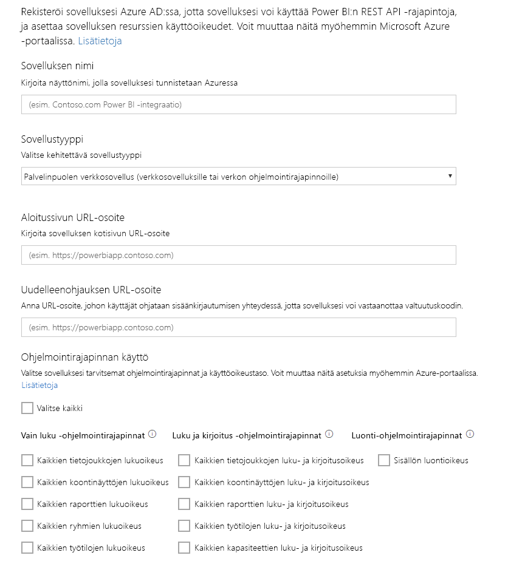

# Vaihe 1: Sovelluksen Azure AD -rekisteröinti
Tämä artikkeli on osa vaiheittaisia ohjeita, joilla [tiedot syötetään tietojoukkoon](walkthrough-push-data.md).

Ensimmäinen vaihe tietojen syöttämisessä tietojoukkoon on sovelluksen rekisteröiminen Azure AD -palveluun. Tämä on tehtävä ensin saadaksesi **Asiakastunnuksen**, joka tunnistaa sovelluksesi Azure AD:ssa. Ilman **Asiakastunnusta** Azure AD ei voi todentaa sovellustasi.

> **Huomautus**: ennen kuin voit rekisteröidä sovelluksen Power BI:ssa, sinun on rekisteröidyttävä [Power BI -palveluun](create-an-azure-active-directory-tenant.md).
> 
> 

Seuraavassa on ohjeet sovelluksen rekisteröimiseksi Azure AD:ssa.

## Rekisteröi sovellus Azure AD:ssä
1. Siirry osoitteeseen dev.powerbi.com/apps.
2. Valitse **Kirjaudu sisään nykyisellä tilillesi** ja kirjaudu sisään Power BI -tilillesi.
3. Syötä **sovelluksen nimi**, kuten ”Tietojen syöttö tietojoukkoon”.
4. Kohdasta **Sovelluksen tyyppi**,valitaan **Alkuperäinen sovellus**.
5. Syötä **Uudelleenohjauksen URL-osoite**, kuten **https://login.live.com/oauth20_desktop.srf**. **Native client -sovelluksessa** uudelleenohjauksen url-osoite antaa **Azure AD:lle** lisätietoja tietystä sovelluksesta, joka sen todentaa. Asiakkaan sovelluksen vakio-Uri on https://login.live.com/oauth20_desktop.srf.
6. **Käytettävien API-liittymien valintaa varten**  valitaan **Kaikkien tietojoukkojen luku- ja kirjoitusoikeus**. Lue lisää kaikkien Power BI-sovellusten käyttöoikeuksista kohdasta [Power BI -käyttöoikeudet](power-bi-permissions.md).
7. Valitse **Rekisteröi sovellus** ja tallenna luotu **Asiakastunnus**. **Asiakastunnus** tunnistaa sovelluksen Azure AD:ssa.

Tältä **Sovelluksen rekisteröiminen Power BI:ssa** -sivun pitäisi näyttää:

Seuraava vaihe näyttää, kuinka [hankkia todennustunnus](walkthrough-push-data-get-token.md).

[Seuraava vaihe >](walkthrough-push-data-get-token.md)

## Seuraavat vaiheet
[Rekisteröidy Power BI -palveluun](create-an-azure-active-directory-tenant.md)  
[Todennustunnuksen hankkiminen](walkthrough-push-data-get-token.md)  
[Vaiheittainen opastus – tiedon syöttäminen tietojoukkoon](walkthrough-push-data.md)  
[Sovelluksen rekisteröinti](register-app.md)  
[Power BI REST -ohjelmointirajapinnan yleiskatsaus](overview-of-power-bi-rest-api.md)  

Onko sinulla muuta kysyttävää? [Voit esittää kysymyksiä Power BI -yhteisössä](http://community.powerbi.com/)

