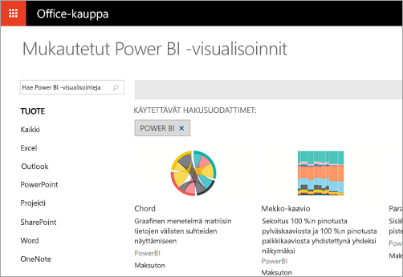

# Mitä kehittäjät voivat tehdä Power BI:llä?
Power BI tarjoaa useita erilaisia asetuksia kehittäjille. Niitä on upottamisesta mukautettuihin visualisointeihin ja virtautettaviin tietojoukkoihin.

## Upottaminen
Power BI -palvelu ja Azuren Power BI Embedded pyrkivät lähitulevaisuudessa tarjoamaan yhteisen ohjelmointirajapinnan koontinäyttöjen ja raporttien upottamista varten. Se tarkoittaa, että saat yhden ohjelmointirajapinnan, jossa on yhtenäiset ominaisuudet ja mahdollisuus käyttää uusimpia Power BI -toimintoja, kuten koontinäyttöjä, yhdyskäytäviä ja sovellustyötiloja, sisältöjen upottamiseen. Lisätietoja on artikkelissa [Upottaminen Power BI:ssä](embedding.md).

## Mukautetut visualisoinnit
Mukautettujen visualisointien avulla voit luoda omia visualisointeja käytettäväksi Power BI ‑raporteissa. Mukautetut visualisoinnit kirjoitetaan TypeScriptillä. Se on JavaScriptin ylijoukko, joka tukee edistyneempiä ominaisuuksia ja varhaista pääsyä ES6/ES7-toiminnallisuuteen. Visualisointityylit käsitellään Cascading Style Sheet (CSS) -tyyliohjeiden avulla. Käyttömukavuuden lisäämiseksi käytämme Less-esikääntäjää, joka tukee joitakin edistyneitä ominaisuuksia, kuten sisäkkäisyyttä, muuttujia, sekoitusta, ehtoja, silmukoita jne. Jos et halua käyttää mitään näistä ominaisuuksista, voit kirjoittaa pelkkää CSS:ää Less-tiedostoon.

Lisätietoja siitä, miten voit kehittää ja julkaista mukautettuja visualisointeja, saat artikkelista [Mukautettujen visualisointien julkaiseminen Office-kauppaan](office-store.md).

## Tietojen työntäminen Power BI:hin
Power BI ‑ohjelmointirajapinnan avulla voit lähettää tietoja tietojoukkoon. Sen avulla voit lisätä tietojoukkoon sisältyvään taulukkoon uuden rivin. Uudet tiedot voidaan sitten esittää koontinäytön ruuduissa sekä raporttiin sisältyvissä visualisoinneissa.

Lisätietoja on artikkelissa [Tietojen lähettäminen koontinäyttöön](walkthrough-push-data.md)

## Seuraavat vaiheet
[Upottaminen Power BI:n avulla](embedding.md)  
[Miten Power BI Embedded -työtilakokoelman sisältö siirretään Power BI -palveluun](migrate-from-powerbi-embedded.md)  
[JavaScript API Git -säilö](https://github.com/Microsoft/PowerBI-JavaScript)  
[Power BI C# Git -säilö](https://github.com/Microsoft/PowerBI-CSharp)  
[Mukautettujen visualisointien julkaiseminen Office-kauppaan](office-store.md)  
[Power BI Visuals Git ‑säilö](https://github.com/Microsoft/PowerBI-visuals)  
[JavaScript-upotuksen näyte](https://microsoft.github.io/PowerBI-JavaScript/demo/)  
[Power BI Premiumin tekninen raportti](https://aka.ms/pbipremiumwhitepaper)  
Ilmenikö muuta kysyttävää? [Kokeile Power BI -yhteisöä](http://community.powerbi.com/)

