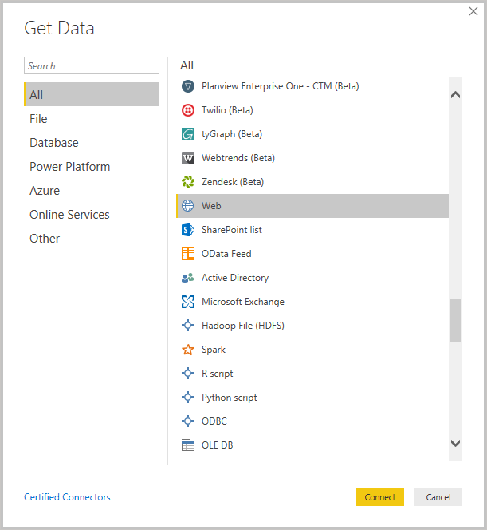
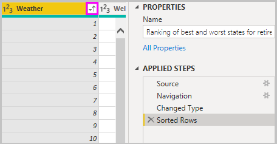
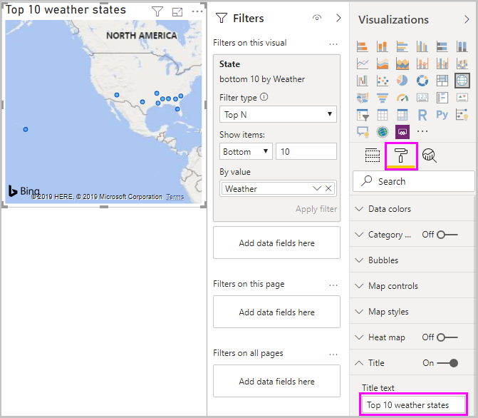
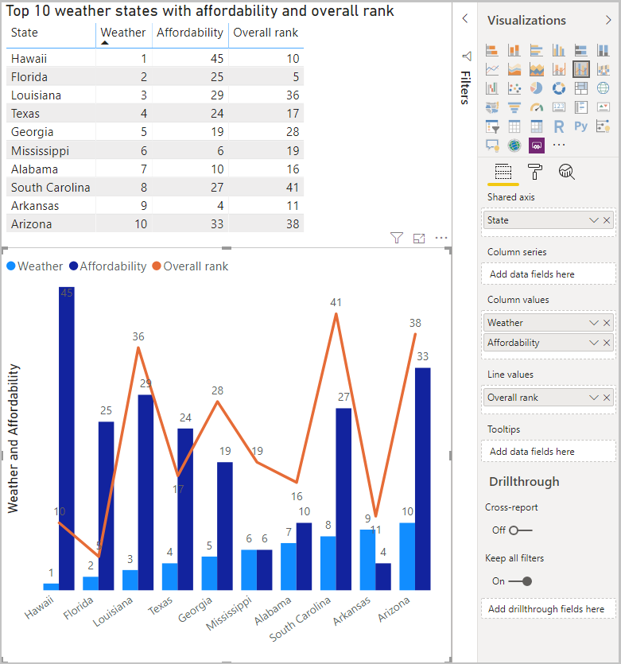

# Power BI Desktopin käytön aloittaminen
Tervetuloa Power BI Desktopin aloitusoppaaseen. Tässä esittelyssä kerrotaan, miten Power BI Desktop toimii, mitä sillä voi tehdä ja miten voit luoda luotettavia tietomalleja ja hienoja raportteja liiketoimintatietojen kehittämiseksi.

Saat lyhyen yleiskatsauksen Power BI Desktopin toiminnoista ja tutustumalla tämän oppaan näyttöihin vain muutamassa minuutissa. Jos haluat kattavamman käsityksen, voit lukea jokaisen osan, noudattaa vaiheita ja lopuksi julkaista itse luomasi Power BI Desktop -tiedoston [Power BI -palveluun](https://app.powerbi.com/) ja jakaa sen muiden kanssa.

Voit myös katsoa [Power BI Desktopin käytön aloittaminen](https://www.youtube.com/watch?v=Qgam9M8I0xA) -videon ja ladata [Talousmallin](https://go.microsoft.com/fwlink/?LinkID=521962) Excel-työkirjan, jota voit seurata samaan aikaan videon kanssa.

## Näin Power BI Desktop toimii
Power BI Desktopin avulla voit tehdä seuraavia toimia:
1. Voit yhdistää tietoihin, mukaan lukien useisiin tietolähteisiin.
1. Voit muotoilla tietoja kyselyillä, joilla voidaan luodaan oivaltavia ja vaikuttavia tietomalleja.
1. Voit luoda visualisointeja ja raportteja tietomallien avulla. 
1. Voit jakaa raportin tiedostoja muiden kanssa, jolloin he voivat hyödyntää ja jakaa niitä itse. Voit jakaa Power BI Desktopin *.pbix*-tiedostoja, kuten mitä tahansa muitakin tiedostoja, mutta tehokkain tapa on ladata ne [Power BI -palveluun](https://preview.powerbi.com/). 

Power BI Desktop integroi Microsoftin taattujen kyselyohjelma-, tietomallinnus-ja visualisointitekniikoiden kanssa. Tietoanalyytikot ja muut voivat luoda kyselykokoelmia, tietoyhteyksiä, malleja ja raportteja ja jakaa ne helposti muiden kanssa. Power BI Desktopin ja Power BI -palvelun yhdistelmällä merkityksellisiä tietoja on helpompi mallintaa, luoda, jakaa ja laajentaa.

Power BI Desktop keskittää, yksinkertaistaa, tehostaa ja nopeuttaa muutoin hajaantunutta, irrallista ja hankalaa liiketoimintatietojen säilöjen ja raporttien suunnittelu- ja luontiprosessia.
Oletko valmis kokeilemaan? Aloitetaan.

> [!NOTE]
> Power BI:stä on myös erillinen erikoisversio, [Power BI -raporttipalvelin](../report-server/get-started.md), joka on tarkoitettu paikallisesti säilytettäville tiedoille ja raporteille. Power BI -raporttipalvelin käyttää Power BI Desktopista erillistä erikoisversiota, jonka nimi on Power BI Desktop Power BI -raporttipalvelimelle ja joka toimii ainoastaan Power BI:n raporttipalvelinversion kanssa. Tämä artikkeli käsittelee Power BI Desktopin perusversiota.

## Power BI Desktopin asentaminen ja suorittaminen
Voit ladata Power BI Desktopin siirtymällä [Power BI Desktopin lataussivulle](https://powerbi.microsoft.com/desktop) ja valitsemalla **Lataa ilmaiseksi**. Voit tarkastella latausasetuksia valitsemalla [Näytä lataus- tai kieliasetukset](https://www.microsoft.com/download/details.aspx?id=58494). 

Voit myös ladata Power BI Desktopin Power BI ‑palvelusta. Valitse yläreunan valikkoriviltä **Lataa**-kuvake ja valitse sitten **Power BI Desktop**.

Valitse Microsoft Store -sivulla **Nouda** ja asenna Power BI Desktop tietokoneeseesi noudattamalla kehotteita. Käynnistä Power BI Desktop Windowsin **aloitusvalikosta** tai Windowsin tehtäväpalkin kuvakkeesta.

Kun Power BI Desktop käynnistyy ensimmäistä kertaa, näkyviin tulee **tervetulonäyttö**.

**Tervetulonäytössä** voit **noutaa tietoja**, tarkastella **viimeaikaisia lähteitä**, avata viimeaikaisia raportteja, **avata muita raportteja** tai valita muita linkkejä. Voit myös valita, näytetäänkö **tervetulonäyttö** aina käynnistyksen yhteydessä. Sulje **tervetulonäyttö** valitsemalla Sulje-kuvake.

Power BI Desktopin vasemmassa reunassa on kolmen Power BI Desktop -näkymän kuvakkeet: ylhäältä alaspäin ne ovat **Raportti**, **Tiedot** ja **Suhteet**. Nykyinen näkymä ilmaistaan vasemmalla olevan keltaisen palkin avulla, ja voit vaihtaa näkymää valitsemalla minkä tahansa kuvakkeen. 

**Raporttinäkymä** on oletusnäkymä. 

Power BI Desktop sisältää myös **Power Query -editorin**, joka avautuu erilliseen ikkunaan. **Power Query -editorissa** voit laatia kyselyjä, muuntaa tietoja, ladata sitten tarkennetun tietomallin Power BI Desktopiin ja luoda raportteja.

## Tietoihin yhdistäminen
Kun Power BI Desktop on asennettu, olet valmis muodostamaan yhteyden alati laajenevaan tietomaailmaan. Jos haluat tarkastella useita käytettävissä olevia tietolähdetyyppejä, valitse **Nouda tiedot** > **Lisää** Power BI Desktopin **Aloitus**-välilehdessä ja selaa **Nouda tiedot** -ikkunassa **kaikkien** tietolähteiden luetteloa. Tässä pikaesittelyssä yhdistät muutamaan eri **verkko**tietolähteeseen.

Kuvittele, että olet tietoanalyytikko, joka työskentelee aurinkolasien jälleenmyyjälle. Haluat auttaa asiakastasi kohdistamaan myynnin sellaisille alueille, joilla aurinko paistaa eniten. Bankrate.comin [parhaimmista ja huonoimmista osavaltioista eläkkeelle jäämiseen](https://www.bankrate.com/retirement/best-and-worst-states-for-retirement/) kertovalla sivulla on kiinnostavia tietoja tästä asiasta.

Valitse Power BI Desktopin **Aloitus**-välilehdessä **Nouda tiedot** > **Verkko**, jos haluat muodostaa yhteyden verkkotietolähteeseen. 

Liitä **Verkosta**-valintaikkunassa osoite *https:\//www.bankrate.com/retirement/best-and-worst-states-for-retirement/* **URL**-kenttään ja valitse **OK**. 

Pyydettäessä valitse **Käytä WWW-sisältöä** -näytössä **Yhdistä** anonyymin käytön mahdollistamiseksi. 

Power BI Desktopin kyselytoiminto alkaa toimia ja muodostaa yhteyden verkkoresurssiin. **Siirtymistoiminto**-ikkuna palauttaa verkkosivulta löytyneet tiedot, eli tässä tapauksessa taulukon, jonka nimi on **Parhaat ja huonoimmat osavaltiot eläkkeelle jäämiseen**, sekä asiakirjan. Sinua kiinnostaa taulukko, joten valitset sen luettelosta.

Tässä vaiheessa voit valita **Lataa**, jos haluat ladata6 taulukon, tai **Muunna tiedot**, jos haluat tehdä muutoksia taulukkoon ennen sen lataamista.

Kun valitset **Muunna tiedot**, Power Query -editori käynnistyy ja näyttää edustavan näkymän taulukosta. **Kyselyasetukset**-ruutu on oikealla puolella, tai voit aina tuoda sen näkyviin valitsemalla **Kyselyasetukset** Power Query -editorin **Näytä**-välilehdessä. 

Lisätietoa tietoihin yhdistämisestä on ohjeartikkelissa [Tietoihin yhdistäminen Power BI Desktopissa](../connect-data/desktop-connect-to-data.md).

## Tietojen muotoileminen
Nyt kun tietolähde on yhdistetty, voit muokata tietoja tarpeidesi mukaan. Jos haluat *muotoilla* tietoja, anna Power Query -editorille vaiheittaiset ohjeet tietojen muokkaamiseen niiden lataamisen ja esittämisen aikana. Muotoilu ei vaikuta alkuperäiseen tietolähteeseen, ainoastaan tähän tiettyyn näkymään tiedoista. 

> [!NOTE]
> Tässä oppaassa käytetyt taulukkotiedot saattavat muuttua ajan kuluessa. Näin ollen suoritettavat toimenpiteet saattavat vaihdella. Sinun on siis oltava luova toimenpiteiden ja tulosten suhteen, mutta sehän vain tekee oppimisesta hauskempaa. 

Muotoilu voi tarkoittaa tietojen *muuttamista*, kuten sarakkeiden tai taulukoiden nimeämistä uudelleen, rivien tai sarakkeiden poistamista tai tietotyyppien muuttamista. Power Query -editori tallentaa nämä vaiheet järjestyksessä **Käytössä olevat vaiheet** -kohdassa **Kyselyasetukset**-ruudussa. Aina, kun tämä kysely muodostaa yhteyden tietolähteeseen, nämä vaiheet suoritetaan, joten tiedot muotoillaan aina määrittämälläsi tavalla. Tämä prosessi suoritetaan, kun käytät Power BI Desktopin kyselyä tai kun joku käyttää jaettua kyselyäsi esimerkiksi Power BI -palvelussa. 

Huomaa, että **Käytössä olevat vaiheet** **kyselyasetuksissa** sisältävät jo muutamia vaiheita. Voit valita kunkin vaiheen, jotta näet sen vaikutuksen Power Query -editorissa. Määritit ensin verkkolähteen, minkä jälkeen esikatselit taulukkoa **Siirtymistoiminto**-ikkunassa. Kolmannessa vaiheessa **Muutettu tyyppi** Power BI tunnisti kokonaislukutiedot niiden tuonnin aikana ja muutti automaattisesti alkuperäisen verkon **Teksti**-*tietotyypin* **kokonaisluvuiksi**. 

Jos sinun on muutettava tietotyyppiä, valitse muutettava sarake tai sarakkeet. Valitse useita vierekkäisiä sarakkeita pitämällä **vaihto**näppäintä painettuna, tai paina **Ctrl**-näppäintä, jos haluat valita muita kuin vierekkäisiä sarakkeita. Napsauta hiiren kakkospainikkeella sarakeotsikkoa, valitse **Muuta tyyppiä** ja valitse uusi tietotyyppi valikosta, tai valitse avattava luettelo **Tietotyyppi**-kohdan vieressä **Aloitus**-välilehden **Muunna**-ryhmässä ja valitse uusi tietotyyppi.

> [!NOTE]
> Power BI Desktopin Power Query -editori käyttää käytettävissä olevien tehtävien valintanauhaa tai hiiren kakkospainikkeen valikkoa. Useimmat tehtävät, jotka ovat valittavissa valintanauhan **Aloitus**- tai **Muunna**-välilehdessä, ovat käytettävissä myös napsauttamalla kohdetta hiiren kakkospainikkeella ja valitsemalla sitten toiminto näyttöön avautuvasta valikosta.

Voit nyt ottaa käyttöön tietoihin tekemäsi muutokset ja muunnokset ja tarkastella niitä **Käytössä olevat vaiheet** -kohdassa. 

Esimerkiksi aurinkolasien myynnissä sinua kiinnostaa eniten sääsijoitus, joten päätät lajitella taulukon **Sää**-sarakkeen mukaan **yleisen sijan** sijaan. Napsauta **Sää-** otsikon vieressä olevaa avattavan valikon nuolta ja valitse **Lajittele nousevaan järjestykseen**. Tiedot näytetään nyt lajiteltuina sääsijoituksen mukaan, ja vaihe **Lajiteltu rivit** näkyy **Käytössä olevat vaiheet** -kohdassa. 

Et ole kovin kiinnostunut aurinkolasien myynnistä osavaltioissa, joissa on huonoin sää, joten päätät poistaa ne taulukosta. Valitse **Aloitus**-välilehden **Vähennä rivejä** -ryhmässä **Poista rivit** > **Poista alimmat rivit**. Kirjoita **Poista alimmat rivit** -valintaikkunaan *10* ja valitse sitten **OK**. 

Alimmat 10 huonoimman sään riviä poistetaan taulukosta, ja vaihe **Poistettu alimmat rivit** näkyy **Käytössä olevat vaiheet** -kohdassa.

Päätät, että et tarvitse kaikkia taulukon tietoja, ja poistat **Edullisuus**-, **Rikollisuus**-, **Kulttuuri**- ja **Hyvinvointi**-sarakkeet. Valitse kunkin sarakkeen otsikko, jonka haluat poistaa. Valitse useita vierekkäisiä sarakkeita pitämällä **vaihto**näppäintä painettuna, tai paina **Ctrl**-näppäintä, jos haluat valita muita kuin vierekkäisiä sarakkeita. 

Valitse sitten **Aloitus**-välilehden **Sarakkeiden hallinta** -ryhmässä **Poista sarakkeet**. Voit myös napsauttaa hiiren kakkospainikkeella yhtä valituista sarakeotsikoista ja valita **Poista sarakkeet** valikosta. Valitut sarakkeet poistetaan, ja vaihe **Poistetut sarakkeet** näkyy **Käytössä olevat vaiheet** -kohdassa.

Itse asiassa **Edullisuus** voisi sittenkin olla merkityksellinen aurinkolasien myynnin kannalta. Haluaisit saada kyseisen sarakkeen takaisin. Voit helposti kumota **Käytössä olevat vaiheet** -ruudun viimeisen vaiheen valitsemalla vaiheen vieressä olevan **X**-poistokuvakkeen. Suorita nyt vaihe uudelleen valitsemalla vain ne sarakkeet, jotka haluat poistaa. Joustavuuden lisäämiseksi voit poistaa kunkin sarakkeen erillisenä vaiheena. 

Voit napsauttaa mitä tahansa **Käytössä olevat vaiheet** -kohdan ruutua hiiren kakkospainikkeella ja poistaa sen, nimetä sen uudelleen, siirtää sitä järjestyksessä ylös- tai alaspäin tai lisätä tai poistaa vaiheita sen jälkeen. Välivaiheissa Power BI Desktop varoittaa, jos muutos voi vaikuttaa myöhempiin vaiheisiin ja keskeyttää kyselyn.  

Jos et esimerkiksi enää halua lajitella taulukkoa **sään** mukaan, voit yrittää poistaa **Lajiteltu rivit** -vaiheen. Power BI Desktop varoittaa, että tämän vaiheen poistaminen saattaa aiheuttaa kyselyn keskeyttämisen. Olet poistanut viimeiset 10 riviä suoritettuasi lajittelun sään mukaan, joten jos poistat lajittelun, eri rivit poistetaan. Näkyviin tulee myös varoitus, jos valitset **Lajiteltu rivit** -vaiheen ja yrität siinä kohtaa lisätä uuden välivaiheen.  

Lopuksi muutat taulukon otsikon viittaamaan aurinkolasien myyntiin eläkkeelle siirtymisen sijaan. **Ominaisuudet**-kohdassa **Kyselyasetukset**-ruudussa korvaa vanha otsikko nimellä *Parhaat osavaltiot aurinkolasien myyntiin*.

Muotoiltujen tietojen valmis kysely näyttää seuraavalta:

Lisätietoa tietojen muotoilemisesta on ohjeartikkelissa [Tietojen muotoilu ja yhdistäminen Power BI Desktopissa](../connect-data/desktop-shape-and-combine-data.md).

## Tietojen yhdistäminen
Tiedot eri osavaltioista ovat mielenkiintoisia. Niistä on myös hyötyä muidenkin analyysien ja kyselyiden luomisessa. Tässä on kuitenkin yksi ongelma: suurin osa saatavilla olevista tiedoista käyttää kaksikirjaimisia osavaltiolyhenteitä, ei osavaltioiden koko nimiä. Osavaltioiden nimet ja niiden lyhenteet täytyy siis yhdistää, jotta voit käyttää tietoja.

Sinulla on onnea. Toinen julkinen tietolähde tekee juuri näin, mutta tietoja pitää muotoilla melko paljon, ennen kuin voit *yhdistää* ne aurinkolasitaulukkoosi.

Jos haluat tuoda osavaltiolyhenteiden tiedot Power Query -editoriin, valitse **Uusi lähde** > **Verkko** valintanauhan **Uusi kysely** -ryhmässä **Aloitus**-välilehdessä. 

Kirjoita **Verkosta**-valintaruutuun osavaltiolyhenteiden sivuston URL-osoite: *https:\//en.wikipedia.org/wiki/List_of_U.S._state_abbreviations*.

Valitse **Siirtymistoiminto**-ikkunassa taulukko **Yhdysvaltojen osavaltioiden, liittovaltion alueen ja muiden alueiden koodit ja lyhenteet** ja valitse sitten **OK**. Taulukko avautuu Power Query -editorissa.

Poista kaikki sarakkeet lukuun ottamatta sarakkeita **Alueen nimi ja tila**, **Alueen nimi ja tila2** ja **ANSI**. Jos haluat säilyttää vain nämä sarakkeet, pidä **Ctrl**-painiketta painettuna ja valitse sarakkeet. Napsauta sitten jotakin sarakeotsikkoa hiiren kakkospainikkeella ja valitse **Poista muut sarakkeet** tai valitse **Aloitus**-välilehden **Sarakkeiden hallinta** -kohdassa **Poista muut sarakkeet**. 

Napsauta **Alueen nimi ja tila2** -sarakkeen otsikon vieressä olevaa nuolta ja valitse **Suodattimet** > **Yhtä suuri kuin**. **Suodata rivit** -valintaikkunassa avaa **Kirjoita tai valitse arvo** -kenttä **Yhtä suuri kuin** -kohdan vieressä ja valitse **Osavaltio**. 

Valitse **Tai** ja valitse toisen **Yhtä suuri kuin** -kentän vieressä **Osavaltio ("liittovaltio")** . Valitse **OK**. 

Kun ylimääräiset arvot, kuten **Liittovaltion alue** ja **saari**, on poistettu, käytössäsi on nyt luettelo 50 osavaltiosta ja niiden virallisista kaksikirjaimisista lyhenteistä. Voit nimetä sarakkeet uudelleen järkevämmiksi, esimerkiksi nimillä **Osavaltion nimi**, **Tila** ja **Lyhenne**, napsauttamalla sarakeotsikoita hiiren kakkospainikkeella ja valitsemalla **Nimeä uudelleen**.

Huomioi, että kaikki nämä vaiheet tallennetaan **Käytössä olevat vaiheet** -kohdassa **Kyselyasetukset**-ruudussa.

Muotoiltu taulukko näyttää nyt tältä:

Muuta taulukon otsikoksi *Osavaltiokoodit* **Ominaisuudet**-kentässä **kyselyasetuksissa**. 

**Osavaltiokoodit**-taulukon muotoilun jälkeen voit *yhdistää* nämä kaksi taulukkoa. Koska nyt käytössäsi olevat taulukot ovat tiedoissa käyttämiesi kyselyjen tuloksia, niitä kutsutaan myös *kyselyiksi*. Kyselyitä voi yhdistää kahdella tavalla: *yhdistämällä* tai *loppuun liittämällä*. 

Jos sinulla on sarake tai sarakkeita, jonka tai jotka haluat lisätä toiseen kyselyyn, *yhdistä* kyselyt. Jos sinulla on lisärivejä tietoja, jotka haluat lisätä olemassa olevaan kyselyyn, *liitä ne kyselyn loppuun*.

Tässä tapauksessa sinun kannattaa *yhdistää* **Osavaltiokoodit**-kysely **Parhaat osavaltiot aurinkolaseille** -kyselyyn. Jos haluat yhdistää kyselyt, vaihda **Parhaat osavaltiot aurinkolaseille** -kyselyyn valitsemalla se Power Query -editorin vasemmassa reunassa olevassa **Kyselyt**-ruudussa. Valitse sitten **Yhdistä kyselyt** **Yhdistä**-ryhmässä valintanauhan **Aloitus**-välilehdessä.

Avaa **Yhdistä**-ikkunassa kenttä valitaksesi **Osavaltiokoodit** muista käytettävissä olevista kyselyistä. Valitse kustakin taulukosta vastaava sarake, tässä tapauksessa **Osavaltio** **Parhaat osavaltiot aurinkolaseille** -kyselystä ja **Osavaltion nimi** **Osavaltiokoodit**-kyselystä. 

Jos näkyviin tulee **Yksityisyystasot**-valintaikkuna, valitse **Ohita tämän tiedoston yksityisyystasotarkistukset** ja valitse sitten **Tallenna**. Valitse **OK**. 

Uusi sarake nimeltä **Osavaltiokoodit** näkyy **Parhaat osavaltiot aurinkolasien myyntiin** -taulukon oikealla puolella. Se sisältää Osavaltiokoodi-kyselyn, jonka yhdistit Parhaat osavaltiot aurinkolasien myyntiin -kyselyyn. Kaikki yhdistetyn taulukon sarakkeet tiivistetään **Osavaltiokoodit**-sarakkeeseen. Voit *laajentaa* yhdistetyn taulukon ja sisällyttää vain haluamasi sarakkeet. 

Jos haluat laajentaa yhdistetyn taulukon ja valita sisällytettävät sarakkeet, valitse sarakeotsikossa **Laajenna**-kuvake. Valitse **Laajenna**-valintaikkunassa vain **Lyhenne**-sarake. Poista kohdan **Käytä alkuperäisen sarakkeen nimeä etuliitteenä** valinta ja valitse sitten **OK**. 

> [!NOTE]
> Voit testata eri keinoja **Osavaltiokoodit**-taulukon tuomiseksi. Voit kokeilla eri tapoja. Jos et pidä tuloksista, poista kyseinen vaihe **Kyselyasetukset**-ruudun **käytössä olevien vaiheiden** luettelosta. Voit siis kokeilla eri tapoja vapaasti niin monta kertaa kuin haluat, kunnes saat laajennusprosessista haluamasi kaltaisen.

Tarkempia tietoja tietojen muotoilun ja yhdistämisen vaiheista on ohjeartikkelissa [Tietojen muotoilu ja yhdistäminen Power BI Desktopissa](../connect-data/desktop-shape-and-combine-data.md).

Nyt sinulla on yksi kyselytaulukko, joka yhdistää kaksi tietolähdettä, jotka kummatkin on muotoiltu tarpeidesi mukaisesti. Tämän kyselyn pohjalta voit luoda paljon muitakin kiinnostavia tietoyhteyksiä, esimerkiksi demografisista tiedoista, varallisuustasoista tai virkistysmahdollisuuksista osavaltioissa.

Nyt sinulla on riittävästi tietoja kiinnostavan raportin luomiseen Power BI Desktopissa. Koska tämä on välivaihe, ota muutokset käyttöön **Power Query -editorissa** ja lataa ne Power BI Desktopiin valitsemalla **Sulje ja ota käyttöön** valintanauhan **Aloitus**-välilehdessä. Voit myös valita vain **Ota käyttöön**, jos haluat pitää kyselyn avoimena Power Query -editorissa Power BI Desktopia käyttäessäsi. 

Voit tehdä taulukkoon lisää muutoksia sen jälkeen, kun se on ladattu Power BI Desktopiin, ja ladata mallin uudelleen, jotta tekemäsi muutokset otetaan käyttöön. Jos haluat avata uudelleen **Power Query -editorin** Power BI Desktopista, valitse **Muokkaa kyselyitä** Power BI Desktopin valintanauhan **Aloitus**-välilehdessä. 

## Raporttien luominen
Voit luoda visualisointeja ja raportteja Power BI Desktopin **Raportti**-näkymässä. **Raportti**-näkymässä on kuusi pääaluetta:

1. Yläosan valintanauha sisältää raportteihin ja visualisointeihin liittyvät yleisimmät tehtävät.
2. Keskiosan pohja on paikka, jossa visualisointeja luodaan ja järjestellään.
3. Alaosassa olevalla Sivut-välilehtialueella voit valita tai lisätä raporttisivuja.
4. **Suodattimet**-ruudussa voit suodattaa tietojen visualisointeja.
5. **Visualisoinnit**-ruudussa voit lisätä, muuttaa tai mukauttaa visualisointeja ja käyttää porautumista.
6. **Kentät**-ruudussa näkyvät kyselyiden käytettävissä olevat kentät. Voit luoda tai muokata visualisointeja vetämällä näitä kenttiä pohjaan, **Suodattimet**-ruutuun tai **Visualisoinnit**-ruutuun.

Voit laajentaa ja kutistaa **Suodattimet**-, **Visualisoinnit**- ja **Kentät**-ruutuja valitsemalla ruutujen yläosassa olevat nuolet. Ruutujen kutistaminen tuo enemmän tilaa pohjaan hienojen visualisointien luomiseen. 

Voit luoda yksinkertaisen visualisoinnin valitsemalla minkä tahansa kentän Kentät-luettelosta tai vetämällä kentän **Kentät**-luettelosta pohjaan. Voit esimerkiksi vetää **Osavaltio**-kentän **Parhaat osavaltiot aurinkolasien myyntiin** -taulukosta pohjaan ja katsoa, mitä tapahtuu.

Vaikuttavaa, eikö totta? Power BI Desktop tunnisti, että **Osavaltio**-kenttä sisälsi maantieteellistä sijaintia kuvaavia tietoja, ja loi automaattisesti karttapohjaisen visualisoinnin. Visualisoinnissa on näkyvissä arvopisteitä tietomallisi 40 osavaltiolle. 

**Visualisoinnit**-ruudussa on näkyvissä tietoja visualisoinnista, ja voit muokata niitä. 

1. Kuvakkeissa näkyy luodun visualisoinnin tyyppi. Voit muuttaa valitun visualisoinnin tyyppiä valitsemalla eri kuvakkeen, tai voit luoda uuden visualisoinnin valitsemalla kuvakkeen ilman, että visualisointi on valittuna. 
2. **Visualisointi**-ruudun **Kentät**-asetuksen avulla voit vetää tietokenttiä ruudun **Selite**- ja muihin kenttiin. 
3. **Muotoile**-asetuksen avulla voit käyttää visualisoinneissa muotoiluja ja muita ohjausobjekteja. 

**Kentät**- ja **Muotoile**-alueilla käytettävissä olevat asetukset riippuvat visualisoinnin ja tietojen tyypistä.

Haluat, että karttavisualisoinnissa näkyy vain 10 parasta osavaltiota sään perusteella. Jos haluat näyttää vain 10 parasta osavaltiota, vie **Suodattimet**-ruudussa hiiren osoitin **Osavaltio on (kaikki)** -kohdan päälle ja laajenna näkyviin tulevaa nuolta. **Suodatintyyppi**-kohdassa avaa luettelo ja valitse **Ylimmät N**. Valitse **Näytä kohteet** -kohdassa **Alimmat**, koska haluat näyttää kohteet, joilla on pienin numeroarvo, ja kirjoita seuraavaan kenttään *10*.

Vedä **Sää**-kenttä **Kentät**-ruudusta **Arvon mukaan** -kenttään ja valitse **Käytä suodatinta**. 

Karttavisualisoinnissa on nyt näkyvissä vain 10 parasta osavaltiota sään perusteella. 

Voit nimetä visualisoinnin otsikon uudelleen valitsemalla **Muotoile**-kuvakkeen **Visualisointi**-ruudussa, valitsemalla **Otsikko** ja kirjoittamalla *10 parasta osavaltiota sään perusteella* **Otsikkoteksti**-kohtaan. 

Jos haluat lisätä visualisoinnin, joka sisältää 10 parasta osavaltiota sään perusteella sekä niiden sijoitukset välillä 1–10, valitse pohjassa tyhjä alue ja valitse sitten **Visualisointi**-ruudussa **Pylväskaavio**-kuvake. Valitse **Kentät**-ruudussa **Osavaltio** ja **Sää**. Pylväskaaviossa näkyvät kyselyn 40 osavaltiota luokiteltuina suurimmasta pienimpään numeroarvoon eli huonoimmasta säästä parhaimpaan. 

Jos haluat vaihtaa sijoitusten järjestystä niin, että numero 1 näkyy ensimmäisenä, valitse **Lisää asetuksia** -kohdan kolme pistettä visualisoinnin oikeassa yläkulmassa ja valitse **Lajittele nousevaan järjestykseen** valikosta. 

Jos haluat rajata taulukon 10 parhaaseen osavaltioon, käytä samaa Alimmat 10 -suodatinta kuin karttavisualisoinneissakin. 

Nimeä visualisointi uudelleen samalla tavalla kuin karttavisualisoinninkin kohdalla. Lisäksi **Visualisointi**-ruudun **Muotoile**-osiossa voit muuttaa kohtaa **Y-akseli** > **Akselin otsikko** ja antaa **Sää**-otsikolle uuden nimen *Sääsijoitus* visualisoinnin selkeyttämiseksi. Aseta sen jälkeen **Y-akselin** valitsin **Off**-asentoon ja **Arvopisteiden otsikot** -valitsin **On**-asentoon. 

Kymmenen parasta osavaltiota sään perusteella ja niiden sijoitukset näkyvät nyt järjestyksessä. 

Voit tehdä samankaltaisia tai muita visualisointeja **Edullisuus**- ja **Yleinen sija** -kentille, tai voit yhdistää useita kenttiä yhdeksi visualisoinniksi. Voit luoda erilaisia kiinnostavia raportteja ja visualisointeja. Näissä **Taulukko**- ja **Viiva- ja yhdistelmäpylväskaavio** -visualisoinneissa näkyy 10 parasta osavaltiota sään perusteella sekä niiden edullisuus ja yleinen sija:

Voit näyttää erilaisia visualisointeja eri raporttisivuilla. Voit lisätä uuden sivun valitsemalla **+** -symbolin aiemmin luotujen sivujen vieressä Sivut-palkissa tai valitsemalla **Lisää** > **Uusi sivu** valintanauhan **Aloitus**-välilehdessä. Jos haluat nimetä sivun uudelleen, kaksoisnapsauta sivun nimeä Sivut-palkissa tai napsauta sitä hiiren kakkospainikkeella ja valitse **Nimeä sivu uudelleen** ja kirjoita sitten uusi nimi. Jos haluat siirtyä raportin eri sivulle, valitse sivu Sivut-palkista. 

Voit lisätä raporttisivuihin tekstiruutuja, kuvia ja painikkeita **Aloitus**-välilehden **Lisää**-ryhmästä. Voit määrittää visualisoinneille muotoiluasetuksia valitsemalla visualisoinnin ja valitsemalla sitten **Muotoile**-kuvakkeen **Visualisoinnit**-ruudussa. Voit määrittää sivujen kokoa, taustoja ja muita tietoja valitsemalla **Muotoile**-kuvakkeen ilman visualisoinnin valitsemista.

Kun sivujen ja visualisointien luominen on valmis, valitse **Tiedosto** > **Tallenna** ja tallenna raportti. 

Lisätietoja raporteista on ohjeartikkelissa [Raportti-näkymä Power BI Desktopissa](../create-reports/desktop-report-view.md).

## Töiden jakaminen
Nyt kun käytössäsi on Power BI Desktop -raportti, voit jakaa sen muiden kanssa. Voit jakaa työsi muutamalla eri tavalla. Voit jakaa raportin *.pbix*-tiedoston muiden tiedostojen tapaan, voit ladata *.pbix*-tiedoston Power BI -palvelusta tai voit julkaista suoraan Power BI Desktopista Power BI -palveluun. Sinulla on oltava Power BI -tili, jotta voit julkaista tai lähettää raportteja Power BI -palveluun. 

Jos haluat julkaista **Power BI** -palveluun Power BI Desktopista, valitse valintanauhan **Aloitus**-välilehdessä **Julkaise**.

Sinua saatetaan pyytää kirjautumaan sisään Power BI:hin tai valitsemaan kohde.

Kun julkaisuprosessi on valmis, näet seuraavan valintaikkunan:

Kun valitset linkin raportin avaamiseksi Power BI:ssä, raportti avautuu Power BI -sivustollasi kohdassa **Oma työtila** > **Raportit**. 

Toinen tapa jakaa työsi on ladata se **Power BI** -palvelun kautta. Avaa Power BI selaimessa osoitteessa *https:\//app.powerbi.com*. Aloita Power BI Desktop -raportin latausprosessi valitsemalla Power BI:n **aloitussivun** vasemmassa alareunassa **Nouda tiedot**.

Valitse seuraavalla sivulla **Nouda** **Tiedostot**-osiossa.

Valitse seuraavalla sivulla **Paikallinen tiedosto**. Etsi ja valitse Power BI Desktopin *.pbix*-tiedosto ja valitse **Avaa**. 

Tiedoston tuonnin jälkeen voit nähdä sen luettelossa kohdassa **Oma työtila** > **Raportit** Power BI -palvelun vasemmanpuoleisessa ruudussa.

Kun valitset tiedoston, raportin ensimmäinen sivu tulee näkyviin. Voit valita eri sivuja raportin vasemmalla puolella olevista välilehdistä. 

Voit tehdä raporttiin muutoksia **Power BI** -palvelussa valitsemalla raporttipohjan yläosassa **Lisää asetuksia** > **Muokkaa**. Tallenna muutoksesi valitsemalla **Tallenna kopio**.

**Power BI** -palvelussa voit luoda raportistasi erilaisia kiinnostavia visualisointeja, jotka voit kiinnittää *koontinäyttöön*. Lisätietoja **Power BI** -palvelun koontinäytöistä on artikkelissa [Vinkkejä laadukkaiden koontinäyttöjen suunnitteluun](../create-reports/service-dashboards-design-tips.md). Lisätietoja raporttinäkymien luomisesta, jakamisesta ja muokkaamisesta on kohdassa [Raporttinäkymän jakaminen](../collaborate-share/service-share-dashboards.md).

Voit jakaa raportin tai koontinäytön valitsemalla **Jaa** avoimen raportti- tai koontinäyttösivun yläosassa tai valitsemalla **Jaa**-kuvakkeen raportin tai koontinäytön nimen vieressä **Oma työtila** > **Raportit**- tai **Oma työtila** > **Koontinäytöt** -luetteloissa.

Täydennä **Jaa raportti**- tai **Jaa koontinäyttö** -näyttö, jos haluat lähettää sähköpostiviestin tai saada linkin raportin tai koontinäytön jakamiseen muiden kanssa. 

Power BI Desktopin ja Power BI -palvelun avulla voi tehdä monenlaisia vakuuttavia tietoihin pohjautuvia koosteita ja visualisointeja. 

## Seuraavat vaiheet
Power BI Desktop tukee diagnostiikkaporttiin yhdistämistä. Diagnostiikkaportti sallii yhteydenmuodostuksen muilla työkaluilla, ja sen avulla voidaan suorittaa jäljityksiä vianmääritystä varten. Diagnostiikkaporttia käytettäessä *muutosten tekemistä malliin ei tueta. Malliin tehdyt muutokset saattavat johtaa vioittumiseen ja tietojen menettämiseen.*

Lisää tietoja Power BI Desktopin monista toiminnoista on seuraavissa resursseissa:

* [Kyselyn yleiskatsaus Power BI Desktopissa](../transform-model/desktop-query-overview.md)
* [Power BI Desktopin tietolähteet](../connect-data/desktop-data-sources.md)
* [Tietoihin yhdistäminen Power BI Desktopissa](../connect-data/desktop-connect-to-data.md)
* [Opetusohjelma: Tietojen muotoilu ja yhdistäminen Power BI Desktopissa](../connect-data/desktop-shape-and-combine-data.md)
* [Yleiset kyselytehtävät Power BI Desktopissa](../transform-model/desktop-common-query-tasks.md)   
