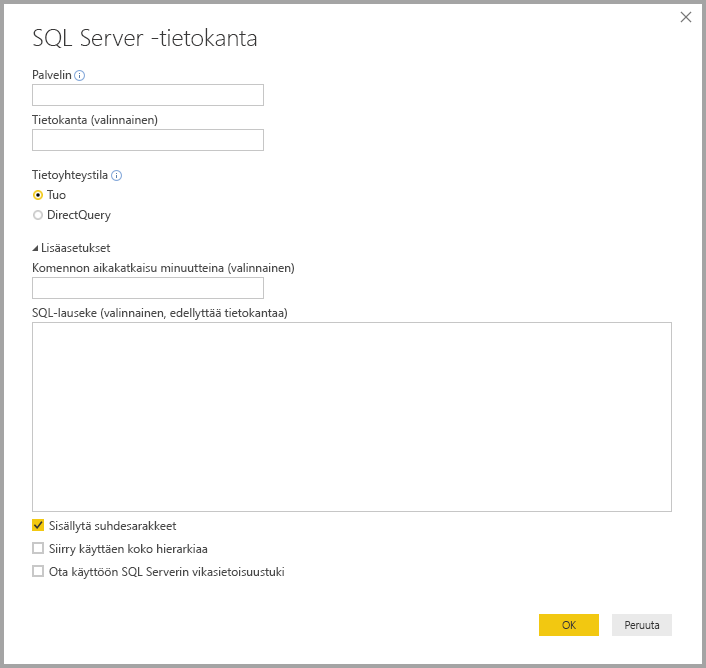
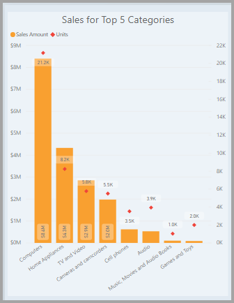

# Mikä on Power BI Desktop?

*Power BI Desktop* on ilmainen sovellus, jonka asennat paikalliseen tietokoneeseen ja jonka avulla voit muodostaa yhteyden tietoihin sekä muuntaa ja visualisoida niitä. Power BI Desktopin avulla voit muodostaa yhteyden moniin eri tietolähteisiin ja yhdistää ne tietomalliin (tätä kutsutaan usein *mallintamiseksi*). Tämän tietomallin avulla voit luoda visualisointeja ja visualisointikokoelmia, joita voit jakaa raportteina muiden organisaatiossasi olevien henkilöiden kanssa. Useimmat liiketoimintatietoprojekteissa työskentelevät käyttäjät luovat raportit Power BI Desktopilla ja jakavat ne sitten muille *Power BI -palvelun* avulla.

Power BI Desktopin yleisimmät käyttötavat ovat seuraavat:

* Tietoihin yhdistäminen
* Tietojen muuntaminen ja siistiminen sekä tietomallin luominen
* Kaavioiden ja muiden visualisointien luominen – tiedot esitetään visuaalisessa muodossa
* Raporttien luominen – visualisoinnit kootaan yhdelle tai useammalle raporttisivulle
* Raporttien jakaminen muiden kanssa Power BI -palvelun avulla

Tällaisista tehtävistä vastaavina henkilöinä pidetään useimmiten *tietoanalyytikkoja* (joita kutsutaan joskus *analyytikoiksi*) ja liiketoimintatiedon asiantuntijoita (joita kutsutaan usein *raportin laatijoiksi*). Kuitenkin monet, jotka eivät pidä itseään analyytikkoina tai raportin laatijoina, laativat vakuuttavia raportteja tai noutavat tietoja eri lähteistä ja luovat työtovereille ja organisaatioille jaettavia tietomalleja Power BI Desktopin avulla.

Power BI Desktopissa on kolme näkymää, jotka voi valita piirtoalustan vasemmasta reunasta. Näkymät, jotka näkyvät niiden näkymisjärjestyksessä, ovat seuraavat:
* **Raportti**: Tässä näkymässä voit luoda raportteja ja visualisointeja, ja siinä myös vietät suurimman osan luontiajastasi.
* **Tiedot**: Tässä näkymässä voit tarkastella raporttiisi liittyvässä tietomallissa käytettäviä taulukoita, mittareita ja muita tietoja sekä muuntaa tiedot parhaalla tavalla raportin mallissa.
* **Malli**: Tässä näkymässä voit tarkastella ja hallita tietomallisi taulukoiden välisiä suhteita.

Seuraavassa kuvassa näkyvät nämä kolme näkymää piirtoalustan vasemmassa reunassa:

 

## Tietoihin yhdistäminen
Kun aloitat Power BI Desktopin käytön, sinun on ensiksi muodostettava yhteys tietoihin. Power BI Desktopilla voit muodostaa yhteyden moniin eri tietolähteisiin. 

Tietoihin yhdistäminen:

1. Valitse **Aloitus**-valintanauhasta **Nouda tiedot** > **Lisää**. 

   Esiin tulee **Nouda tiedot** -ikkuna, joka sisältää kaikki ne vaihtoehdot, joihin Power BI Desktop voi muodostaa yhteyden.

   

2. Kun valitset tietotyypin, sinulta pyydetään tietoja, kuten URL-osoite ja tunnistetiedot. Niitä tarvitaan, jotta Power BI Desktop voi muodostaa yhteyden tietolähteeseen puolestasi.

   

3. Kun olet muodostanut yhteyden vähintään yhteen tietolähteeseen, voit halutessasi muuntaa tiedot omaan käyttötarkoitukseesi sopivaan muotoon.

## Tietojen muuntaminen ja siistiminen sekä mallin luominen

Power BI Desktopissa voit siistiä ja muuntaa tietoja ohjelman sisäisen [Power Query -editorin](https://docs.microsoft.com/power-bi/desktop-query-overview) avulla. Power Query -editorilla voit tehdä tietoihin muutoksia, kuten vaihtaa tietotyyppiä, poistaa sarakkeita tai yhdistää useiden lähteiden tietoja. Periaate on sama kuin kuvanveistossa – voit aloittaa suuresta savikimpaleesta (tai tietomassasta), poistaa joitakin palasia ja lisätä toisia tarpeen mukaan, kunnes tietojen muoto on juuri sellainen kuin haluat. 

Power Query -editorin käynnistäminen:

- Valitse **Muokkaa kyselyjä** > **Muokkaa kyselyjä** **Aloitus-** valintanauhasta.

   Näyttöön tulee **Power Query -editori**-ikkuna.

   

Power Query -editori tallentaa jokaisen tietojen muuntamisen vaiheen (kuten taulukon uudelleennimeämisen, tietotyypin muuttamisen tai sarakkeen poistamisen). Aina, kun tämä kysely muodostaa yhteyden tietolähteeseen, nämä vaiheet suoritetaan, joten tiedot muotoillaan aina määrittämälläsi tavalla.

Seuraavassa kuvassa näkyy muotoillun ja malliksi muunnetun kyselyn **Power Query -editori** -ruutu.

 

Kun tiedot ovat haluamassasi muodossa, voit luoda visualisointeja. 

## Visualisointien luominen 

Kun käytössäsi on tietomalli, voit luoda *visualisointeja* vetämällä *kenttiä* raporttipohjalle. Visualisoinnit ovat mallisi tietojen graafisia esityksiä. Power BI Desktopissa on valittavissa monia erilaisia visualisointityyppejä. Seuraavassa visualisoinnissa näkyy yksinkertainen pylväskaavio. 

Visualisoinnin luominen tai muuttaminen: 

- Valitse **Visualisoinnit**-ruudusta visualisointikuvake. 

   

   Jos jokin raporttipohjalla oleva visualisointi on jo valittuna, kyseinen visualisointi muuttuu valintasi mukaan. 

   Jos visualisointeja ei ole valittu pohjalla, ohjelma luo uuden visualisoinnin valintasi perusteella.

## Raporttien luominen

Useimmiten kannattaa luoda kokoelma visualisointeja kuvaamaan eri näkökulmista niitä tietoja, joita mallin luomiseen Power BI Desktopissa on käytetty. Yhdessä Power BI Desktop -tiedostossa olevien visualisointien kokoelmaa kutsutaan *raportiksi*. Raportissa voi olla yksi tai useampi sivu, aivan kuten Excel-tiedostossa voi olla yksi tai useampi laskentataulukko. 

Power BI Desktopilla voit luoda monitasoisia ja visuaalisesti monipuolisia raportteja. Voit yhdistää tietoja useista lähteistä yhdeksi kattavaksi raportiksi, jonka voit jakaa muiden organisaatiosi jäsenten kanssa.

Seuraavassa kuvassa näet Power BI Desktop -raportin ensimmäisen sivun, jonka nimi on **Yleiskatsaus** (välilehti näkyy kuvan alaosassa). 

## Jaa raportteja

Kun raportti on valmis jaettavaksi, voit *julkaista* sen Power BI -palveluun ja antaa sen kaikkien niiden organisaatiosi jäsenten käyttöön, joilla on Power BI -käyttöoikeus. 

Power BI Desktop -raportin julkaiseminen: 

1. Valitse **Aloitus**-valintanauhasta **Julkaise**.

   

   Power BI Desktop yhdistää sinut Power BI -palveluun Power BI tilisi avulla. 

2. Power BI pyytää valitsemaan, missä Power BI -palvelussa haluat jakaa raportin, kuten työtilan, ryhmän työtilan tai jonkin muun Power BI -palvelu sijainnin. 

   Sinulla on oltava Power BI -käyttöoikeus, jotta voit jakaa raportteja Power BI -palveluun.

## Seuraavat vaiheet

Jotta voit aloittaa Power BI Desktopin käytön, sinun on ensin ladattava ja asennettava sovellus. Saat Power BI Desktopin käyttöösi kahdella eri tavalla:

* [Lataa Power BI Desktop Windows-kaupasta](https://aka.ms/pbidesktopstore)
* [Lataa Power BI Desktop verkosta](https://docs.microsoft.com/power-bi/desktop-get-the-desktop#download-power-bi-desktop-directly)

