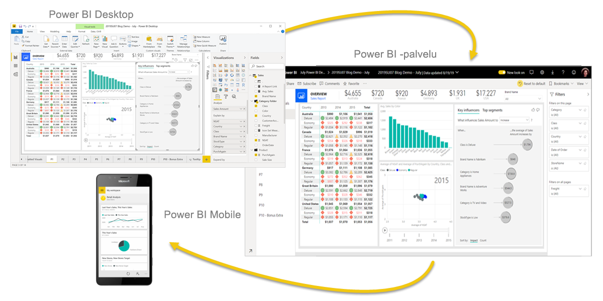
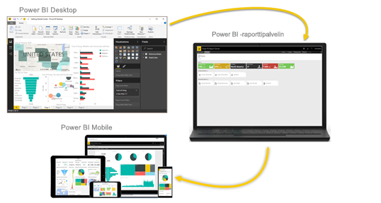

# Mikä Power BI on?
**Power BI** on kokoelma ohjelmistopalveluja, sovelluksia ja yhdistimiä, jotka yhdessä muuntavat toisiinsa liittymättömistä lähteistä peräisin olevan tiedon johdonmukaisiksi, visuaalisesti vaikuttaviksi ja vuorovaikutteisiksi näkemyksiksi. Tiedot voivat olla Excel-laskentataulukossa tai joukossa pilvipohjaisia ja paikallisia hybriditietovarastoja. Power BI:n avulla voit helposti muodostaa yhteyden tietolähteisiin, visualisoida ja löytää tärkeitä asioita sekä jakaa niitä kenen kanssa haluat.

## Power BI:n osat
Power BI koostuu seuraavista: 
- Windowsin työpöytäsovellus nimeltä **Power BI Desktop**
- Verkossa oleva SaaS (*Software as a Service*) -palvelu nimeltä **Power BI -palvelu** 
- Power BI **-mobiilisovellukset** Windows-, iOS- ja Android-laitteille.

Jokainen osista – &mdash;Power BI Desktop, Power BI -palvelu ja mobiilisovellukset&mdash; – on suunniteltu siten, että merkityksellisten liiketoimintatietojen tuottaminen, jakaminen ja hyödyntäminen on mahdollisimman tehokasta sinun ja roolisi kannalta.

Neljännen elementin, **Power BI -raporttipalvelimen**, avulla voit julkaista Power BI -raportteja paikalliseen raporttipalvelimeen, kun olet luonut ne Power BI Desktopissa. Lue lisää [Power BI -raporttipalvelimesta](#on-premises-reporting-with-power-bi-report-server).

## Power BI:n tuki käyttäjärooleille
Power BI:n käyttämisen tapa voi riippua roolistasi projektissa tai tiimissä. Muissa rooleissa toimivat voivat käyttää Power BI:tä toisin.

Saatat itse käyttää **Power BI -palvelua** ensisijaisesti raporttien ja koontinäyttöjen tarkasteluun. Runsaasti laskentatehoa vaativia liiketoimintaraportteja tuottava kollegasi saattaa puolestaan luottaa **Power BI Desktopiin** raporttien luomisessa ja julkaista Desktop-raportit sitten Power BI -palveluun tarkasteltaviksesi. Toinen kollega myynnin puolelta voi käyttää pääasiassa **Power BI -puhelinsovellusta** myyntitavoitteidensa seurantaan ja uusien liiditietojen tutkimiseen.

Jos olet sovelluskehittäjä, saatat käyttää Power BI -ohjelmointirajapintoja tietojen viemiseen tietojoukkoihin tai upottaa koontinäyttöjä tai raportteja räätälöityihin sovelluksiisi. Onko sinulla idea uudesta visualisoinnista? Rakenna se itse ja jaa se muiden kanssa.  

Saatat käyttää Power BI:n eri osia aina sen mukaan, mitä on tarkoitus saavuttaa tai mikä roolisi on tietyssä projektissa.

Power BI:n käyttötapasi voi riippua siitä, mikä Power BI:n toiminto tai palvelu on paras työkalu tilanteeseesi. Voit esimerkiksi käyttää Power BI Desktopia raporttien luomiseen tiimillesi asiakkaiden osallistamistilastoista ja tarkastella varastotilannetta tai valmistumisprosessin etenemistä Power BI -palvelun reaaliaikaisessa koontinäytössä. Kukin Power BI:n osa on käytettävissäsi, mikä tekee siitä niin joustavan ja houkuttavan.

Tutustu rooliasi vastaaviin dokumentteihin:
- Power BI Desktop [*suunnittelijoille*](desktop-what-is-desktop.md)
- Power BI [*kuluttajille*](../consumer/end-user-consumer.md)
- Power BI [*järjestelmänvalvojille*](../admin/service-admin-administering-power-bi-in-your-organization.md)
- Power BI *kehittäjille*
    * [Upotettu analysointi Power BI:n avulla](../developer/embedded/embedding.md)
    * [Mikä on Power BI Embedded Azuressa?](../developer/embedded/azure-pbie-what-is-power-bi-embedded.md)
    * [Visualisoinnit Power BI:ssä](../developer/visuals/power-bi-custom-visuals.md)
    * [Mitä kehittäjät voivat tehdä Power BI -ohjelmointirajapinnalla?](../developer/automation/overview-of-power-bi-rest-api.md)

## Työnkulut Power BI:ssä
Tyypillinen Power BI -työnkulku alkaa yhteyden ottamisesta tietolähteisiin ja raportin luomisesta Power BI Desktopissa. Sen jälkeen julkaiset kyseisen raportin Power BI Desktopista Power BI -palveluun ja jaat sen, jotta Power BI -palvelua ja mobiililaitteita käyttävät loppukäyttäjät voivat tarkastella ja käsitellä raporttia.
Tämä työnkulku on yleinen ja näyttää, miten kolme keskeistä Power BI -osaa täydentävät toisiaan.

Tutustu yksityiskohtaiseen [Power BI Desktopin ja Power BI -palvelun vertailuun](../fundamentals/service-service-vs-desktop.md).

## Paikallinen raportointi Power BI -raporttipalvelimella

Mutta entä jos et ole valmis siirtymään pilvipalveluun, ja haluat säilyttää raporttisi yrityksen palomuurin takana?  Lue lisää.

Voit luoda, ottaa käyttöön ja hallita Power BI ‑mobiiliraportteja ja sivutettuja raportteja paikallisesti Power BI -raporttipalvelimen tarjoamien erilaisten käyttövalmiiden työkalujen ja palveluiden avulla.

Power BI -raporttipalvelin on ratkaisu, jonka voit ottaa käyttöön oman palomuurisi sisällä ja toimittaa sitten raporttisi halutuille käyttäjille eri tavoilla, halusivat he sitten katsella niitä verkkoselaimella, mobiililaitteella tai sähköpostiviestinä. Ja koska Power BI -raporttipalvelin on yhteensopiva Power BI:n kanssa pilvipalvelussa, voit siirtyä pilvipalveluun, kun olet valmis. 

Lue lisää [Power BI -raporttipalvelimesta](../report-server/get-started.md).

## Seuraavat vaiheet
- [Pikaopas: Power BI -palvelussa liikkuminen](../service-the-new-power-bi-experience.md)   
- [Opetusohjelma: Power BI -palvelun käytön aloittaminen](service-get-started.md)
- [Pikaopas: Tietoihin yhdistäminen Power BI Desktopissa](../connect-data/desktop-quickstart-connect-to-data.md)
