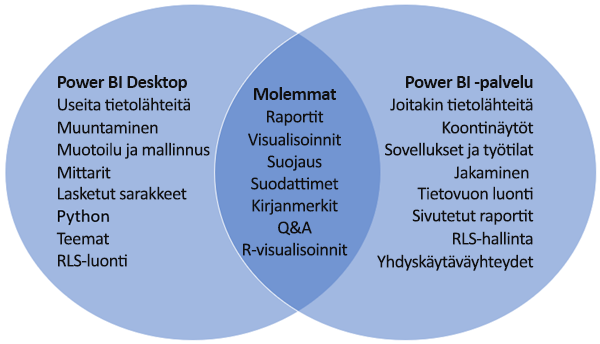

# Power BI Desktopin ja Power BI -palvelun vertailu

Power BI Desktopin ja Power BI -palvelun Venn-vertailukaaviossa keskellä oleva alue näyttää, miten nämä kaksi palvelua limittyvät. Voit tehdä joitakin tehtäviä joko Power BI Desktopissa tai palvelussa. Venn-kaavion kumpikin puoli näyttää ominaisuudet, jotka ovat ainutlaatuisia sovellukselle ja palvelulle.  

**Power BI Desktop** on kattava tietoanalyysien ja raporttien luontityökalu, jonka voit asentaa ilmaiseksi paikalliseen tietokoneeseesi. Asennuksessa on mukana Kyselyeditori, jonka avulla voit muodostaa yhteyden moniin eri tietolähteisiin ja yhdistää ne (kutsutaan usein mallintamiseksi) tietomalliin. Sen jälkeen voit suunnitella kyseiseen tietomalliin perustuvan raportin. [Power BI Desktopin aloitusopas](../desktop-getting-started.md) ohjaa sinut prosessin läpi.

**Power BI -palvelu** on pilvipohjainen palvelu. Se tukee raporttien kevyttä muokkaamista ja yhteistyötä tiimeissä ja organisaatioissa. Voit muodostaa yhteyden tietolähteisiin myös Power BI -palvelussa, mutta mallintamista on rajoitettu. 

Useimmat raportin suunnittelijat, jotka työskentelevät liiketoimintatietoprojekteissa, käyttävät **Power BI Desktopia** raporttien luomiseen ja sitten **Power BI -palvelua** raporttien jakamiseen muiden kanssa.

## Raportin muokkaaminen

Voit sekä sovelluksessa että palvelussa luoda ja muokata *raportteja*. Raportissa voi olla yksi sivu tai useita sivuja, joissa on visualisointeja ja visualisointikokoelmia. Voit lisätä kirjanmerkkejä, painikkeita, suodattimia ja porautumista siirtymisen helpottamiseksi raporteissa.

Power BI Desktopin ja palvelun raporttieditorit ovat samankaltaisia. Ne koostuvat kolmesta osasta:  

1. Yläosan siirtymisruudut ovat erilaiset Power BI Desktopissa ja palvelussa    
2. Raportin piirtoalusta     
3. **Kentät**-, **Visualisoinnit**- ja **Suodattimet**-ruudut

Tässä videossa näytetään Power BI Desktopin raporttieditori. 

<iframe width="560" height="315" src="https://www.youtube.com/embed/IkJda4O7oGs" frameborder="0" allowfullscreen></iframe>

## Power BI -palvelun käyttäminen

### Yhteistyö

Kun olet luonut raportit, voit tallentaa ne *työtilaan***Power BI -palvelussa**, jossa sinä ja työtoverisi teette yhteistyötä. Voit luoda *koontinäyttöjä* näiden raporttien päälle. Voit sitten jakaa kyseiset koontinäytöt ja raportit raporttien käyttäjille organisaation sisä- ja ulkopuolella. Raportin käyttäjät voivat tarkastella niitä Power BI -palvelun *lukunäkymässä*, ei muokkausnäkymässä. He eivät voi käyttää kaikkia ominaisuuksia, jotka ovat saatavilla raportin tekijöille.  Voit myös jakaa tietojoukkosi ja antaa muiden luoda omia raportteja niistä. Lue lisää [yhteistyöstä Power BI -palvelussa](../service-new-workspaces.md).

### Omatoiminen tietojen valmisteleminen tietovoiden avulla

Tietovoiden avulla organisaatiot voivat yhdistää eri lähteistä olevia tietoja ja valmistella ne mallinnusta varten. Analyytikot voivat luoda helposti tietovoita tutuilla, omatoimisilla työkaluilla. Analyytikot voivat tietovoita käyttämällä käyttää, muuntaa, yhdistää ja täydentää massadataa määrittämällä tietolähdeyhteyksiä, keräämis-, muuntamis- ja lataamislogiikka, päivitysaikatauluja ja paljon muuta. Lue lisää [omatoimisesta tietojen valmistelemisesta tietovoiden avulla](../service-dataflows-overview.md).

## Seuraavat vaiheet

[Mikä on Power BI Desktop?](../desktop-what-is-desktop.md)

[Raportin luominen](../service-report-create-new.md) Power BI -palvelussa

[Peruskäsitteet raportin suunnittelijoille](../service-basic-concepts.md)

Onko sinulla kysyttävää? [Kokeile Power BI -yhteisöä](https://community.powerbi.com/)

