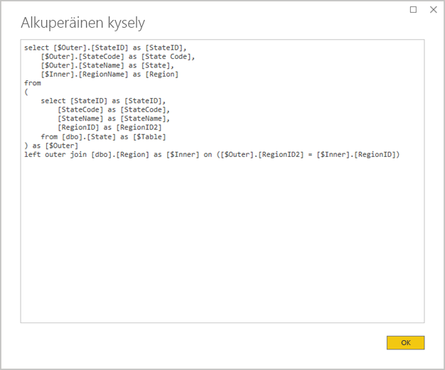

# <a name="directquery-model-guidance-in-power-bi-desktop"></a>Power BI Desktopin DirectQuery-mallin ohjeet

Tässä artikkelissa käsitellään tietojen mallintajia, jotka kehittävät Power BI:n DirectQuery-malleja, jotka on kehitetty joko Power BI Desktopin tai Power BI -palvelun avulla. Tässä kuvataan DirectQueryn käyttötapauksia, rajoituksia ja ohjeita. Ohjeiden tarkoituksena on erityisesti auttaa selvittämään, onko DirectQuery sopiva tila mallillesi, ja parantaa raporttiesi suoritustehoa DirectQuery-mallien perusteella. Tämä artikkeli koskee Power BI -palvelussa tai Power BI -raporttipalvelimessa isännöityjä DirectQuery-malleja.

Tämän artikkelin tarkoituksena ei ole käydä DirectQuery-mallia läpi kokonaisvaltaisesti. Saat lisätietoja [DirectQuery-mallit Power BI Desktopissa](../desktop-directquery-about.md) -artikkelista. Jos haluat syvellisempiä tietoja, lue suoraan tekninen raportti [DirectQuery SQL Server 2016 Analysis Servicesissä](https://download.microsoft.com/download/F/6/F/F6FBC1FC-F956-49A1-80CD-2941C3B6E417/DirectQuery%20in%20Analysis%20Services%20-%20Whitepaper.pdf). Kannattaa muistaa, että tekninen raportti kuvaa DirectQueryn käyttämistä SQL Server Analysis Servicesissä. Suurta osaa sisällöstä voidaan kuitenkin soveltaa Power BI:n DirectQuery -malleihin.

Tämä artikkeli ei suoranaisesti käsittele yhdistelmämalleja. Yhdistelmämalli koostuu vähintään yhdestä DirectQuery-lähteestä. Tässä artikkelissa kuvatut ohjeet ovat koskevat kuitenkin  – ainakin osittain – yhdistelmämallin suunnittelua. Tässä artikkelissa ei kuitenkaan käsitellä tuontitaulukoiden yhdistämisen vaikutuksia DirectQuery-taulukoihin. Jos haluat lisätietoja, katso [Yhdistelmämallien käyttäminen Power BI Desktopissa](../desktop-composite-models.md).

On tärkeää ymmärtää, että DirectQuery-mallit asettavat erilaisen kuormituksen Power BI -ympäristölle (Power BI-palvelulle tai Power BI-raporttipalvelimelle) ja myös pohjana oleville tietolähteille. Jos päätät, että DirectQuery on sopiva suunnittelumenetelmä, suosittelemme, että otat oikeat henkilöt mukaan projektiin. Huomaamme usein, että DirectQuery-mallin onnistunut käyttöönotto on seurausta siitä, että IT-ammattilaisten ryhmä työskentelee tiiviissä yhteistyössä. Ryhmä koostuu yleensä mallien kehittäjistä ja lähdetietokantojen järjestelmänvalvojista. Siihen voi kuulua myös tietoarkkitehtejä ja tietovarastojen sekä keräämisen, muuntamisen ja lataamisen kehittäjiä. Usein optimointeja on sovellettava suoraan tietolähteeseen hyvien suorituskykytulosten saavuttamiseksi.

## <a name="design-in-power-bi-desktop"></a>Suunnitelu Power BI Desktopissa

Sekä Azure SQL Data Warehouse- että Azure HDInsight Spark -tietolähteet voidaan yhdistää suoraan ilman tarvetta käyttää Power BI Desktopia. Tämä tehdään Power BI -palvelussa ”hankkimalla tiedot” ja valitsemalla Tietokannat-ruutu. Jos haluat lisätietoja, lue artikkeli [Azure SQL Data Warehouse ja DirectQuery](../service-azure-sql-data-warehouse-with-direct-connect.md).

Vaikka suora yhteys on kätevä, emme suosittele tämän lähestymistavan käyttämistä. Pääsyy on se, että mallirakennetta ei voi päivittää pohjana olevan tietolähderakenteen muuttuessa.

Suosittelemme, että luot ja hallitset kaikkia DirectQuery-mallejasi Power BI Desktopin avulla. Tämän lähestymistavan avulla voit määrittää tarvitsemasi mallin, mukaan lukien tuettujen ominaisuuksien, kuten hierarkioiden, laskettujen sarakkeiden ja mittareiden, käytön. Sen avulla voit myös muuttaa mallin rakennetta, jos pohjana oleva tietolähderakenne muuttuu.

## <a name="optimize-data-source-performance"></a>Tietolähteen suorituskyvyn optimoiminen

Relaatiotietokantalähde voidaan optimoida useilla eri tavoilla, kuten seuraavassa luettelossa on kuvattu.

> [!NOTE]
> Ymmärrämme, että kaikilla mallintajilla ei ole käyttöoikeuksia tai taitoa relaatiotietokannan optimoimiseen. Jotkin optimoinnit voidaan tehdä myös mallin rakenteessa ilman, että lähdetietokantaa muokataan, vaikka se onkin ensisijainen kerros DirectQuery-mallin tietojen valmistelemiseen. Usein parhaat optimointitulokset saavutetaan kuitenkin käyttämällä optimointeja lähdetietokannassa.

- **Varmista, että tietojen eheys on valmis:** On erityisen tärkeää, että dimensiotyypin taulukot sisältävät yksilöiviä arvoja sisältävän sarakkeen (dimensioavain), joka yhdistetään faktatyypin taulukkoon tai taulukoihin. On myös tärkeää, että faktatyypin dimensiosarakkeet sisältävät kelvollisia dimensioavainarvoja. Niiden avulla voit määrittää tehokkaampia mallisuhteita, joissa odotetaan vastaavia arvoja suhteen molemmin puolin. Kun lähdetiedot eivät ole eheät, on suositeltavaa, että tiedot korjataan tehokkaasti lisäämällä ”tuntematon” dimensiotietue. Voit esimerkiksi lisätä **Tuote**-taulukkoon rivin, joka edustaa tuntematonta tuotetta, ja määritä sille sitten alueen ulkopuolella oleva avaimen, kuten -1. Jos **Myynti**-taulukon riveillä on puuttuva tuoteavainarvo, korvaa se arvolla -1. Näin varmistat, että jokaisella **Myynti**-tuoteavainarvolla on vastaava rivi **Tuote**-taulukossa.
- **Lisää indeksejä:** Määritä taulukoille tai näkymille sopivia indeksejä, jotka tukevat tietojen tehokasta noutamista odotetun raportin visualisoinnin suodatusta ja ryhmittelyä varten. Lue SQL Serveriä, Azuren SQL-tietokantaa tai Azure SQL Data Warehousea koskevia hyödyllisiä indeksisuunnittelun ohjeita artikkelista [SQL Serverin indeksiarkkitehtuuri-ja suunnitteluopas](/sql/relational-databases/sql-server-index-design-guide?view=sql-server-2017). Jos käytössä ovat SQL Serverin tai Azuren SQL-tietokannan muuttuvat lähteet, tutustu ohjeartikkeliin [Reaaliaikainen toiminnallinen analytiikka sarakesäilöä käyttämällä](/sql/relational-databases/indexes/get-started-with-columnstore-for-real-time-operational-analytics?view=sql-server-2017).
- **Suunnittele jaettuja taulukoita:** Arkkitehtuurinaan massiivista rinnakkaiskäsittelyä (MPP) hyödyntävissä Azure SQL Data Warehouse -lähteissä kannattaa harkita suurten faktatyypin taulukoiden määrittämistä hajautusarvojaelluiksi ja dimensiotyypin taulukoiden määrittämistä replikoimaan kaikkiin laskentasolmuihin. Lisätietoja on artikkelissa [Ohjeita jaettujen taulukoiden suunnitteluun Azure SQL Data Warehousessa](/azure/sql-data-warehouse/sql-data-warehouse-tables-distribute#what-is-a-distributed-table).
- **Varmista, että tarvittavat tietojen muunnokset muodostuvat:** SQL Serverin relaatiotietokannan lähteissä (ja muissa relaatiotietokantalähteissä) taulukoihin voidaan lisätä laskettuja sarakkeita. Nämä sarakkeet perustuvat lausekkeeseen, kuten **Määrä** kertaa **Yksikköhinta**. Lasketut sarakkeet voivat olla pysyviä (muodostettuja) ja, kuten tavalliset sarakkeet, ne voidaan joskus indeksoida. Jos haluat lisätietoja, lue artikkeli [Laskettujen sarakkeiden indeksit](/sql/relational-databases/indexes/indexes-on-computed-columns?view=sql-server-2017).

    Harkitse myös indeksoituja näkymiä, jotka voivat koostaa faktataulukon tiedot ennakkoon yksityiskohtaisesti. Jos esimerkiksi **Myynti**-taulukko tallentaa tiedot tilausrivin tasolle, voit luoda näkymän, joka tiivistää nämä tiedot. Näkymä voi perustua SELECT-lausekkeeseen, joka ryhmittelee **Myynti**-taulukon tiedot päivämäärän (kuukauden tasolla), asiakkaan ja tuotteen mukaan ja tekee yhteenvedon mittariarvoista, kuten myynti, määrä ja niin edelleen. Näkymä voidaan tämän jälkeen indeksoida. Lisätietoja SQL Serverin tai Azuren SQL-tietokannan lähteistä saat artikkelista [Indeksoitujen näkymien luominen](/sql/relational-databases/views/create-indexed-views?view=sql-server-2017).
- **Muodosta päivämäärätaulukko:** Yleinen mallinnusvaatimus liittyy päivämäärätaulukon lisäämiseen aikapohjaisen suodatuksen tueksi. Jos haluat tukea organisaatiosi tunnettuja aikapohjaisia suodattimia, luo taulukko lähdetietokantaan ja varmista, että siihen on ladattu päivämääräalue, joka kattaa faktataulukon päivämäärät. Varmista myös, että se sisältää hyödyllisiä ajanjaksosarakkeita, kuten vuosi, vuosineljännes, kuukausi, viikko jne.

## <a name="optimize-model-design"></a>Mallin rakenteen optimoiminen

DirectQuery-malli voidaan optimoida monella tavalla, kuten seuraavassa luettelossa on kuvattu.

- **Vältä monimutkaisia Power Query -kyselyitä:** Tehokas mallin rakenne voidaan saavuttaa poistamalla tarve muunnosten käyttöönottoon Power Query -kyselyillä. Tämä tarkoittaa sitä, että jokainen kysely yhdistää yksittäiseen relaatiotietokannan lähdetaulukkoon tai näkymään. Voit esikatsella käytössä olevan Power Query -vaiheen todellista SQL-kyselylauseketta valitsemalla vaihtoehdon **Näytä natiivi kysely**.

    
    
    

- **Tarkista laskettujen sarakkeiden käyttö ja tietotyyppimuutokset:** DirectQuery-mallit tukevat laskutoimitusten ja PowerQuery-vaiheiden lisäämistä tietotyyppien muuntamiseksi. Suorituskyky usein kuitenkin paranee, kun muunnoksen tulokset muodostuvat relaatiotietokantalähteeseen mahdollisuuksien mukaan.
- **Älä käytä Power Queryn suhteellista päivämääräsuodatusta:** Power Query -kyselyssä voi määrittää suhteellisen päivämääräsuodatuksen. Voit esimerkiksi hakea myyntitilaukset, jotka luotiin edellisenä vuonna (suhteessa kuluvan päivän päivämäärään). Tämäntyyppinen suodatin muodostaa tehottoman natiivikyselyn seuraavasti:

    ```SQL
    …
    from [dbo].[Sales] as [_]
    where [_].[OrderDate] >= convert(datetime2, '2018-01-01 00:00:00') and [_].[OrderDate] < convert(datetime2, '2019-01-01 00:00:00'))  
    ```
    
    Parempi lähestymistapa suunnitteluun on sisällyttää suhteelliset aikasarakkeet päivämäärätaulukkoon. Nämä sarakkeet tallentavat siirtymäarvot suhteessa nykyiseen päivämäärään. Esimerkiksi **RelativeYear**-sarakkeessa arvo nolla edustaa kuluvaa vuotta, -1 edustaa edellistä vuotta jne. Mieluiten **RelativeYear**-sarake muodostuu päivämäärätaulukkoon. Vaikka tapa ei olekaan yhtä tehokas, lisäys voidaan tehdä myös mallin laskettuna sarakkeena, joka perustuu [TODAY-](/dax/today-function-dax) ja [DATE](/dax/date-function-dax)-DAX-funktioita käyttävään lausekkeeseen.

- **Pidä mittarit yksinkertaisina:** Suosittelemme, että ainakin aluksi käytät mittareina vain yksinkertaisia koosteita. Koostefunktioihin kuuluvat SUM, COUNT, MIN, MAX ja AVERAGE. Jos mittarit ovat riittävän herkkiä, voit kokeilla monimutkaisempia mittareita samalla kuitenkin kiinnittäen huomiota kunkin suorituskykyyn. Vaikka [CALCULATE](/dax/calculate-function-dax)-DAX-funktiolla voidaan tuottaa kehittyneitä mittarilausekkeita, jotka muokkaavat suodatinkontekstia, ne voivat luoda raskaita natiiveja kyselyitä, joiden suorituskyky on huono.
- **Vältä suhteita lasketuissa sarakkeissa:** Mallin suhteet voivat muodostaa suhteen ainoastaan yhden taulukon yksittäisestä sarakkeesta toisen taulukon yksittäiseen sarakkeeseen. Toisinaan taulukoita on kuitenkin tarpeen liittää useisiin sarakkeisiin. Esimerkiksi **Myynti**- ja **Maantiede**-taulukot liittyvät kahteen sarakkeeseen: **Maa** ja **Kaupunki**. Jos haluat luoda suhteen taulukoiden välille, tarvitaan yksittäinen sarake ja **Maantiede**-taulukossa sarakkeen on sisällettävä yksilöllisiä arvoja. Maan ja kaupungin yhdistäminen yhdysmerkki-erottimella voi tuottaa tämän tuloksen.

    Yhdistetty sarake voidaan luoda joko Power Queryn mukautetulla sarakkeella tai mallissa laskettuna sarakkeena. Tätä tulisi kuitenkin välttää, koska laskentalauseke upotetaan lähdekyselyihin. Tämä on paitsi tehotonta, mutta yleensä myös estää indeksien käyttämisen. Lisää sen sijaan muodostettuja sarakkeita relaatiotietokantalähteeseen ja harkitse niiden indeksoimista. Voit myös halutessasi lisätä korvaavia avainsarakkeita dimensiotyypin taulukoihin, mikä on yleinen käytäntö relaatiotietovaraston suunnittelussa.
    
    Tähän ohjeistukseen on yksi poikkeus, ja se koskee [COMBINEVALUES](/dax/combinevalues-function-dax)-DAX-funktion käyttämistä. Tämän funktion tarkoituksena on tukea monisarakkeisia mallien yhteyksiä. Sen sijaan, että se loisi suhteen käyttämän lausekkeen, se luo monisarakkeisen SQL-liittymispredikaatin.
- **Vältä suhteita ”Unique Identifier” -sarakkeissa:** Power BI ei suoraan tue yksilöivän tunnisteen tietotyyppiä (GUID). Kun määrität suhdetta tämän tyypin sarakkeiden välille, Power BI muodostaa lähdekyselyn, jossa on liitos, johon liittyy tyyppimuunnos. Tämä kyselyajan tietojen muuntaminen johtaa usein huonoon suorituskykyyn. Ellei tätä tapausta optimoida, ainoa tapa tämän kiertämiseen on luoda sarakkeet eri tietotyypillä taustatietokannassa.
- **Piilota suhteiden yhden puolen sarake:** Suhteen yhden puolen sarake tulisi olla piilotettuna. (Se on yleensä dimensiotyypin taulukoiden perusavainsarake.) Kun se on piilotettu, se ei ole käytettävissä **Kentät**-ruudussa, joten sitä ei voi käyttää visualisoinnin määrittämiseen. Monen puolen sarake voi pysyä näkyvissä, jos raporttien ryhmitteleminen tai suodattaminen on hyödyllistä sarakkeiden arvojen mukaan. Harkitse esimerkiksi mallia, jossa **Myynti**- ja **Tuote**-taulukoiden välillä on suhde. Suhdesarakkeet sisältävät tuotteen SKU-arvot (varastointiyksikköarvot). Jos tuotteen SKU on lisättävä visualisointeihin, sen tulee näkyä vain **Myynti**-taulukossa. Kun tämän sarakkeen avulla suodatetaan tai ryhmitetään visualisointia, Power BI luo kyselyn, jonka ei tarvitse liittyä **Myynti**- ja **Tuote**-taulukoihin.
- **Pakota eheys määrittämällä suhteita:** DirectQuery-suhteiden **Oleta viite-eheys**-ominaisuus määrittää, muodostaako Power BI lähdekyselyt käyttämällä sisäliitosta ulkoliitoksen sijaan. Yleensä se parantaa kyselyn tehokkuutta, mutta tämä riippuu kuitenkin relaatiotietokantalähteen ominaisuuksista. Lisätietoja on artikkelissa [Oleta viite-eheys -asetus Power BI Desktopissa](../desktop-assume-referential-integrity.md).
- **Vältä kaksisuuntaisen suhteen suodatuksen käyttöä:** Kaksisuuntaisen suhteiden suodatuksen käyttö voi johtaa kyselylausekkeisiin, jotka eivät toimi kunnolla. Käytä tätä suhdeominaisuutta vain tarvittaessa. Yleensä tilanne on tämä silloin, kun monta-moneen-suhde otetaan käyttöön välitaulukon kautta. Lisätietoja on kohdassa [Moni-moneen-kardinaliteetin sisältävien suhteiden käyttäminen Power BI Desktopissa](../desktop-many-to-many-relationships.md).
- **Rajaa rinnakkaisia kyselyitä:** Voit valita, enimmäismäärän yhteyksille, jotka DirectQuery avaa kullekin pohjana olevalle tietolähteelle. Se määrittää, montako kyselyä tietolähteeseen lähetetään samanaikaisesti.

    
    
    Asetus on käytössä vain, kun mallissa on vähintään yksi DirectQuery-lähde. Arvoa sovelletaan kaikkiin DirectQuery-lähteisiin ja malliin lisättyihin kaikkiin uusiin DirectQuery-lähteisiin.

    **Yhteyksien enimmäismäärä tietolähdettä kohden** -arvon lisääminen varmistaa sen, että taustalla olevaan tietolähteeseen voidaan lähettää enemmän kyselyjä (korkeintaan määritetty enimmäismäärä). Tästä on hyötyä, kun yhdellä sivulla on lukuisia visualisointeja tai useat käyttäjät käsittelevät raporttia samanaikaisesti. Kun yhteyksien enimmäismäärä on saavutettu, muut kyselyt  laitetaan jonoon, kunnes yhteys on saatavilla. Tämän rajan nostaminen lisää taustalla olevan tietolähteen kuormitusta, joten asetus ei välttämättä paranna yleistä suorituskykyä.
    
    Kun malli julkaistaan Power BI:hin, pohjana olevaan tietolähteeseen lähetettyjen samanaikaisten kyselyiden enimmäismäärä riippuu myös ympäristöstä. Eri ympäristöt (kuten Power BI, Power BI Premium tai Power BI -raporttipalvelin) voivat kukin määrätä erilaisia siirtorajoitteita. Saat lisätietoja Power BI Premium -kapasiteetin resurssien rajoituksista lukemalla artikkelin [Power BI Premium -kapasiteettien käyttöönotto ja hallinta](https://docs.microsoft.com/power-bi/whitepaper-powerbi-premium-deployment).

## <a name="optimize-report-designs"></a>Raportin mallien optimoiminen

DirectQuery-tietojoukolle perustuvat raportit voidaan optimoida monella tavalla, kuten seuraavassa luettelossa on kuvattu.

- **Ota käyttöön kyselyn pienentäminen:** Power BI Desktopin _Asetukset ja vaihtoehdot_ sisältävät Kyselyn pienentäminen -sivun, jolla on kolme hyödyllistä vaihtoehtoa. Oletusarvoisen ristiinkorostamisen ja ristiinsuodatuksen voi poistaa käytöstä, mutta tämä voidaan ohittaa muokkaamalla vuorovaikutuksia. Voit myös näyttää Käytä-painikkeen osittajien ja suodattimien kohdalla. Osittajan tai suodattimen asetuksia ei käytetä, ennen kuin raportin käyttäjä napsauttaa painiketta. Jos otat nämä asetukset käyttöön, suosittelemme, että teet sen luodessasi raporttia.

    
    
- **Ota suodattimet käyttöön ensin:** Kun suunnittelet raportteja ensimmäistä kertaa, suosittelemme, että otat käyttöön soveltuvat suodattimet – raportti-, sivu- tai visualisointitasolla – ennen kuin yhdistät kenttiä visuaalisiin kenttiin. Sen sijaan, että vetäisit **Maa** ja **Myynti**-mittarit ja suodattaisit sitten tietyn vuoden mukaan, ota suodatin ensin käyttöön **Vuosi**-kentässä. Tämä johtuu siitä, että visualisoinnin luomisen jokainen vaihe lähettää kyselyn. Vaikka voitkin tehdä toisen muutoksen, ennen kuin ensimmäinen kysely on suoritettu, tämä aiheuttaa silti tarpeetonta kuormitusta pohjana olevalle tietolähteelle. Kun otat suodattimet käyttöön aikaisessa vaiheessa, välivaiheen kyselyistä tulee kevyempiä ja nopeampia. Jos suodattimia ei oteta käyttöön ajoissa, tämä voi johtaa miljoonan rivin rajan ylitykseen edellä kuvatulla tavalla.
- **Rajoita sivun visualisointien määrää:** Kun raporttisivu avataan (ja kun sivusuodattimia otetaan käyttöön) kaikki sivun visualisoinnit päivitetään. Power BI -ympäristön vuoksi ja **Yhteyksien enimmäismäärä tietolähdettä kohden** mallin asetuksen mukaisesti rinnakkain lähetettäviä kyselyitä voidaan kuitenkin lähettää rajoitettu määrä edellä kuvatulla tavalla. Sivun visualisointien määrän kasvaessa on siis suurempi mahdollisuus, että ne päivitetään sarjamaisesti. Tämä pidentää koko sivun päivittämiseen kuluvaa aikaa, ja se lisää myös todennäköisyyttä, että visualisoinnit saattavat näyttää ristiriitaisia tuloksia (muuttuvien tietolähteiden osalta). Tästä syystä suosittelemme, että rajoitat sivujen visualisointien määrää. Voit käyttää sen sijaan useita yksinkertaisempia sivuja. Useiden korttien visualisointien korvaaminen yksittäisellä monirivisen kortin visualisoinnilla voi tuottaa samanlaisen sivun asettelun.
- **Visualisointien välisen vuorovaikutuksen käytöstä poistaminen:** Ristiinkorostamisen ja ristiinsuodatuksen vuorovaikutukset edellyttävät, että kyselyt lähetetään pohjana olevaan lähteeseen. Elleivät nämä vuorovaikutukset ole välttämättömiä, on suositeltavaa, että ne poistetaan käytöstä, jos käyttäjien valintoihin vastaamiseen kuluva aika olisi kohtuuttoman pitkä. Tämän vuorovaikutuksen voi poistaa käytöstä joko koko raportissa (kuten yllä kuvattiin Kyselyn pienentäminen -asetusten kohdassa) tai tapauskohtaisesti. Lisätietoja on kohdassa [Visualisointien ristiinsuodatus keskenään Power BI -raportissa](../consumer/end-user-interactions.md).

Ota yllä mainittujen optimointitekniikoiden lisäksi huomioon myös se, että kaikki seuraavista raportointitoiminnoista voivat vaikuttaa suorituskykyongelmien syntymiseen:

- **Mittarisuodattimet:** Mittareita sisältävissä visualisoinneissa (tai sarakkeiden koosteissa) voi olla käytössä suodattimia näille mittareille. Alla olevassa visualisoinnissa näytetään **myynti** **luokan** mukaan siten, että mukana ovat vain ne luokat, joiden myynti on vähintään 15 miljoonaa dollaria.

    
    
    
    Tämä voi aiheuttaa sen, että taustalähteeseen lähetetään kaksi kyselyä:
    
    - Ensimmäinen kysely hakee luokat, jotka täyttävät ehdon (Myynti > 15 miljoonaa dollaria).
    - Toinen kysely hakee sitten visualisoinnissa tarvittavat tiedot ja lisää luokat, jotka täyttivät WHERE-lausekkeen ehdon
    
    Tämä toimii yleensä hyvin, jos luokkia on satoja tai tuhansia, kuten tässä esimerkissä. Suorituskyky voi kuitenkin heikentyä, jos luokkia on paljon enemmän. Itse asiassa kysely epäonnistuu, jos ehdon täyttäviä luokkia on yli miljoona. Tämä johtuu edellä mainitusta miljoonan rivin rajoituksesta.
- **Ylimmät N -suodattimet:** Lisäsuodatuksen voi määrittää suodattamaan vain ylimmät (tai alimmat) N-arvot, jotka on luokiteltu mittarin mukaan. Voit esimerkiksi näyttää vain viisi ylintä luokkaa yllä olevassa visualisoinnissa. Kuten mittarisuodattimissa, tämän tuloksena on myös kaksi kyselyä, jotka lähetetään pohjana olevaan tietolähteeseen. Ensimmäinen kysely kuitenkin palauttaa kaikki luokat taustalähteestä, kun taas ylimmät N -suodattimella näytettävät arvot määritetään palautettujen tulosten pohjalta. Käytetyn sarakkeen kardinaliteetista riippuen tämä voi johtaa suorituskykyongelmiin (tai kyselyn epäonnistumiseen, jos miljoonan rivin raja ylittyy).
- **Mediaani:** Yleensä mikä tahansa kooste (Summa, Erillisten määrä jne.) lähetetään taustalähteeseen. Tämä ei kuitenkaan pidä paikkaansa mediaanin kohdalla, koska taustalähde ei tue tätä koostetta. Tässä tapauksessa haetaan tarkat tiedot taustalähteestä ja Power BI laskee mediaanin palautetuista tuloksista. Tämä ei haittaa, kun mediaani lasketaan kohtuullisen pienestä tulosmäärästä, mutta suorituskykyongelmia ilmenee, jos kardinaliteetti on suuri (tai kysely epäonnistuu, jos miljoonan rivin rajoitus ylittyy). Esimerkiksi maiden asukaslukujen mediaanin hakeminen voi olla kohtuullista, mutta myyntihinnan mediaanin hakeminen tuskin on.
- **Usean osittajan valinta:** Usean valinnan salliminen osittajissa ja suodattimissa voi aiheuttaa suorituskykyongelmia. Tämä johtuu siitä, että kun käyttäjä valitsee lisää osittajan kohteita (esimerkiksi lisäämällä enintään kymmenen tuotetta, joista on kiinnostunut), jokainen uusi valinta johtaa uuteen kyselyyn, joka lähetetään pohjana olevaan lähteeseen. Vaikka käyttäjä voikin valita seuraavan kohteen ennen kyselyn valmistumista, tämä aiheuttaa lisäkuormitusta taustalähteelle. Tilanne voidaan välttää näyttämällä Käytä-painike, kuten yllä kyselyn pienentämistekniikoissa on kuvattu.
- **Visuaaliset summat:** Taulukot ja matriisit näyttävät oletusarvoisesti kokonaissummat ja välisummat. Monissa tapauksissa summien arvojen hakeminen edellyttää lisäkyselyiden lähettämistä taustalähteeseen. Tämä pätee aina, kun käytetään Erillisten määrä- tai Mediaani-koostetta, ja kaikissa tapauksissa käytettäessä DirectQueryä SAP HANAn tai SAP Business Warehousen kanssa. Tällaiset summat kannattaa poistaa käytöstä (Muotoile-ruudussa), jos niitä ei tarvita.

## <a name="convert-to-a-composite-model"></a>Yhdistelmämalliksi muuntaminen

Tuonti- ja DirectQuery-mallien edut voidaan yhdistää yhdeksi malliksi määrittämällä mallitaulukoiden tallennustila. Taulukon tallennustila voi olla tuonti tai DirectQuery tai molemmat, joka tunnetaan nimellä kaksoistaulukko. Kun malli sisältää taulukoita, joilla on eri tallennustilat, sitä kutsutaan yhdistelmämalliksi. Jos haluat lisätietoja, katso [Yhdistelmämallien käyttäminen Power BI Desktopissa](../desktop-composite-models.md).

Voit toteuttaa monia toiminnallisia ja suorituskykyyn liittyviä parannuksia muuntamalla DirectQuery-mallin yhdistelmämalliksi. Yhdistelmämalli voi integroida useamman kuin yhden DirectQuery-lähteen, ja se voi sisältää myös koosteita. Koostetaulukoita voidaan lisätä DirectQuery-taulukoihin, jos haluat tuoda yhteenvetoesityksen taulukosta. Niillä voi saavuttaa merkittäviä suorituskyvyn parannuksia, kun visualisoinnit suorittavat kyselyjä ylemmän tason koosteille. Saat lisätietoja ohjeartikkelista [Koosteet Power BI Desktopissa](../desktop-aggregations.md).

## <a name="educate-users"></a>Käyttäjien kouluttaminen

On tärkeää kouluttaa käyttäjät käsittelemään DirectQuery-tieto joukoille perustuvia raportteja tehokkaasti. Raportin tekijöiden tulee tuntea [Raportin mallien optimoiminen](#optimize-report-designs section) -ohjeartikkelin sisältö.

Suosittelemme koulutat raporttiesi käyttäjät ymmärtämään DirectQuery-tietojoukkoihin perustuvia raportteja. Se voi auttaa ymmärtämään yleistä tietoarkkitehtuuria, myös tässä artikkelissa kuvattuja tärkeitä rajoituksia. Ilmoita käyttäjillesi, että päivityksen vastaukset ja vuorovaikutteinen suodatus saattavat toisinaan olla hitaita. Kun raportin käyttäjät ymmärtävät, miksi suorituskyky voi heikentyä, he eivät menetä helposti luottamustaan raportteihin ja tietoihin.

Kun raportteja toimitetaan muuttuvista tietolähteistä, varmista, että opetat raportin käyttäjille Päivitä-painikkeen käytön. Kerro heille myös, että on mahdollista nähdä ristiriitaisia tuloksia ja että raportin päivitys voi ratkaista mahdolliset epäyhtenäisyydet raporttisivulla.

## <a name="next-steps"></a>Seuraavat vaiheet

Saat lisätietoja DirectQuerystä seuraavista resursseista:

- [DirectQuery-mallit Power BI Desktopissa](../desktop-directquery-about.md)
- [DirectQueryn käyttö Power BI Desktopissa](../desktop-use-directquery.md)
- [Power BI Desktopin DirectQuery-mallin vianmääritys](../desktop-directquery-troubleshoot.md)
- Onko sinulla kysyttävää? [Voit esittää kysymyksiä Power BI -yhteisössä](https://community.powerbi.com/)
