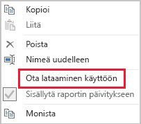

# Tietojen vähentämisen tekniikat tuonnin mallinnusta varten

Tämä artikkeli kohdistuu Power BI Desktopin tietomallintajille, jotka kehittävät tuontimalleja. Artikkelissa kuvataan eri tekniikoita, joiden avulla voit vähentää tuontimalleihin ladattuja tietoja.

Tuontimalleihin on ladattu pakattuja ja optimoituja tietoja, jotka VertiPaq-säilömoduuli tallentaa levylle. Kun lähdetiedot ladataan muistiin, 10-kertainen pakkaus on mahdollinen. On siis kohtuullista olettaa, että 10 gigatavua lähdetietoja voidaan pakata noin 1 gigatavun kokoon. Lisäksi, kun ne tallennetaan pysyvästi levylle, 20 prosentin lisävähennys voidaan saavuttaa.

VertiPaq-säilömoduulin tuottamista tehokkuuseduista huolimatta on tärkeää pyrkiä minimoimaan malleihin ladatut tiedot. Tämä pätee erityisesti suuriin malleihin tai malleihin, joiden odotetaan kasvavan suuriksi ajan mittaan. Neljä vakuuttavaa syytä:

- Kapasiteettisi ei välttämättä tue suurempia mallin kokoja. Jaettu kapasiteetti voi isännöidä enintään 1 gigatavun kokoisia malleja, kun taas Premium-kapasiteetit voivat isännöidä jopa 13 gigatavun kokoisia malleja. Lisätietoja on artikkelissa [Power BI Premiumin suurten tietojoukkojen tuki](../service-premium-large-datasets.md).
- Pienemmät mallikoot vähentävät kapasiteettiresursseihin, erityisesti muistiin, liittyviä kiistoja. Tämän ansiosta enemmän malleja voidaan ladata samanaikaisesti entistä pidemmän aikaa, joten poistoprosentit putoavat. Jos haluat lisätietoja, tutustu aiheeseen [Miten kapasiteetit toimivat](../whitepaper-powerbi-premium-deployment.md#how-capacities-function) raportissa [Power BI:n premium-käyttöönotto](../whitepaper-powerbi-premium-deployment.md).
- Pienemmissä malleissa tietojen päivitys on nopeampaa, joten tuloksena on pienemmät viiveet raportoinnissa, suurempi tietojoukon päivitysnopeus ja vähemmän painetta lähdejärjestelmässä ja kapasiteettiresursseissa.
- Pienemmät taulukon rivimäärät voivat johtaa nopeampaan laskennan arviointiin, mikä voi tuottaa kyselyssä paremman yleisen suorituskyvyn.

Tässä artikkelissa käsitellään seitsemää erilaista tietojen vähentämisen tekniikkaa. Näitä ovat esimerkiksi seuraavat:

- [Poista tarpeettomat sarakkeet](#remove-unnecessary-columns)
- [Poista tarpeettomat rivit](#remove-unnecessary-rows)
- [Ryhmittelyperuste ja yhteenveto](#group-by-and-summarize)
- [Sarakkeen tietotyyppien optimoiminen](#optimize-column-data-types)
- [Mukautettujen sarakkeiden asetus](#preference-for-custom-columns)
- [Poista Power Query -kyselyn lataaminen käytöstä](#disable-power-query-query-load)
- [Vaihda yhdistelmätilaan](#switch-to-mixed-mode)

## Poista tarpeettomat sarakkeet

Mallitaulukon sarakkeilla on kaksi päätarkoitusta:

- **Raportoinnin** avulla voi luoda raporttimalleja, jotka suodattavat, ryhmittelevät ja vetävät yhteen mallin tiedot asianmukaisesti
- **Mallin rakenne** tukee mallin yhteyksiä, mallin laskelmia, suojausrooleja ja jopa tietojen värimuotoilua

Sarakkeet, jotka eivät palvele näitä tarkoituksia, poistetaan todennäköisesti. Sarakkeiden poistamista kutsutaan _pystysuuntaiseksi suodatukseksi_.

Suosittelemme, että suunnittelet malleja, joissa on täsmälleen oikea määrä sarakkeita tunnettujen raportointivaatimusten perusteella. Vaatimukset voivat tietenkin muuttua ajan mittaan, mutta muista, että sarakkeita on helpompi lisätä kuin poistaa. Sarakkeiden poistaminen voi rikkoa raportit tai mallin rakenteen.

## Poista tarpeettomat rivit

Mallin taulukoihin tulee ladata mahdollisimman vähän rivejä. Tämä voidaan toteuttaa lataamalla suodatetut rivijoukot mallitaulukoihin kahdesta eri syystä: suodattamalla entiteetin mukaan tai ajan mukaan. Rivien poistamista kutsutaan _vaakasuuntaiseksi suodatukseksi_.

**Suodattamisessa entiteetin mukaan** malliin ladataan lähdetiedoista alijoukko. Esimerkiksi sen sijaan, että ladattaisiin kaikkien myyntialueiden myyntitiedot, ladataan vain yhden alueen tiedot. Tämä rakennelähestymistapa saa aikaan useita pienempiä malleja. Se voi myös poistaa tarpeen määrittää rivitason suojaus (mutta tietyt tietojoukon oikeudet on myönnettävä Power BI -palvelussa ja kuhunkin tietojoukkoon yhteyden muodostavat raporttien kopiot on myös luotava). Voit yksinkertaistaa hallintaa ja julkaisemista käyttämällä Power Query -parametreja ja Power BI:n mallitiedostoja. Lisätietoja on blogikirjoituksessa [Syväkatsaus kyselyparametreihin ja Power BI:n malleihin](https://powerbi.microsoft.com/blog/deep-dive-into-query-parameters-and-power-bi-templates/).

**Suodatuksessa ajan mukaan** rajoitetaan tietotyyppitaulukoihin ladattavan _tietohistorian_ määrää (ja samalla mallin päivämäärätaulukoihin ladattavia päivämäärärivejä). Suosittelemme, ettet lataa automaattisesti kaikkea saatavilla olevaa historiaa, ellei se ole tiedossa oleva raportointivaatimus. On hyödyllistä ymmärtää, että aikaan perustuvia Power Query -suodattimia voidaan parametrisoida ja jopa määrittää käyttämään suhteellisia ajanjaksoja (suhteessa päivityspäivämäärään, esimerkiksi viimeiset viisi vuotta). Muista myös, että aikasuodattimien taannehtivat muutokset eivät riko raportteja. Muutoksen tuloksena raporteissa on käytettävissä vähemmän (tai enemmän) tietoa.

## Ryhmittelyperuste ja yhteenveto

Valmiiksi yhteenvedettyjen tietojen lataaminen on kenties tehokkain tapa pienentää mallin kokoa. Tätä tekniikkaa voidaan käyttää tiedonjyvätyyppisten taulukoiden koostamiseen. Vastakauppana tosin yksityiskohtia menetetään.

Esimerkiksi lähdemyynnin tietotaulukossa tallennetaan yksi rivi tilausriviä kohti. Tietojen määrää voidaan vähentää merkittävästi vetämällä yhteen kaikki myyntimittarit ja ryhmittelemällä päivämäärän, asiakkaan ja tuotteen mukaan. Huomaa, että tätäkin enemmän tietoja voidaan vähentää ryhmittelemällä päivämäärän mukaan _kuukauden tasolla_. Tällä tavalla mallin koko voi pienentyä 99 %, mutta tällöin raportointi päivän tasolla tai yksittäisen tilauksen tasolla ei ole enää mahdollista. Tietotyyppitietojen yhteenvedosta päättäminen edellyttää aina kompromisseja. Tätä kompromissia voidaan lieventää käyttämällä rakenteena yhdistelmämallia. Tätä käsitellään myöhemmin aiheessa [Vaihda yhdistelmätilaan](#switch-to-mixed-mode).

## Sarakkeen tietotyyppien optimoiminen

VertiPaq-säilömoduuli käyttää kullekin sarakkeelle erillisiä tietorakenteita. Rakenteellisesti näillä tietorakenteilla saavutetaan suurimmat optimoinnit numeerisissa saraketiedoissa, joissa käytetään arvon koodausta. Tekstissä ja muissa kuin numeerisissa tiedoissa käytetään kuitenkin hajautuskoodausta. Tämä edellyttää, että säilömoduuli antaa numeerisen tunnisteen kullekin sarakkeeseen sisältyvälle yksilöivälle tekstiarvolle. Kyseinen numeerinen tunniste tallennetaan tietorakenteeseen, mikä edellyttää hajautusarvon hakua tallennuksen ja kyselyn aikana.

Joissakin tietyissä tapauksissa lähdetekstin tiedot voi muuntaa numeerisiksi arvoiksi. Esimerkiksi myynnin tilausnumeron eteen voidaan johdonmukaisesti lisätä tekstiarvo (esim. "SO123456"). Etuliite voidaan poistaa ja tilausnumeron arvo voidaan muuntaa kokonaisluvuksi. Suurissa taulukoissa tämä voi johtaa merkittävään tietojen vähentämiseen etenkin silloin, kun sarake sisältää yksilöiviä tai suuren kardinaliteetin arvoja.

Suosittelemme tässä esimerkissä, että asetat sarakkeen Oletusyhteenveto-ominaisuudeksi Älä tee yhteenvetoa -vaihtoehdon. Tämä auttaa minimoimaan tilausnumeroarvojen sopimattoman yhteenvedon.

## Mukautettujen sarakkeiden asetus

VertiPaq-säilömoduuli tallentaa mallin lasketut sarakkeet (määritetty DAX-mallissa) tavallisten Power Querystä peräisin olevien sarakkeiden tavoin. Tietorakenteet tallennetaan kuitenkin hieman eri tavalla, ja niiden pakkaus on yleensä vähemmän tehokas. Lisäksi ne rakennetaan, kun kaikki Power Query -taulukot on ladattu, mikä voi aiheuttaa pidempiä tietojen päivitysaikoja. Tämän seurauksena taulukon sarakkeiden lisääminen _laskettuina_ sarakkeina on tehottomampaa kuin Power Queryn _laskettuina_ sarakkeina (määritetty M:ssä).

Etusijalla tulee olla mukautettujen sarakkeiden luominen Power Queryssä. Kun lähde on tietokanta, latausta voi tehostaa kahdella tavalla. Laskenta voidaan määrittää SQL-lauseessa (käyttäen palvelun alkuperäisen tietokantakyselyn kieltä) tai se voidaan muodostaa sarakkeena tietolähteessä.

Joissakin tapauksissa mallin lasketut sarakkeet voivat kuitenkin olla parempi vaihtoehto. Näin saattaa olla, kun kaava sisältää mittareiden arviointia tai edellyttää tiettyä mallintamistoimintoa, jota vain DAX-toiminnot tukevat. Lisätietoja yhdestä tällaisesta esimerkistä on artikkelissa [Toiminnot DAX:n pää- ja alikohteiden hierarkiassa](/dax/understanding-functions-for-parent-child-hierarchies-in-dax).

## Poista Power Query -kyselyn lataaminen käytöstä

Power Query -kyselyitä, joiden tarkoituksena on tukea tietojen integrointia muihin kyselyihin, ei pidä ladata malliin. Jos haluat välttää kyselyn lataamisen malliin, varmista, että poistat kyselyiden lataamisen käytöstä näissä esiintymissä.

## Vaihda yhdistelmätilaan

Power BI Desktopin yhdistelmätilan rakenne tuottaa yhdistelmämallin. Sen avulla voit määrittää tallennustilan tilan _kullekin taulukolle_. Sen takia jokaisessa taulukossa taulukon Tallennustilan tila -ominaisuuden arvoksi voidaan asettaa Tuo tai DirectQuery (Kaksoistaulukko on myös vaihtoehtona).

Tehokas menetelmä pienentää mallin kokoa on määrittää Tallennustilan tila -ominaisuuden arvoksi DirectQuery suuremmissa tietotyyppisissä taulukoissa. Huomaa, että tämä rakennemenetelmä voi toimia hyvin edellä käsitellyn [Ryhmittelyperuste ja yhteenveto](#group-by-and-summarize) -aiheen kanssa. Esimerkiksi myynnin yhteenvetotietoja voidaan käyttää suorituskykyisen yhteenvetoraportoinnin saavuttamiseen. Porautumissivulla voidaan näyttää tarkka myynti tietyllä (ja suppealla) suodatuskontekstilla, jotta kaikki kontekstiin sisältyvät myyntitilaukset näkyvät. Tässä esimerkissä porautumissivu sisältää DirectQuery-taulukkoon perustuvia visualisointeja myyntitilauksen tietojen noutamiseksi.

Yhdistelmämalleihin liittyy kuitenkin useita tietoturva- ja suorituskykyvaikutuksia. Lisätietoja on artikkelissa [Yhdistelmämallien käyttäminen Power BI Desktopissa](../desktop-composite-models.md).

## Seuraavat vaiheet

Lisätietoja Power BI:n tuontimallin rakenteesta on seuraavissa artikkeleissa:

- [Yhdistelmämallien käyttäminen Power BI Desktopissa](../desktop-composite-models.md)
- [Tallennustilan tila Power BI Desktopissa](../desktop-storage-mode.md)
