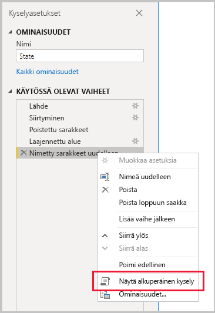
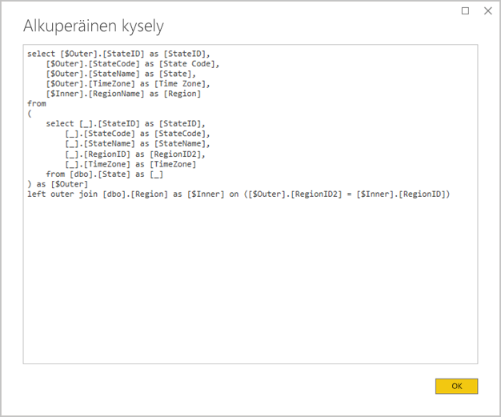
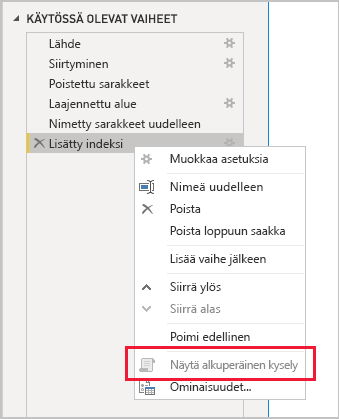

# <a name="the-importance-of-query-folding"></a>Kyselyn lähteeseen delegoinnin tärkeys

Tämä artikkeli on suunnattu tietomallintajille, jotka kehittävät malleja Power BI Desktopissa. Siinä kuvataan, mitä kyselyn lähteeseen delegointi on ja miksi se on tärkeää. Siinä kuvataan myös tietolähteet ja muunnokset, jotka saattavat suorittaa kyselyn lähteeseen delegoinnin, sekä se, miten voit selvittää, että Power Query -kyselysi voidaan delegoida lähteeseen joko kokonaan tai osittain. Lisäksi se tarjoaa ohjeita parhaisiin käytäntöihin, jotka koskevat sitä, milloin ja miten kyselyn delegointi lähteeseen on mahdollista.

## <a name="background"></a>Tausta

Kyselyn delegointi lähteeseen on Power Query -kyselyn kyky luoda yksittäinen kyselylauseke lähdetietojen noutamista ja muuntamista varten. Power Queryn koostemoduuli pyrkii suorittamaan kyselyn delegoinnin lähteeseen mahdollisuuksien mukaan, koska sen seurauksena on tehokkain polku Power BI -mallitaulukon ja sen pohjana olevan tietolähteen yhdistämiseen.

Kyselyn delegointi lähteeseen on tärkeä aihe tietojen mallinnuksessa monesta syytä:

- **Tuontimallitaulukot:** Tuontimallitaulukoiden tietojen päivitys tapahtuu tehokkaasti resurssien käytön ja päivityksen keston suhteen
- **DirectQueryn ja kaksoistallennustilan taulukot:** Kunkin DirectQueryn ja kaksoistallennustilan taulukon on perustuttava Power Query -kyselyyn, joka voidaan delegoida lähteeseen
- **Lisäävä päivitys:** Lisäävä tietojen päivitys on tehokasta resurssien käytön ja päivityksen keston kannalta. Itse asiassa lisäävä päivityksen määritysikkuna varoittaa sinua, jos se määrittää, että taulukon kyselyn delegointi lähteeseen ei ole mahdollista. Jos delegointia ei voida tehdä, lisäävän päivityksen tavoite on epäonnistunut. Koostemoduuli vaaditaan sitten noutamaan kaikki lähderivit ja käyttämään suodattimia lisäävien muutosten määritykseen.

Kyselyn delegointi lähteeseen voi tapahtua koko Power Query -kyselylle tai sen vaiheiden alijoukolle. Kun kyselyn delegointi lähteeseen ei onnistu – joko osittain tai kokonaan – Power BI:n Power Query -koostemoduulin on kompensoitava epäonnistuminen käsittelemällä tietojen muunnokset itse. Tämä saattaa edellyttää lähdekyselyjen tulosten noutamista, mikä vaatii erittäin paljon resursseja ja on hidasta suurten tietojoukkojen ollessa kyseessä.

Suosittelemme, että tietojen mallintajat pyrkivät tehokkuuteen tuontimallin suunnittelussa varmistamalla, että kyselyn delegointi lähteeseen toteutuu aina, kun se on mahdollista.

## <a name="sources-that-support-query-folding"></a>Lähteet, jotka tukevat kyselyn delegointia lähteeseen

Useimmat tietolähteet, joissa on kyselykieli, tukevat kyselyn delegointia lähteeseen. Näitä voivat olla esimerkiksi relaatiotietokannat, OData-syötteet (mukaan lukien SharePoint-luettelot), Exchange ja Active Directory. Kuitenkin tietolähteet, kuten tietuetiedostot, blob-objektit ja verkko, eivät yleensä tue sitä.

## <a name="transformations-that-can-achieve-query-folding"></a>Muunnokset, jotka voivat suorittaa kyselyn delegoinnin lähteeseen

Relaatiotietolähteen muunnokset, joiden kyselyt voidaan delegoida lähteeseen, ovat ne, jotka voidaan kirjoittaa yksittäisenä SELECT-lauseena. SELECT-lause voidaan muodostaa sopivalla WHERE-, GROUP BY- ja JOIN-lauseella. Se voi sisältää myös sarakelausekkeita (laskutoimituksia), jotka käyttävät SQL-tietokantojen tukemia yleisiä sisäisiä funktioita.

Seuraavassa luettelossa kuvataan muunnokset, joiden kysely voidaan yleisesti ottaen delegoida lähteeseen.

- Sarakkeiden poistaminen
- Sarakkeiden nimeäminen uudelleen (SELECT-sarakealiaset)
- Rivien suodattaminen staattisilla arvoilla tai Power Query -parametreilla (WHERE-lauseen predikaatit)
- Ryhmittely ja yhteenveto (GROUP BY -lause)
- Tietuesarakkeiden laajentaminen (lähteen viiteavainsarakkeet) kahden lähdetaulukon liittämiseksi (JOIN-lause)
- Saman lähteeseen perustuvien lähteeseen delegoitavien kyselyiden ei-sumea yhdistäminen (JOIN-lause)
- Samaan lähteeseen perustuvien lähteeseen delegoitavien kyselyiden yhdistäminen(UNION ALL -operaattori)
- Mukautettujen sarakkeiden lisääminen _yksinkertaisella logiikka_ (SELECT-sarakelausekkeet). Yksinkertainen logiikka viittaa mutkattomiin toimintoihin. Näihin kuuluvat mahdollisesti M-funktiot, esimerkiksi matemaattiset tai tekstinkäsittelyfunktiot, joilla on vastaavat funktiot SQL-tietolähteessä. Esimerkiksi seuraava lauseke palauttaa **OrderDate**-sarakearvon vuosiosan (ja palauttaa numeerisen arvon).

    ```powerquery-m
    Date.Year([OrderDate])
    ```

- Pivotointi ja pivotoinnin poistaminen (PIVOT- ja UNPIVOT-operaattorit)

## <a name="transformations-that-prevent-query-folding"></a>Muunnokset, jotka estävät kyselyn delegoinnin lähteeseen

Seuraavassa luettelossa kuvataan muunnokset, joiden estävät yleisesti ottaen kyselyn delegoinnin lähteeseen. Tämän ei ole tarkoitus olla tyhjentävä luettelo.

- Eri lähteisiin perustuvien kyselyiden yhdistäminen
- Eri lähteisiin perustuvien kyselyiden liittäminen
- Mukautettujen sarakkeiden lisääminen _monimutkaisella logiikalla_. Monimutkainen logiikka viittaa sellaisten M-funktioiden käyttöön, joilla ei ole vastaavia funktioita tietolähteessä. Esimerkiksi seuraava lauseke muotoilee **OrderDate**-sarakearvon (ja palauttaa tekstiarvon).

    ```powerquery-m
    Date.ToText([OrderDate], "yyyy")
    ```

- Hakemistosarakkeiden lisääminen
- Sarakkeen tietotyypin muuttaminen

Ota huomioon, että kun Power Query -kysely sisältää useita tietolähteitä, tietolähteen tietosuojatasojen yhteensopimattomuus voi estää kyselyiden delegoimisen lähteeeen. Lisätietoja on artikkelissa [Power BI Desktopin yksityisyystasot](../desktop-privacy-levels.md).

## <a name="determine-when-a-query-can-be-folded"></a>Selvitä, milloin kysely voidaan delegoida lähteeseen

Power Query -editori-ikkunassa on mahdollista selvittää, milloin Power Query -kysely voidaan delegoida lähteeseen. Napsauta **Kyselyasetukset**-ruudussa hiiren kakkospainikkeella viimeistä käytössä olevaa vaihetta. Jos **Näytä alkuperäinen kysely** -asetus on käytössä (ei harmaana), kysely voidaan delegoida lähteeseen.



Jos haluat tarkastella lähteeseen delegoitua kyselyä, siirry eteenpäin ja valitse **Näytä alkuperäinen kysely** -vaihtoehto. Näyttöön tulee alkuperäinen kysely, jota Power Query käyttää lähdetietojen kanssa.



Jos **Näytä alkuperäinen kysely** -asetus ei ole käytössä (harmaa), se on todiste siitä, että kaikkia kyselyvaiheita ei voi delegoida lähteeseen. Se voi kuitenkin tarkoittaa, että vaiheiden alijoukko voidaan edelleen delegoida lähteeseen. Jos siirryt taaksepäin edellisestä vaiheesta, voit tarkistaa kunkin vaiheen nähdäksesi tuleeko **Näytä alkuperäinen kysely** -asetus käyttöön. Jos näin käy, olet selvittänyt, missä kohtaa vaihejärjestyksessä kyselyn delegointi lähteeseen ei ole enää mahdollista.



## <a name="best-practice-guidance"></a>Ohjeet parhaisiin käytäntöihin

Lyhyesti sanottuna Power Query -kyselyn on onnistuttava kyselyn delegoinnissa lähteeseen DirectQueryn tai kaksoistallennustilan taulukossa. Kun kyseessä on relaatiolähteeseen perustuva tuontitaulukko ja kun yksittäinen SELECT-lause voidaan muodostaa, _paras tietojen päivityksen suorituskyky_ saavutetaan varmistamalla, että kyselyn delegointi lähteeseen onnistuu. Jos muunnosten käsittelyyn tarvitaan yhä koostemoduuli, sinun on pyrittävä minimoimaan sen tekemä työ erityisesti suurten tietojoukkojen kohdalla.

Seuraavassa luettelossa annetaan parhaita käytäntöjä koskevia ohjeita.

- **Delegoi mahdollisimman suuri osa käsittelystä tietolähteeseen:** Kun Power Query -kyselyn kaikkia vaiheita ei voida delegoida lähteeseen, selvitä vaihe, joka estää kyselyn delegoimisen lähteeseen. Jos se on mahdollista, siirrä tätä seuraavat vaiheet aiempaan kohtaan järjestyksessä, jotta ne voidaan ottaa mukaan kyselyn lähteeseen delegointiin. Ota huomioon, että Power Queryn koostemoduuli voi olla niin älykäs, että se järjestää kyselyvaiheet uudelleen, kun se luo lähdekyselyn.

Jos kyseessä on relaatiotietolähde, jonka kyselyiden delegoinnin lähteeseen estävä vaihe voidaan suorittaa yksittäisellä SELECT-lauseella tai tallennetun toimintosarjan menettelylogiikan puitteissa, harkitse alkuperäisen kyselylausekkeen käyttämistä seuraavassa kuvatulla tavalla.

- **Käytä alkuperäistä SQL-kyselyä:** Kun Power Query -kysely noutaa tietoja relaatiolähteestä, on mahdollista käyttää alkuperäistä SQL-kyselyä. Kysely voi itse asiassa olla mikä tahansa kelvollinen lauseke, mukaan lukien tallennetun toimintosarjan suorittaminen. Jos lauseke tuottaa useita tulosjoukkoja, vain ensimmäinen palautetaan. Parametrit voidaan esitellä lausekkeessa, ja suosittelemme käyttämään [Value.NativeQuery](/powerquery-m/value-nativequery) -M-funktiota parametriarvojen turvalliseen ja kätevään hyväksymiseen. On tärkeää ymmärtää, että Power Query -koostemoduuli ei voi delegoida seuraavia kyselyvaiheita lähteeseen, joten on tärkeää sisällyttää kaikki (tai yhtä paljon) muunnoslogiikka alkuperäiseen kyselylausekkeeseen.

    Kun käytät alkuperäisiä SQL-kyselyitä, kannattaa muistaa kaksi tärkeää seikkaa:

    - DirectQuery-mallitaulukossa kyselyn on oltava SELECT-lauseke, eikä se voi käyttää yleisiä taulukkolausekkeita (CTE) tai tallennettua toimintosarjaa
    - Lisäävä päivitys ei voi hyödyntää alkuperäistä SQL-kyselyä, joten se pakottaisi Power Queryn koostemoduulin noutamaan kaikki lähderivit ja käyttämään suodattimia määrittääkseen lisääviä muutoksia

    > [!IMPORTANT]
    > Alkuperäinen kysely voi mahdollisesti tehdä muutakin kuin hakea tietoja. Mikä tahansa kelvollinen lauseke voidaan suorittaa (ja mahdollisesti useita kertoja), mukaan lukien lauseke, joka muokkaa tai poistaa tietoja. On tärkeää ottaa käyttöön vähimpien oikeuksien periaate, jolla varmistetaan, että tilillä, jota käytetään tietokannan käyttämiseen, on ainoastaan vaadittujen tietojen lukuoikeus.

- **Valmistele ja muunna lähteen tietoja:** Jos huomaat, että joitakin Power Query -kyselyn vaiheita ei voida delegoida lähteeseen, saatat pystyä käyttämään tietolähteessä muunnoksia. Tämä voidaan toteuttaa kirjoittamalla tietokantanäkymä, joka loogisesti muuntaa lähdetiedot, tai valmistelemalla ja muodostamalla tiedot fyysisesti, ennen kuin Power BI kyselee niitä. Relaatiotietovarasto on erinomainen esimerkki valmistelluista tiedoista, jotka koostuvat tavallisesti ennalta integroiduista organisaatiotietojen lähteistä.

## <a name="next-steps"></a>Seuraavat vaiheet

Lisätietoja kyselyn delegoinnista lähteeseen ja siihen liittyvistä aiheista saat seuraavista lähteistä:

- [Yhdistelmämallien käyttäminen Power BI Desktopissa](../desktop-composite-models.md)
- [Lisäävää päivitys Power BI Premiumissa](../service-premium-incremental-refresh.md)
- [Kyselyn lähteeseen delegoinnin käyttöönotto Table.View’tä käyttämällä](/power-query/handlingqueryfolding)
- Onko sinulla kysyttävää? [Voit esittää kysymyksiä Power BI -yhteisössä](https://community.powerbi.com/)
