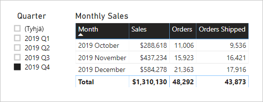

# <a name="active-vs-inactive-relationship-guidance"></a>Aktiivisten ja passiivisten suhteiden ohjeet

Tämä artikkeli on tarkoitettu tietojen mallintajille, jotka käyttävät Power BI Desktopia. Artikkelissa on ohjeita siitä, milloin tulee luoda aktiivisia ja milloin passiivisia mallisuhteita. Oletusarvon mukaan aktiiviset suhteet levittävät suodattimia muihin taulukoihin. Passiivinen suhde kuitenkin levittää suodattimia vain, kun DAX-lauseke aktivoi suhteen (käyttää suhdetta).

[!INCLUDE [relationships-prerequisite-reading](includes/relationships-prerequisite-reading.md)]

## <a name="active-relationships"></a>Aktiiviset suhteet

Yleensä suosittelemme aktiivisten suhteiden määrittämistä aina kun mahdollista. Ne laajentavat mallisi käyttöaluetta ja tarjoavat enemmän mahdollisuuksia, joita raportin tekijät sekä Q&A:n kanssa työskentelevät käyttäjät voivat hyödyntää.

Otetaan esimerkiksi tuontimalli, joka on suunniteltu analysoimaan lentoyhtiön lennonaikaista suoritustehoa (OTP). Mallilla on faktatyyppinen **Flight**-taulukko, joka tallentaa yhden rivin kutakin lentoa kohti. Kullakin rivillä näkyy lennon päivämäärä, lennon numero, lähtö- ja saapumislentokenttä sekä mahdollinen viiveaika (minuutteina). Lisäksi dimensiotyyppisessä **Airport**-taulukossa on yksi rivi kutakin lentokenttää kohti. Kullakin rivillä on lentokentän koodi, lentokentän nimi sekä maa.

Tässä on kahden taulukon osittainen mallikaavio.


**Flight**- ja **Airport**-taulukon välillä on kaksi mallisuhdetta. **Flight**-taulukossa **DepartureAirport**- ja **ArrivalAirport**-sarakkeet liittyvät **Airport**-taulukon **Airport** -sarakkeeseen. Tähtirakenteessa **Airport**-taulukko kuvataan [rooliulottuvuudeksi](star-schema.md#role-playing-dimensions). Tässä mallissa kaksi roolia ovat _departure airport_ (lähtökenttä) ja _arrival airport_ (kohdekenttä).

Tämä rakenne toimii hyvin suhteellisissa tähtirakenteissa, mutta ei Power BI -malleissa. Mallisuhteet ovat nimittäin suodattimen levittämispolkuja, ja polkujen tulee olla deterministisiä. Tästä syystä mallissa ei voi olla useita kahden taulukon välisiä aktiivisia suhteita. Näin ollen – kuten tässä esimerkissä on kuvattu – yksi suhde on aktiivinen, kun taas toinen on passiivinen (esitetään katkoviivana). Aktiivisena on suhde **ArrivalAirport**-sarakkeeseen. Tämä tarkoittaa sitä, että **Airport**-taulukkoon käytetyt suodattimet automaattisesti leviävät **Flight**-taulukon **ArrivalAirport**-sarakkeeseen.

Tähän mallirakenteeseen liittyy huomattavia rajoituksia sen suhteen, miten tietoja voidaan raportoida. Erityisesti ei ole mahdollista suodattaa **Airport**-taulukkoa niin, että se automaattisesti eristäisi lähtölentokentän lentotiedot. Koska raportoinnin vaatimuksiin sisältyy suodattaminen (tai ryhmitteleminen) lähtö- ja kohdelentokenttien mukaisesti _samaan aikaan_, tarvitaan kaksi aktiivista suhdetta. Tämän vaatimuksen kääntäminen Power BI -mallirakenteeksi tarkoittaa sitä, että mallissa on oltava kaksi lentokenttätaulukkoa.

Tässä on paranneltu mallirakenne.


Mallissa on nyt kaksi lentokenttätaulukkoa: **Departure Airport** ja **Arrival Airport**. Näiden taulukoiden ja **Flight**-taulukon väliset mallisuhteet ovat aktiivisia. Huomaa myös, että **Departure Airport**- ja **Arrival Airport** -taulukoiden sarakenimissä on etuliitteenä sana _Departure_ tai _Arrival_.

Paranneltu mallirakenne tukee seuraavan raporttimallin tuottamista.


Raportin sivu on suodatettu niin, että lähtökenttänä on Melbourne, ja taulukon visualisointi ryhmittelee tiedot kohdelentokenttien mukaan.

> [!NOTE]
> Tuontimallien osalta lisätaulukko on kasvattanut mallin kokoa ja pidentänyt päivitysaikoja. Näin ollen se on ristiriidassa niiden suositusten kanssa, jotka on kuvattu artikkelissa [Tietojen vähentämisen tekniikat tuonnin mallinnusta varten](import-modeling-data-reduction.md). Tässä esimerkissä vaatimus vain aktiivisten suhteiden esittämisestä kuitenkin ohittaa nämä suositukset.
>
> On myös yleistä, että dimensiotyyppisten taulukoiden rivimäärä on vähäinen suhteessa faktatyyppisten taulukoiden rivimääriin. Niinpä kasvanut mallikoko ja pidentyneet päivitysajat eivät oletettavasti ole vielä kohtuuttoman suuria.

### <a name="refactoring-methodology"></a>Muodostamismenetelmät

Seuraavan menetelmän avulla voidaan muodostaa malli yhdestä rooliulottuvuustyyppisestä taulukosta rakenteeseen, jossa on _yksi taulukko roolia kohden_.

1. Poista passiiviset yhteydet.
2. Harkitse rooliulottuvuustyyppisen taulukon nimeämistä uudelleen, niin että sen rooli kuvataan paremmin. Esimerkissä **Airport**-taulukko on suhteessa **Flight**-taulukon **ArrivalAirport**-sarakkeeseen, joten taulukon nimeksi vaihdetaan **Arrival Airport**.
3. Luo kopio roolitaulukosta ja määritä sille sen roolia vastaava nimi. Jos kyseessä on tuontitaulukko, suosittelemme lasketun taulukon määrittämistä. Jos kyseessä on DirectQuery-taulukko, voit kahdentaa Power Query -kyselyn.

    Esimerkissä **Departure Airport** -taulukko luotiin käyttämällä seuraavaa lasketun taulukon määritystä.

    ```dax
    Departure Airport = 'Arrival Airport'
    ```

4. Luo aktiivinen suhde, joka yhdistää uuden taulukon.
5. Harkitse taulukoiden sarakkeiden nimeämistä uudelleen, niin että ne nimet vastaavat sarakkeiden roolia. Esimerkissä kaikkien sarakkeiden etuliitteenä on sana _Departure_ tai _Arrival_. Näiden nimien ansiosta raportin visualisoinneilla on oletusarvon mukaan kuvaavat ja yksiselitteiset otsikot. Samalla Q&A-käyttökokemus paranee, kun käyttäjien on helppo kirjoittaa kysymyksensä.
6. Harkitse kuvausten lisäämistä roolitaulukoihin. (**Fields**-ruudussa kuvaus tulee näkyviin työkaluvihjeessä, kun raportin tekijä pitää kohdistinta taulukon päällä.) Näin voit ilmoittaa muista suodatinten välitystiedoista raporttien tekijöille.

## <a name="inactive-relationships"></a>Passiiviset yhteydet

Tietyissä tapauksissa passiiviset yhteydet voivat vastata raportoinnin erityisiin tarpeisiin.

Ajatellaan nyt toisenlaista mallia ja toisenlaisia raportointitarpeita:

- Myyntimallissa on **Sales**-taulukko, jossa on kaksi päivämääräsaraketta: **OrderDate** ja **ShipDate**
- Kukin **Sales**-taulukon rivi sisältää yhden tilauksen.
- Päivämääräsuodattimia käytetään lähes aina **OrderDate**-sarakkeeseen, jossa on aina kelvollinen päivämäärä.
- Vain yksi mittari vaatii päivämääräsuodattimen levittämistä **ShipDate**-sarakkeeseen, joka voi sisältää tyhjäarvoja (kunnes tilaus on lähetetty).
- Tilaus- _ja_ lähetyspäivämäärien perusteella ei tarvita samanaikaista suodatusta (tai ryhmittelyä).

Tässä on kahden taulukon osittainen mallikaavio.


**Sales**- ja **Date**-taulukon välillä on kaksi mallisuhdetta. **Sales**-taulukossa **OrderDate**- ja **ShipDate**-sarakkeet ovat suhteessa **Date**-taulukon **Date**-sarakkeeseen. Tässä mallissa **Date**-taulukon kaksi roolia ovat _tilauspäivämäärä_ ja _lähetyspäivämäärä_. Suhde **OrderDate**-sarakkeeseen on aktiivinen.

Kaikki kuusi mittaria – yhtä lukuun ottamatta – on suodatettava **OrderDate**-sarakkeen mukaan. **Orders Shipped** -mittari on kuitenkin suodatettava **ShipDate**-sarakkeen mukaan.

Tässä on **Orders**-mittarin määritys. Se vain laskee **Sales**-taulukon rivien määrän suodattimen kontekstissa. Kaikki **Date**-taulukkoon käytetyt suodattimet leviävät **OrderDate**-sarakkeeseen.

```dax
Orders = COUNTROWS(Sales)
```

Tässä on **Orders Shipped** -mittarin määritys. Se käyttää DAX-funktiota [USERELATIONSHIP](/dax/userelationship-function-dax), joka aktivoi suodattimen leviämisen tietyssä suhteessa vain lausekkeen laskemisen aikana. Tässä esimerkissä käytetään suhdetta **ShipDate**-sarakkeeseen.

```dax
Orders Shipped =
CALCULATE(
    COUNTROWS(Sales)
    ,USERELATIONSHIP('Date'[Date], Sales[ShipDate])
)
```

Tämä mallirakenne tukee seuraavan raporttimallin tuottamista.



Raporttisivu suodattaa vuosineljänneksen 2019 Q4 mukaan. Taulukon visualisointi ryhmittelee kuukauden perusteella ja näyttää useita myyntitietoja. **Orders**- ja **Orders Shipped** -mittarit tuottavat erilaisia tuloksia. Ne käyttävät samaa yhteenvetologiikkaa (**Sales**-taulukon rivien laskeminen), mutta erilaista **Date**-taulukon suodatuksen levittämistä.

Huomaa, että vuosineljänneksen osittaja sisältää tyhjäarvoisen kohteen. Tämä osittajakohde tulee näkyviin [taulukon laajennuksen](../desktop-relationships-understand.md#strong-relationships) seurauksena. Kullakin **Sales**-taulukon rivillä on tilauspäivämäärä, mutta joillakin riveillä on tyhjä lähetyspäivämäärä – näitä tilauksia ei vielä ole lähetetty. Taulukon laajennus ottaa huomioon myös passiiviset suhteet, joten tyhjäarvoja saattaa ilmestyä, jos suhteessa on monta puolta tai jos tiedoissa on eheysongelmia.

## <a name="recommendations"></a>Suositukset

Yhteenvetona suosittelemme aktiivisten suhteiden määrittämistä aina kun mahdollista. Ne laajentavat mallisi käyttöaluetta ja tarjoavat enemmän mahdollisuuksia, joita raportin tekijät sekä Q&A:n kanssa työskentelevät käyttäjät voivat hyödyntää. Näin ollen rooliulottuvuustyyppiset taulukot tulee kahdentaa mallissasi.

Tietyissä tilanteissa voit kuitenkin määrittää rooliulottuvuustyyppiselle taulukolle yhden tai useamman passiivisen suhteen. Voit harkita tällaista rakennetta seuraavissa tilanteissa:

- Raportin visualisointien ei tarvitse samanaikaisesti suodattua useiden eri roolien perusteella.
- Käytät DAX-funktiota USERELATIONSHIP aktivoidaksesi tietyn suhteen asiaan liittyville mallin laskutoimituksille.

## <a name="next-steps"></a>Seuraavat vaiheet

Saat lisätietoja tähän artikkeliin liittyen tutustumalla seuraaviin resursseihin:

- [Mallien suhteet Power BI Desktopissa](../desktop-relationships-understand.md)
- [Tutustu tähtirakenteeseen ja sen merkitykseen Power BI:ssä](star-schema.md)
- [Suhteen vianmääritysohjeet](relationships-troubleshoot.md)
- Onko sinulla kysyttävää? [Voit esittää kysymyksiä Power BI -yhteisössä](https://community.powerbi.com/)
- Onko sinulla ehdotuksia? [Kerro ideasi Power BI:n parantamiseksi](https://ideas.powerbi.com/)
