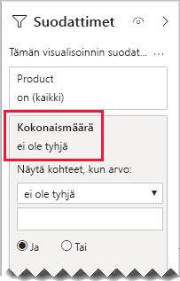

# <a name="bi-directional-relationship-guidance"></a>Kaksisuuntaisen suhteen ohjeet

Tämä artikkeli on tarkoitettu tietojen mallintajille, jotka käyttävät Power BI Desktopia. Artikkelissa on ohjeita siitä, milloin tulee luoda kaksisuuntaisia mallisuhteita. Kaksisuuntainen suhde on suhde, jossa suodatetaan _molempiin suuntiin_.

[!INCLUDE [relationships-prerequisite-reading](includes/relationships-prerequisite-reading.md)]

Yleisesti ottaen on suositeltavaa käyttää mahdollisimman vähän kaksisuuntaisia suhteita. Ne saattavat heikentää mallikyselyn tehokkuutta ja mahdollisesti aiheuttaa raporttisi käyttäjille hämmentäviä kokemuksia.

Kaksisuuntainen suodatus voi vastata tiettyihin vaatimuksiin kolmessa tilanteessa:

- [Erityiset mallisuhteet](#special-model-relationships)
- [Osittajan kohteet, ”joissa on tietoja”](#slicer-items-with-data)
- [Dimensioiden välinen analyysi](#dimension-to-dimension-analysis)

## <a name="special-model-relationships"></a>Erityiset mallisuhteet

Kaksisuuntaiset suhteet ovat tärkeässä roolissa, kun luodaan kahta seuraavaa erityistä mallisuhdetyyppiä:

- **Yksi yhteen**: Kaikkien yksi-yhteen-suhteiden on oltava kaksisuuntaisia – muulla tavalla niitä ei voi määrittää. Emme yleensä suosittele tällaisten suhteiden luomista. Koko keskustelu ja vaihtoehtoisia ratkaisuja on ohjeaiheessa [Yksi-yhteen-suhteen ohjeet](relationships-one-to-one.md).
- **Monta moneen**: Kun suhdetta luodaan kahden dimensiotyyppisen taulukon välille, tarvitaan välitaulukko. Kaksisuuntaisen suodattimen avulla varmistetaan, että suodattimet leviävät välitaulukon kautta. Lisätietoja on kohdassa [Monta-moneen-suhteen ohjeet (Liitä monta-moneen-dimensiot)](relationships-many-to-many.md#relate-many-to-many-dimensions).

## <a name="slicer-items-with-data"></a>Osittajan kohteet, ”joissa on tietoja”

Kaksisuuntaiset suhteet voivat toimittaa osittajia, jotka rajaavat kohteet sinne, missä on tietoja. (Jos tunnet Excelin Pivot-taulukot ja osittajat, tämä on oletustoimintaa, kun tietoja hankitaan Power BI -tietojoukosta tai Analysis Services -mallista.) Tämän voi selittää tutkimalla seuraavaa mallikaaviota.


Ensimmäisen taulukon nimi on **Customer**, ja siinä on kolme saraketta: **Country-Region**, **Customer** ja **CustomerCode**. Toisen taulukon nimi on **Product**, ja siinä on kolme saraketta: **Color**, **Product** ja **SKU**. Kolmannen taulukon nimi on **Sales**, ja siinä on neljä saraketta: **CustomerCode**, **OrderDate**, **Quantity** ja **SKU**. **Customer**- ja **Product**-taulukot ovat dimensiotyyppisiä taulukoita, ja molemmilla on yksi moneen -suhde **Sales**-taulukkoon. Kukin suhde suodattaa yhteen suuntaan.

Mallikaaviota on muokattu näyttämään taulukon rivit, jotta voimme paremmin kuvata kaksisuuntaisen suodatuksen toimintaa. Kaikki tämän artikkelin esimerkit perustuvat näihin tietoihin.

> [!NOTE]
> Taulukon rivejä ei voida näyttää Power BI Desktop -mallikaaviossa. Tässä artikkelissa niin on kuitenkin tehty, jotta voidaan antaa selkeitä esimerkkejä keskustelun tueksi.


Näiden kolmen taulukon rivien tiedot kerrotaan seuraavassa luettelossa:

- **Customer**-taulukossa on kaksi riviä:
  - **CustomerCode** CUST-01, **Customer** Customer-1, **Country-Region** United States
  - **CustomerCode** CUST-02, **Customer** Customer-2, **Country-Region** Australia
- **Product**-taulukossa on kolme riviä:
  - **SKU** CL-01, **Product** T-shirt, **Color** Green
  - **SKU** CL-02, **Product** Jeans, **Color** Blue
  - **SKU** AC-01, **Product** Hat, **Color** Blue
- **Sales**-taulukossa on kolme riviä:
  - **OrderDate** January 1 2019, **CustomerCode** CUST-01, **SKU** CL-01, **Quantity** 10
  - **OrderDate** February 2 2019, **CustomerCode** CUST-01, **SKU** CL-02, **Quantity** 20
  - **OrderDate** March 3 2019, **CustomerCode** CUST-02, **SKU** CL-01, **Quantity** 30

Katsotaan sitten seuraavaa raporttisivua.


Sivulla on kaksi osittajaa ja kortin visualisointi. Ensimmäinen osittaja liittyy kohteeseen **Country-Region**, ja siinä on kaksi kohdetta: Australia ja United States. Tällä hetkellä raportti ositetaan Australian mukaan. Toinen osittaja liittyy kohteeseen **Product**, ja siinä on kolme kohdetta: Hat, Jeans ja T-shirt. Kohteita ei ole valittu (eli _mitään tuotteita_ ei suodateta). Kortin visualisoinnissa näkyy määränä 30.

Kun raportin käyttäjät osittavat tiedot Australian mukaan, voit halutessasi rajoittaa **Product**-osittajan näyttämään kohteet, joiden tiedot _liittyvät_ Australian myyntiin. Tällöin näytetään osittajakohteet, ”joissa on tietoja”. Voit toteuttaa tämän toiminnan määrittämällä **Product**- ja **Sales**-taulukoiden suhteen niin, että suhteessa suodatetaan molempiin suuntiin.


**Product**-osittaja näyttää nyt yhden kohteen: T-shirt. Tämä kohde edustaa ainoaa australialaisille asiakkaille myytyä tuotetta.


Suosittelemme harkitsemaan huolellisesti, sopiiko tämä rakenne raporttisi käyttäjille. Jotkut raporttikäyttäjät saattavat pitää käyttökokemusta hämmentävänä. He eivät ymmärrä, miksi osittajakohteita tulee näkyviin tai katoaa dynaamisesti, kun he käsittelevät muita osittajia.

Jos päätät näyttää osittajakohteet, ”joissa on tietoja”, emme suosittele kaksisuuntaisten suhteiden määrittämistä. Kaksisuuntaiset suhteet vaativat enemmän käsittelyä, joten ne saattavat vaikuttaa negatiivisesti kyselyn suorituskykyyn – varsinkin, kun kaksisuuntaisten suhteiden määrä mallissasi kasvaa.

Saman tuloksen voi saavuttaa paremmallakin tavalla: Kaksisuuntaisten suodattimien sijasta voit käyttää visualisointitason suodatinta itse **Product**-osittajaan.

Ajatellaan, että **Product**- ja **Sales**-taulukon välinen suhde ei enää suodata molempiin suuntiin. Lisäksi **Sales**-taulukkoon on lisätty seuraava mittarimääritys.

```dax
Total Quantity = SUM(Sales[Quantity])
```

Jos haluat näyttää **Product**-osittajan kohteet, ”joissa on tietoja”, osittaja tulee vain suodattaa **Total Quantity** -mitalla käyttämällä ehtoa ”ei ole tyhjä”.



## <a name="dimension-to-dimension-analysis"></a>Dimensioiden välinen analyysi

Toisenlainen kaksisuuntaisiin suhteisiin liittyvä skenaario käsittelee faktatyyppistä taulukkoa välitaulukkona. Näin se tukee ulottuvuustyypin taulukon analysointia erilaisen ulottuvuustyypin taulukon suodatinkontekstissa.

Käytetään tämän artikkelin esimerkkimallia ja pohditaan, kuinka seuraaviin kysymyksiin voidaan vastata:

- Montako väriä australialaisille asiakkaille myytiin?
- Kuinka monessa maassa ostettiin farkkuja?

Molempiin kysymyksiin voidaan vastata _ilman_, että faktatyyppisessä välitaulukossa tehdään yhteenvetoa. Kysymyksiin vastaaminen kuitenkin vaatii, että suodattimet välitetään yhdestä ulottuvuustyypin taulukosta toiseen. Kun suodattimet välitetään faktatyyppisen taulukon kautta, ulottuvuustyypin taulukkosarakkeiden yhteenveto voidaan luoda käyttämällä DAX-funktiota [DISTINCTCOUNT](/dax/distinctcount-function-dax) – sekä mahdollisesti DAX-funktioita [MIN](/dax/min-function-dax) ja [MAX](/dax/max-function-dax).

Faktatyyppinen taulukko toimii välitaulukkona, joten voit seurata monta-moneen-suhteen ohjeita siitä, miten kaksi ulottuvuustyypin taulukkoa liitetään. Vähintään yksi suhde on määritettävä suodattamaan molempiin suuntiin. Lisätietoja on kohdassa [Monta-moneen-suhteen ohjeet (Liitä monta-moneen-dimensiot)](relationships-many-to-many.md#relate-many-to-many-dimensions).

Kuten tässä artikkelissa on kuitenkin jo kuvattu, tällainen rakenne heikentää luultavasti suorituskykyä sekä vaikuttaa käyttäjäkokemukseen, joka liittyy [osittajan kohteisiin, "joissa on tietoja"](#slicer-items-with-data). On siis suositeltavaa aktivoida kaksisuuntainen suodatus _mittarimäärityksessä_ käyttämällä sen sijaan DAX-funktiota [CROSSFILTER](/dax/crossfilter-function). CROSSFILTER-funktiolla voidaan lausekkeen arvioinnin aikana muokata suodatuksen ohjeita – tai jopa poistaa suhde käytöstä.

Tutustu seuraavaan mittarimääritykseen, joka on lisätty **Sales**-taulukkoon. Tässä esimerkissä **Customer**- ja **Sales**-taulukoiden välinen mallisuhde on määritetty suodattamaan _yhteen suuntaan_.

```dax
Different Countries Sold =
CALCULATE(
    DISTINCTCOUNT(Customer[Country-Region]),
    CROSSFILTER(
        Customer[CustomerCode],
        Sales[CustomerCode],
        BOTH
    )
)
```

Kun **Different Countries Sold** -mittarilauseketta arvioidaan, **Customer**- ja **Sales**-taulukoiden välinen suhde suodatetaan molempiin suuntiin.

Seuraavassa taulukossa esitetään kunkin myydyn tuotteen nykyiset tilastotiedot. **Quantity**-sarake on yksinkertaisesti määräarvojen summa. **Different Countries Sold** -sarake edustaa kaikkien tuotteen ostaneiden asiakkaiden erillisten maa-alue-arvojen määrää.


## <a name="next-steps"></a>Seuraavat vaiheet

Saat lisätietoja tähän artikkeliin liittyen tutustumalla seuraaviin resursseihin:

- [Mallien suhteet Power BI Desktopissa](../desktop-relationships-understand.md)
- [Tutustu tähtirakenteeseen ja sen merkitykseen Power BI:ssä](star-schema.md)
- [Yksi-yhteen-suhteen ohjeet](relationships-one-to-one.md)
- [Monta-moneen-suhteen ohjeet](relationships-many-to-many.md)
- [Suhteen vianmääritysohjeet](relationships-troubleshoot.md)
- Onko sinulla kysyttävää? [Voit esittää kysymyksiä Power BI -yhteisössä](https://community.powerbi.com/)
- Onko sinulla ehdotuksia? [Kerro ideasi Power BI:n parantamiseksi](https://ideas.powerbi.com/)
