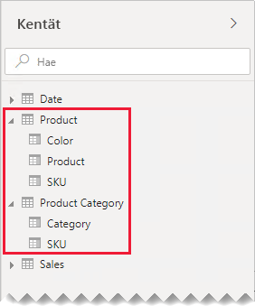
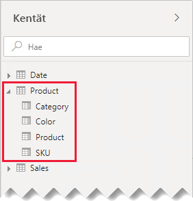
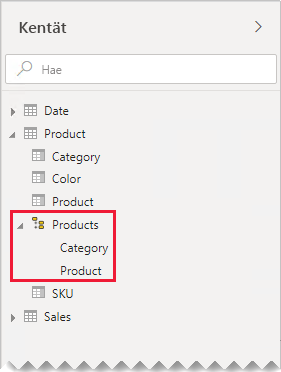
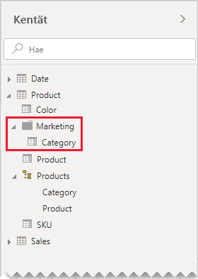

# Yksi-yhteen-suhteen ohjeet

Tämä artikkeli on tarkoitettu tietojen mallintajille, jotka käyttävät Power BI Desktopia. Artikkelissa on ohjeita yksi-yhteen-mallisuhteiden käyttämisestä. Yksi-yhteen-suhde voidaan luoda, kun molemmat taulukot sisältävät sarakkeen, jossa on yleisiä ja yksilöiviä arvoja.

[!INCLUDE [relationships-prerequisite-reading](includes/relationships-prerequisite-reading.md)]

Kahteen skenaarioon liittyy yksi yhteen -suhteita:

- [Johdetut dimensiot](#degenerate-dimensions): Voit johtaa [johdetun dimension](star-schema.md#degenerate-dimensions) faktatyyppisestä taulukosta.
- [Rivitiedot ulottuvat taulukosta toiseen](#row-data-spans-across-tables): Yksi liiketoimintaentiteetti tai aihe ladataan kahtena (tai useampana) mallitaulukkona, mahdollisesti koska niiden tiedot ovat peräisin eri tietolähteistä. Tämä skenaario voi olla yleinen dimensiotyyppisten taulukoiden yhteydessä. Päätuotetiedot on esimerkiksi voitu tallentaa toiminnassa olevaan myyntijärjestelmään ja lisätuotetiedot eri lähteeseen.

    On kuitenkin epätavallista, että kaksi faktatyyppistä taulukkoa liitettäisiin yksi yhteen -suhteella. Molemmilla faktatyyppisillä taulukoilla tulisi tällöin olla samat dimensiot ja sama askelväli. Lisäksi kukin faktatyyppinen taulukko tarvitsisi yksilölliset sarakkeet, jotta mallisuhde voitaisiin luoda.

## Johdetut dimensiot

Jos faktatyyppisen taulukon sarakkeita käytetään suodatukseen tai ryhmittelyyn, voit halutessasi määrittää ne käytettäväksi erillisessä taulukossa. Näin voit erotella suodatukseen tai ryhmittelyyn käytetyt sarakkeet sarakkeista, joita käytetään faktarivien yhteenvetoihin. Tällainen erottelu voi

- vähentää tallennustilan kulutusta
- yksinkertaistaa mallilaskutoimituksia
- parantaa osaltaan kyselyiden suorituskykyä
- tarjota raporttien tekijöille aiempaa intuitiivisemman **Fields** (Kentät) -ruudun käyttökokemuksen.

Harkitse lähteeksi myyntitaulukkoa, joka tallentaa myyntitilausten tiedot kahteen sarakkeeseen.

**OrderNumber** (tilausnumero) -sarakkeessa on tilausnumero, kun taas **OrderLineNumber** (tilauksen rivinumero) -sarakkeessa ovat tilaukseen sisältyvät rivit.

Huomaa seuraavassa mallikaaviossa, että tilausnumeroa ja tilauksen rivinumeroa ei ole ladattu **Sales**-taulukkoon. Sen sijaan niiden arvojen perusteella on luotu [korvaava avain](star-schema.md#surrogate-keys)sarake nimeltä **SalesOrderLineID** (myyntitilauksen rivitunnus). (Avainarvo lasketaan kertomalla tilauksen numero 1 000:lla ja lisäämällä sitten tilauksen rivinumero.)

**Sales Order** -taulukko tarjoaa raporttien luojille monipuolisen käyttökokemuksen, sillä käytettävissä on kolme saraketta: **Sales Order**, **Sales Order Line** ja **Line Number**. Mukana on myös hierarkia. Nämä taulukon resurssit tukevat raporttirakenteita, joiden tulee suodattaa tai ryhmitellä tilauksia ja tilausrivejä tai porautua niissä alaspäin.

**Sales Order** -taulukko johdetaan Sales-taulukosta, joten molemmissa taulukoissa pitäisi olla tarkalleen sama määrä rivejä. Lisäksi kunkin **SalesOrderLineID**-sarakkeen arvojen tulee vastata toisiaan.

## Rivitiedot ulottuvat taulukosta toiseen

Ajatellaan esimerkkiä, jossa on kaksi yksi-yhteen-suhteista dimensiotyyppistä taulukkoa: **Product** ja **Product Category**. Kumpikin taulukko esittää tuotuja tietoja, ja kummassakin taulukossa on **SKU** (varastointiyksikkö) -sarake, joka sisältää yksilöivät arvot.

Tässä on kahden taulukon osittainen mallikaavio.

Ensimmäisen taulukon nimi on **Product**, ja siinä on kolme saraketta: **Color**, **Product** ja **SKU**. Toisen taulukon nimi on **Product Category**, ja siinä on kaksi saraketta: **Category** ja **SKU**. Yksi yhteen -suhde liittää kaksi **SKU**-saraketta toisiinsa. Suhde suodattaa molempiin suuntiin, kuten aina yksi yhteen -suhteissa.

Mallikaaviota on muokattu näyttämään taulukon rivit, jotta pystymme paremmin kuvaamaan suhteiden suodatuksen levittämistä. Kaikki tämän artikkelin esimerkit perustuvat näihin tietoihin.

> [!NOTE]
> Taulukon rivejä ei voida näyttää Power BI Desktop -mallikaaviossa. Tässä artikkelissa niin on kuitenkin tehty, jotta voidaan antaa selkeitä esimerkkejä keskustelun tueksi.

Kahden taulukon rivien tiedot kerrotaan seuraavassa luettelossa:

- **Product**-taulukossa on kolme riviä:
  - **SKU** CL-01, **Product** T-shirt, **Color** Green
  - **SKU** CL-02, **Product** Jeans, **Color** Blue
  - **SKU** AC-01, **Product** Hat, **Color** Blue
- **Product Category** -taulukossa on kaksi riviä:
  - **SKU** CL-01, **Category** Clothing
  - **SKU** AC-01, **Category** Accessories

Huomaa, että **Product Category** -taulukossa ei ole riviä tuotteelle SKU CL-02. Tämän puuttuvan rivin seurauksia käsitellään myöhemmin tässä artikkelissa.

**Fields**-ruudussa on raportin tekijöille tuotteisiin liittyviä kenttiä kahdessa taulukossa: **Product** ja **Product Category**.

Katsotaan, mitä tapahtuu, kun molempien taulukoiden kentät lisätään taulukon visualisointiin. Tässä esimerkissä **SKU**-sarake on lähtöisin **Product**-taulukosta.

Huomaa, että tuotteen SKU CL-02 **Category**-arvo on TYHJÄ. Tämä johtuu siitä, että **Product Category** -taulukossa ei ole riviä tälle tuotteelle.

### Suositukset

Jos mahdollista, suosittelemme välttämään yksi yhteen -mallisten suhteiden luomista, jos rivitiedot ulottuvat mallitaulukosta toiseen. Tämä johtuu siitä, että tämä rakenne saattaa

- lisätä tarpeettomia osia **Fields**-ruutuun, niin että siinä näkyy enemmän taulukoita kuin on tarpeen
- vaikeuttaa sitä, että raportin tekijät löytävät kohteeseen liittyviä kenttiä, koska kentät on jaettu useisiin taulukoihin
- rajoittaa mahdollisuutta hierarkioiden luomiseen, koska hierarkioiden tasojen tulee perustua _samassa taulukossa_ oleviin sarakkeihin
- tuottaa odottamattomia tuloksia, jos taulukoiden välillä ei ole rivien täyttä vastaavuutta.

Tarkat suositukset vaihtelevat sen mukaan, onko yksi yhteen -suhde _saarensisäinen_ vai _saartenvälinen_. Jos haluat lisätietoja suhteen arvioinnista, katso [Mallien suhteet Power BI Desktopissa (Suhteen arviointi)](../desktop-relationships-understand.md#relationship-evaluation).

### Saarensisäinen yksi yhteen -suhde

Jos taulukoiden välillä on _saarensisäinen_ yksi yhteen -suhde, suosittelemme tietojen yhdistämistä yhteen mallitaulukkoon. Tämä tehdään yhdistämällä Power Query -kyselyt.

Seuraavissa vaiheissa esitellään menetelmä, jolla voidaan yhdistää ja mallintaa yksi yhteen -suhteiset tiedot:

1. **Yhdistä kyselyt**: Kun [yhdistät kahta kyselyä](../desktop-shape-and-combine-data.md#combine-queries), ota huomioon tietojen täydellisyys kussakin kyselyssä. Jos yksi kysely sisältää koko rivijoukon (pääluettelon tapaan), yhdistä toinen kysely siihen. Määritä yhdistämismuunnos käyttämään _vasenta ulkoliitosta_, joka on liitosten oletustyyppi. Tämä liitostyyppi varmistaa, että kaikki ensimmäisen kyselyn rivit säilyvät ja että ne täydennetään toisen kyselyn vastaavilla riveillä. Laajenna kaikki toisen kyselyn pakolliset sarakkeet ensimmäiseen kyselyyn.
2. **Poista kyselyn lataaminen käytöstä**: Muista [poistaa lataaminen](import-modeling-data-reduction.md#disable-power-query-query-load) toisen kyselyn osalta. Tällöin se ei lataa tuloksiaan mallitaulukoksi. Tämä määritys pienentää tietomallin tallennuskokoa ja auttaa selkeyttämään **Fields** (Kentät) -ruutua.

    Omassa esimerkissämme raportin tekijät löytävät nyt **Fields**-ruudusta yksittäisen taulukon, jonka nimi on **Product**. Se sisältää kaikki tuotteisiin liittyvät kentät.

    
3. **Korvaa puuttuvat arvot**: Jos toisessa kyselyssä on rivejä, joille ei löydy vastaavuutta, siitä saaduissa sarakkeissa näkyy NULL-arvo. Voit tarvittaessa korvata NULL-arvot tunnusarvolla. Puuttuvien arvojen korvaaminen on erityisen tärkeää, jos raporttien tekijät suodattavat tai ryhmittelevät tietoja sarakkeiden arvojen perusteella, sillä tyhjäarvot saattavat näkyä raportin visualisoinneissa.

    Huomaa seuraavassa taulukon visualisoinnissa, että tuotteen SKU CL-02 kohdalla lukee nyt _[Undefined]_ . Kyselyssä tyhjäarvoiset luokat korvattiin tällä tunnusarvolla.

    

4. **Luo hierarkiat**: Jos suhteita on yhdistetyn taulukon _sarakkeiden välillä_, harkitse hierarkioiden luomista. Näin raporttien tekijät tunnistavat nopeasti mahdollisuudet raportin visualisointiin porautumiseen.

    Tässä esimerkissä raporttien tekijät voivat nyt käyttää hierarkiaa, jossa on kaksi tasoa: **Category** ja **Product**.

    

Jos koet erillisten taulukoiden auttavan kenttien järjestämisessä, suosittelemme kuitenkin yhdistämistä yhdeksi taulukoksi. Voit edelleen järjestellä kenttiä, mutta nyt järjestelyyn käytetään _näyttökansioita_.

Tässä esimerkissä raporttien tekijät löytävät **Category**-kentän **Marketing**-näyttökansiosta.

Jos päätät kuitenkin määrittää mallissasi saarensisäisiä yksi yhteen -suhteita, varmista aina kun mahdollista, että toisiinsa liittyvissä taulukoissa on toisiaan vastaavat rivit. Saarensisäinen yksi yhteen -suhde arvioidaan [vahvaksi suhteeksi](../desktop-relationships-understand.md#strong-relationships), joten tietojen eheyteen liittyvät ongelmat saattavat näkyä raportin visualisoinneissa tyhjäarvoina. (Tämän artikkelin ensimmäisessä taulukon visualisoinnissa on esimerkki tyhjäarvoisesta ryhmittelystä.)

### Saartenvälinen yksi yhteen -suhde

Jos taulukoiden välillä on _saartenvälinen_ yksi yhteen -suhde, tarjolla ei ole vaihtoehtoista mallirakennetta – ellet sitten etukäteen yhdistä tietolähteiden tietoja. Power BI arvioi yksi yhteen -mallisuhteen [heikoksi suhteeksi](../desktop-relationships-understand.md#weak-relationships). Varmista siis, että toisiinsa liittyvissä taulukoissa on vastaavat rivit, koska toisiaan vastaamattomat rivit poistetaan kyselyn tuloksista.

Katsotaan, mitä tapahtuu, kun molempien taulukoiden kentät lisätään taulukon visualisointiin ja taulukoiden välillä on heikko suhde.

Taulukko näyttää vain kaksi riviä. Taulukossa ei ole tuotetta, jonka SKU-arvo on CL-02, koska **Product Category** -taulukossa ei ole vastaavaa riviä.

## Seuraavat vaiheet

Saat lisätietoja tähän artikkeliin liittyen tutustumalla seuraaviin resursseihin:

- [Mallien suhteet Power BI Desktopissa](../desktop-relationships-understand.md)
- [Tutustu tähtirakenteeseen ja sen merkitykseen Power BI:ssä](star-schema.md)
- [Suhteen vianmääritysohjeet](relationships-troubleshoot.md)
- Onko sinulla kysyttävää? [Voit esittää kysymyksiä Power BI -yhteisössä](https://community.powerbi.com/)
- Onko sinulla ehdotuksia? [Kerro ideasi Power BI:n parantamiseksi](https://ideas.powerbi.com/)
