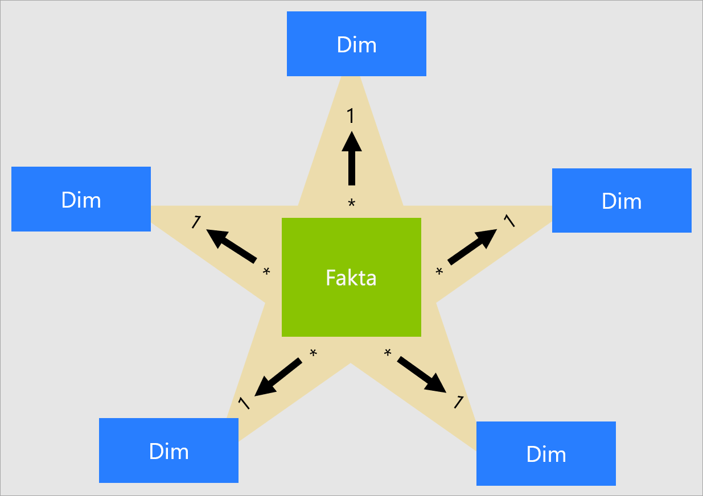
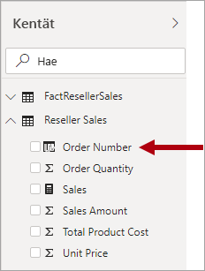

# Tutustu tähtirakenteeseen ja sen merkitykseen Power BI:ssä

Tämä artikkeli kohdistuu Power BI Desktopin tietomallintajille. Artikkelissa kuvaillaan tähtirakenne ja sen merkitys, kun kehitetään suorituskykyyn ja käytettävyyteen optimoituja Power BI -tietomalleja.

Tämän artikkelin tarkoituksena ei ole käydä tähtirakenne läpi kokonaisvaltaisesti. Jos haluat lisätietoja, tutustu muuhun julkaistuun sisältöön, kuten **The Data Warehouse Toolkit: The Complete Guide to Dimensional Modeling** (2. painos, 2002), Ralph Kimball et al.

## Tähtirakenteen yleiskatsaus

**Tähtirakenne** on kypsä mallinnusmenetelmä, joka on laajasti käytössä relaatiotietovarastoissa. Se edellyttää, että mallintajat luokittelevat mallitaulukot joko _dimensioksi_ tai _faktaksi_.

**Dimensiotaulukot** kuvailevat liiketoiminnan entiteettejä eli mallinnettavia asioita. Entiteetit voivat sisältää tuotteita, henkilöitä, paikkoja ja käsitteitä aika mukaan luettuna. Yhdenmukaisin tähtirakenteesta löytyvä taulukko on päivämäärän dimensiotaulukko. Dimensiotaulukko sisältää avainsarakkeen (tai -sarakkeet), joka toimii yksilöivänä tunnisteena, ja kuvaavia sarakkeita.

**Faktataulukot** tallentavat havaintoja tai tapahtumia. Ne voivat olla myyntitilauksia, varastosaldoja, valuuttakursseja, lämpötiloja jne. Faktataulukko sisältää dimension avainsarakkeita, jotka liittyvät dimensiotaulukoihin, ja numeerisia mittarisarakkeita. Dimension avainsarakkeet määrittävät faktataulukon _dimensiot_, kun taas dimension avainarvot määrittävät faktataulukon _rakeisuuden_. Harkitse esimerkiksi faktataulukkoa, joka on suunniteltu tallentamaan myyntitavoitteet, joissa on kaksi dimension avainsaraketta: **Päivämäärä** ja **Tuoteavain**. On helppo ymmärtää, että taulukossa on kaksi dimensiota. Rakeisuutta ei kuitenkaan voida määrittää ottamatta huomioon dimension avainarvoja. Tässä esimerkissä otetaan huomioon, että **Päivämäärä**-sarakkeeseen tallennetut arvot ovat kunkin kuukauden ensimmäinen päivä. Tässä tapauksessa rakeisuus on kuukauden tuotetasolla.

Yleensä dimensiotaulukot sisältävät suhteellisen vähän rivejä. Faktataulukoissa voi sen sijaan olla erittäin paljon rivejä ja ne kasvavat ajan mittaan.

## Tähtirakenteen merkitys Power BI -malleille

Tähtirakenne ja monet tässä artikkelissa esitetyt liitännäiskäsitteet ovat erittäin merkityksellisiä suorituskyvyn ja käytettävyyden suhteen optimoitujen Power BI -mallien kehittämisessä.

Huomaa, että jokainen Power BI -raportin visualisointi luo kyselyn, joka lähetetään Power BI -malliin (jota Power BI -palvelussa kutsutaan tietojoukoksi). Näitä kyselyitä käytetään mallitietojen suodattamiseen, ryhmittelemiseen ja vetämiseen yhteen. Hyvin suunniteltu malli on siis sellainen, joka tarjoaa taulukoita suodatusta ja ryhmittelyä varten ja taulukoita yhteenvedon tekemistä varten. Tämä sopii hyvin tähtirakenteen periaatteisiin:

- Dimensiotaulukot tukevat _suodatusta_ ja _ryhmittelyä_.
- Faktataulukot tukevat _yhteenvetoa_.

Vaikka taulukon tyypin (dimension tai fakta) määrittämiseen ei ole mallintajien asettamaa taulukko-ominaisuutta, mallin yhteydet määrittävät tyypin. Mallin yhteys muodostaa suodatuksen välityspolun kahden taulukon välille. Yhteyden **Kardinaliteetti**-ominaisuus määrittää taulukkotyypin. Yleinen yhteyden kardinaliteetti on "yksi moneen" tai sen käänteinen vastapari "monta yhteen". "Yksi" puoli on aina dimensiotyyppinen taulukko ja "moni" puoli on aina faktatyyppinen taulukko.

Hyvin jäsennetyn mallin rakenteen tulee sisältää taulukoita, jotka ovat joko dimensiotyyppisiä taulukoita tai faktatyyppisiä taulukoita. Vältä kahden tyypin sekoittamista yhteen taulukkoon. Suosittelemme myös, että pyrit antamaan oikean määrän taulukoita, joihin olet lisännyt oikeat yhteydet. On myös tärkeää, että faktatyyppiset taulukot lataavat aina tiedot yhdenmukaisella askelvälillä.

Lopuksi on tärkeää ymmärtää, että optimaalinen mallin rakenne on osin tiedettä ja osin taidetta. Joskus hyviä ohjeita kannattaa rikkoa, kun siitä on hyötyä.

Tähtirakenteeseen liittyy monia muita käsitteitä, joita voidaan käyttää Power BI -mallissa. Näitä ovat esimerkiksi seuraavat:

- [Mittarit](#measures)
- [Korvaavat avaimet](#surrogate-keys)
- [Snowflake-dimensiot](#snowflake-dimensions)
- [Rooliulottuvuudet](#role-playing-dimensions)
- [Hitaasti muuttuvat dimensiot](#slowly-changing-dimensions)
- [Roskadimensiot](#junk-dimensions)
- [Johdetut dimensiot](#degenerate-dimensions)
- [Faktattomat faktataulukot](#factless-fact-tables)

## Mittarit

Tähtirakenteessa **mittari** on faktataulukon sarake, johon on tallennettu yhteenvedossa käytettävät arvot.

Power BI -mallissa **mittarin** määritelmä on samankaltainen, mutta silti erilainen. Se on [Data Analysis Expressions (DAX)](https://docs.microsoft.com/dax/data-analysis-expressions-dax-reference) -kielellä kirjoitettu kaava, joka toteuttaa yhteenvedon. Mittayksikkölausekkeet hyödyntävät usein DAX-koostefunktioita, kuten SUM, MIN, MAX, AVERAGE jne. Niiden avulla tuotetaan skalaariarvotulos, kyselyhetkellä (arvoja ei koskaan tallenneta malliin). Mittayksikkölauseke voi vaihdella yksinkertaisesta sarakekoosteesta kehittyneeseen kaavaan, joka ohittaa suodatinkontekstin ja/tai yhteyden välityksen. Lisätietoja on artikkelissa [DAX-kielen perusteet Power BI Desktopissa](https://docs.microsoft.com/power-bi/desktop-quickstart-learn-dax-basics).

On tärkeää ymmärtää, että Power BI -mallit tukevat toista menetelmää yhteenvedon saavuttamiseksi. Mikä tahansa sarake – ja tyypillisesti numerosarakkeet – voidaan tiivistää raportin visualisoinnin tai Q&A:n avulla. Tästä on hyötyä mallin kehittäjille, koska monissa esiintymissä ei tarvitse luoda mittareita. Esimerkiksi Adventure Works -jälleenmyyjämyynnin sarake **Myynnin summa** voidaan vetää yhteen monella tavalla (summa, määrä, keskiarvo, mediaani, minimi, maksimi jne.) ilman, että tarvitsee luoda mittari jokaiselle mahdolliselle koostamistyypille.

Mittareiden luomiseen on kuitenkin kaksi vakuuttavaa syytä myös yksinkertaisissa saraketason yhteenvedoissa:

- Kun tiedät, että raportin tekijät tekevät kyselyn malliin käyttämällä [MDX](https://docs.microsoft.com/sql/analysis-services/multidimensional-models/mdx/mdx-query-the-basic-query?view=sql-server-2017)-lauseketta, mallissa on oltava mittareita. MDX ei voi vetää yhteen sarakearvoja. Tämä on erittäin olennaista, kun Power BI -tietojoukkoon tehdään kysely MDX:n avulla, ja näin on käytettäessä [Analysoi Excelissä](https://docs.microsoft.com/power-bi/service-analyze-in-excel) -toimintoa (pivot-taulukot tekevät MDX-kyselyitä).
- Jos haluat varmistaa, että raportin tekijät voivat tehdä yhteenvedon sarakkeista vain tietyllä tavalla: Esimerkiksi jälleenmyyjämyynnin **Yksikköhinta**-sarakkeesta (joka on yksikkökohtainen hinta) voidaan tehdä yhteenveto, mutta vain käyttämällä määrättyjä koostamisfunktioita. Sitä ei tule koskaan laskea yhteen, mutta se voidaan vetää yhteen käyttämällä muita koostamisfunktioita (minimi, maksimi, keskiarvo jne.). Tässä esiintymässä mallintaja voi piilottaa **Yksikköhinta**-sarakkeen ja luoda mittareita kaikille sopiville koostamisfunktioille.

Ota huomioon, että tämä rakennemenetelmä toimii hyvin Power BI -palvelussa ja Q&A:ssa laadituille raporteille. Power BI Desktopin live-yhteyksien avulla raporttien tekijät voivat näyttää **Kentät**-ruudussa piilotetut kentät, minkä ansiosta tämä rakennemenetelmä voidaan kiertää.

## Korvaavat avaimet

**Korvaava avain** on yksilöivä tunniste, joka lisätään taulukkoon tähtirakenteen tueksi. Määrittelyn mukaan sitä ei ole määritetty tai tallennettu lähdetietoihin. Yleensä korvaavat avaimet lisätään relaatiotietovaraston dimensiotaulukoihin, jotta kullekin dimensiotaulukon riville voidaan antaa yksilöivä tunnus.

Power BI:n malliyhteydet perustuvat yksittäiseen yksilöivään sarakkeeseen yhdessä taulukossa, joka välittää suodattimet yksittäiseen sarakkeeseen eri taulukossa. Kun mallissa oleva dimensiotyyppinen taulukko ei sisällä yksittäistä yksilöivää saraketta, sinun on lisättävä yksilöivä tunnus, josta tulee suhteen "yksi"-puoli. Power BI Desktopissa se onnistuu helposti luomalla [Power Query -indeksisarake](https://docs.microsoft.com/powerquery-m/table-addindexcolumn).

Tämä kysely on yhdistettävä "monta"-puolen kyselyyn, jotta siihenkin voidaan lisätä indeksisarake. Kun lataat nämä kyselyt malliin, voit luoda yksi-moneen-yhteyksiä mallitaulukoiden välille.

## Snowflake-dimensiot

**Snowflake-dimensio** on joukko normalisoituja taulukoita yksittäiselle liiketoimintaentiteetille. Esimerkiksi Adventure Works luokittelee tuotteet luokan ja aliluokan mukaan. Luokat on määritetty aliluokkiin, ja tuotteet on puolestaan määritetty aliluokkiin. Adventure Works -relaatiotietovarastossa tuotedimensio normalisoidaan ja tallennetaan kolmeen liittyvään taulukkoon: **DimProductCategory** , **DimProductSubcategory** ja **DimProduct**.

Mielikuvitusta käyttäen voit nähdä normalisoidut taulukot sijoitettuina ulospäin faktataulukosta, mistä syntyy Snowflake-rakenne (lumihiutale).

Voit halutessasi jäljitellä Power BI Desktopissa Snowflake-dimensiorakennetta (koska lähdetiedot tekevät niin) tai integroida (denormalisoida) lähdetaulukot yksittäiseksi mallitaulukoksi. Yleensä yksittäisen mallitaulukon edut ovat merkittävämmät kuin useista mallitaulukoista saatavat edut. Optimaalinen päätös voi riippua mallin tietomääristä ja käytettävyysvaatimuksista.

Kun päätät jäljitellä Snowflake-dimension rakennetta:

- Power BI lataa enemmän taulukoita, mikä ei ole yhtä tehokasta tallennuksen ja suorituskyvyn kannalta. Näissä taulukoissa on oltava sarakkeet, jotka tukevat malliyhteyksiä, ja tämä voi johtaa suurempaan mallikokoon.
- Pidemmät yhteyksien suodatuksen välitysketjut on kuljettava läpi, mikä on todennäköisesti vähemmän tehokasta kuin yksittäiseen taulukkoon käytetyt suodattimet.
- **Kentät**-ruutu sisältää enemmän mallitaulukoita raportin tekijöille, mikä voi heikentää käyttökokemuksen intuitiivisuutta erityisesti silloin, kun Snowflake-dimension taulukot sisältävät vain yhden tai kaksi saraketta.
- Useisiin taulukoihin ulottuvaa hierarkiaa ei voi luoda.

Kun päätät integroida yksittäiseen mallitaulukkoon, voit määrittää myös hierarkian, joka kattaa dimension suurimman ja pienimmän rakeen. Tarpeettomien denormalisoitujen tietojen tallennus voi kasvattaa mallin tallennuskokoa erityisesti erittäin suurissa dimensiotaulukoissa.

## Hitaasti muuttuvat dimensiot

**Hitaasti muuttuva dimensio** (SCD) on sellainen, joka hallitsee dimension jäsenten muutosta ajan mittaan asianmukaisesti. Sitä käytetään, kun liiketoimintayksikön arvot muuttuvat ajan kuluessa ja tapauskohtaisesti. Hyvä esimerkki _hitaasti_ muuttuvasta dimensiosta on asiakasdimensio ja erityisesti sen yhteystietosarakkeet, kuten sähköpostiosoite ja puhelinnumero. Sitä vastoin joidenkin dimensioiden katsotaan _muuttuvan nopeasti_, kun dimension määrite muuttuu usein, kuten varaston markkinahinta. Näissä tapauksissa yleinen rakennemenetelmä on tallentaa nopeasti muuttuvat määritearvot faktataulukon mittariin.

Tähtirakenneteoriassa viitataan kahteen yleiseen hitaasti muuttuvan dimension tyyppiin: tyyppi 1 ja tyyppi 2. Dimensiotyypin taulukko voi olla tyyppiä 1 tai 2 tai tukea molempia tyyppejä samanaikaisesti eri sarakkeissa.

### Tyypin 1 hitaasti muuttuva dimensio

**Tyypin 1** **hitaasti muuttuva dimensio** vastaa aina uusimpia arvoja. Kun lähdetiedoissa havaitaan muutoksia, dimensiotaulukon tiedot korvataan. Tätä rakennemenetelmää käytetään yleisesti sarakkeissa, joihin tallennetaan täydentäviä arvoja, kuten asiakkaan sähköpostiosoite tai puhelinnumero. Kun asiakkaan sähköpostiosoite tai puhelinnumero muuttuu, uudet arvot päivittyvät dimensiotaulukon asiakasriville. Lopputuloksena näyttää siltä, kuin asiakkaalla olisi aina ollut nämä yhteystiedot.

Power BI -mallin dimensiotyypin taulukon kertapäivitys saa aikaan tyypin 1 hitaasti muuttuvan dimension tuloksen. Taulukkotiedot päivittyvät sen varmistamiseksi, että uusimmat arvot ladataan.

### Tyypin 2 hitaasti muuttuva dimensio

**Tyypin 2** **hitaasti muuttuva dimensio** tukee dimension jäsenten versiointia. Jos lähdejärjestelmä ei tallenna versioita, yleensä tietovaraston lataamisprosessi havaitsee muutokset ja hallitsee dimensiotaulukon muutosta asianmukaisella tavalla. Tässä tapauksessa dimensiotaulukon on käytettävä korvaavaa avainta, jotta dimension jäsenen _versio_ saa yksilöivän viittauksen. Se sisältää myös sarakkeet, jotka määrittävät version päivämääräalueen (kuten **StartDate** ja **EndDate**) sekä mahdollisesti merkintäsarakkeen (kuten **IsCurrent**), jotta suodattaminen nykyisten dimension jäsenten mukaan onnistuu helposti.

Adventure Works esimerkiksi määrittää myyjät myyntialueisiin. Kun myyjä siirtyy toiselle alueelle, myyjästä on luotava uusi versio sen varmistamiseksi, että historialliset tiedot pysyvät liitettynä entiseen alueeseen. Myyjän myyntihistorian tarkan analyysin tukemista varten dimensiotaulukkoon on tallennettava myyjien ja myyjiin liittyvien alueiden versiot. Taulukossa on oltava myös ajan määrittävät alkamis- ja päättymispäivämäärien arvot. Nykyiset versiot voivat määrittää tyhjän päättymispäivämäärän (tai 31.12.9999), mikä osoittaa, että rivi on nykyinen versio. Taulukossa on myös määritettävä korvaava avain, koska liiketoiminta-avain (tässä esiintymässä työntekijän tunnus) ei ole yksilöivä.

On tärkeää ymmärtää, että kun lähdetiedot eivät tallenna versioita, on käytettävä välijärjestelmää (kuten tietovarastoa) muutosten tunnistamiseen ja tallentamiseen. Taulukon lataamisprosessin on säilytettävä olemassa olevat tiedot ja havaittava muutokset. Kun muutos havaitaan, taulukon lataamisprosessin on siirrettävä nykyinen versio vanhentuneeksi. Se tekee tämän päivittämällä **EndDate**-arvon ja lisäämällä uuden version, jonka **StartDate**-arvo alkaa edellisestä **EndDate**-arvosta. Aiheeseen liittyvissä faktoissa on lisäksi käytettävä aikapohjaista hakua dimension faktan päivämäärälle olennaisen avainarvon noutamiseksi. Tämä ei ole mahdollista Power Querya käyttävän Power BI -mallin avulla. Se voi kuitenkin ladata tiedot valmiiksi ladatusta tyypin 2 hitaasti muuttuvan dimension taulukosta.

Power BI -mallin tulee tukea jäsenen historiallisten tietojen kyselyä muutoksesta riippumatta ja jäsenen version kyselyä, mikä edustaa jäsenen kulloistakin tilaa ajan mukaan. Adventure Worksin yhteydessä tämän avulla voi tehdä myyjäkyselyn riippumatta määritetystä myyntialueesta tai kyselyn myyjän tietystä versiosta.

Tämän saavuttamiseksi Power BI -mallin dimensiotyypin taulukossa on oltava sarake myyjän suodatusta varten ja toinen sarake tietyn myyjän version suodattamista varten. On tärkeää, että versiosarake sisältää yksiselitteisen kuvauksen, kuten "Michael Blythe (15.12.2008-26.6.2019)" tai "Michael Blythe (nykyinen)". On myös tärkeää kouluttaa raportin tekijöitä ja käyttäjiä tyypin 2 hitaasti muuttuvan dimension perusteista ja sopivien raporttimallien luomisesta käyttämällä oikeita suodattimia.

Hyvä rakennekäytäntö on myös se, että hierarkia sisällytetään siten, että visualisoinneissa voidaan porautua version tasolle.

## Rooliulottuvuudet

**Rooliulottuvuus** on dimensio, joka voi suodattaa liittyvät faktat eri tavalla. Esimerkiksi Adventure Worksissa päivämäärän dimensiotaulukossa on kolme yhteyttä jälleenmyyjän faktoihin. Samaa dimensiotaulukkoa voidaan käyttää tietojen suodattamiseen tilauspäivämäärän, lähetyspäivämäärän tai toimituspäivämäärän mukaan.

Tietovarastossa hyväksytty rakennemenettely on yksittäisen päivämäärän dimensiotaulukon määrittäminen. Kyselyhetkellä päivämäärädimension "rooli" määräytyy sen mukaan, mitä faktasaraketta käytetään taulukoiden yhdistämiseen. Kun esimerkiksi myyntiä analysoidaan tilauspäivämäärän mukaan, taulukoiden yhdistäminen liittyy jälleenmyyjän myynnin tilauspäivämäärän sarakkeeseen.

Power BI -mallissa tätä rakennetta voidaan jäljitellä luomalla useita yhteyksiä kahden taulukon välille. Adventure Worksin esimerkissä päivämäärän ja jälleenmyyjän myynnin taulukoissa on kolme yhteyttä. Vaikka se on mahdollista, on tärkeää ymmärtää, että kahden Power BI -mallin taulukon välillä voi olla vain yksi aktiivinen yhteys. Loput yhteydet on asetettava passiivisiksi. Kun aktiivisia yhteyksiä on yksi, käytettävissä on oletusarvoinen suodattimen lisäys päivämäärästä jälleenmyyjän myyntiin. Tässä esiintymässä aktiiviseksi yhteydeksi määritetään yleisin raporteissa käytetty suodatin, joka Adventure Worksissa on tilauspäivämäärän yhteys.

Ainoa tapa käyttää passiivista yhteyttä on määrittää DAX-lauseke, joka käyttää [USERELATIONSHIP-funktiota](https://docs.microsoft.com/dax/userelationship-function-dax). Esimerkissä mallin kehittäjän on luotava mittareita, joiden avulla voidaan analysoida jälleenmyyjän myynti lähetyspäivämäärän ja toimituspäivämäärän mukaan. Tämä voi olla työlästä etenkin silloin, kun jälleenmyyjätaulukko määrittää useita mittareita. Sen myötä **Kentät**-ruutu on sekava ja mittareita on ylen määrin. Muut rajoitukset:

- Kun raportin tekijät luottavat sarakkeiden yhteenvetoon mittareiden määrittämisen sijasta, yhteenveto ei onnistu passiivisissa yhteyksissä ilman raporttitason mittarin luomista. Raporttitason mittareita voidaan määrittää vain luotaessa raportteja Power BI Desktopissa.
- Kun päivämäärän ja jälleenmyyjän myynnin välillä on vain yksi aktiivinen yhteys, jälleenmyyjän myyntiä ei voi suodattaa samanaikaisesti erityyppisten päivämäärien mukaan. Et voi esimerkiksi luoda visualisointia, joka näyttää tilauspäivämäärät toimitettujen myyntien mukaan.

Näiden rajoitusten ohittamiseksi Power BI -mallinnuksessa luodaan usein dimensiotyypin taulukko kullekin rooliesiintymälle. Yleensä lisädimensiotaulukot luodaan [laskettuina taulukoina](https://docs.microsoft.com/dax/calculatetable-function-dax) DAX:n avulla. Laskettuja taulukoita käyttämällä malli voi sisältää **Päivämäärä**-taulukon, **Lähetyspäivämäärä**-taulukon ja **Toimituspäivämäärä**-taulukon, joilla kullakin on yksi aktiivinen yhteys sitä vastaavaan jälleenmyyjän myyntitaulukon sarakkeeseen.

Tämä rakennemenetelmä ei edellytä useiden mittareiden määrittämistä eri päivämäärärooleille ja se mahdollistaa samanaikaisen suodattamisen eri päivämääräroolien mukaan. Tässä rakennemenetelmässä ongelmana on se, että päivämäärän dimensiotaulukko monistetaan, minkä seurauksena mallin tallennuskoko kasvaa. Koska dimensiotyyppisissä taulukoissa on tallennettuna yleensä vähemmän rivejä faktatyyppisiin taulukoihin verrattuna, tämä ei yleensä aiheuta huolta.

Noudata seuraavia hyvän rakenteen käytäntöjä, kun luot mallin dimensiotyyppisiä taulukoita kullekin roolille:

- Varmista, että sarakkeiden nimet ovat kuvaavia ja selkeitä. Vaikka **Vuosi**-saraketta voidaan käyttää kaikissa päivämäärätaulukoissa (sarakenimet ovat yksilöiviä taulukon sisällä), kyseessä ei ole itsestäänselvästi kuvaava oletusarvoinen visualisoinnin otsikko. Harkitse sarakkeiden nimeämistä uudelleen kussakin dimensioroolin taulukossa siten, että **lähetyspäivämäärä**-taulukon vuosisarakkeen nimi on esimerkiksi **Lähetysvuosi** ja niin edelleen.
- Varmista tarvittaessa, että taulukon kuvaukset antavat raportin tekijöille (**Kentät**-ruudun työkaluvihjeiden kautta) tietoa siitä, miten suodattimien täyttäminen on määritetty. Tämä selkeys on tärkeää, kun malli sisältää yleisesti nimetyn taulukon, kuten **Päivämäärä**, jota käytetään useiden faktatyyppisten taulukoiden suodattamiseen. Jos kyseisessä taulukossa on esimerkiksi aktiivinen yhteys jälleenmyyjän myynnin tilauspäivämäärän sarakkeeseen, voit käyttää taulukon kuvauksena jotakin seuraavankaltaista: ”Suodattaa jälleenmyyjän myynnin tilauspäivämäärän mukaan”.

## Roskadimensiot

**Roskadimensio** on hyödyllinen, kun dimensioita on useita, ne sisältävät vähän määritteitä (kenties vain yhden) ja näillä määritteillä on vähän arvoja. Hyviä ehdokkaita ovat tilauksen tilan sarakkeet tai asiakkaan demografiset sarakkeet (sukupuoli, ikäryhmä jne.).

Roskadimension rakennetavoitteena on koota useita pieniä dimensioita yhdeksi dimensioksi mallin tallennuskoon pienentämiseksi ja **Kentät**-ruudun sekasotkun vähentämiseksi mallitaulukoiden vähäisemmän näkymisen myötä.

Roskadimensiotaulukko on yleensä kaikkien dimensiomääritteiden jäsenten karteesinen tulo, jossa on korvaava avainsarake. Korvaava avain tarjoaa yksilöivän viitteen kuhunkin taulukon riviin. Voit luoda dimension tietovarastoon tai luoda Power Queryn avulla kyselyn, joka suorittaa [täyden ulkoisen kyselyn liitokset](https://docs.microsoft.com/powerquery-m/table-join), ja lisää sitten korvaavan avaimen (indeksisarake).

Tämä kysely ladataan malliin dimensiotyyppisenä taulukkona. Tämä kysely on lisäksi yhdistettävä myös faktakyselyyn, jotta indeksisarake ladataan malliin yksi moneen -malliyhteyden tukemista varten.

## Johdetut dimensiot

**Johdettu dimensio** viittaa faktataulukon määritteeseen, joka tarvitaan suodattamista varten. Adventure Worksissa jälleenmyyjän myyntitilauksen numero on hyvä esimerkki. Tässä tapauksessa mallin hyvän rakenteen kannalta ei ole järkevää luoda itsenäistä taulukkoa, joka sisältää vain tämän yhden sarakkeen, koska se kasvattaa mallin tallennuskokoa ja aiheuttaa tarpeetonta sekasotkua **Kentät**-ruudussa.

Power BI -mallissa myyntitilauksen numeron sarake voi olla syytä lisätä faktatyyppiseen taulukkoon, jotta suodattaminen tai ryhmittely myyntitilauksen numeron mukaan on mahdollista. Tämä on poikkeus aiemmin käyttöön otettuun sääntöön siitä, että taulukkotyyppejä ei pidä sekoittaa (yleensä mallitaulukoiden on oltava joko dimensiotyyppisiä tai faktatyyppisiä).

## Faktattomat faktataulukot

**Faktaton faktataulukko** ei sisällä yhtäkään mittarisaraketta. Se sisältää vain dimensioavaimia.

Faktaton faktataulukko voi tallentaa dimensioavainten määrittämät havainnot. Esimerkiksi tietty asiakas on kirjautunut verkkosivustoon tiettynä päivänä ja tiettyyn aikaan. Voit määrittää mittarin, joka laskee faktattoman faktataulukon rivit sen analysoimiseksi, milloin asiakkaat ovat kirjautuneet ja kuinka moni asiakas on kirjautunut.

Vakuuttava syy käyttää faktatonta faktataulukkoa on dimensioiden välisten yhteyksien tallentaminen. Tässä Power BI -mallirakenteessa suosittelemme monta-moneen-dimensioyhteyksien määrittämistä. Monta-moneen-dimensioyhteyden rakenteessa faktatonta faktataulukkoa kutsutaan _välitaulukoksi_.

Esimerkiksi myyjille voidaan määrittää yksi _tai useampi_ myyntialue. Välitaulukko voidaan suunnitella faktattomana faktataulukkona, joka koostuu kahdesta sarakkeesta: myyjäavaimesta ja alueavaimesta. Arvojen kaksoiskappaleet voidaan tallentaa kumpaankin sarakkeeseen.

Tämä monta-moneen-rakennemenetelmä on hyvin dokumentoitu, ja se voidaan saavuttaa ilman välitaulukkoa. Välitaulukkomenetelmää pidetään kuitenkin parhaana käytäntönä kahden dimension yhdistämisessä toisiinsa. Lisätietoja on kohdassa [Moni-moneen-kardinaliteetin sisältävien suhteiden käyttäminen Power BI Desktopissa](https://docs.microsoft.com/power-bi/desktop-many-to-many-relationships).

## Seuraavat vaiheet

Lisätietoja tähtirakenteesta ja Power BI:n mallin rakenteesta on seuraavissa artikkeleissa:

- [Dimensiomallinnuksen Wikipedia-artikkeli](https://go.microsoft.com/fwlink/p/?linkid=246459)
- [Yhteyksien luominen ja hallinta Power BI Desktopissa](../desktop-create-and-manage-relationships.md)
- [Moni-moneen-kardinaliteetin sisältävät suhteet Power BI Desktopissa](../desktop-many-to-many-relationships.md)
- [Mallintamisen ohjattu oppimiskokemus](/learn/modules/model-data-power-bi/)