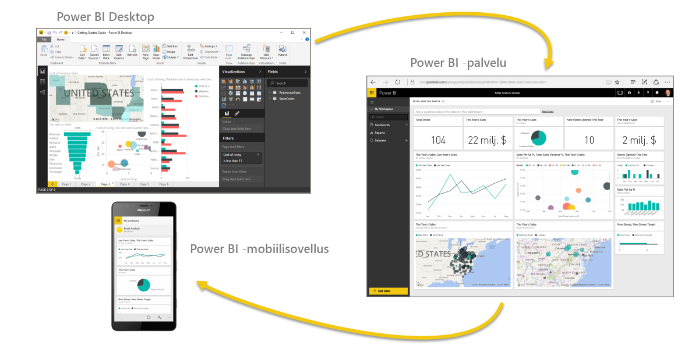

Tervetuloa Power BI:n **Ohjattu oppiminen** -kurssille. Verkkokurssissa käydään läpi Power BI:n ominaisuuksia järjestyksessä alkeista yhä edistyneempiin aiheisiin, joten voit kartuttaa osaamistasi luontevasti ja omaan tahtiin.

Kurssi tarjoaa ohjeita helposti omaksuttavissa annoksissa ja siten, että käsitteet, tiedot ja esimerkit esitellään loogisessa järjestyksessä. Oppimisen tueksi on tarjolla myös paljon havaintomateriaalia ja videoita.

**Ohjattu oppiminen** -kurssi sisältää useita **osioita**, joista kukin sisältää useita **aiheita**. Tämän **Aloittaminen**-osion muutaman ensimmäisen aiheen jälkeen lähes jokainen aihe sisältää opittavaa sisältöä kuvaavan videon. Videon alla olevassa tekstissä opittava käsite selitetään tarkemmin, joten voit tutustua siihen ja opetella sen omaan tahtiisi.

Jos olet Power BI:n käyttäjänä vielä **aloittelija**, tämän kurssin avulla pääset hyvään vauhtiin. **Kokeneille käyttäjille** kurssista on apua käsitteiden vetämisessä yhteen ja mahdollisten aukkopaikkojen täyttäjänä. Pyrimme lisäämään kurssiin entistäkin enemmän sisältöä jatkossa. Toivottavasti viihdyt oppimisen parissa!

## Mikä on Power BI?
**Power BI** on kokoelma ohjelmistopalveluja, sovelluksia ja yhdistimiä, jotka yhdessä muuntavat toisiinsa liittymättömistä lähteistä peräisin olevan tiedon johdonmukaisiksi, visuaalisesti vaikuttaviksi ja vuorovaikutteisiksi näkemyksiksi. **Power BI:n** avulla voit helposti muodostaa yhteyden tietolähteisiin, jotka voivat olla lähes mitä tahansa yksinkertaisesta Excel-laskentataulukosta kokoelmaan pilvipohjaisia ja paikallisia hybriditietovarastoja. Voit löytää ja visualisoida tärkeät tiedot sekä jakaa tulokset kaikille tarvittaville tahoille.

**Power BI:tä** voi käyttää yksinkertaisesti ja nopeasti, kun on tarve tuottaa merkityksellisiä tietoja Excel-taulukosta tai paikallisesta tietokannasta käden käänteessä. **Power BI** on kuitenkin myös järeä ja monipuolinen suuryritystason työkalu, joka sopii laajamittaiseen mallintamiseen, reaaliaikaiseen analytiikkaan ja mukautettavaan kehittämiseen. Näin ollen se toimii yhtä sujuvasti henkilökohtaisena raportointi- ja visualisointityökaluna kuin analytiikka- ja päätöksentekovälineenä ryhmäprojekteille, yksiköille ja kokonaisille organisaatioille.

## Power BI:n osat
Power BI koostuu **Power BI Desktop** -nimisestä Windows-työpöytäsovelluksesta ja **Power BI -palvelusta**, joka on verkkopohjainen SaaS (*ohjelmisto palveluna*) -tuote. Lisäksi siihen kuuluvat Power BI **-mobiilisovellukset**, jotka ovat saatavilla Windows-puhelimille ja -tableteille sekä iOS- ja Android-laitteille.

Jokainen osista – **työpöytäsovellus**, **verkkopalvelu** ja **mobiilisovellukset** – on suunniteltu siten, että merkityksellisten liiketoimintatietojen tuottaminen, jakaminen ja hyödyntäminen on mahdollisimman tehokasta kunkin käyttäjän tai hänen roolinsa kannalta.

## Power BI:n tuki käyttäjärooleille
Power BI:n käyttämisen tapa voi riippua roolistasi projektissa tai tiimissä. Vastaavasti muissa rooleissa toimivat voivat käyttää sitä omilla tavoillaan.

Saatat itse käyttää ensisijaisesti **Power BI -palvelua**, kun taas runsaasti laskentatehoa vaativia liiketoimintaraportteja tuottava kollegasi luottaa **Power BI Desktopiin** – ja julkaisee Desktop-raportit sitten Power BI -palveluun tarkasteltaviksesi. Toinen kollega myynnin puolelta voi käyttää pääasiassa Power BI -puhelinsovellusta myyntitavoitteidensa seurantaan ja uusien liiditietojen tutkimiseen.

Saatat käyttää **Power BI:n** eri osia aina sen mukaan, mitä on tarkoitus saavuttaa tai mikä roolisi on tietyssä projektissa tai tehtävässä.

Voit esimerkiksi tarkastella varastotilannetta tai valmistumisprosessin etenemistä palvelun reaaliaikaisessa koontinäytössä ja käyttää myös **Power BI Desktopia** raporttien luomiseen tiimillesi asiakkaiden osallistamistilastoista. Power BI:n käyttötapa voi perustua siihen, mikä Power BI:n ominaisuus tai palvelu on kulloinkin tilanteeseesi paras työkalu, mutta kaikki sen osat ovat silti aina saatavillasi – joustavasti ja kätevästi.

Käsittelemme jokaista kolmea osaa eli **työpöytäsovellusta**, **verkkopalvelua** ja **mobiilisovelluksia** yksityiskohtaisemmin hieman myöhemmin tällä **Ohjattu oppiminen** -kurssilla. Tulevissa artikkeleissa myös luomme raportteja Power BI Desktopissa, jaamme niitä palvelussa ja pureudumme niihin mobiililaitteella.

## Työnkulut Power BI:ssä
Tyypillinen Power BI -työnkulku alkaa raportin luomisesta **Power BI Desktopissa**. Sen jälkeen raportti julkaistaan Power BI **-palveluun** ja jaetaan **Power BI Mobile** -sovellusten käyttäjien käytettäväksi.

Toki prosessi ei aina etene näin, mutta tämän työnkulun avulla autamme sinua oppimaan Power BI:n eri osien toiminnan ja tavat, joilla ne täydentävät toisiaan.

Nyt meillä on yleinen käsitys kurssin sisällöstä ja Power BI:stä sekä sen kolmesta pääelementistä. Katsotaan seuraavaksi, miten **Power BI:tä** käytetään.

