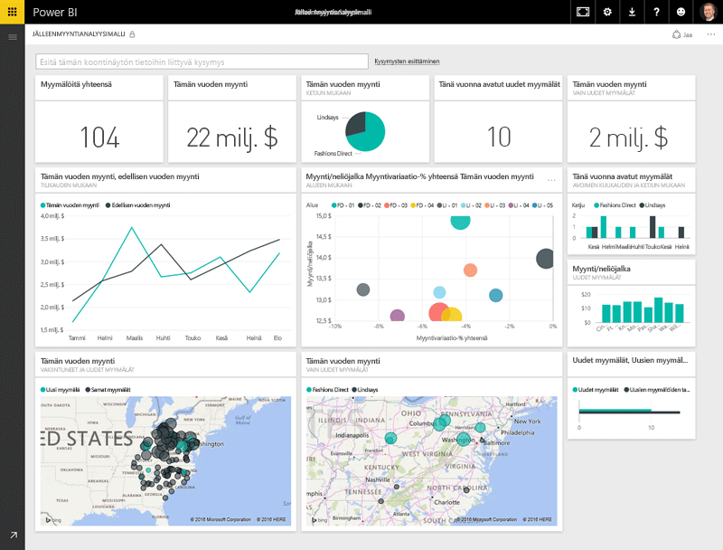
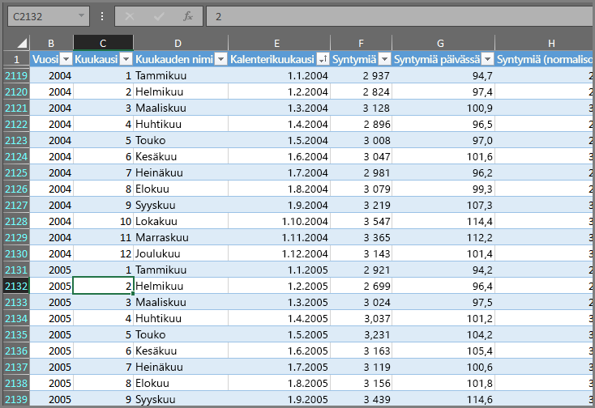
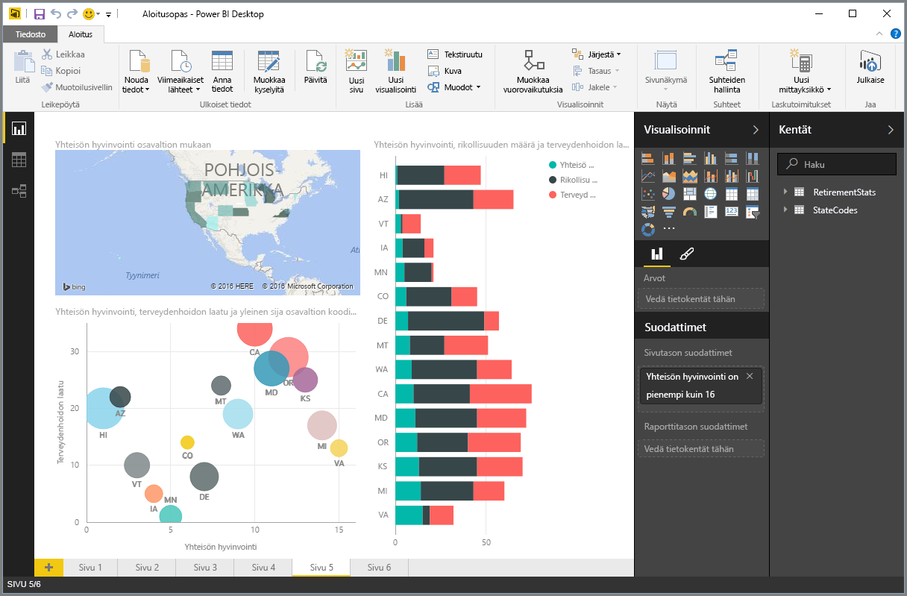
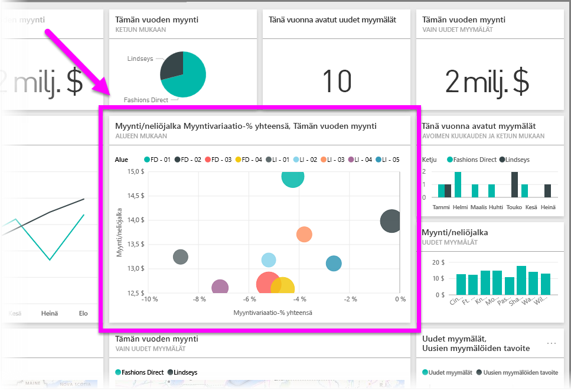

Kaikki Power BI:ssä tehtävät asiat voidaan jakaa muutamiin **peruselementteihin**. Kun olet sisäistänyt nämä peruselementit, voit ryhtyä laajentamaan tietämystäsi jokaisesta ja aloittaa yksityiskohtaisten ja monipuolisten raporttien tekemisen. Lopultahan jopa monimutkaisimmilta näyttävät asiat rakentuvat peruselementeistä aivan niin kuin rakennukset puusta, teräksestä, betonista ja lasista tai autot metallista, kankaasta ja kumista. Niin rakennukset kuin autotkin voivat olla rakenteeltaan yksinkertaisia tai monimutkaisia riippuen siitä, miten niiden peruselementit on järjestelty.

Seuraavaksi tutustumme Power BI:n peruselementteihin ja niillä suoritettaviin perustason tehtäviin. Saat myös maistiaisen sen monimutkaisemmista mahdollisuuksista.

Power BI:n peruselementit ovat

* visualisoinnit
* tietojoukot
* raportit
* koontinäytöt
* ruudut.

## Visualisoinnit
**Visualisointi** on tietojen esitys **visuaalisessa** muodossa, kuten kaaviona, diagrammina tai värikoodattuna karttana. Sen tarkoituksena on näyttää tiedot mielenkiintoisella ja havainnollisella tavalla. Power BI:ssä on tarjolla paljon erilaisia visualisointityyppejä, ja uusia lisätään jatkuvasti. Seuraavassa kuvassa on kokoelma erilaisia Power BI -palvelussa luotuja visualisointeja.

Visualisointi voi olla hyvin yksinkertainen, kuten jotakin merkittävää asiaa esittävä yksittäinen numero. Se voi olla myös hyvin monipuolinen, kuten liukuvärjätty kartta, joka esittää äänestäjien suhtautumista tiettyyn yhteiskunnalliseen aiheeseen. Tavoitteena on esittää tiedot siten, että ne saavat kontekstin ja mahdollistavat näkemysten muodostamisen, mikä pelkkää numerotaulukkoa tai tekstimassaa tutkimalla olisi vaikeaa.

## Tietojoukot
**Tietojoukko** on kokoelma tietoja, joista Power BI luo visualisoinnit.

Voit käyttää yksinkertaista tietojoukkoa, joka perustuu Excel-työkirjan yksittäiseen taulukkoon. Tällaisen näet seuraavassa kuvassa.

**Tietojoukot** voivat olla myös yhdistelmiä monista erilaisista tietolähteistä, joista voi suodattaa ja yhdistää ainutlaatuisen tietokokoelman (tietojoukon) Power BI:ssä käytettäväksi.

Voit esimerkiksi luoda tietojoukon kolmesta erilaisesta tietokantakentästä, yhdestä verkkosivuston taulukosta, Excel-taulukosta ja sähköpostikampanjan verkossa olevista tuloksista. Tätä ainutlaatuista yhdistelmää käsitellään silti yhtenä **tietojoukkona**, vaikka tiedot on koottu monista eri lähteistä.

Voit keskittyä itsellesi merkityksellisimpiin tietoihin suodattamalla ne ennen tuomista Power BI:hin. Voit esimerkiksi suodattaa yhteystietojen tietokannan siten, että tietojoukkoon sisällytetään vain kampanjasähköpostin vastaanottaneita asiakkaita. Sen jälkeen voit luoda visualisoinnin tämän kampanjaan kuuluneiden asiakkaiden alijoukon (suodatetun kokoelman) perusteella. Suodattaminen auttaa keskittymään tärkeisiin tietoihin – ja se säästää aikaa ja vaivaa.

Tärkeä ja hyödyllinen osa Power BI:tä on siihen sisältyvä laaja valikoima tietojen **yhdistimiä**. Power BI:n sisäänrakennettujen yhdistimien avulla voit helposti tuoda tietoja tietojoukkoon ja tarvittaessa suodattaa niitä. Tarvittavat tiedot voivat olla vaikkapa Excelissä, SQL-tietokannassa, Azuressa tai Oraclessa tai erilaisissa palveluissa, kuten Facebookissa, Salesforcessa tai MailChimpissa.

Kun tietojoukko on tuotu, voit ryhtyä luomaan visualisointeja, jotka esittävät tietojoukon eri osia erilaisilla tavoilla ja mahdollistavat näkemysten muodostamisen tiedoista. Sitten on aika keskittyä raportteihin.

## Raportit
Power BI:ssä **raportilla** tarkoitetaan visualisointien kokoelmaa yhdellä tai useammalla sivulla. Power BI:n tuottama **raportti** on kokoelma toisiinsa liittyviä kohteita – aivan kuin mikä tahansa muukin raportti, kuten myyntiesitys tai kouluesitelmä. Seuraavassa kuvassa näet **raportin** Power BI Desktopissa. Tässä tapauksessa kyseessä on kuusisivuisen raportin viides sivu. Raportteja voi luoda myös Power BI -palvelussa.

Raportteihin voi sisällyttää useita visualisointeja tarvittaessa useille eri sivuille. Niitä voi järjestellä esityksen viestin kannalta parhaaseen järjestykseen.

Voit luoda raportin kvartaalin myyntiluvuista, tuotesegmentin kasvusta tai vaikkapa jääkarhujen vaellusreiteistä. Oli aihe mikä tahansa, raporttien avulla voit kerätä ja järjestää visualisointeja tarvittavalle sivumäärälle.

## Koontinäytöt
Kun olet valmis jakamaan raportin yksittäisen sivun tai kokoelman visualisointeja, voit luoda **koontinäytön**. Power BI **-koontinäyttö** on muille käyttäjille jaettava ja yhdelle sivulle koottu kokoelma visualisointeja, jota voi verrata esimerkiksi auton kojelaudan mittaristoon. Yleensä se on valittu ryhmä visualisointeja, jotka esittävät pähkinänkuoressa halutut tiedot tai esille tuotavan viestin.

Koontinäytön on mahduttava yhdelle sivulle eli Power BI Desktopin tai Power BI -palvelun tyhjälle taustalle, jota kutsutaan myös kankaaksi. Se onkin kuin taidemaalarin käyttämä kangas: työtila, jossa luodaan, yhdistetään ja muokataan mielenkiintoisia ja mukaansatempaavia visualisointeja.
Koontinäyttöjä voi jakaa muille käyttäjille tai ryhmille, jotka voivat käyttää niitä Power BI -palvelussa tai mobiililaitteillaan.

## Ruudut
Power BI:ssä **ruudulla** tarkoitetaan raportissa tai koontinäytössä olevaa yksittäistä visualisointia. Se on neliön muotoinen laatikko, jonka sisällä visualisointi on. Seuraavassa kuvassa näet yhden ruudun (kirkkaalla laatikolla korostettuna), joka on muiden ruutujen ympäröimä.

Kun *luot* raporttia tai koontinäyttöä Power BI:ssä, voit siirrellä ja järjestellä ruutuja sen mukaan, miten haluat informaation esittää. Voit kasvattaa ruutujen kokoa, korkeutta ja leveyttä sekä etäisyyttä toisistaan.

Kun *tarkastelet* sinulle *jaettua* koontinäyttöä tai raporttia, jota et itse omista tai ole itse luonut, voit kyllä käyttää sitä, mutta et voi muuttaa ruutujen kokoa tai paikkaa.

## Yhteenveto
Olemme nyt käsitelleet Power BI:n perusteita ja elementtejä, joista se koostuu. Kerrataanpa hieman.

Power BI on kokoelma palveluja, sovelluksia ja yhdistimiä, joiden avulla voit muodostaa yhteyden tietoihin niiden sijainnista riippumatta. Tiedot voi tarvittaessa suodattaa ja tuoda Power BI:hin, jossa voit luoda niistä kiinnostavia visualisointeja muille jaettaviksi.  

Kun nyt tunnet Power BI:n peruselementit, pystyt luomaan tietojoukkoja, jotka ovat merkityksellisiä *juuri itsesi kannalta*, ja luomaan visuaalisesti kiinnostavia raportteja viestisi välittämiseksi tehokkaasti. Power BI:llä välitettävien viestien ei tarvitse olla monimutkaisia tai monisäikeisiä ollakseen mukaansatempaavia.

Osalle käyttäjistä vain yhden Excel-taulukon käyttäminen tietojoukkona ja koontinäytön jakaminen tiimille voi olla äärimmäisen arvokas tapa käyttää Power BI:tä.

Toiset taas saavat Power BI:stä tarvitsemansa hyödyn käyttämällä reaaliaikaisia Azure SQL -tietovarastotaulukoita yhdistettynä muihin tietokantoihin ja reaaliaikaisiin lähteisiin sekä suodattamalla tiedot tietojoukoksi, joka valvoo valmistusprosessin etenemistä hetki hetkeltä.

Kummallekin käyttäjäryhmälle prosessi on sama: koosta tietojoukko, luo kiinnostavia visualisointeja ja jaa ne muille. Vastaavasti myös tulos on sama kummallakin: jatkuvasti kasvavan tietomäärän hallinta ja muuttaminen toteutuskelpoisiksi näkemyksiksi.

Power BI auttaa alkuun nopeasti riippumatta siitä, edellyttääkö näkemysten aikaansaaminen yksinkertaisia vai monimuotoisia tietojoukkoja. Käyttöä voi skaalata juuri niin suuriin mittoihin kuin käsiteltävä tiedon määrä tarvitsee. Lisäksi Power BI on Microsoftin tuote, joten se on taatusti tehokas, kattava, laajennettava ja Office-yhteensopiva sekä sopii kaikenkokoisille yrityksille.

Tutustutaan seuraavaksi sen toimintaan. Aloitetaan katsauksella Power BI -palveluun.

