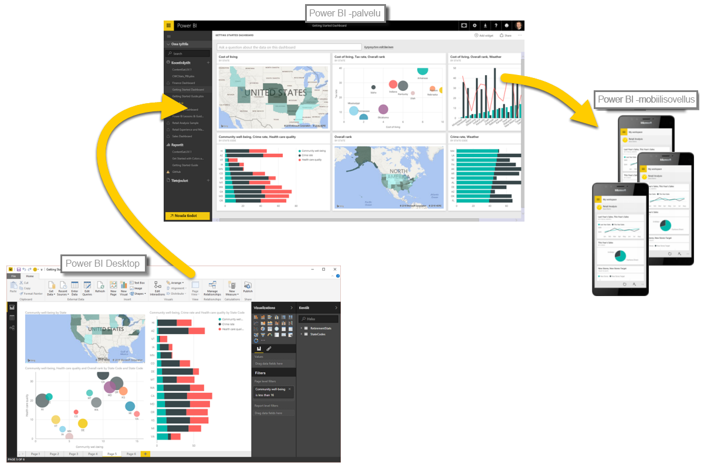

Power BI:n perusteet ovat nyt hallussa, joten voimme siirtyä käytännön kokeilun ja ohjatun esittelyn pariin. Videoesittelyn vetää **Will Thompson**, joka on Microsoftin Power BI -tiimin ohjelmajohtaja. Myöhemmässä vaiheessa kurssia nähdään myös vierailevia esiintyjiä.

Kun Will kuvailee Power BI:n monia mahdollisuuksia, kannattaa muistaa, että kaikki nämä tehtävät toimet ja analyysit noudattavat yleensä samaa järjestystä. Toimien **yleinen kulku** on Power BI:ssä seuraava:

* Tuo tiedot Power BI Desktopiin ja luo raportti.
* Julkaise Power BI -palveluun, jossa voit luoda uusia visualisointeja ja koontinäyttöjä.
* Jaa koontinäytöt muille, erityisesti toimistosta poissa oleville.
* Tarkastele jaettuja koontinäyttöjä ja raportteja ja tee niille toimia Power BI -mobiilisovelluksissa.

Kuten aiemmin mainittiin, voit aivan hyvin käyttää yksinomaan **Power BI -palvelua**, noutaa tietoja ja luoda koontinäyttöjä. Joku toinen tiimisi jäsen saattaa puolestaan käyttää yksinomaan **Power BI Desktopia**. Esittelemme sinulle Power BI:n koko jatkumon ja sen täydet mahdollisuudet kokonaan, minkä jälkeen voit itse päättää, miten sitä parhaiten hyödynnät.

Annetaan Willin nyt opastaa ratkaisun käyttämisessä. Tärkeysjärjestyksessä ensimmäisenä on ymmärtää Power BI:n peruselementit. Se muodostaa hyvän perustan, kun siirrymme oppimaan Power BI:n tapoja muuttaa tiedot näyttäviksi raporteiksi ja visualisoinneiksi. 

