Tässä aiheessa tarkastellaan lähemmin sitä, miten Power BI:n kaksi ensimmäistä osaa sopivat yhteen:

* raportin luominen **Power BI Desktopissa**
* raportin julkaiseminen **Power BI -palvelussa**.

Aloitamme Power BI Desktopissa valitsemalla **Nouda tiedot**. Näet kokoelman valittavia tietolähteitä. Seuraavassa kuvassa valitaan lähteeksi verkkosivu, ja videossa yllä Will valitsi **Excel**-työkirjan.

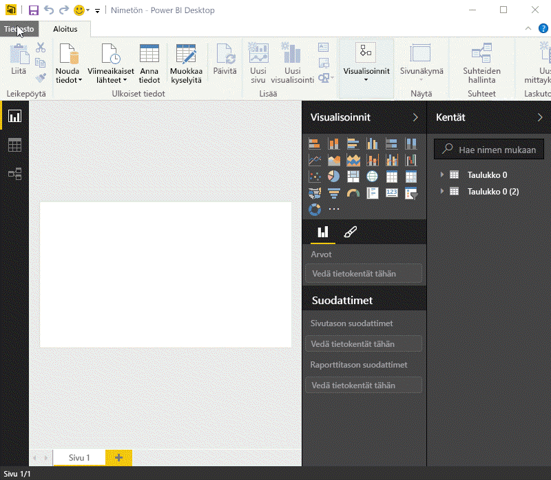

Power BI muodostaa yhteyden valitsemaasi tietolähteeseen ja näyttää lähteessä saatavilla olevat tiedot. Seuraavassa kuvassa on esimerkkinä verkkosivu, joka analysoi eri osavaltioita ja eläkkeelle jäämiseen liittyviä tietoja.

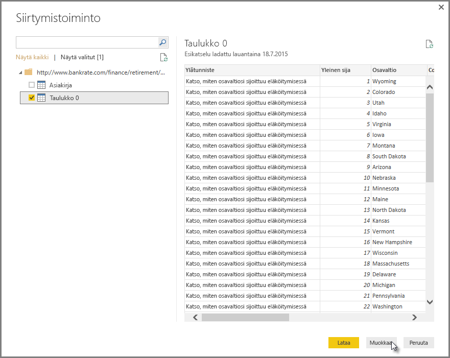

Raportin luominen aloitetaan Power BI Desktopin **Raportti**-näkymässä.

**Raportti**-näkymässä on viisi pääaluetta:

1. Valintanauha sisältää raportteihin ja visualisointeihin liittyvä yleisimmät tehtävät.
2. **Raportti**-näkymä eli kangas on paikka, jossa visualisointeja luodaan ja järjestellään.
3. Alaosassa olevalla **Sivut**-välilehtialueella voit valita tai lisätä raporttisivun.
4. **Visualisoinnit**-ruudussa voi esimerkiksi muuttaa visualisointeja, mukauttaa värejä tai akseleita, käyttää suodattimia ja siirtää kenttiä.
5. **Kentät**-ruudussa olevia kyselyelementtejä ja suodattimia voi vetää **Raportti**-näkymään tai **Visualisoinnit**-ruudun **Suodattimet**-alueelle.

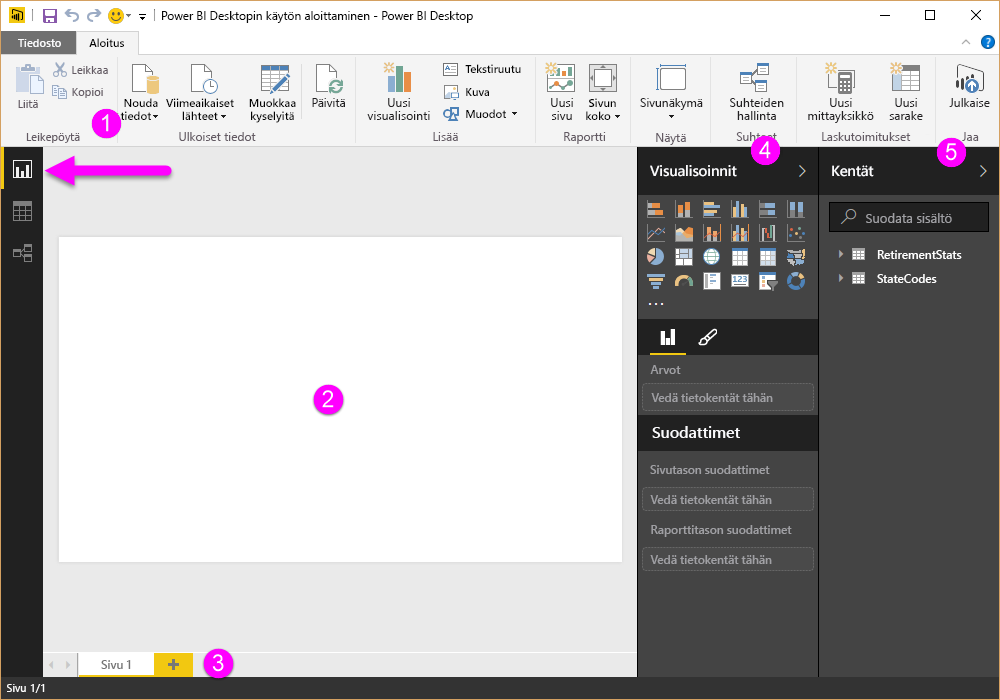

**Visualisoinnit**- ja **Kentät**-ruudut voi kutistaa valitsemalla reunassa olevan pienen nuolen, jolloin **Raportti**-näkymään jää enemmän tilaa näyttävien visualisointien luomiselle. Visualisointeja muokatessasi näet myös ylös ja alas osoittavat nuolet, joilla osion voi laajentaa tai kutistaa.

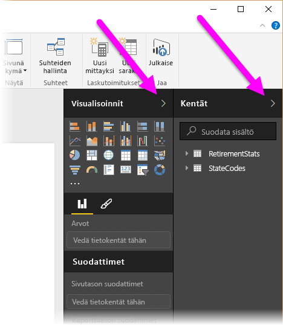

Aloita visualisoinnin luominen vetämällä kenttä **Kentät**-luettelosta **Raportti**-näkymään. Tässä tapauksessa voimme vetää State-kentän *RetirementStats*-luettelosta ja katsoa, mitä tapahtuu.

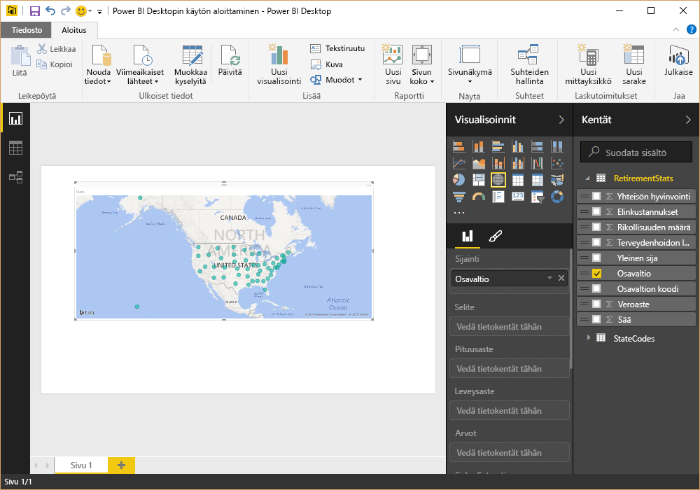

Vaikuttavaa, eikö totta? Power BI Desktop loi automaattisesti karttapohjaisen visualisoinnin, koska se tunnisti, että State-kenttä sisälsi maantieteellistä sijaintia kuvaavia tietoja.

Voimme harpata nyt prosessissa hieman eteenpäin. Olemme luoneet muutamia visualisointeja sisältävän raportin, jonka haluamme nyt julkaista Power BI -palveluun.  Valitse Power BI Desktopin **Aloitus**-valintanauhasta **Julkaise**.

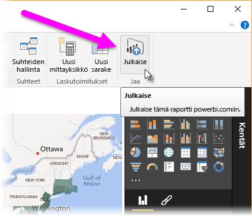

Sinua pyydetään kirjautumaan sisään Power BI:hin.

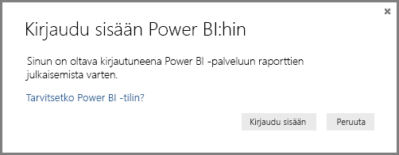

Kun olet kirjautunut sisään ja julkaisuprosessi on valmis, näet seuraavan valintaikkunan. Valitsemalla **Onnistui**-kohdan alla olevan linkin siirryt Power BI -palveluun, jossa voit nähdä juuri julkaisemasi raportin.

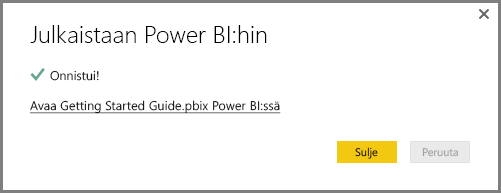

Kun kirjaudut sisään Power BI:hin, näet juuri palvelussa julkaisemasi Power BI Desktop -tiedoston. Alla olevassa kuvassa Power BI Desktopissa luotu raportti näkyy **Raportit**-osiossa.

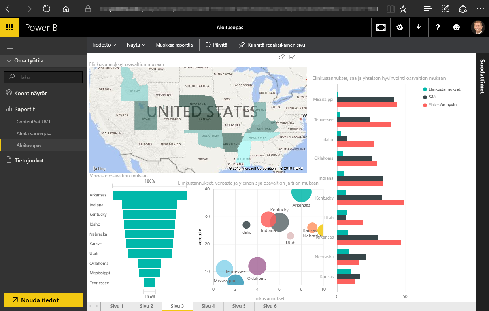

Visualisoinnin voi kiinnittää koontinäyttöön valitsemalla raportin **Kiinnitä**-kuvakkeen. Seuraavassa kuvassa Kiinnitä-kuvake on korostettu kirkkaalla laatikolla ja nuolella.

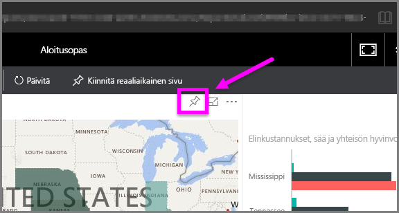

Kun valitsen sen, näen seuraavan valintaikkunan ja voin kiinnittää visualisoinnin olemassa olevaan koontinäyttöön tai luoda uuden koontinäytön.

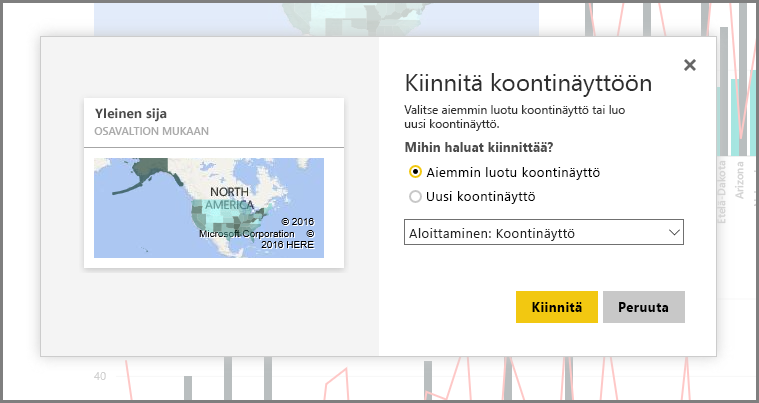

Kun kiinnitämme pari visualisointia raportista, näemme ne koontinäytössä.

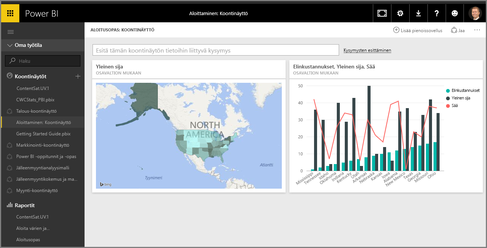

Power BI:ssä voi tehdä toki paljon muutakin, kuten jakaa luotuja koontinäyttöjä. Jakamista käsitellään myöhemmin tällä kurssilla.

Seuraavaksi tarkastellaan ominaisuutta, joka voi luoda automaattisesti koontinäyttöjä puolestasi muodostamalla yhteyden pilvipalveluun, kuten Facebookiin tai Salesforceen.

