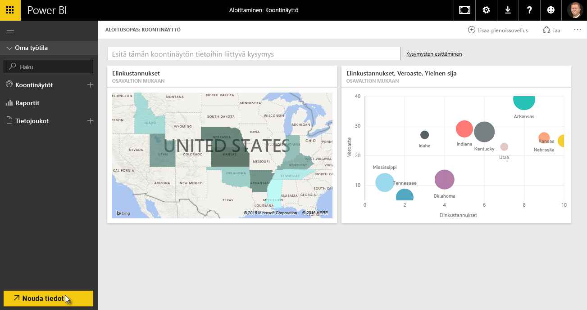
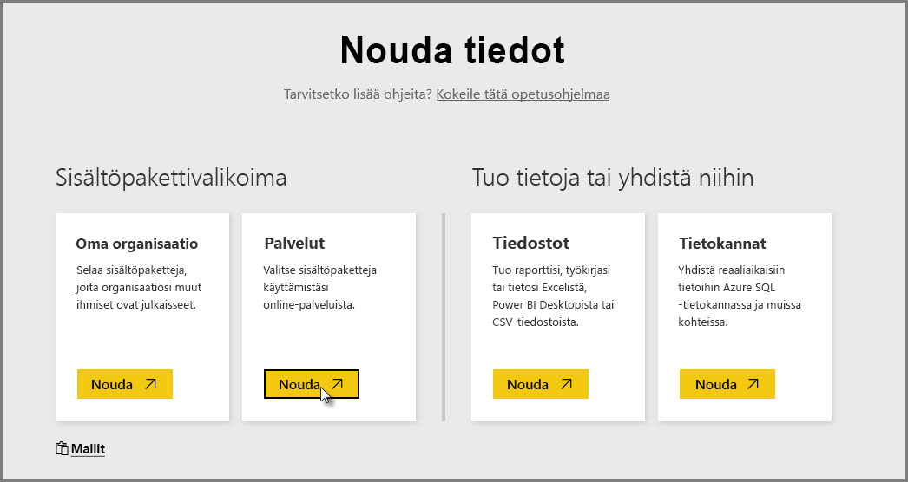
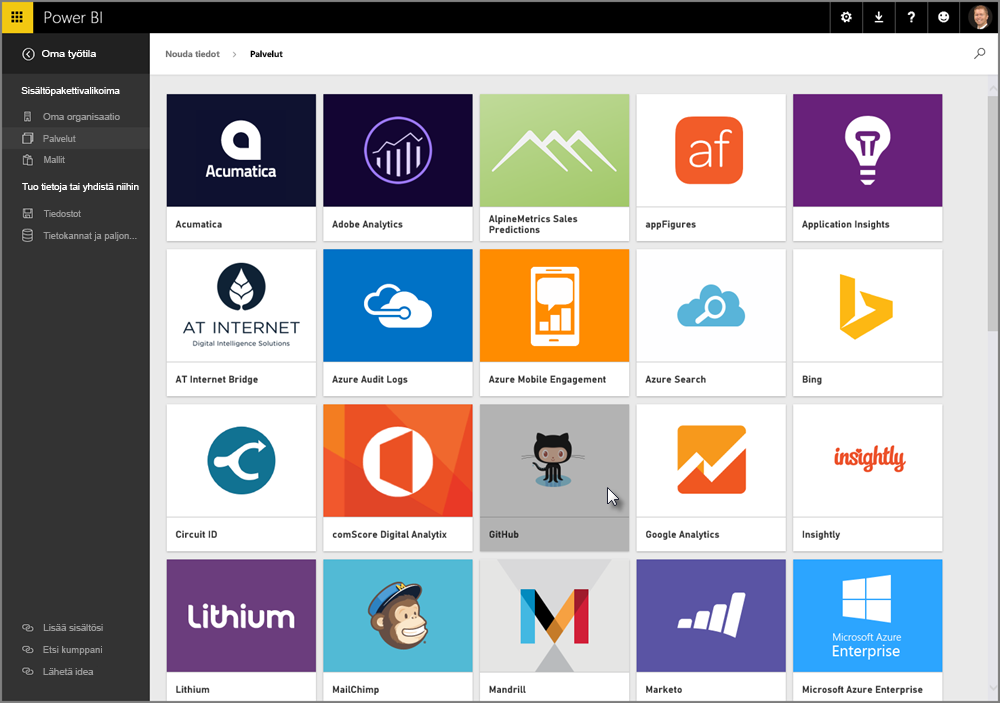
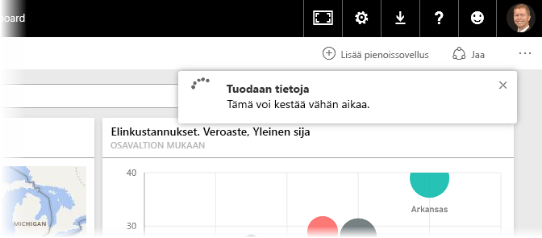
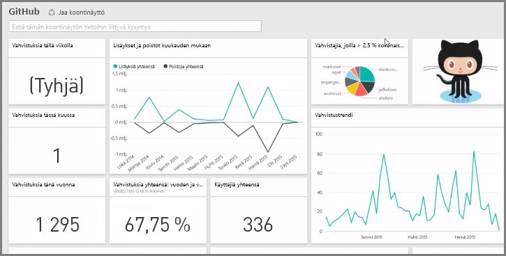
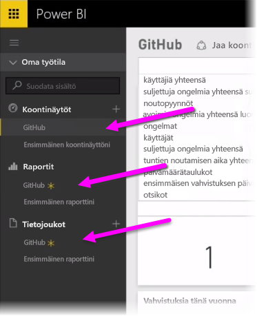
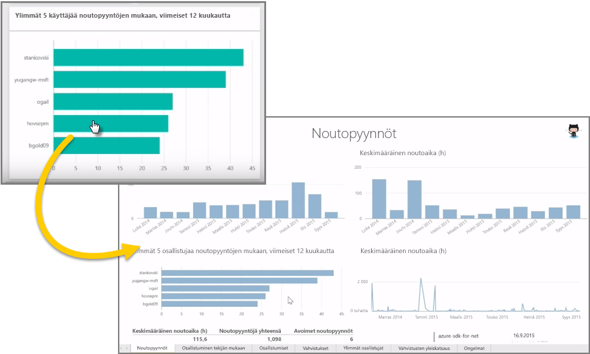
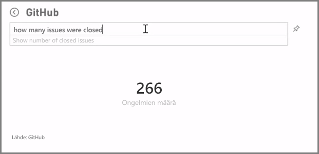
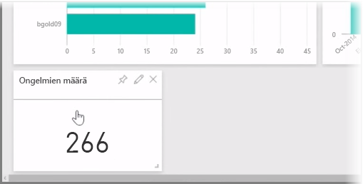
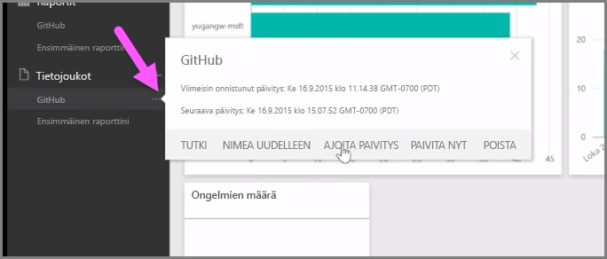

Kuten olemme oppineet, yleinen työnkulku Power BI:ssä on raportin luominen Power BI Desktopissa ja julkaiseminen Power BI -palvelussa sekä sen jakaminen muille palvelussa tai mobiilisovelluksessa tarkasteltavaksi.

Osa käyttäjistä aloittaa kuitenkin Power BI -palvelulla, joten tutustutaan pikaisesti siihen sekä helppoon ja suosittuun tapaan luoda visualisointeja nopeasti Power BI *-sisältöpaketeilla*.

**Sisältöpaketti** on kokoelma esimääritettyjä ja valmiita visualisointeja ja raportteja, jotka perustuvat tiettyihin tietolähteisiin, kuten Salesforceen. Sisältöpaketin käyttäminen on tavallaan kuin lämmittäisi valmisaterian mikrossa: vain parilla napsautuksella ja kommentilla saat nopeasti käyttöösi kokoelman hyvin yhteensopivia elementtejä käyttövalmiina ja siistinä pakettina.

Tutustutaan siis sisältöpaketteihin ja palveluun sekä niiden toimintaan. Tässä tarjoillaan vain hieman esimakua, sillä sisältöpaketteihin ja palveluun pureudutaan tarkemmin tulevissa osiossa.

## Käyttövalmiiden koontinäyttöjen luominen pilvipalvelujen avulla
Power BI:ssä yhteyden muodostaminen tietolähteisiin on helppoa. Power BI -palvelussa tarvitsee vain valita **Nouda tiedot** -painike aloitusnäytön vasemmasta alakulmasta.

*Kankaalla* eli Power BI -palvelun näytön keskellä olevalla alueella näet palvelussa saatavilla olevat tietolähteet. Yleisimpien tietolähteiden, kuten Excel-tiedostojen, tietokantojen tai Azure-tietojen, lisäksi Power BI voi aivan yhtä vaivattomasti muodostaa yhteyden **ohjelmistopalveluihin** eli SaaS-palveluntarjoajiin tai pilvipalveluihin. Niitä ovat esimerkiksi Salesforce, Facebook ja Google Analytics.

Näille ohjelmistopalveluille **Power BI -palvelu** tarjoaa **sisältöpaketeiksi** kutsutun valikoiman valmiita koontinäyttöihin järjesteltyjä visualisointeja ja raportteja. Sisältöpakettien ansiosta Power BI:n käytön aloittaminen valitun palvelun tiedoilla onnistuu nopeasti. Jos käytät esimerkiksi Salesforce-sisältöpakettia, Power BI muodostaa yhteyden omaan Salesforce-tiliisi antamillasi tunnistetiedoilla ja tuottaa tiedoista esimääritellyn kokoelman visualisointeja ja koontinäyttöjä Power BI:hin.

Power BI:ssä on sisältöpaketteja monenlaisia palveluja varten. Seuraavassa kuvassa näet palvelujen ensimmäisen näytön aakkosjärjestyksessä. Näet näytön, kun valitset **Nouda**-valinnan **Palvelut**-ruudussa (edellisessä kuvassa). Kuten alla oleva kuva näyttää, valittavaa on runsaasti.

Valitsemme nyt **GitHubin**. GitHub verkkolähteiden hallintaan kehitetty sovellus. Kun annan GitHub-sisältöpaketin edellyttämät tiedot ja tunnistetiedot, tietojeni tuonti alkaa.

Kun tiedot on ladattu, näemme esimääritetyn GitHub-sisältöpaketin koontinäytön.

**Koontinäytön** lisäksi tarjolle tulee myös GitHub-sisältöpaketin osana luotu **raportti**, jonka perusteella koontinäyttö tehtiin. Samoin voit nähdä tuonnin aikana muodostetun **tietojoukon** eli kokoelman GitHubista noudettuja tietoja, joista GitHub-raportti luotiin.

Voit napsauttaa mitä tahansa koontinäytön visualisointia, jolloin siirryt sille **raportin** sivulle, josta visualisointi on luotu. Joten kun napsautat **Top 5 users by pull requests** -nimistä visualisointia, Power BI avaa raportin **Pull Requests** -sivun, joka on visualisoinnin pohjana.

## Kysymysten esittäminen tiedoista
Tiedoista voi myös esittää kysymyksiä, jolloin Power BI -palvelu luo reaaliajassa visualisoinnin kysymyksen perusteella. Seuraavassa kuvassa näet, miten Power BI luo numerovisualisoinnin, joka kuvaa loppuun käsiteltyjen ongelmien määrää **luonnollisen kielen mukaisen kyselyn** palkkiin kirjoitetun tekstin perusteella.

Parhaat visualisoinnit voit kiinnittää koontinäyttöön luonnollisen kielen kyselyn palkin oikealla puolella olevalla **Kiinnitä**-kuvakkeella. Tässä tapauksessa visualisointi kiinnitetään GitHub-koontinäyttöön, joka on valittuna.

## Tietojen päivittäminen Power BI -palvelussa
Sisältöpaketin tietojoukkoa tai muita Power BI:ssä käytettäviä tietoja on mahdollista **päivittää**. Määritä päivitysasetukset valitsemalla tietojoukon vieressä oleva ellipsikuvake (kolme pistettä), jolloin avautuu valikko.

Valitse valikon alaosasta **Ajoita päivitys** -vaihtoehto. Kankaalle avautuu Asetukset-valintaikkuna, jossa voit määrittää päivitysasetukset haluamiksesi.

Tässä oli pikakatsaus Power BI -palveluun. Palvelussa voi tehdä paljon muitakin asioita, joita käsitellään myöhemmin tällä kurssilla. Muista myös, että mahdollisia käytettäviä tietotyyppejä ja sisältöpaketteja on monia erilaisia – ja uusia lisätään jatkuvasti.

Siirrytään seuraavaksi **Aloittaminen**-osion yhteenvetoon, jossa myös kerrotaan, mitä on luvassa seuraavaksi.

