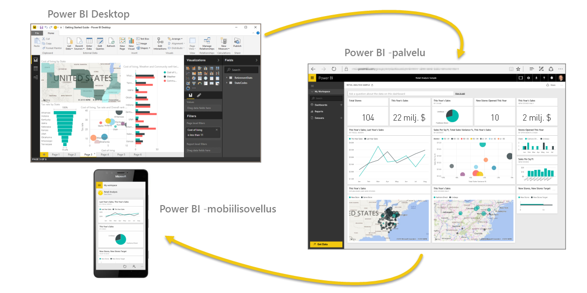
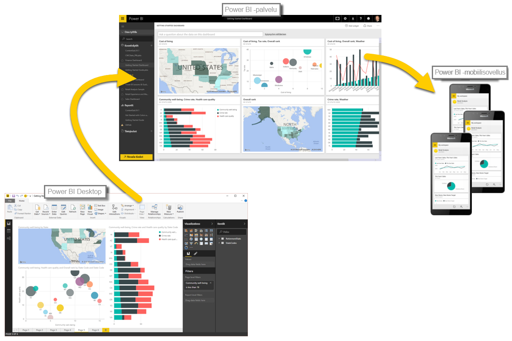

Kerrataan nopeasti ensimmäisessä osiossa opitut asiat.

**Power BI** on kokoelma ohjelmistopalveluja, sovelluksia ja yhdistimiä, jotka yhdessä muuntavat tiedon vuorovaikutteisiksi näkemyksiksi. Voit käyttää tietoja yksittäisistä lähteistä, kuten Excel-työkirjasta, tai noutaa tietoja useista tietokannoista ja pilvilähteistä monimuotoisiin tietojoukkoihin ja raportteihin. Power BI:tä voi käyttää yhtä hyvin yksinkertaisiin tehtäviin kuin suuryrityksen globaalin liiketoiminnan monitahoisiin tarpeisiin.

Power BI:n pääkomponentit – **Power BI Desktop**, **Power BI -palvelu** ja **Power BI Mobile** – mahdollistavat tietojen luomisen, käyttämisen, jakamisen ja kuluttamisen juuri niin kuin haluat.

Käsittelimme myös Power BI:n peruselementtejä:

* **Visualisoinnilla** tarkoitetaan tietojen esittämistä visuaalisessa muodossa.
* **Tietojoukko** on kokoelma tietoja, joista Power BI luo visualisoinnit.
* **Raportti** on yksi- tai useampisivuinen kokoelma tietojoukosta luotuja visualisointeja.
* **Koontinäyttö** on raportin pohjalta luotu yhden sivun kokoelma visualisointeja.
* **Ruutu** on raportissa tai koontinäytössä oleva yksittäinen visualisointi.

Seuraavaksi tutustuimme Power BI:hin **Will Thompsonin** vetämässä videoesittelyssä. Will antoi pikaisen yleiskatsauksen tietojen analysointiin ja visualisointiin Power BI:ssä.

<!---
In **Power BI Desktop**, we connected to a basic Excel file, created visualizations, then published those visualizations to the service. Even if you use Power BI only with your Excel workbooks, you can gain amazing visual insights with those Excel workbooks, and both interact and share it in ways never before possible.
-->
**Power BI -palvelussa** loimme koontinäytön vain parilla napsautuksella. Jatkoimme tutustumista Power BI -palveluun käyttämällä **sisältöpakettia**, joka on valmiiksi luotu kokoelma visualisointeja ja raportteja. Muodostimme yhteyden **ohjelmistopalveluun**, jonka tiedot tuotiin sisältöpakettiin ja herätettiin eloon.

Esitimme myös kysymyksen tiedoista luonnollisella kielellä joita kutsutaan **Q & A**, jolloin Power BI loi visualisointeja kysymyksen pohjalta. Viimeiseksi määritimme tiedoille **päivitysaikataulun**, jotta seuraavalla kerralla Power BI:tä käyttäessämme tiedämme, että tiedot ovat ajan tasalla.

## Seuraavat vaiheet
**Onneksi olkoon!** Olet nyt suorittanut ensimmäisen osion Power BI:n **Ohjattu oppiminen** -kurssista. Sinulla on nyt hyvät pohjatiedot seuraavaksi tulevaa **Tietojen noutaminen** -osiota varten. Siinä käsitellään Power BI:n työnkulun seuraavaa loogista vaihetta.

Painotetaan vielä kerran, että tällä kurssilla kehität osaamistasi Power BI:n tavallisen työnkulun mukaisesti:

* Tuo tiedot **Power BI Desktopiin** ja luo raportti.
* **Julkaise** Power BI -palveluun, jossa voit luoda uusia visualisointeja ja koontinäyttöjä.
* **Jaa** koontinäytöt muille, erityisesti toimistosta poissa oleville.
* Tarkastele jaettuja koontinäyttöjä ja raportteja ja tee niille toimia **Power BI -mobiilisovelluksissa**.

Kaikkia näitä tehtäviä et välttämättä tarvitse itse, sillä osa käyttäjistä vain tarkastelee palvelussa muiden luomia koontinäyttöjä. *Käyt* joka tapauksessa läpi kaikki nämä osiot tällä kurssilla, joten opit *ymmärtämään*, miten koontinäytöt luodaan ja miten ne liittyvät tietoihin. Ehkäpä innostut luomaan sellaisen itsekin.

Nähdään seuraavassa osiossa!

