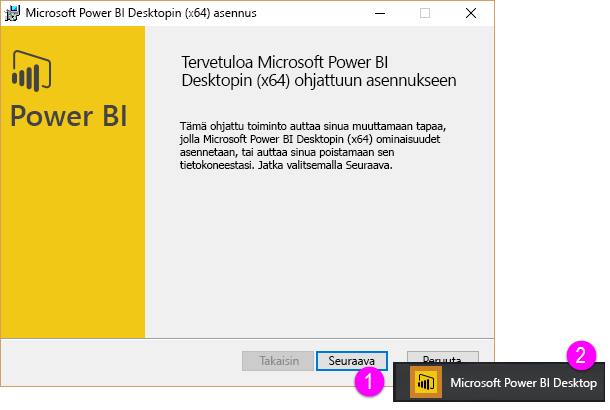

Tervetuloa Power BI:n **Ohjattu Oppiminen** -kurssin toiseen osioon, jonka nimi on **Tietojen hankkiminen**. Tässä osiossa tutustutaan Power BI:n moniin tietokeskeisiin ominaisuuksiin ja työkaluihin. Painopiste on Power BI Desktopissa. Monia työkaluja voi käyttää myös Power BI -palvelussa, joten opiskelemalla tämän osion lyöt kaksi kärpästä yhdellä iskulla.

Joskus noutamasi tiedot eivät ole niin käyttökelpoisessa muodossa tai *puhtaita* kuin toivoisit. Tässä osiossa opitkin, miten tiedot noudetaan ja miten ne puhdistetaan (tätä kutsutaan joskus tietojen *suodatukseksi* tai *muuntamiseksi*). Lisäksi saat muutamia tietojen noutamista helpottavia lisävinkkejä.

Kuten kaikissa tämän kurssin osioissa, oppiminen etenee Power BI:n työnkulun mukaisesti. Tutustutaanpa siis **Power BI Desktopiin**, josta prosessi usein alkaa.

## Power BI Desktopin yleiskatsaus
Power BI Desktop on työkalu, jolla tietoihin voi muodostaa yhteyden ja jolla niitä voi suodattaa ja visualisoida. Power BI Desktopin avulla voit muodostaa yhteyden tietoihin ja mallintaa ja visualisoida niitä eri tavoin. Useimmat liiketoimintatietoprojekteissa työskentelevät käyttäjät viettävät suurimman osan ajastaan Power BI Desktopin parissa.

**Power BI Desktopin** voi ladata [verkosta](http://go.microsoft.com/fwlink/?LinkID=521662) tai Power BI -palvelusta tai asentaa sovelluksena [**Windows-kaupasta**](http://aka.ms/pbidesktopstore). Jos haluat ladata **Power BI Desktopin** palvelusta, napsauta Power BI:n oikeassa yläkulmassa olevaa alanuolipainiketta ja valitse sitten Power BI Desktop.

Power BI Desktop asennetaan Windows-tietokoneeseen sovelluksena.

Kun siis olet kerran ladannut sen, voit asentaa Power BI Desktopin ja käyttää sitä kuten muitakin Windows-sovelluksia. Seuraava kuva esittää Power BI Desktopin aloitusnäyttöä, joka avautuu, kun sovellus käynnistetään.

Power BI Desktop muodostaa yhteyden moniin erilaisiin tietolähteisiin, niin paikallisiin tietokantoihin kuin pilvipalveluihin tallennettuihin Excel -laskentataulukoihin. Sen avulla voit suodattaa ja muotoilla tietoja entistä käyttökelpoisempaan muotoon esimerkiksi jakamalla sarakkeita ja nimeämällä ne uudelleen, muuttamalla tietotyyppejä sekä työskentelemällä päivämäärien parissa. Voit myös luoda suhteita sarakkeiden välille mallinnuksen ja analysoinnin helpottamiseksi.

