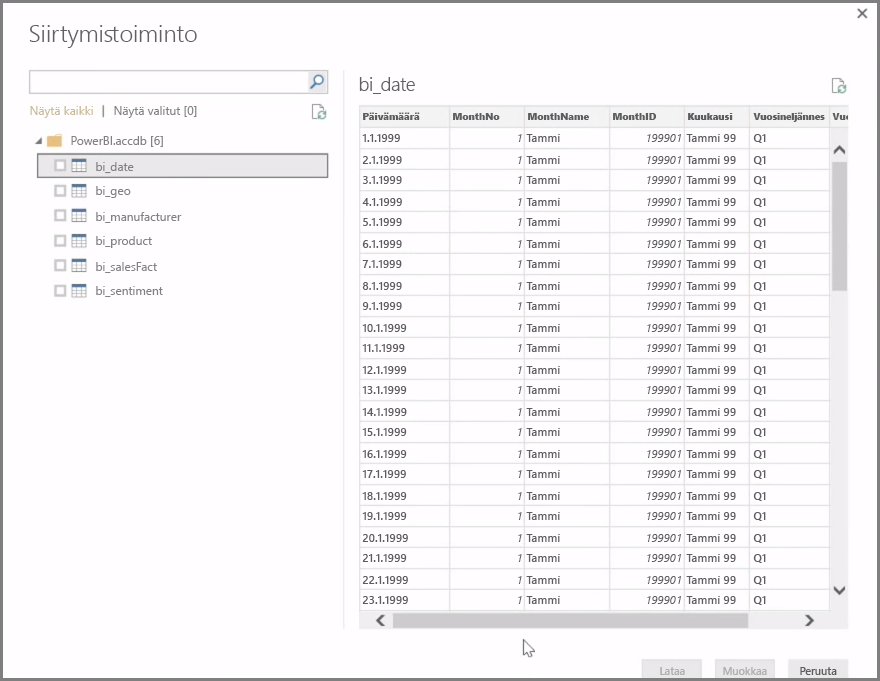

**Power BI Desktop** voi muodostaa yhteyden moniin erilaisiin tietolähteisiin, esimerkiksi paikallisiin tietokantoihin, Excel-työkirjoihin ja pilvipalveluihin. Tällä hetkellä yli 59 eri pilvipalvelulla, kuten GitHubilla ja Marketolla, on erityiset liittimet, ja yleisiin lähteisiin voi muodostaa yhteyden XML:n, CSV:n, tekstin ja ODBC:n avulla. Power BI voi kerätä taulukkomuotoisia tietoja jopa suoraan sivuston URL-osoitteesta. Aloitetaan kuitenkin alusta avaamalla Power BI Desktop ja muodostamalla yhteys tietoihin.

Kun käynnistät **Power BI Desktopin** ja siirryt aloitusnäytön ohi, voit valita **Aloitus**-välilehden valintanauhasta Nouda tiedot -toiminnon.

Power BI Desktopia päivitetään kuukausittain, ja jokaisen päivityksen myötä **Power BI Desktopin Uudet ominaisuudet** -sivulla julkaistaan päivitysten tiedot, blogiin johtavat linkit ja latauslinkki.

Power BI Desktopissa voi käyttää monia erilaisia tietolähteitä. Muodosta yhteys valitsemalla haluamasi lähde. Valintasi mukaan sinua kehotetaan etsimään lähde tietokoneelta tai verkosta tai todentamaan pyyntösi kirjautumalla palveluun.

Kun yhteys on muodostettu, ensimmäiseksi avautuu **Siirtymistoiminto**-ikkuna. Siirtymistoiminto-ikkunassa näytetään tietolähteen taulukot tai entiteetit, ja napsauttamalla jotakin niistä voit esikatsella sen sisältöä. Valitut taulukot tai entiteetit voi tuoda välittömästi, tai tietoja voi ensin muuntaa ja suodattaa valitsemalla **Muokkaa**.

Kun olet valinnut Power BI Desktopiin siirrettävät taulukot, voit ladata ne Power BI Desktopiin napsauttamalla **Siirtymistoiminto-ikkunan** oikeassa alakulmassa sijaitsevaa **Lataa**-painiketta. Toisinaan saatat kuitenkin haluta tehdä muutoksia taulukoihin ennen niiden lataamista Power BI Desktopiin. Ehkä haluat tarkastella vain tiettyä asiakkaiden alijoukkoa tai suodattaa tiedot vain tietyssä maassa tapahtuneista myynneistä. Tällaisissa tilanteissa voit napsauttaa Muokkaa-painiketta ja suodattaa tai muuntaa tiedot ennen kuin siirrät ne kaikki Power BI Desktopiin.

Jatkamme tästä tietojen muokkaamiseen seuraavassa osiossa.

