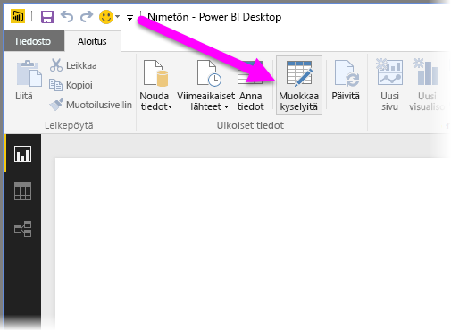
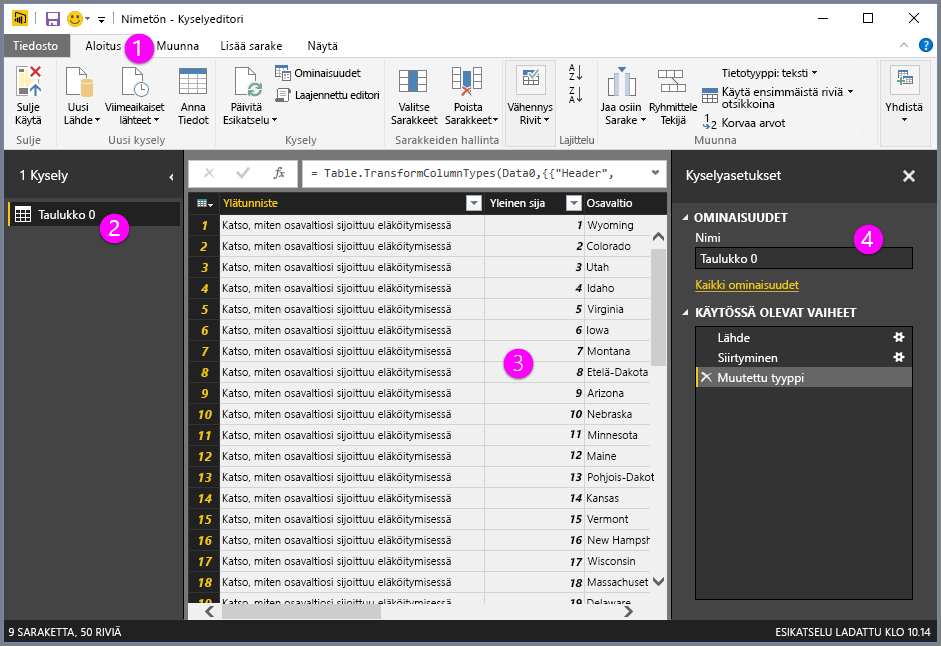
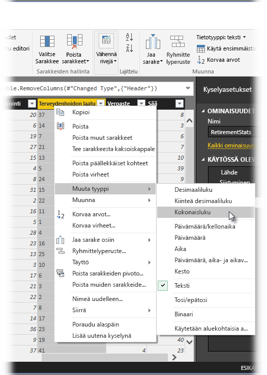
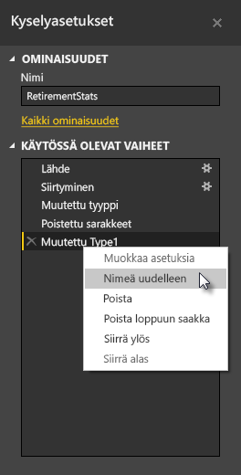
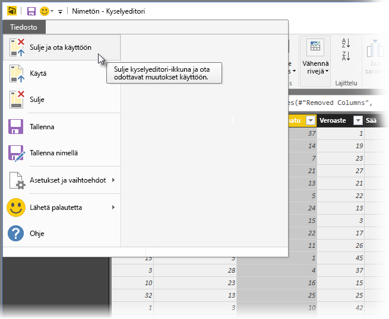
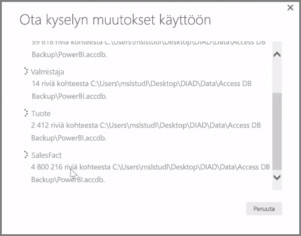

**Power BI Desktopiin** sisältyy **kyselyeditori**, jolla tietoja voi muovata ja muuntaa tehokkaasti malleihin ja visualisointeihin sopivaan muotoon. Kun valitset Siirtymistoiminto-ikkunasta Muokkaa-työkalun, kyselyeditori käynnistyy ja tietolähteestä valitsemasi taulukot tai muut entiteetit lisätään siihen.

**Kyselyeditorin** voi käynnistää myös suoraan **Power BI Desktopista** **Aloitus**-valintanauhan **Muokkaa kyselyitä** -painikkeella.

Kun muovattavat tiedot on ladattu kyselyeditoriin, näkyvissä on useita osia:

1. Valintanauhassa on nyt useita aktiivisia painikkeita, joiden avulla kyselyn tietoja voi käsitellä.
2. Vasemmassa ruudussa on luettelo kyselyistä (yksi jokaista taulukkoa tai entiteettiä kohden), jotka voi valita ja joita voi tarkastella ja muovata.
3. Keskiruudussa näkyvät valitun kyselyn tiedot valmiina muovattavaksi.
4. Kyselyasetukset-ikkunassa näytetään luettelo kyselyn ominaisuuksista ja käytössä olevista vaiheista.

Kun jotakin keskiruudun saraketta napsautetaan hiiren kakkospainikkeella, näkyviin tulee useita erilaisia muuntamistoimintoja, kuten sarakkeen poistaminen taulukosta, sarakkeen monistaminen uudella nimellä sekä arvojen korvaaminen. Tässä valikossa voi myös jakaa tekstisarakkeita useampaan osaan yhteisillä erottimilla.

**Kyselyeditori**-valintanauhassa on lisätyökaluja, joilla voi esimerkiksi muuttaa sarakkeiden tietotyyppiä, lisätä tieteellisen merkinnän tai poimia viikonpäivän kaltaisia elementtejä päivämääristä.

Kun teet muunnoksia, jokainen vaihe näkyy **Kyselyasetukset**-ruudun **Käytössä olevat vaiheet** -luettelossa **Kyselyeditorin** oikealla puolella. Tämän luettelon avulla voit kumota tai tarkastella yksittäisiä muutoksia tai jopa muuttaa vaiheen nimeä. Voit tallentaa muunnokset valitsemalla **Aloitus**-välilehdessä **Sulje ja ota käyttöön**.

Kun valitset **Sulje ja ota käyttöön** -toiminnon, kyselyeditori ottaa tekemäsi muutokset käyttöön kyselyssä ja käyttää niitä Power BI Desktopissa.

**Kyselyeditorissa** tietoja voi muuntaa monin eri tavoin, ja käytettävissä on myös erityismuunnoksia. Seuraavassa osiossa perehdytään joihinkin tällaisiin erityismuunnoksiin, jotta saat käsityksen niistä lukemattomista tavoista, joilla tietoja voi **kyselyeditorissa** muuntaa.

