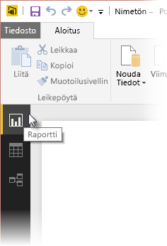
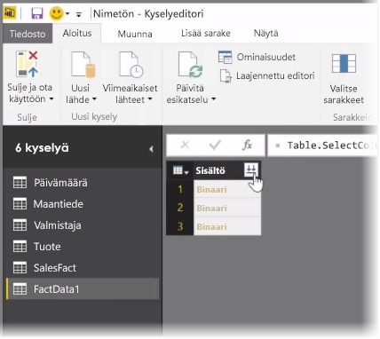
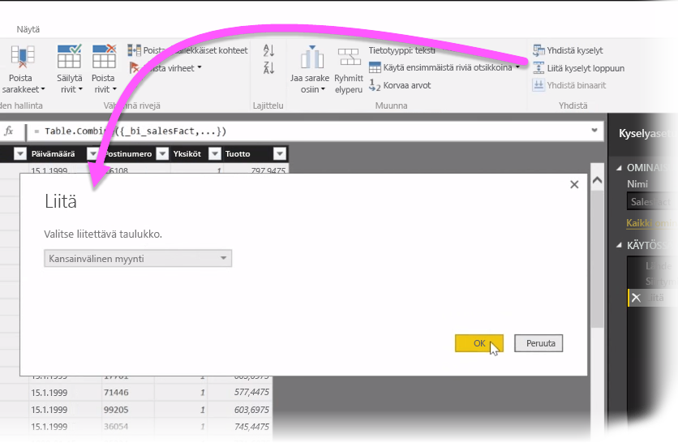
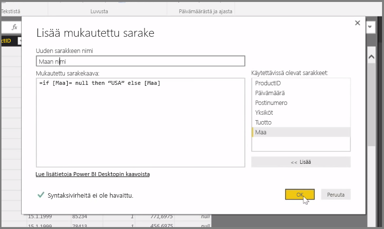

Tässä artikkelissa tutustutaan joihinkin **Power BI Desktopin** edistyneisiin tietojen tuonti- ja suodatustekniikoihin. Kun olet muovannut tietoja **kyselyeditorissa** ja siirtänyt ne **Power BI Desktopiin**, voit tarkastella niitä eri tavoilla. Power BI Desktopissa on kolme näkymää: **Raportti**-näkymä, **Tiedot**-näkymä ja **Suhteet**-näkymä. Pääset kuhunkin näkymään napsauttamalla pohjan vasemmassa yläkulmassa haluamasi näkymän kuvaketta. Seuraavassa kuvassa valittuna on **Raportti**-näkymä. Kuvakkeen vieressä näkyvä keltainen palkki osoittaa, mikä näkymä on aktiivinen.

Näkymää voi vaihtaa napsauttamalla jommankumman muun näkymän kuvaketta. Kuvakkeen vieressä näkyvä keltainen palkki osoittaa, mikä näkymä on aktiivinen.

Power BI Desktop voi yhdistää monien eri lähteiden tietoja yhteen raporttiin milloin tahansa mallinnusprosessin aikana. Jos haluat lisätä uusia lähteitä olemassa olevaan raporttiin, valitse ensin **Aloitus**-valintanauhasta **Muokkaa kyselyitä** ja sitten **kyselyeditorista** **Uusi lähde**.

**Power BI Desktopissa** voi käyttää monia erilaisia tietolähteitä, myös kansioita. Muodostamalla yhteyden kansioon voit tuoda kerralla tietoja useista tiedostoista, esimerkiksi Excel- tai CSV-tiedostojen sarjasta. Valitun kansion sisältämät tiedostot näkyvät **kyselyeditorissa** binaarisisältönä, ja niiden arvot voi ladata napsauttamalla **Sisältö**-sarakkeen yläosassa sijaitsevaa kaksoisnuolikuvaketta.

Yksi Power BI:n hyödyllisimmistä työkaluista ovat *Suodattimet*. Esimerkiksi sarakkeen vieressä olevan avausnuolen napsauttaminen avaa tekstisuodattimien tarkistusluettelon, jonka avulla mallista voi poistaa arvoja.

Kyselyitä voi myös yhdistää ja liittää, ja useista taulukoista (tai kansioissa olevien eri tiedostojen tiedoista) voi muodostaa yhden taulukon, joka sisältää pelkästään tarvitut tiedot. **Liitä kyselyt loppuun** -työkalun avulla uuden taulukon tietoja voi lisätä jo olemassa olevaan kyselyyn. Power BI Desktop yrittää sovittaa sarakkeet kyselyihin, joita voi tämän jälkeen muokata tarpeen mukaan **kyselyeditorissa**.

**Lisää mukautettu sarake** -työkalu tarjoaa kokeneille käyttäjille mahdollisuuden kirjoittaa kyselylausekkeita alusta alkaen tehokkaalla M-kielellä. Voit lisätä M-kyselykielen lausekkeisiin perustuvan mukautetun sarakkeen ja muokata tietoja juuri sellaisiksi kuin itse haluat.

