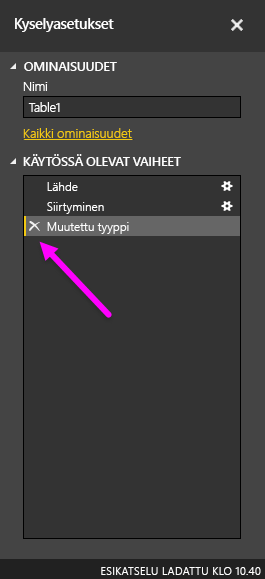

Power BI voi tuoda tietoja lähes mistä tahansa lähteestä, mutta sen visualisointi- ja mallinnustyökalut toimivat parhaiten, jos tiedot on järjestetty sarakkeisiin. Toisinaan tietoja ei muotoilla yksinkertaisiin sarakkeisiin, kuten usein Excel-laskentataulukoissa, joissa ihmissilmille selkeä taulukko ei välttämättä sovellu parhaalla mahdollisella tavalla automatisoituihin kyselyihin. Seuraavassa laskentataulukossa on esimerkiksi käytetty otsikoita, jotka ulottuvat usean sarakkeen alueelle.

Power BI:ssä on kuitenkin työkaluja, joilla usean sarakkeen taulukot voi muuntaa nopeasti käyttökelpoisiksi tietojoukoiksi.

## Tietojen transponointi
Esimerkiksi **kyselyeditorin** **Transponoi**-toiminnolla tiedot voi kääntää (muuttamalla sarakkeet riveiksi ja rivit sarakkeiksi) siten, että niiden erottelu käsiteltäviin muotoihin onnistuu.

Kun olet tehnyt tämän muutaman kerran videossa esitetyllä tavalla, taulukkosi alkaa muovautua Power BI:lle paremmin sopivaan muotoon.

## Tietojen muotoilu
Sinun on ehkä myös muotoiltava tietoja, jotta Power BI pystyy luokittelemaan ja tunnistamaan ne oikein tuonnin jälkeen.

Muutamalla muunnoksella, esimerkiksi *korottamalla rivejä otsikoiksi* väliotsikoita varten, muuttamalla *tyhjäarvot* samassa sarakkeessa ylä- tai alapuolella oleviksi arvoiksi **Täyttö**-toiminnolla sekä **poistamalla sarakkeiden pivotoinnin**, voit puhdistaa tiedot sellaiseksi tietojoukoksi, jota voit käyttää Power BI:ssä.

Power BI:n avulla voit kokeilla tällaisia muunnoksia ja löytää ne tavat, joiden avulla saat tietosi Power BI:lle sopivaan sarakemuotoon. Muistathan, että kaikki suorittamasi toimenpiteet tallennetaan kyselyeditorin Käytössä olevat vaiheet -osaan. Jos muunnos ei toimi odotetulla tavalla, voit kumota sen helposti napsauttamalla kyseisen vaiheen vieressä olevaa **x**-kuvaketta.

## Visualisointien luominen
Kun tiedot on muunnettu ja puhdistettu Power BI:lle sopivaan muotoon, voit aloittaa visualisointien luomisen.

## Seuraavat vaiheet
**Onnittelut!** Olet nyt suorittanut tämän osion Power BI:n **Ohjattu oppiminen** -kurssista. Nyt osaat **noutaa tietoja** Power BI Desktopiin sekä *muovata* tai *muuntaa* niitä vakuuttavien visualisointien luomista varten.

Jotta ymmärtäisit vielä paremmin, miten Power BI toimii ja miten saat sen toimimaan *sinulle sopivalla tavalla*, perehdy seuraavaksi **mallinnukseen**. Kuten jo tiedätkin, Power BI:n peruselementti on **tietojoukko**, mutta jotkin tietojoukot voivat olla monitahoisia ja perustua moniin erilaisiin tietolähteisiin. Joskus sinun on lisättävä oma panoksesi (tai *kenttä*) luomaasi tietojoukkoon.

Seuraavassa osiossa opit lisää **mallinnuksesta** ja lisäksi paljon muutakin. Nähdään siellä!

