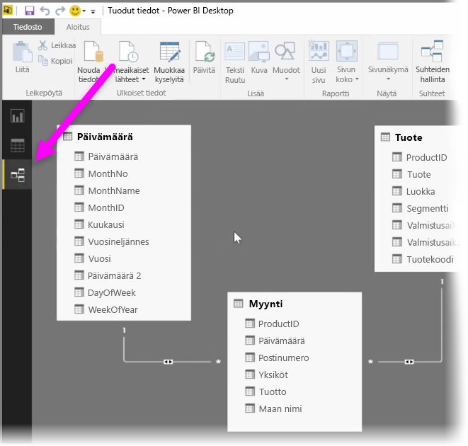
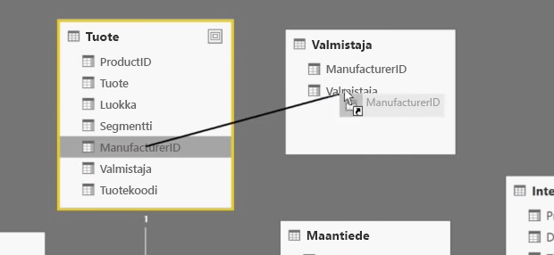
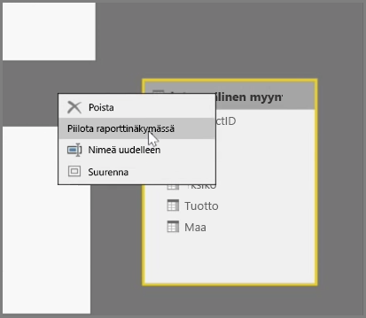
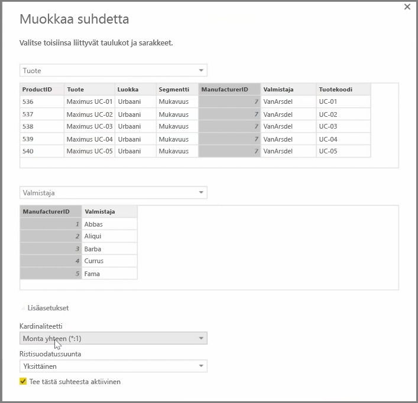

Power BI:n avulla voit määrittää taulukkojen tai elementtien välisen suhteen visuaalisesti. Voit tarkastella tietojasi kaaviomuodossa **Suhde-näkymän** avulla. Se sijaitsee uloimpana vasemmalla raporttipohjan vieressä.

**Suhteet**-näkymässä on kutakin taulukkoa ja sen sarakkeita edustava lohko, ja lohkojen väliset viivat edustavat suhteita.

Suhteiden lisääminen ja poistaminen on yksinkertaista. Jos haluat poistaa suhteen, napsauta sitä hiiren kakkospainikkeella ja valitse **Poista**. Jos haluat luoda suhteen, vedä ja pudota taulukoiden väliset linkitettävät kentät.

Jos haluat piilottaa taulukon tai yksittäisen sarakkeen raportista, napsauta sitä Suhde-näkymässä hiiren kakkospainikkeella ja valitse **Piilota raporttinäkymässä**.

Jos haluat tarkemman kuvan tietojen suhteista, valitse **Aloitus**-välilehdessä **Suhteiden hallinta**. Näyttöön avautuu **Suhteiden hallinta** -valintaikkuna, jossa suhteet näkyvät luettelona visuaalisen kaavion sijaan. Tästä näkymästä voit hakea uusien tai päivitettyjen tietojen suhteita valitsemalla **Automaattinen tunnistus**. Voit muokata suhteita manuaalisesti **Suhteiden hallinta** -valintaikkunassa olevalla **Muokkaa**-toiminnolla. Samassa valintaikkunassa on myös lisäasetuksia suhteiden *kardinaliteetin* ja *ristisuodatuksen* määrittämiseksi.

Kardinaliteetin asetusvaihtoehdot ovat *Monta yhteen* ja *Yksi yhteen*. *Monta yhteen* on fakta dimensioon -tyyppinen suhde (esimerkiksi myyntitaulukko, jossa kullakin tuotteella on monta riviä, joka yhdistetään taulukkoon, jossa jokainen tuote on yhdellä rivillä). *Yksi yhteen* -asetusta käytetään usein viitetaulukoiden yksittäisten merkintöjen linkittämiseen.

Suhteiden oletusarvoisena määrityksenä on ristisuodatus molempiin suuntiin. Ristisuodatus vain yhteen suuntaan rajoitti suhteen mallinnusominaisuuksia.

Kun tietojen väliset suhteet on tarkasti määritetty, voit luoda monimutkaisia laskutoimituksia useiden tietoelementtien välille.

