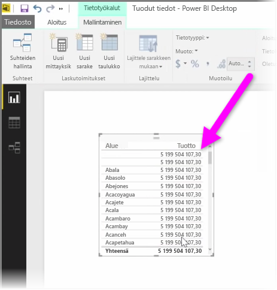
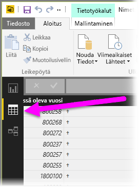
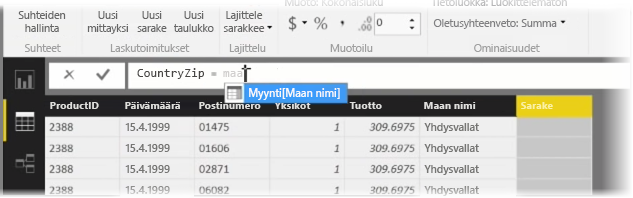
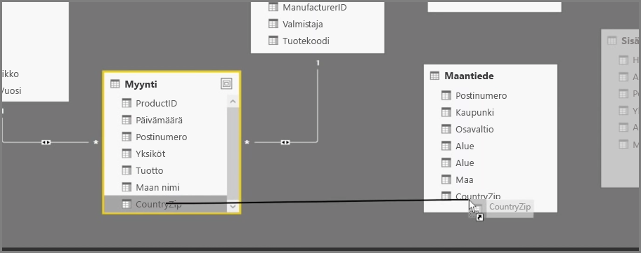
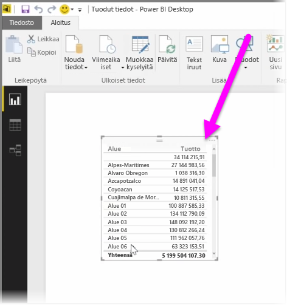

Laskettujen sarakkeiden luominen on helppo tapa rikastaa ja tehostaa tietoja. **Laskettu sarake** on uusi sarake, joka luodaan määrittämällä laskutoimitus, joka muuntaa tai yhdistää vähintään kaksi olemassa olevan tietoelementtiä. Voit esimerkiksi luoda uuden sarakkeen yhdistämällä kaksi saraketta.

Lasketun sarakkeen luominen on hyödyllistä esimerkiksi silloin, kun haluat muodostaa suhteen taulukoiden välille eikä suhteen muodostamiseen käytettävää yksilöivää kenttää ole olemassa. Suhteen puuttuminen käy selväksi, kun luot yksinkertaisen taulukkovisualisoinnin Power BI Desktopissa ja huomaat, että kaikissa merkinnöissä on sama arvo, vaikka tiedät, että pohjana olevissa tiedoissa on eroja.

Luodaksesi suhteen yksilöivien kenttien avulla voit esimerkiksi luoda uuden lasketun sarakkeen nimeltä Koko puhelinnumero yhdistämällä tiedoissa jo olevat Suuntanumero- ja Puhelinnumero-sarakkeiden arvot. Lasketut sarakkeet ovat hyödyllisiä työkaluja, joilla mallien ja visualisointien luominen onnistuu nopeasti.

Voit luoda lasketun sarakkeen valitsemalla Power BI Desktopin raporttipohjan vasemmalta puolelta **Tiedot-näkymän**.

Valitse Mallinnus-välilehdestä **Uusi sarake**. Tällöin saat käyttöön kaavarivin, johon voit kirjoittaa laskutoimituksia DAX (Data Analysis Expressions) -kielellä. DAX on tehokas kaavakieli, jolla voi laatia raskaitakin laskutoimituksia. Sitä käytetään myös Excelissä. Kun kirjoitat kaavaa, Power BI Desktop auttaa ja nopeuttaa kaavan laatimista näyttämällä sopivia kaavoja tai tietoelementtejä.

Power BI -kaavarivi ehdottaa tiettyjä DAX-funktioita ja aiheeseen liittyviä tietosarakkeita, kun kirjoitat lauseketta.

Kun jokaiseen taulukkoon on luotu lasketut sarakkeet, niitä voi käyttää yksilöivänä avaimena, jonka avulla niiden välille voi luoda suhteen. Voit tämän jälkeen luoda suhteen valitsemalla **Suhde**-näkymän ja vetämällä kentän yhdestä taulukosta toiseen.

Kun palaat **Raportti**-näkymään, näet jokaisella alueella eri arvon.

Laskettuja sarakkeita luomalla voi tehdä paljon muutakin.

