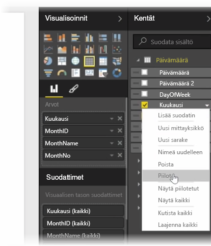
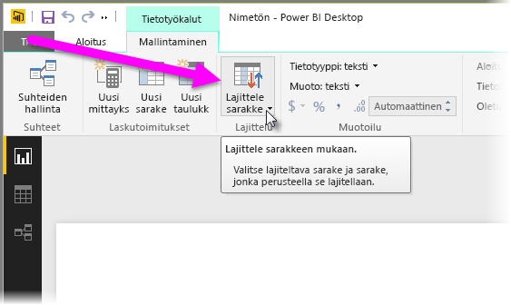
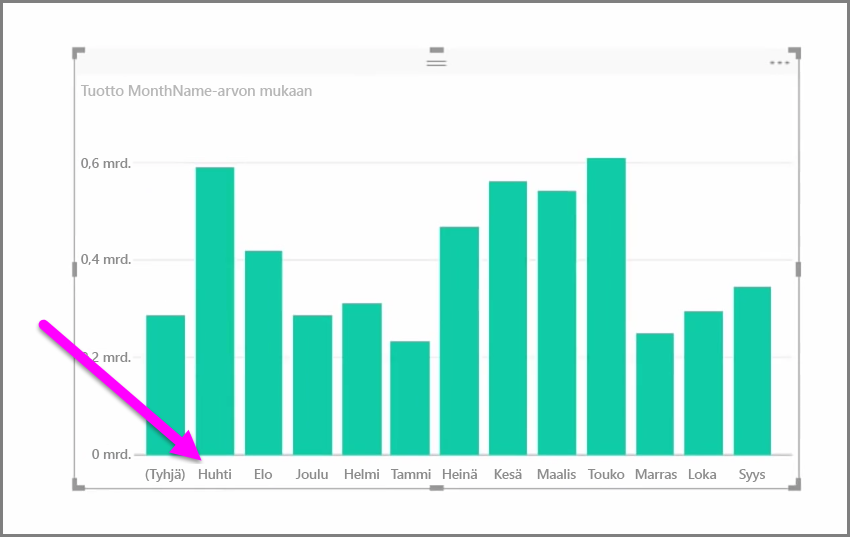
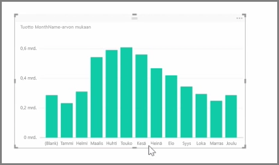

Tuodut tiedot sisältävät usein kenttiä, joita ei oikeastaan tarvita raportoinnissa ja visualisointitehtävissä, joko koska tiedot ovat ylimääräisiä tai koska sama tieto on jo saatavissa toisesta sarakkeesta. Power BI Desktopissa on työkaluja, joilla tietoja voi optimoida ja niistä voi tehdä hyödyllisempiä raporttien ja visualisointien luomisen sekä jaettujen raporttien tarkastelun kannalta.

## Kenttien piilottaminen
Jos haluat piilottaa sarakkeen Power BI Desktopin **Kentät**-ruudussa, napsauta sitä hiiren kakkospainikkeella ja valitse **Piilota**. Huomaa, että piilotettuja sarakkeita ei poisteta. Jos olet käyttänyt kyseistä kenttää aiemmin visualisoinneissa, tiedot ovat edelleen kyseisessä visualisoinnissa. Voit käyttää sarakkeen tietoja myös muissa visualisoinneissa, mutta piilotettu kenttä ei enää näy **Kentät**-ruudussa.

Jos tarkastelet taulukoita **Suhteet**-näkymässä, piilotetut kentät näkyvät harmaina. Niiden tiedot ovat silti käytettävissä ja edelleen osa mallia, vaikka ne onkin piilotettu näkyvistä. Voit tuoda piilotetun kentän esiin milloin tahansa napsauttamalla sitä hiiren kakkospainikkeella ja valitsemalla **Tuo esiin**.

## Visualisoinnin tietojen lajittelu toisen kentän mukaan
**Mallinnus**-välilehden **Lajittele sarakkeen mukaan** -työkalulla voit varmistaa kätevästi, että tietosi näytetään haluamassasi järjestyksessä.

On esimerkiksi yleinen tilanne, että kuukauden nimen sisältävät tiedot on oletusarvoisesti lajiteltu aakkosjärjestyksessä, jolloin vaikkapa elokuu näkyy ennen helmikuuta.

Tällaisen ongelman voi korjata valitsemalla ensin kyseisen kentän Kentät-luettelosta, valitsemalla sitten **Mallinnus**-välilehdestä **Lajittele sarakkeen mukaan** -työkalun ja valitsemalla lopuksi kentän, jonka mukaan lajittelu tehdään. Tässä tapauksessa MonthNo-luokan lajitteluvaihtoehto järjestää kuukaudet halutulla tavalla.

Toinen tapa optimoida tiedot niin, että niitä käsitellään oikein, on määrittää kentän tietotyyppi. Tietotyypin voi vaihtaa raporttipohjasta valitsemalla halutun sarakkeen **Kentät**-ruudusta ja valitsemalla sitten jonkin muotoiluvaihtoehdon avattavasta **Muoto**-valikosta. Kaikki luomasi visualisoinnit, joissa kyseinen kenttä näkyy, päivitetään automaattisesti.

