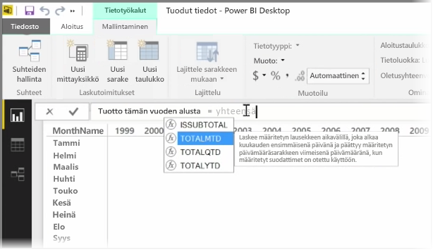

*Mittari* on Power BI -tietomallissa oleva laskutoimitus. Voit luoda mittarin valitsemalla **Raportti**-näkymässä **Mallinnus**-välilehdestä **Uusi mittari** -työkalun.

Yksi Power BI:n DAX (Data Analysis Expression) -kielen vahvuuksista on se, että siinä on runsaasti hyödyllisiä funktioita. Tällaisia ovat erityisesti aikaan perustuvat laskutoimitukset, kuten *Kuluva vuosi*ja *Year Over Year* (Vuodesta toiseen). DAX-kielen avulla voit määrittää ajan mittarin kerran ja osittaa sen sitten tietomallistasi niin monen eri kentän mukaan kuin haluat.

Power BI:ssä määritettyä laskutoimitusta kutsutaan *mittariksi*. Voit luoda *mittarin* valitsemalla **Aloitus**-välilehdestä **Uusi mittari** -työkalun. Näyttöön avautuu kaavarivi, johon voit kirjoittaa mittaria määrittävän DAX-lausekkeen. Laskutoimitusta kirjoittaessasi Power BI ehdottaa aiheeseen liittyviä DAX-funktioita ja tietokenttiä ja näyttää syntaksi- ja funktioparametreja selittävän työkaluvihjeen.

Jos laskutoimitus on erityisen pitkä, voit lisätä lauseke-editoriin ylimääräisiä rivinvaihtoja näppäinyhdistelmällä **ALT–Enter**.

Kun uusi mittari on luotu, se näkyy jossakin näytön oikeassa reunassa olevan **Kentät**-ruudun taulukossa. Power BI sijoittaa uuden mittarin kulloinkin valittuna olevaan taulukkoon, ja vaikka mittarin tarkalla sijainnilla ei ole merkitystä, voit siirtää sen helposti valitsemalla sen ja käyttämällä avattavaa **Aloitustaulukko**-valikkoa.

Mittaria voi käyttää aivan kuten muitakin taulukon sarakkeita: sen voi vetää ja pudottaa raporttipohjaan tai visualisointikenttiin. Mittarit integroituvat saumattomasti osittajien kanssa, joten tiedot segmentoituvat saman tien. Voit siis käyttää kerran määritettyä mittaria monissa eri visualisoinneissa.

DAX-kielen **Laske**-funktio on tehokas väline kaikenlaisten hyödyllisten laskutoimitusten suorittamiseen. Siitä on hyötyä erityisesti taloushallinnon raportoinnissa ja visualisoinneissa.

