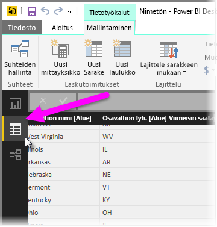
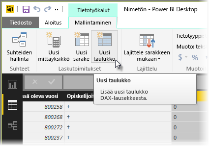
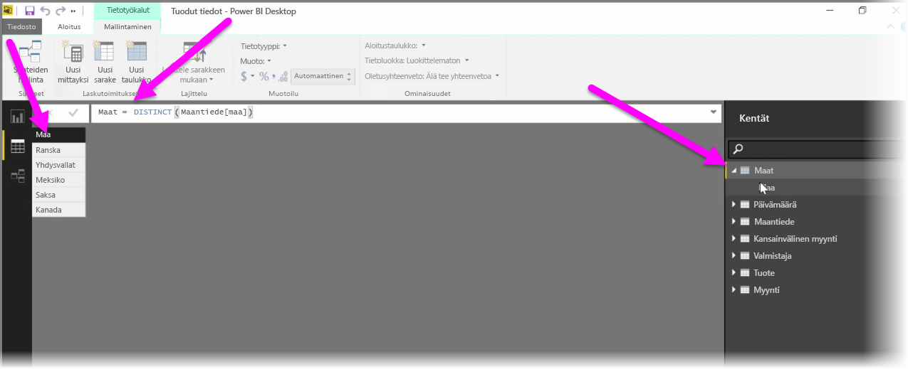

Lasketut taulukot ovat DAX-funktio, joka mahdollistaa monien uusien mallinnusominaisuuksien käytön. Lasketut taulukot ovat hyödyllisiä työkaluja, jos esimerkiksi haluat tehdä erilaisia yhdistelmäliitoksia tai luoda nopeasti uusia taulukoita funktionaalisen kaavan tulosten perusteella.

Voit luoda lasketun taulukon siirtymällä Power BI Desktopin **Tiedot-näkymään**, jonka voi aktivoida raporttipohjan vasemmalta puolelta.

Avaa kaavarivi valitsemalla Mallinnus-välilehdestä **Uusi taulukko**.

Kirjoita uuden taulukon nimi yhtäläisyysmerkin vasemmalle puolelle ja taulukossa käytettävä laskutoimitus oikealle puolelle. Kun laskutoimitus on valmis, uusi taulukko näkyy mallin Kentät-ruudussa.

Kun laskettu taulukko on luotu, sitä voi käyttää muiden taulukoiden tavoin suhteissa, kaavoissa ja raporteissa.

