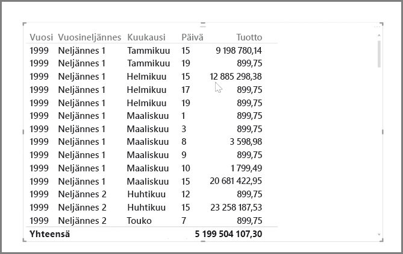
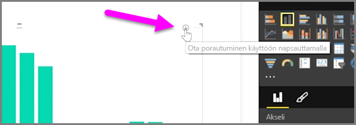
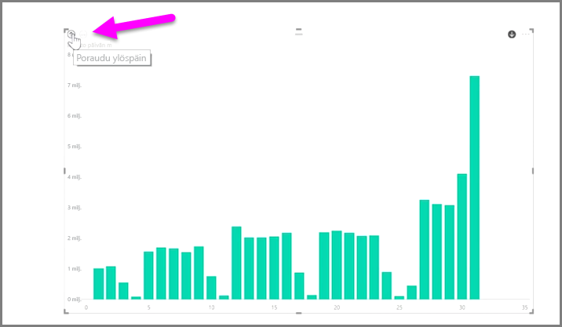
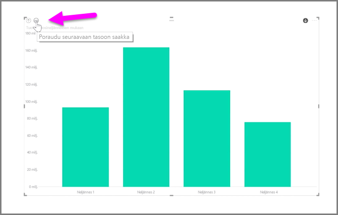
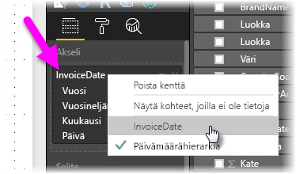

Power BI:ssä aikaan perustuvien tietojen analysointi on helppoa. Power BI Desktopin mallinnustyökalut sisältävät automaattisesti luodut kentät, joista voi porautua vuosi-, vuosineljännes-, kuukausi- tai päivätason tietoihin helposti yhdellä napsautuksella.  

Kun raporttiin luodaan taulukkomuotoinen visualisointi päivämääräkenttää käyttäen, Power BI Desktop luo siihen automaattisesti ajanjaksojen mukaiset erittelyt. Seuraava esimerkkikuva osoittaa, miten Power Bi erotteli automaattisesti **Päivämäärä**-taulukon yksittäisen päivämääräkentän vuoden, vuosineljänneksen, kuukauden ja päivän mukaan.

Visualisoinneissa tiedot esitetään oletusarvoisesti *vuositasolla*, mutta asetusta voi muuttaa ottamalla visualisoinnin oikeasta yläkulmasta käyttöön **Poraudu alaspäin** -työkalun.

Kaavion palkkeja tai viivoja napsauttamalla voi porautua aikahierarkian seuraavalle tasolle, esimerkiksi *vuosista* *vuosineljänneksiin*. Porautumista voi jatkaa hierarkian alimmalle tasolle asti, tässä tapauksessa *päivätasolle*. Aikahierarkiassa voi liikkua takaisin ylöspäin visualisoinnin vasemmassa yläkulmassa sijaitsevalla **Poraudu ylöspäin** -työkalulla.

Visualisoinnissa voi porautua alaspäin myös kaikkien tietojen läpi, ei siis vain valitun kauden läpi, valitsemalla visualisoinnin oikeasta yläkulmasta **Drill All** (Poraudu kaikkiin) -kaksoisnuolikuvakkeen.

Jos mallissa on päivämääräkenttä, Power BI luo eri aikahierarkioille automaattisesti omat näkymät.

Päivämäärähierarkiasta voi palata takaisin yksittäisiin päivämääriin napsauttamalla **Kentät**-kohdassa sarakkeen nimeä hiiren kakkospainikkeella (seuraavassa kuvassa sarakkeen nimi on *InvoiceDate*) ja valitsemalla sitten avautuvasta valikosta sarakkeen nimen **Päivämäärähierarkia**-vaihtoehdon sijaan. Tämän jälkeen visualisoinnissa näkyvät tiedot perustuvat kyseisen sarakkeen tietoihin, eikä päivämäärähierarkiaa käytetä. Tarvitsetko taas päivämäärähierarkiaa? Ei hätää – napsauta uudelleen hiiren kakkospainikkeella ja valitse valikosta **Päivämäärähierarkia**.

## Seuraavat vaiheet
**Onnittelut!** Olet nyt suorittanut tämän osion Power BI:n **Ohjattu oppiminen** -kurssista. Nyt kun hallitset *mallinnus* tietoja, olet valmis hauska Lue seuraavassa osiossa hauskuuteen: **Visualisointien**.

Kuten aiemmin mainittiin, tällä kurssilla kehität osaamistasi Power BI:n tavallisen työnkulun mukaisesti:

* Tuo tiedot **Power BI Desktopiin** ja luo raportti.
* Julkaise Power BI -palvelussa, jossa voit luoda uusia **visualisointeja** ja laatia koontinäyttöjä.
* **Jaa** koontinäytöt muille, erityisesti toimistosta poissa oleville.
* Tarkastele jaettuja koontinäyttöjä ja raportteja ja tee niille toimia **Power BI -mobiilisovelluksissa**.

Vaikka et ehkä teekään kaikkia työvaiheita itse, opit *ymmärtämään*, miten koontinäytöt luodaan ja miten ne liittyvät tietoihin. Tämän kurssin suoritettuasi osaat myös luoda koontinäytön itse.

Nähdään seuraavassa osiossa!

