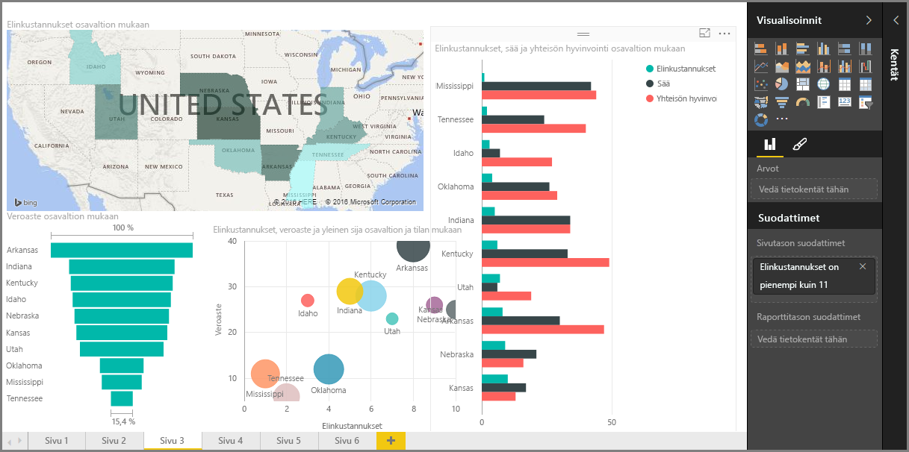

Tervetuloa Power BI:n **Ohjattu oppiminen** -kurssin **Visualisoinnit**-osioon. Luvassa on hauska, mielenkiintoinen ja valaiseva retki, jolla tutustutaan Power BI:n tarjoamiin lukuisiin visualisointimahdollisuuksiin. Eivätkä ne tähän lopu – visualisointeja tulee jatkuvasti lisää.

Kaikki liiketoimintatietojen tarkastelut johtavat tietenkin visualisointeihin. Tiedot on esitettävä vakuuttavalla ja tarkkanäköisellä tavalla, ja *esityksestä* on käytävä ilmi, mitkä seikat ovat huomionarvoisia. Power BI tarjoaa kaikenlaisia vakuuttavia visualisointeja – sekä lähes rajattomasti mahdollisuuksia niiden mukauttamiseen – joten tämä osio on tärkeä!

Saattaa vaikuttaa siltä, että tähän osioon sisältyy paljon eri aihepiirejä, mutta ei huolta: kaikki aihepiirit ovat lyhyitä, niissä on paljon visuaalista havaintomateriaalia (kuten arvata saattaa), ja ne on helppo omaksua. Todennäköisesti tämä osio sujuu leikiten ja antaa ideoita siitä, miten visualisointeja voi hyödyntää omien tietojen esittelyssä.

Aloitamme visualisointien kulmakivistä – yksinkertaisista visualisoinneista, jotka ovat kaikille tuttuja – ja varmistamme, että ne ovat läpikotaisin hallussa. Tämän jälkeen siirrymme edistyneempiin, tai ainakin hieman harvinaisempiin, visualisointeihin, jotka täydentävät raportoinnin työkalupakkia.

Pidä hauskaa – voit oppia paljon!

## Johdatus Power BI:n visualisointeihin
Tietojen visualisointi on yksi Power BI:n keskeisistä osista – peruselementti, kuten aiemmin tällä kurssilla todettiin – ja visualisointien luominen on helpoin tapa tehdä merkityksellisiä havaintoja ja jakaa niitä toisille.

Power BI sisältää oletusarvoisesti runsaasti erilaisia visualisointeja, niin yksinkertaisia palkkikaavioita ja ympyräkaavioita kuin karttojakin, ja lisäksi erikoisempia vaihtoehtoja, kuten vesiputouksia, suppiloita ja mittareita. Power BI Desktop sisältää myös paljon sivun muotoilun työkaluja, esimerkiksi muotoja ja kuvia, jotka tuovat raporttiin elävyyttä.

