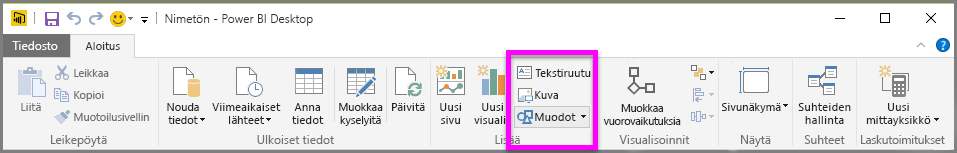
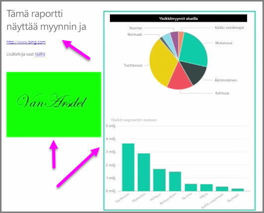

Tietoihin sidottujen visualisointien lisäksi voit lisätä staattisia elementtejä, kuten tekstiruutuja, kuvia ja muotoja, raporttiesi visuaalisen ilmeen kohentamiseksi. Jos haluat lisätä visuaalisen elementin, valitse **Aloitus**-välilehdeltä **Tekstiruutu**, **Kuva** tai **Muodot**.

**Tekstiruudut** ovat hyvä tapa näyttää suuria otsikoita, tekstityksiä tai lyhyitä tekstikappaleita visualisointien rinnalla. Tekstiruudut voivat sisältää linkkejä joko kirjoitettuina URL-osoitteina tai korostamalla ankkurilause ja valitsemalla linkkisymboli tekstiruudun asetuspalkista. Voit lisätä URL-osoitteita tekstiruutuihin, jolloin Power BI tunnistaa linkin automaattisesti ja tekee siitä toimivan.

Kun valitaan **Kuva**, avautuu tiedostoselain, jonka avulla voit valita kuvan tietokoneeltasi tai muusta verkkolähteestä. Jos kuvan kokoa muutetaan raportissa, sen kuvasuhde pysyy oletuksena samana, mutta asetus voidaan poistaa käytöstä visuaalisen muotoilun asetuksissa.

**Muodoilla** on viisi erilaista muotovaihtoehtoa, kuten suorakulmiot ja nuolet. Muodot voivat olla läpinäkymättömiä tai läpinäkyviä värillisellä reunalla. (Jälkimmäinen on kätevä luotaessa reunoja visualisointiryhmien ympärille.)

